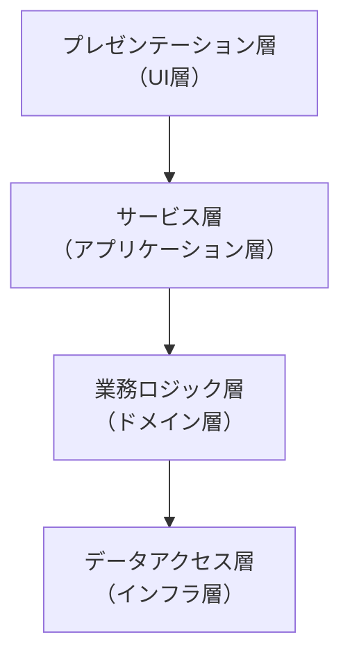
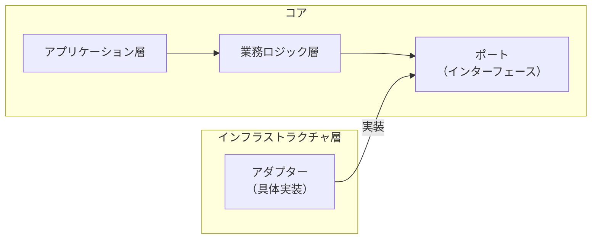
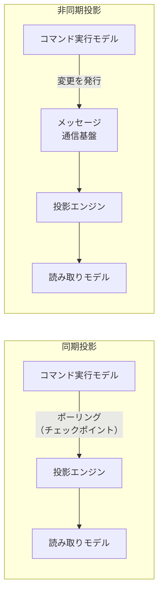
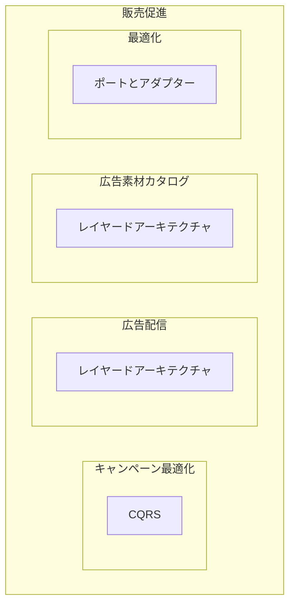

# 技術方式（レイヤードアーキテクチャ・ポートとアダプター・CQRS）

## 概要（8.1）

業務ロジックはソフトウェアで最も重要な部分だが、唯一のコンポーネントではない。コードベースにはUI・永続化・外部連係など多くの関心事があり、それらが混在すると業務ロジックが拡散する。

**技術方式**（アプリケーションアーキテクチャ）: コードベースのさまざまな関心事をどう構造化するかの原則。

本書が扱う三つの主要な技術方式:
- レイヤードアーキテクチャ
- ポートとアダプター
- CQRS（コマンド・クエリ責任分離）

---

## レイヤードアーキテクチャ（8.2）

技術的な関心事にもとづいてソースコードを分解する方式。

### 三層構造

```
プレゼンテーション層（UI層）
    ↓
業務ロジック層（ドメイン層）
    ↓
データアクセス層（インフラストラクチャ層）
```

| 層 | 別名 | 役割 |
|---|---|---|
| プレゼンテーション層 | UI層 | エンドユーザーとの対話（GUI・CLI・API・メッセージ購読/送出）。プログラムの公開インターフェース |
| 業務ロジック層 | ドメイン層・モデル層 | 業務ロジックをカプセル化。ソフトウェアの心臓部（第5〜7章の実装方法はここで使用） |
| データアクセス層 | インフラストラクチャ層 | 永続化・外部API連係（DB・メッセージ通信基盤・オブジェクトストレージ・外部サービス） |

**レイヤー間の通信**: トップダウン。各レイヤーは直下のレイヤーにのみ依存する。

### サービス層（派生型）

プレゼンテーション層と業務ロジック層の間に挟む仲介役。

- 「アプリケーション層」とも呼ばれる
- プレゼンテーション層の多様性（Web・CLI・MQ等）から業務ロジックを守る論理的な境界
- 物理的に独立したサービス（マイクロサービス）ではない



### レイヤーとティアの違い

| 区分 | 性質 | 例 |
|---|---|---|
| **レイヤー** | 論理的な境界 | 同一プロセス内でコードを分割した構造 |
| **ティア** | 物理的な境界 | 別サーバー・別プロセスへの分離 |

同じコードをレイヤードで設計しつつ、物理的には2ティア（Webサーバー＋DB）や3ティアで展開できる。

### いつ使うか

- **向いている**: トランザクションスクリプト・アクティブレコードで実装する業務ロジック
- **向いていない**: ドメインモデルを使う複雑な業務ロジック（次のポートとアダプターを使う）

---

## ポートとアダプター（8.3）

レイヤードアーキテクチャの欠点（業務ロジックとDAを結びつけてしまう）を解消する方式。

### 核心: 依存関係逆転の原則（DIP）

レイヤードアーキテクチャでは業務ロジック層がデータアクセス層に依存する（下向き矢印）。
ポートとアダプターでは**この依存方向を逆転**させる。



- **ポート**: 業務ロジック層が外部とやり取りするための抽象インターフェース（例: `IMessaging`）
- **アダプター**: インフラストラクチャ層でポートを実装した具体クラス（例: `SQSBus : IMessaging`）

```csharp
// ポート（業務ロジック層に定義）
public interface IMessaging {
    void Publish(IDomainEvent domainEvent);
}

// アダプター（インフラストラクチャ層に定義）
public class SQSBus : IMessaging {
    public void Publish(IDomainEvent domainEvent) { ... }
}
```

### 同類の呼び名

| 呼び名 | 別名 |
|---|---|
| ポートとアダプター | ヘキサゴナルアーキテクチャ・オニオンアーキテクチャ・クリーンアーキテクチャ |
| アプリケーション層 | サービス層・ユースケース層 |
| 業務ロジック層 | ドメイン層・コア層 |

### いつ使うか

- **向いている**: ドメインモデルを用いた業務ロジックの実装
- 業務ロジックをすべての基盤コンポーネントから独立させたい場合

---

## CQRS（コマンド・クエリ責任分離）（8.4）

同じデータを**複数の永続化モデル**で表現することを可能にする方式。イベント履歴式ドメインモデルと密接に関連。

### 目的: 目的別のモデリング（8.4.1）

単一モデルですべての要件（OLTP＋OLAP）に対応することは困難。異なる用途には異なるモデルが必要（polyglot persistence）。

### 二つのモデル（8.4.2）

| モデル | 役割 | 特性 |
|---|---|---|
| **コマンド実行モデル** | 状態を変更する操作専用 | 業務ロジック・ルール検証・不変条件の強制。強一貫性。楽観的排他制御。真実を語る唯一の情報源 |
| **読み取りモデル（投影）** | ユーザーへの表示・他システムへの情報提供 | 複数モデル可能。投影結果のキャッシュ（永続的DB・フラットファイル・インメモリ）。読み取り専用 |

### 読み取りモデルの投影方法（8.4.3）



**同期投影**:
- 投影エンジンがコマンド実行モデルをポーリング（チェックポイント方式）
- 新しい投影の追加・ゼロからの再生成が簡単
- 推奨: 常に同期投影を実装することからスタート

**非同期投影**:
- コマンド実行モデルがメッセージ通信基盤に変更を発行
- 投影エンジンが購読して読み取りモデルを更新
- スケーリング・パフォーマンスに利点
- 課題: 順序保証・重複処理→一貫性保証が困難

### モデルの隔離（8.4.5）

> **コマンドはデータを返すことができる**（一般的な誤解の訂正）

ただし、コマンドが返すデータはコマンド実行モデルを元にすること（読み取りモデルからではない）。

### いつ使うか（8.4.6）

- 同じデータをもとに複数のモデルを扱う必要がある場合
- イベント履歴式ドメインモデルを使うシステム（集約の状態にもとづいてクエリできないため必須）
- 複数の永続化モデルが必要なシステム全般

---

## スコープ（8.5）

技術方式は**一つの区切られた文脈の全体的な構造ではない**。



- 複数の業務領域を含む区切られた文脈では、業務領域ごとに**異なる技術方式を混在**させてよい
- 適切な垂直の境界を定義し、それぞれに適切な技術方式を採用することがきわめて重要
- 垂直方向の論理的境界は、将来さらに細分化した区切られた文脈の**物理的な境界**にリファクタリング可能

---

## まとめ（8.6）

| 技術方式 | 特徴 | 向いている実装 |
|---|---|---|
| **レイヤードアーキテクチャ** | 業務ロジックとDAを結びつける。技術的関心事で分解 | トランザクションスクリプト・アクティブレコード |
| **ポートとアダプター** | 依存関係逆転。業務ロジックを基盤から独立 | ドメインモデル |
| **CQRS** | 複数モデルで表現。イベント履歴式に必須 | イベント履歴式ドメインモデル・複数永続化モデルが必要な場合 |

次章（第9章）では、システム全体を構成するコンポーネント間の信頼できる相互作用（通信）を検討する。

---

## 判断基準

**Q. どの技術方式を選ぶか？**

```
「業務ロジックの実装方法は何か？」
  トランザクションスクリプト・アクティブレコード
      → レイヤードアーキテクチャ
  ドメインモデル
      → ポートとアダプター
  イベント履歴式ドメインモデル
      → CQRS（必須）＋ポートとアダプター

「同じデータを複数のモデルで表現する必要があるか？」
  YES → CQRSを追加で検討する
  NO  → 上記の基本選択で十分
```

**Q. 一つの区切られた文脈で複数の業務領域がある場合は？**

```
業務領域ごとに適切な技術方式を選択できる。
「すべてに同じ技術方式を使わなければならない」という制約はない。
```

---

## アンチパターン

**アンチパターン1: ドメインモデルにレイヤードアーキテクチャを使う**
> 業務ロジックとデータアクセスが結合し、テストが難しく、外部インフラの変更が業務ロジックに波及する。

**アンチパターン2: 非同期投影だけを使う**
> 順序問題や重複処理が一貫性を損なう。推奨は同期投影を基本とし、オプションで非同期投影を追加すること。

**アンチパターン3: コマンドから読み取りモデルのデータを返す**
> コマンドとクエリの責任分離に違反する。コマンドが返すデータはコマンド実行モデルを元にすること。

---

## 関連概念

- [[business-logic-simple]] — レイヤードアーキテクチャが向いているトランザクションスクリプト・アクティブレコードの詳細
- [[domain-model]] — ポートとアダプターが向いているドメインモデルの詳細
- [[event-sourced-domain-model]] — CQRSが必須となるイベント履歴式ドメインモデルの詳細
- [[bounded-context]] — 技術方式の選択は区切られた文脈ごとに行う
