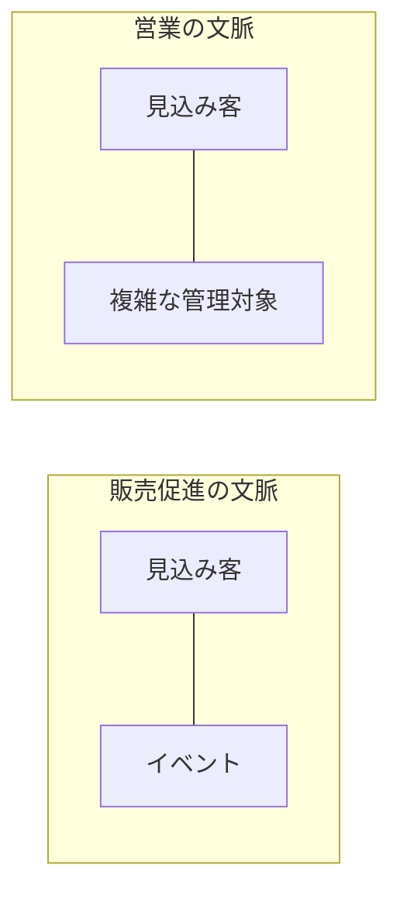
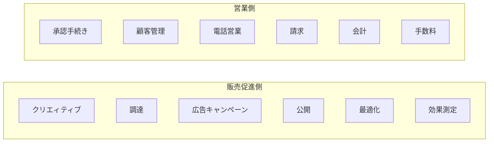
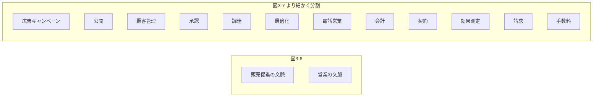
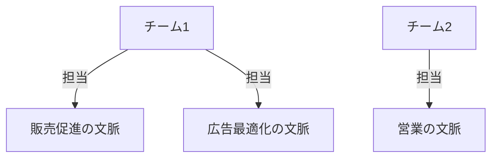

# 区切られた文脈（Bounded Context）

## 定義

区切られた文脈とは、同じ言葉（ユビキタス言語）が通用する範囲を定義した境界。モデルの境界であり、同時にシステムを実装する単位の境界でもある。

同じ言葉を一貫した意味で使えるのは、区切られた文脈の**内側だけ**。

---

## なぜ必要か

一つの言葉が文脈によって異なる意味を持つ場合がある。例：「見込み客」

- **販売促進の文脈:** イベントに紐づく見込み客（marketing lead）
- **営業の文脈:** 複雑な管理対象としての見込み客（sales lead）

この問題を解決するために、同じ言葉を「文脈ごとに小さく分割」し、それぞれの文脈（区切られた文脈）に割り当てる。

### 図3-3: 文脈を区切って言葉のあいまいさを取り除く



ある意味で、事業活動がそれなりの規模になれば、言葉の意味が衝突し文脈が暗黙化するのは本来の姿かもしれない。区切られた文脈は、そのような暗黙の文脈の存在を明確にする方法。文脈は事業活動を表現する不可欠な部品となる。

---

## 文脈の境界（3.2.1）

モデルには必ず境界がある。モデルの境界を広げすぎるとそのモデルは役に立たなくなる。

- 区切られた文脈 = 同じ言葉が通用する範囲 = 同じ言葉を使って表現したモデルが役に立つ範囲
- 区切られた文脈は**個々の課題領域に特化したモデル**を作るための手法
- 別の言い方: 同じ言葉の一貫性を保つための境界

**地図のアナロジー:** 航空機のルートマップ・船舶用の海図・地形図・地下鉄の路線図は、それぞれ異なる目的に特化したモデル。地下鉄の路線図は船舶の運行には役立たない。同じ言葉もそれと同じで、ある文脈で使われる同じ言葉は、別の文脈ではまったく役に立たないことがある。

---

## 同じ言葉の定義（改良版）（3.2.2）

DDDの「同じ言葉」は**組織全体で統一した言葉**という意味ではない。

- 同じ言葉が通用する範囲は、**区切られた文脈の境界の内部に限定される**
- 同じ言葉は、区切られた文脈ごとの**固有のモデル**を表現することに焦点を合わせる
- 同じ言葉を定義・利用するためには、その言葉が通用する範囲を明確に定義した区切られた文脈が必要

---

## 区切られた文脈の大きさ（3.2.3）

区切られた文脈の大きさ自体は重要ではない。**モデルが役に立つかどうか**が基準。

同じ言葉の一貫性に注目することで、その言葉が通用するもっとも広い範囲を特定できる。それ以上広げると言葉の一貫性が失われる。

**大きな文脈を小さく切り分ける理由:**
- 開発チームを増やす場合
- 非機能要件に対応するために開発単位を分ける場合
- スケーラビリティ（スケールアウトが必要な一部機能を切り離す）

### 図3-4: 区切られた文脈を細分化する



---

## 業務領域と区切られた文脈の関係（3.3）

業務領域の「分割」と、区切られた文脈の「分割」は目的が異なる。

### 業務領域（3.3.1） → 「発見」

- 事業活動を分析し、業務領域を三つのカテゴリー（中核・補完・一般）に分類する
- 企業がどのように競合他社と差別化を図ろうとしているかを明らかにする
- 事業活動とシステムへの要求事項からユースケースを定義するのは**事業側の役割**
- ソフトウェア技術者は事業活動を分析して業務領域とそのカテゴリーを識別する

### 区切られた文脈（3.3.2） → 「設計」

- モデルの境界をどう選ぶかは**設計判断**
- ソフトウェア設計の視点から、どのように事業活動を小さく扱いやすい単位に分割するかを決定
- 業務領域は事業方針によって決まる構造。区切られた文脈はプロジェクトの目的と制約条件に合わせて**ソフトウェア技術者が決定**できる

### 業務領域と区切られた文脈の対応（3.3.3）

区切られた文脈と業務領域を一対一に対応させることが最善の場合もあるし、別の方針で分割することが役立つ場合もある。

**段階的な分割の流れ（図3-5→3-6→3-7）:**

小さなシステムなら単一の文脈で開発できる（図3-5）。モデルの不整合が見つかれば、複数の区切られた文脈に分割する（図3-6）。さらに業務領域ごとに細分化することも可能（図3-7）。



**重要:** 同じデータに対して操作を行うユースケースの集まりを特定し、そのユースケースの集まりを複数の区切られた文脈に**分散させないようにする**。

また、一つの業務領域でも課題が複数あれば課題ごとに別のモデルを作るほうがよいことがある。「一つの業務領域に一つのモデル」という固定観念は持たないこと。

---

## 文脈の境界（3.4）

> アーキテクチャの選択はシステムの設計です。システムの設計は文脈の設計です。文脈の本質は境界です。境界の内側に何があり、境界の外側に何があるか。境界を越えて、どうつながり、何が移動するか。何を選択し、何をあきらめるか。境界は、何が外部であり何が内部であるかを明らかにします。
> — ルース・マラン

DDDの区切られた文脈は、**システムの物理的な境界**と**システムの所有権の境界**を決める手法。

### 物理的な境界（3.4.1）

- 区切られた文脈はモデルの境界を定義し、同時に**システムを実装する単位**を定義する
- 区切られた文脈は**独立したサービスまたはプロジェクト**として実装する
- 他の文脈から切り離して開発・変更・バージョン管理する
- 一つの区切られた文脈が複数の業務領域を含む場合: 物理的には単一の境界、論理的には複数の業務領域の境界（名前空間・モジュール・パッケージで表現）

### 所有権の境界（3.4.2）

「よい垣根がよい隣人を作る」— チームの責任範囲を明確に分けることが重要な設計課題。

- 一つの区切られた文脈の開発・変更・保守を担当するのは**一つのチーム**
- 複数のチームが一つの区切られた文脈を担当してはいけない（一つのソフトウェアに異なるモデルが無意識に混入するのを防ぐ）
- チームと区切られた文脈の関係は**単方向**: 一つの文脈を一つのチームが所有する（逆はNG）
- 一つのチームが複数の文脈を所有することは可能
- お互いのモデルとシステムをどう連係させるかの**約束事（通信規約）**を明示的に決める

### 図3-8: チームと文脈の関係



---

## 現実世界の区切られた文脈（3.5）

区切られた文脈は事業活動や業務領域のように明白には存在しない。しかし、業務エキスパートの頭の中に、業務のとらえ方として区切られた文脈が存在する。

業務エキスパートが事業活動に関わるヒト・モノ・コトをどのようにとらえているかを意識することで把握できる。

### 言葉の意味論（3.5.1）

DDDの区切られた文脈は、言語学の「意味論的な領域」（semantic domains）にもとづく。

意味論的な領域 = 言葉が同じ意味で使われる範囲（あるいはその内部で同じ意味で使われる言葉の集合）。

**トマトの例（文脈によって意味が変わる）:**

| 文脈 | トマトの意味 |
|---|---|
| 植物学の文脈 | 果実（種子を拡散するための器官、花から成長） |
| 料理の文脈 | 野菜（味わいで分類。しゃきしゃきした食感・調理して食べる） |
| アメリカ課税制度の文脈 | 野菜（1893年最高裁判決。野菜輸入に10%課税のため） |
| 舞台公演の文脈 | 「ふざけんな、金返せ！」のメッセージ |

### 科学（3.5.2）

科学理論もそれぞれの文脈で役に立つ:
- **ニュートンの運動法則:** 空間と時間は絶対的（古典力学の文脈）
- **アインシュタインの相対性理論:** 空間と時間は観測者によって異なる（高速・高重力の文脈）

どちらの理論も相反するように見えるが、それぞれにふさわしい区切られた文脈の中で役に立つ。知識の本当の評価基準は真理かどうかではなく、役に立つかどうか。

### 冷蔵庫を買った時の話（3.5.3）

**複数のモデル（区切られた文脈）を組み合わせることで課題を解決できる例:**

課題: 「新しい冷蔵庫（Siemens KG86NAI31L）を台所に搬入できるか」

使ったモデル（文脈）:
1. **段ボール** — 冷蔵庫の幅と奥行きの大きさにカットしたもの。「台所のドアを通れるか（幅・奥行き）」を確認するモデル
2. **巻き尺** — 入り口の高さを測るためのモデル

→ 3次元モデルを作ることは明らかにオーバーエンジニアリング。

**教訓:** 個別の課題を解決するシンプルなモデルを組み合わせて目的を達成できるなら、「何にでも手を出して、どれもちゃんとできていない」単一の入り組んだモデルを作る必要はない。モデルから余分な情報を取り除き、解くべき課題だけに最適化する。

---

## 判断基準

**Q. 一つの言葉が複数の意味を持つ場合、どうするか？**

```
「この言葉は業務エキスパートによって異なるとらえ方をされているか？」
  YES → 区切られた文脈を分割し、それぞれの文脈でその言葉に固有の意味を持たせる
  NO（同じ意味だがあいまい）
      → 同じ言葉の問題 → 用語を分解して明確化する
```

**Q. 区切られた文脈の大きさはどれくらいにするか？**

```
「同じ言葉の一貫性が保てる最大の範囲はどこまでか？」
  → それが区切られた文脈の上限。それ以上広げると言葉の意味がぶれる。

「開発チームを分ける・非機能要件・スケーラビリティの要件があるか？」
  YES → さらに小さく分割することを検討する
  NO  → それ以上分割しない（細分化しすぎると組み合わせがやっかいになる）
```

**Q. 業務領域と区切られた文脈を1対1に対応させるべきか？**

```
「同じデータを操作するユースケースが複数の文脈に分散していないか？」
  YES → 設計の見直しが必要。ユースケースの集まりを一つの文脈に集約する
  NO  → 1対1対応でなくてもよい。設計の目的に合わせて判断する
```

---

## 具体例

**オンライン広告代理店（見込み客の例）:**

同じ「見込み客」という言葉が業務エキスパートごとに異なるとらえ方をされていた。

- 販売促進部門: 見込み客 = イベントに紐づくマーケティングリード
- 営業部門: 見込み客 = 複雑な管理対象のセールスリード

**解決策:** 「販売促進の文脈」と「営業の文脈」に分割し、それぞれの文脈で「見込み客」に独自の意味を持たせる。

---

## アンチパターン

**アンチパターン1: 組織全体で同じ言葉を統一しようとする**
> DDDの「同じ言葉」は組織全体の共通言語ではない。区切られた文脈の外では同じ言葉の一貫性を強制しなくてよい。無理に統一しようとすると、業務ごとのモデルの独立性が失われる。

**アンチパターン2: 複数のチームで一つの区切られた文脈を担当する**
> 複数チームが担当すると、一つのソフトウェアに異なるモデルが無意識に混入する。通信規約を明示せず暗黙の依存が生まれる。一つの文脈は一つのチームが所有する。

**アンチパターン3: 区切られた文脈を細かく分割しすぎる**
> 細分化しすぎると、それらを組み合わせて全体を組み立てることがやっかいになる。区切られた文脈の大きさは「モデルが役に立つか」で判断する。

**アンチパターン4: 一つの業務領域に一つのモデルという固定観念**
> 業務領域と区切られた文脈を1対1に限定すると課題解決の柔軟性が失われる。一つの業務領域に複数の課題があれば、課題ごとに別のモデル（別の区切られた文脈）を作ったほうがよい場合がある。

---

## 関連概念

- [[ubiquitous-language]] — 区切られた文脈の内側で一貫性を保つ同じ言葉
- [[subdomain]] — 区切られた文脈が対応する業務活動の単位
- [[business-domain]] — 区切られた文脈が属する事業全体
