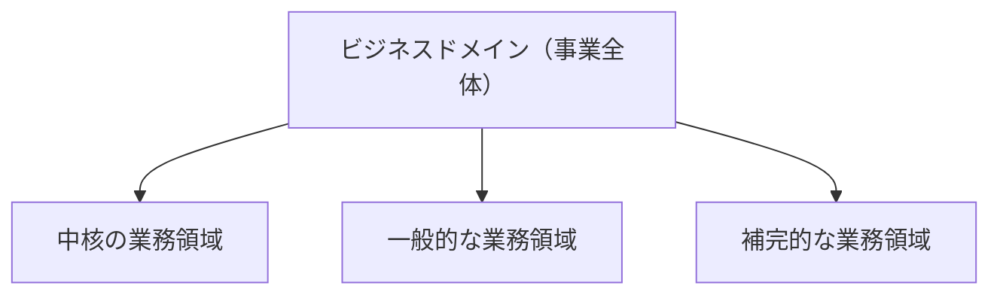

# ビジネスドメイン（事業領域）

## 定義

ビジネスドメインとは、企業が事業活動を展開する領域。企業が顧客に提供するサービスの大枠であり、複数の業務領域（サブドメイン）から構成される。

---

## 構造



---

## 具体例

| 企業 | ビジネスドメイン |
|---|---|
| クロネコヤマト | 宅配サービス |
| スターバックス | コーヒー（飲食） |
| Amazon | ネット通販・クラウドコンピューティング（複数） |
| Uber | ライドシェア・料理配達・自転車シェアリング（複数） |

**Amazonのように複数のビジネスドメインを持つ企業もある。** その場合、ドメインごとに独立した業務領域の分析が必要。

**ビジネスドメインは変わることがある。** ノキア社は製紙会社として創業し、その後ゴム製品の製造販売、有線通信事業者を経て、現在の主力事業はモバイル通信設備の製造開発へと変化した。

---

## 判断基準

**Q. これはビジネスドメインか、業務領域（サブドメイン）か？**

```
「企業が顧客に提供しているサービスの大枠か？」
  YES → ビジネスドメイン
  NO（その中の個別活動） → 業務領域（サブドメイン）
```

---

## アンチパターン

**アンチパターン: ビジネスドメインをサブドメインと混同する**
> 「ネット通販」はAmazonのビジネスドメインであり、その中の「商品推薦」「物流管理」「決済」がサブドメイン。粒度を混同すると設計の起点が狂う。

---

## 関連概念

- [[subdomain]] — ビジネスドメインを構成する個々の業務活動の単位
- [[bounded-context]] — サブドメインをソフトウェアとして実装する際の境界
