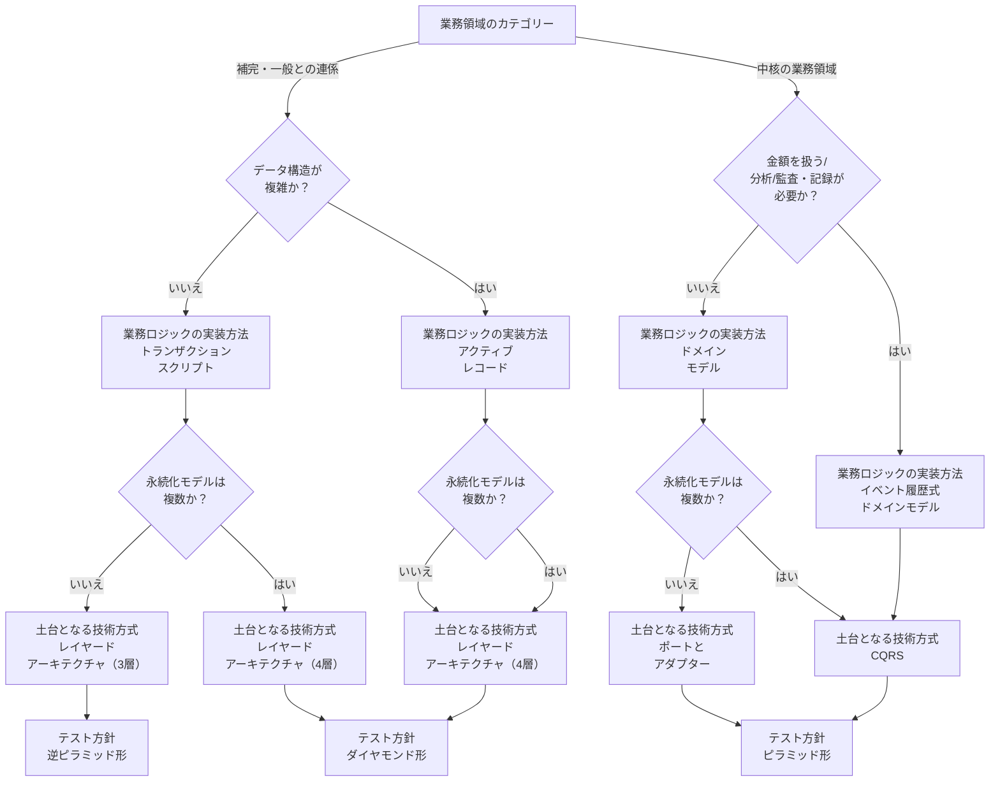

# 実装方法を選択する経験則（結びの言葉・付録A）

## 概要

「ドメイン駆動設計をはじめよう」の結びの言葉（p.313〜）と付録A（事例研究）に記載された、本書全体の集大成となる実践的な経験則。

---

## 事業領域の分類（表E-1）

| カテゴリー | 競争優位性 | 複雑さ | 変化 | 実装手段 | 課題の特性 |
|---|---|---|---|---|---|
| **中核** | ○ | 大きい | 多い | 社内で開発 | 複雑で興味深い |
| **一般** | × | 大きい | 少ない | パッケージや外部サービスを利用 | 既存の解決策がある |
| **補完** | × | 小さい | 少ない | 内製または外部委託 | 単純 |

---

## 図E-1: 実装方法を選択する経験則フロー

本書の全判断を統合した実装方法の選択フロー。



### フローの読み方（テキスト形式）

**補完・一般との連係の場合**:
```
「データ構造が複雑か？」
  NO → トランザクションスクリプト
    「永続化モデルは複数か？」
      NO → レイヤードアーキテクチャ（3層）+ 逆ピラミッド形テスト
      YES → レイヤードアーキテクチャ（4層）+ ダイヤモンド形テスト
  YES → アクティブレコード
    「永続化モデルは複数か？」
      NO or YES → レイヤードアーキテクチャ（4層）+ ダイヤモンド形テスト
```

**中核の業務領域の場合**:
```
「金額を扱う/分析/監査・記録が必要か？」
  NO → ドメインモデル
    「永続化モデルは複数か？」
      NO → ポートとアダプター + ピラミッド形テスト
      YES → CQRS + ピラミッド形テスト
  YES → イベント履歴式ドメインモデル → CQRS + ピラミッド形テスト
```

---

## 付録A 事例研究: マーケットノバス社の失敗と学び

付録Aは著者が実際に経験したスタートアップ（マーケットノバス社）でのDDD実践の物語。失敗から学んだ教訓が書かれている。

### A.1.2 区切られた文脈 その1: 販売促進

**最初の設計（失敗）**: 「何でも集約」スタイル。すべての名詞を集約として宣言し、巨大な一枚岩のシステムに詰め込む。業務ロジックはほとんどなく、すべてサービス層に記述した→**貧血ドメインモデル**。

**なぜ一時的に成功したか**:
- 同じ言葉を業務エキスパートと確立できていた
- 2人の技術者が倉庫で開発するには十分な設計だった
- 動くソフトウェアを短期間で市場に投入できた

**教訓**: 補完的・一般的な業務領域では、シンプルな実装（TS/AR）が適切。設計の正しさより「動くソフトウェアを早く出せるか」が事業的には重要な場合がある。

### A.1.3 区切られた文脈 その2: 顧客管理

**問題の発見（集約名が不自然になるサイン）**:
```
CRMLead（顧客管理見込み客）
MarketingLead（販売促進見込み客）
MarketingCampaign（販売促進キャンペーン）
CRMCampaign（顧客管理キャンペーン）
```
業務エキスパートとの会話では「Lead」「Campaign」だけで通じるのに、集約名に文脈を示す接頭語が必要になっている → **区切られた文脈が欠如しているサイン**。

**設計のやり直し**: 巨大な一枚岩を「販売促進」と「顧客管理」の二つの区切られた文脈に分割。

**ドメインモデル実装への挑戦**: 貧血ドメインモデルを脱却し「本当の」集約を実装しようとしたが困難だった。
- 適切なトランザクション境界を最初から見つけることはほとんど不可能
- 「正しくやる」ことは高くつく（多くの時間が必要）
- 期限に間に合わず、経営陣が業務ロジックをストアードプロシージャ（SQL）に移すことを決定

**A.1.3.3 バベルの塔の再現（ストアードプロシージャの罠）**:

ストアードプロシージャへの移行は「暗黙の区切られた文脈」を生み出した。

- 二つのチーム（プロダクトチームとDBチーム）がそれぞれの独自の言葉で業務を記述
- 同じビジネス要素（Lead）をお互いほとんど会話せずに実装
- お互いのモデルはまったく一致しない。業務知識が重複し、同じ業務ルールが二重に実装された
- 業務ロジックを変更する時、必ず両者の間に不一致が生まれた
- 予定の期日にリリースできず、欠陥だらけのソフトウェアを数年にわたって本番で稼働させ続けた

**A.1.3.4 ドメイン駆動設計の理解の広がり**:

```
同じ言葉 → を保護する → 区切られた文脈 → を実装する → ドメインモデル
```

この時点でまだ欠けていたもの: 業務領域の考え方とそのカテゴリーの判断。補完的な業務領域をドメインモデルで実装するという無駄な努力をしていた。

### A.1.4 区切られた文脈 その3: イベント処理装置

外部から到着する顧客イベントの処理が、販売促進と顧客管理のどちらか一方の責任ではなく、両方を変更しなければならない機能だった → 独立した補完の業務領域として「イベント処理装置」を切り出し。

**実装**: 補完の業務領域なのでレイヤードアーキテクチャで簡単なトランザクションスクリプトを実装。

**誤り**: 事業が発展するにつれてイベント処理装置に複雑な業務ロジックが追加され、本格的な**中核の業務領域**に発展したにもかかわらず、トランザクションスクリプトのままにしていた。→ 【第11章: 業務領域カテゴリーの変化への対応】

---

## 判断基準

**Q. 集約名に文脈を示す接頭語が必要になっていないか？**

```
「集約名に業務エキスパートが使わない単語を付けているか？」
（例: CRMLead, MarketingLead, CRMCampaign）
  YES → 区切られた文脈が欠如している。境界の見直しが必要
  NO → 同じ言葉が自然に使えている
```

**Q. 業務ロジックをストアードプロシージャやSQLに移すことを検討しているか？**

```
「業務ロジックをDBレイヤーに移そうとしているか？」
  YES → 暗黙の区切られた文脈を作るリスクがある。
         DBチームとプロダクトチームが別々の言葉でモデル化し始め、
         バベルの塔になる危険性が高い
  NO → 業務ロジックはドメインモデルに留める
```

**Q. 補完の業務領域なのにドメインモデルで実装しようとしていないか？**

```
「補完の業務領域（単純・変化が少ない）に時間をかけて設計しようとしているか？」
  YES → 無駄な努力の可能性。TSまたはARで十分
  NO（中核の業務領域） → 適切なドメインモデルへの投資が正当化される
```

---

### A.1.5 区切られた文脈 その4: 販売報奨金

補完の業務領域として設計（ARとレイヤードアーキテクチャ）。事業が発展するにつれ計算ロジックが複雑化し金額を扱うようになった → **中核の業務領域に変化** → イベント履歴式ドメインモデルへリファクタリング。

**同じ言葉の効果**: 同じ言葉を使っていたため「ARでモデル化できなくなった時点」で早めに設計変更に気づけた。無駄な努力を最小化できた。

### A.1.6 区切られた文脈 その5: マーケティングハブ（大失敗）

中核の業務領域と判断 → イベント履歴式DM + CQRS + マイクロサービス（集約ごとにサービスを分割）で実装。

**マイクロサービス大失敗の原因**:
- 「小さなサービスが良いマイクロサービス」という誤解で、集約ごとにサービスを分割
- システムが成長するにつれサービス間の通信が増加。機能実現に多くのサービスからデータをかき集める必要
- 疎結合を目指したが、実際にできたのは「分散した大きな泥団子」

**本当の課題（A.1.6.2）**: マーケティングハブは**実際には補完の業務領域**だった。
- 新たな収益源を期待して「中核」と判断したが、競争優位はソフトウェア機能ではなく他企業との協業関係にあった
- 技術的複雑さが業務内容の複雑さをはるかに上回る「**不必要な複雑さ**」が発生
- 適切な実装はシンプルなアクティブレコードだった

---

## A.2 ふりかえり: 事例から学ぶ実践的な知見

### A.2.1 同じ言葉は必須

**すべてのプロジェクトを通じた教訓**:

| プロジェクト | 同じ言葉の有無 | 結果 |
|---|---|---|
| 販売促進 | あり | しっかりした同じ言葉が設計の欠陥を補い、成功に導いた |
| 顧客管理 | なし（二つの言葉が混在） | 大失敗。意図の伝達がうまくいかず大きな混乱が残った |
| イベント処理装置 | なし | 成長した時に後悔。同じ言葉があればもっと短期間で成果を出せた |
| 販売報奨金 | あり | 設計方針を変えるべき時期に早く気づけた |

**結論**: 同じ言葉は状況によって選択したりしなかったりするものではない。中核・補完・一般のどの業務領域に取り組む場合でも、必ず同じ言葉を使って開発する。できるだけ早い段階から投資することが重要。

### A.2.2 業務領域カテゴリーと設計判断の逆転トリック（A.2.2.1）

**通常の手順**: 業務領域のカテゴリーを特定 → 実装方法を選択

**逆転トリック**: 実装方法から業務領域カテゴリーを検証する
1. 目の前の要求内容に適した実装方法を直感で選ぶ（憶測や粉飾なし）
2. 選んだ実装方法から業務領域のカテゴリーを逆算する
3. そのカテゴリーが事業方針と整合しているか確認する

**この逆転の価値**: 技術者と業務担当者の間に新たな対話の機会を生み出す。

実装方法と業務領域の不一致が発見された場合:
- **業務担当者が「中核」と考えているのに1日で実装できる** → 開発者が課題を簡単に考えすぎているか、その機能が競争優位に結びついていない
- **業務担当者が「補完」と考えているのに実装がDMやESを必要とする** → 業務担当者が要件を必要以上に複雑化しているか、競争優位の源泉に気づいていない可能性

### A.2.2.2 たいへんさを無視しない

業務ロジックの実装がたいへんであれば、それは事業モデルの発展や設計判断の進化につながるきわめて重要な兆候。

- たいへんさに気づいたら業務エキスパートとよく話し合う
- 業務領域のカテゴリーと業務ロジックの実装方法を再検討すべき状況の変化がないか確認する
- ひるまずに設計を変える → 業務ロジックを適切にモデル化していれば、変化に対応して洗練された方法に変えることは比較的簡単にできる

### A.2.3 区切られた文脈の境界: 4つのパターン

マーケットノバス社が実際に試した4つの境界設定:

| 境界の種類 | 説明 | 評価 |
|---|---|---|
| **言葉による境界** | 同じ言葉を保護するために文脈を区切る（販売促進と顧客管理） | 有効 |
| **業務領域ごとの境界** | 業務領域ごとに一つの区切られた文脈を実装（イベント処理装置・販売報奨金） | 有効 |
| **集約ごとの境界** | 各集約を独立した文脈として扱う（マーケティングハブ） | 特定の状況でのみ有効。マーケティングハブでは失敗 |
| **自殺行為となった境界** | 一つの集約を二つの区切られた文脈に分割（顧客管理開発時の失敗） | **絶対にやってはいけない** |

**初期の文脈の大きさ**: 業務知識が貧弱なほど、広い範囲の文脈で始める。
- 業務知識を増やしながら段階的に小さく分割していく
- 文脈の区切り方のリファクタリングは、十分な業務知識を習得した後でやる
- 細かく分割しすぎる失敗を避けられる

---

## A.3 まとめ: DDD実践のステップ（マーケットノバス社の教訓）

1. **常に同じ言葉からスタート**: 対象となる事業活動についてできるだけ多くを学ぶため
2. **モデルが混乱したら文脈を分割**: それぞれの文脈で同じ言葉を使って開発するため
3. **業務領域のカテゴリーを特定**: 中核・一般・補完のどれかを判断する
4. **経験則で実装方法を選択**: 業務領域カテゴリーに対応した適切な実装方法を使う
5. **実装方法からカテゴリーを逆検証**: 選んだ実装方法が業務担当者の認識と一致しない場合は再検討する
6. **業務知識が増えたら文脈をさらに小さく分割**: 最初は大きめに、後から縮小

「いつでもどこでも集約」から「いつでもどこでも同じ言葉」への変化。

---

## アンチパターン（事例から学ぶ）

**アンチパターン1: 「何でも集約」（貧血ドメインモデル）**
> 要求事項に出てくるすべての名詞を集約として宣言し、業務ロジックをサービス層に書く。見た目はドメインモデルだが実質はトランザクションスクリプト。中核の業務領域では技術的負債になる。ただし補完・一般の業務領域では合理的な選択。

**アンチパターン2: 区切られた文脈なしに同じ言葉を守ろうとする**
> 一枚岩のシステムで「同じ言葉」を使おうとすると、集約名に文脈を示す接頭語を付けるしかなくなる（CRMLead、MarketingLeadなど）。本当の解決策は区切られた文脈で境界を設けること。

**アンチパターン3: ドメインモデルで「正しくやる」ことを急ぐ**
> 適切なトランザクション境界を最初から見つけることはほとんど不可能。多くの時間と試行錯誤が必要。期限のある状況では「動くソフトウェア」を優先し、設計を後から改善するアプローチも現実的。

**アンチパターン4: 補完の業務領域をドメインモデルで実装する（不必要な複雑さ）**
> 単純・変化が少ない補完の業務領域にドメインモデルを適用するのは過剰設計。技術的複雑さが業務内容の複雑さを上回る「不必要な複雑さ」になる。TSまたはARが適切。

**アンチパターン5: 集約ごとにマイクロサービスを分割する**
> 「小さなサービスが良いマイクロサービス」という誤解から集約ごとにサービスを分けると、サービス間の通信が爆発的に増加し分散した大きな泥団子になる。区切られた文脈の粒度でサービスを分割する。

**アンチパターン6: 一つの集約を二つの区切られた文脈に分割する（自殺行為）**
> 絶対にやってはいけない。業務ロジックが分断され、バベルの塔の再現につながる。

---

## 関連概念

- [[subdomain]] — 事業領域の3分類（中核・一般・補完）
- [[business-logic-simple]] — トランザクションスクリプト・アクティブレコード
- [[domain-model]] — 値オブジェクト・エンティティ・集約
- [[event-sourced-domain-model]] — イベント履歴式ドメインモデル
- [[architecture-patterns]] — レイヤード・ポートとアダプター・CQRS
- [[design-heuristics]] — 第10章の総合判定フロー（本ファイルのフローの詳細版）
- [[evolving-design]] — 業務領域カテゴリーの変化への対応（第11章）
- [[ubiquitous-language]] — 同じ言葉と区切られた文脈の関係
