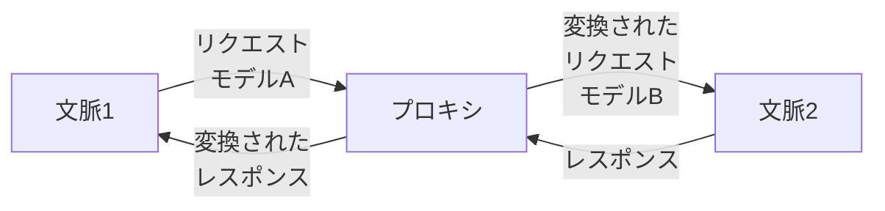
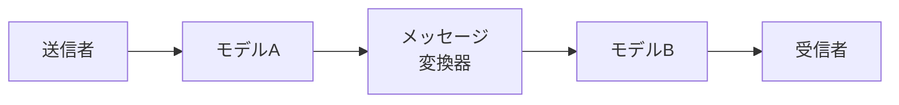
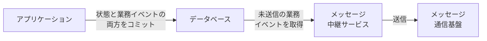
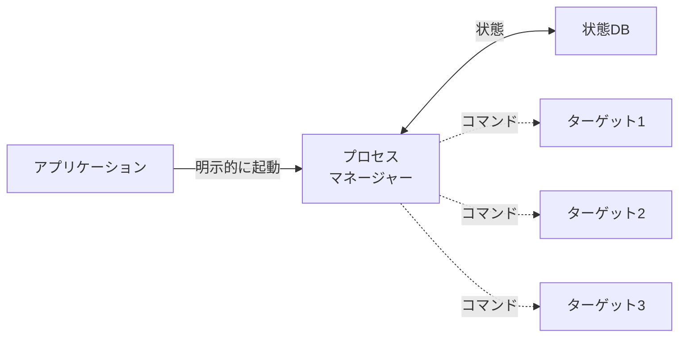

# 通信（モデル変換・送信箱・サーガ・プロセスマネージャー）

## 概要（第9章）

第5〜8章は個々のコンポーネント（区切られた文脈）の内部構造を扱った。本章では、コンポーネントの境界を越えたコンポーネントどうしの連係方法を扱う。

この章で学ぶ内容:
- 区切られた文脈どうしの通信方法
- 集約の設計原則に起因する連係方法の制約に対処する方法
- 複数の区切られた文脈にまたがる業務プロセスの実現方法

---

## モデルの変換（9.1）

区切られた文脈はモデルの境界。異なる区切られた文脈をつなぐには、モデルの変換が必要になることがある。

変換ロジックはモデル変換装置と共用サービスで同じような実装になるため、本書では両者を区別せず扱う。

### 状態なしのモデル変換（9.1.1）

変換機能（上流の共用サービスまたは下流のモデル変換装置）を、**プロキシ（代理）方式**で実現する。通信中のリクエストを横取りして、送信元のモデルを送信先のモデルに変換する。

#### 同期式（9.1.1.1）

区切られた文脈のコードベースの一部に変換ロジックを埋め込む。



**APIゲートウェイの活用**: Kong・KrakenD（オープンソース）やAWS API Gateway・Google Apigee・Azure API Managementを使うことで、低コストで実現できる。複数の区切られた文脈から利用できる独立した区切られた文脈（**モデル交換文脈** interchange contexts）として機能させることも可能。

#### 非同期式（9.1.1.2）

非同期メッセージングでモデルを変換する場合は「**メッセージプロキシ**」を用意する。発信元の区切られた文脈から発行されたメッセージを中間コンポーネント（プロキシ）が代理で受け取り、モデル変換後に本来の購読者に転送する。



**重要**: 内部モデルのオブジェクトをそのまま公開された言葉として外部にさらけ出すのは、ありがちな、まちがった設計。業務イベントをそのまま送信してしまうのも同様。

- **内部イベント**: 区切られた文脈の内部だけで使うイベント
- **公開イベント**: 他の文脈と通信するためのイベント

非同期のモデル変換は、ある文脈で発生した業務イベントを横取りして公開された言葉に変換可能。これにより内部イベントと公開イベントを明確に区別できる。

### 状態ありのモデル変換（9.1.2）

複数のデータを集めて一つにまとめたり、さまざまな発生元からのデータを統合したりする場合。APIゲートウェイサービスでは実現できない。永続化の仕組みが必要。

#### 到着データを一つにまとめる（9.1.2.1）

複数リクエストを一括処理、または小さく分割されたメッセージを統合するパターン。
データストリーム式（Apache Kafka・AWS Kinesis）またはバッチ式（Apache NiFi・AWS Glue・Apache Spark）で実現できる。

#### 複数の発生元からのデータを統合する（9.1.2.2）

典型例: **BFF（Backend For Frontend）**。ユーザーインターフェースが複数のサービスからデータを集めて組み立てる状況。

解決策: データを利用する側の手前にモデル変換装置を配置し、他の文脈からのさまざまなデータを受け取り、一つのまとまったデータに変換する。

---

## 集約どうしの連係（9.2）

集約が他のコンポーネントと連係するやり方として、**業務イベントの発行（publish）**がある。外部コンポーネントは業務イベントを購読（subscribe）して業務ロジックを実行する。

### 送信箱（Outbox）（9.2.1）

集約内部から業務イベントを直接発行してはいけない。理由は二つ:
1. DBにコミットする前に業務イベントを外部に発信してしまう（購読者が受け取った時点でDBの状態と不整合）
2. DBへのコミット失敗後でも業務イベントが送信済みになる（撤回不可）

**送信箱パターン**で業務イベントを確実に発行できる:



1. 更新された集約の状態と業務イベントの**両方を一つのトランザクションとしてDB**にコミット
2. 中継サービスが新規コミットされた業務イベントを読み取る
3. 中継サービスがメッセージ通信基盤に発行する
4. メッセージ送信成功後、中継サービスはDBの業務イベントに送信済みの印をつける（またはイベントを削除）

**RDBの場合**: 二つのテーブルへの書き込みをアトミックにコミット（送信箱テーブル）。
**NoSQLの場合**: 集約レコードの中に発行すべき業務イベントを埋め込む（outbox属性）。

#### 未送信のイベントを読み取る

- **プル方式（ポーリング）**: 中継サービスが継続的にDBを検索して未送信イベントを発見。インデックス設定が重要。
- **プッシュ方式（トランザクションログ追跡）**: データベースのトランザクションログを追跡してレコードの更新・追加を検知。（RDB: CDC / NoSQL: DynamoDB Streams等）

> 送信箱によるメッセージ送信は「**少なくとも1回（at least once）**」を保証する。同じメッセージが二重送信される可能性があるため、購読側のべき等処理が必要。

### サーガ（Saga）（9.2.2）

複数のコンポーネントにまたがる、単純で直線的な業務プロセスを実装する方法。

**定義**: 開始から終了まで長く続く業務プロセス。「長く続く」は時間的な長さではなく、**多数のトランザクションで構成される**という意味。

**仕組み**: サーガは関連するコンポーネントが発行する業務イベントを検知し、それに続くコマンドを別のコンポーネントに向けて発行する。一連の処理がどこかで失敗した場合、システムの一貫性を確保するために失敗に対応する「**補償アクション**」を実行する。

```csharp
public class CampaignPublishingSaga {
    // 検知する3つのイベント（購読）
    public void Process(CampaignActivated @event) {
        var campaign = _repository.Load(@event.CampaignId);
        var advertisingMaterials = campaign.GenerateAdvertisingMaterials();
        _publishingService.SubmitAdvertisement(@event.CampaignId, advertisingMaterials);
    }
    public void Process(PublishingConfirmed @event) {
        var campaign = _repository.Load(@event.CampaignId);
        campaign.TrackPublishingConfirmation(@event.ConfirmationId);
        _repository.CommitChanges(campaign);
    }
    public void Process(PublishingRejected @event) {
        var campaign = _repository.Load(@event.CampaignId);
        campaign.TrackPublishingRejection(@event.RejectionReason); // 補償アクション
        _repository.CommitChanges(campaign);
    }
}
```

**起動方法**: 特定イベントを検知した時に**暗黙的に起動**される。

#### 一貫性（9.2.2.1）

> - 集約の境界の内側にあるデータは**強く整合**していると想定できる
> - 集約の境界の外側にあるデータは**結果的に整合**する

サーガを適切に使う指針: **集約境界の設計が不適切なことを補うためにサーガを使ってはいけない**。同じ集約に所属させるべき業務処理は、強い一貫性が保証されたデータを必要とする。

### プロセスマネージャー（9.2.3）

業務ロジックが中心となる、複雑な業務プロセスを実装する方法。

**定義**: プロセスの状態を管理し、次に処理すべきステップを決定する中央処理装置（CPU）。

**サーガとの違い**:

| 区分 | サーガ | プロセスマネージャー |
|---|---|---|
| 複雑さ | 単純・直線的 | 複雑（業務ロジックが中心） |
| 起動方法 | 特定イベントを検知して暗黙的に起動 | 明示的に起動（特定ソースイベントと関連づけられない） |
| 状態 | 状態なし（基本型） | 状態あり（必ず状態を永続化） |
| 分岐 | if-else不要 | if-elseによる処理分岐が必要 |

> 経験則: サーガの実装でif-else文を使った処理の分岐が必要なら、それはおそらくプロセスマネージャーです。



**実装**: 多くの場合、複数の集約の組み合わせ。状態ありの集約、あるいはイベント履歴式の集約のどちらでも実装可能。

---

## まとめ（9.3）

| パターン | 用途 |
|---|---|
| **モデル変換（状態なし）** | 区切られた文脈間でモデルを変換する（同期: プロキシ / 非同期: メッセージプロキシ） |
| **モデル変換（状態あり）** | 複数データの統合・集約が必要な変換 |
| **送信箱（Outbox）** | 集約の業務イベントを外部に確実に発行する（at least once） |
| **サーガ** | 複数コンポーネントにまたがる単純・直線的な業務プロセス |
| **プロセスマネージャー** | 複雑な業務ロジックを持つ長期プロセス |

サーガとプロセスマネージャーの土台となるのは、**業務イベントへの非同期な応答とコマンド発行の仕組み**（送信箱パターン）。

---

## 判断基準

**Q. 業務イベントを確実に発行するにはどうするか？**

```
集約内部から直接メッセージ通信基盤に発行してはいけない
→ 送信箱（Outbox）パターンを使う
→ 状態と業務イベントを一つのトランザクションでDBにコミット
→ 中継サービスがDBから読み取って発行する
```

**Q. サーガかプロセスマネージャーか？**

```
「業務フローにif-else分岐（複雑な業務ロジック）が必要か？」
  YES → プロセスマネージャー
  NO（業務イベントとコマンドの単純対応） → サーガ
```

**Q. サーガを使っていいか？**

```
「集約境界の設計が不適切なことを補うために使おうとしているか？」
  YES → 使ってはいけない。集約の境界を見直す
  NO  → サーガを使ってよい
```

---

## アンチパターン

**アンチパターン1: 集約内部から業務イベントを直接発行する**
> DBコミット前に発行するとデータ不整合が起きる。DBコミット失敗後でも発行済みになると撤回できない。送信箱パターンを使う。

**アンチパターン2: 内部モデルをそのまま公開イベントとして送信する**
> 区切られた文脈の内部実装が外部に漏れる。業務イベントを公開された言葉に変換してから送信する。

**アンチパターン3: 集約境界の不備をサーガで補う**
> 本来同じ集約に閉じるべき処理をサーガで繋ごうとしている設計は失敗する。集約の境界を見直す。

---

## 関連概念

- [[context-integration]] — 区切られた文脈どうしの連係パターン（第4章）
- [[domain-model]] — 集約の設計原則・業務イベントの発行
- [[event-sourced-domain-model]] — 内部イベントと公開イベントの区別
- [[architecture-patterns]] — CQRS・送信箱との関係（非同期投影）
