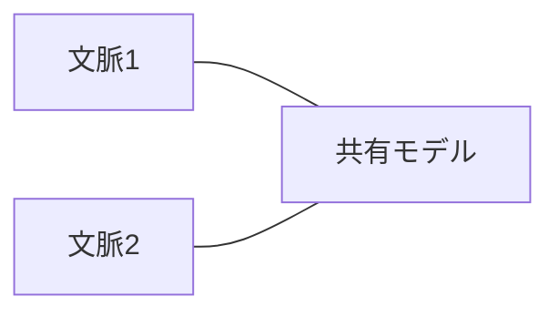
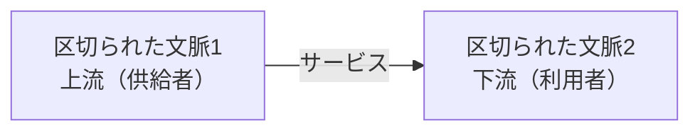

# 区切られた文脈どうしの連係（Context Integration）

## 概要

区切られた文脈は独立して進化できるが、完全に独立しているわけではない。システムとして機能するには文脈どうしの連係が必要。文脈間の**接合部分**を「契約」と呼ぶ。

契約が必要な理由: 異なる区切られた文脈どうしではモデルと言葉が異なるから。取り決めを明文化し、お互いの利害を調整することが必要。

連係方法は、区切られた文脈を担当する開発チーム間の**協力関係の違い**によって3グループに分類される:

| グループ | 連係方法 |
|---|---|
| 緊密な協力 | 良きパートナー、モデルの共有 |
| 利用者と供給者の関係 | 従属する、モデル変換装置、共用サービス |
| 互いに独立 | 互いに独立 |

---

## 緊密な協力（4.1）

### 良きパートナー（Partnership）（4.1.1）

区切られた文脈どうしの連係を**臨機応変**に実現する関係。

- APIの変更をしたチームが他のチームに伝えると、他のチームは協力的にその変更に対応する（大騒ぎになったり利害関係が衝突したりしない）
- この協力関係は**双方向**: 一方のチームが連係の約束事を決めて押しつけることはしない
- 連係に関わる課題を**二つのチームが協力して**取り組む

**成立条件:** 二つのチームが協力することに習熟し、目標の達成に強い意欲を持ち、頻繁に同期を行う。技術的には継続的インテグレーションを頻繁に実施することで連係に関わる問題の発生を最小にする。

**注意:** 物理的に離れたチームどうしでは難しい可能性がある。


### モデルの共有（Shared Kernel）（4.1.2）

複数の区切られた文脈で同じモデル（またはその一部）を実装する方法。

- 共有部分は、関係するすべての区切られた文脈の要求にもとづいて設計する
- 共有されたモデルは、それを使うすべての区切られた文脈と**整合する**必要がある
- ある文脈で行った変更は、共有しているすべての文脈で同様に適用する必要がある



**共有する範囲:**
- 共有しているモデルへの変更はすべての区切られた文脈にただちに影響する（密結合）
- 変更の影響を小さくするために、共有するモデルの範囲は**どちらの文脈にも実装が必須になる部分に限定**する
- 理想: 共有するモデルの対象は「連係するための契約と境界を越えて渡すデータ構造だけ」

**どう実現するか:**
- 単一リポジトリ: それぞれの区切られた文脈が同じソースコードを利用
- リポジトリが分かれている場合: 共有するモデルを独立したモジュールに切り出し、各文脈がそのモジュールを利用
- どちらの方法でも、共有モデルを変更したら**すべての文脈で結合テストを自動実行**する

**判断基準（共有するかどうか）:**
- コードの重複によるコスト ＜ チーム間の調整コスト → 共有しない（コードを重複させる）
- コードの重複によるコスト ＞ チーム間の調整コスト → モデルの共有を選択
- モデルが頻繁に変わる場所（中核の業務領域）ほど共有コストが高くなる

**モデルの共有は例外的な連係方法:**
- 「一つの区切られた文脈は一つのチームが所有する」という原則と矛盾する
- やむを得ず使う例外的な状況:
  - チームが地理的に離れている・組織の利害関係が衝突している（良きパートナーができない）
  - 既存システムの段階的な置き換え（一時的な移行策）
  - 一つのチームが複数の区切られた文脈を所有している場合（境界を明確に定義するための手段）

---

## 利用者と供給者の関係（Customer-Supplier）（4.2）

片方の区切られた文脈が「供給者」（上流）となりサービスを提供し、もう片方が「利用者」（下流）となる関係。自分たちのチームの成功にとって相手チームの成功は必須ではないため、**力関係**が生まれる。



### 従属する関係（Conformist）（4.2.1）

上流チームが力を持ち、下流チームが上流チームのモデルを**そのまま受け入れる**関係。

**発生条件:** 外部サービスを利用する場合や組織の権力構造によって決まる。

下流チームが従属を選択する理由:
- 上流チームが提示する契約が業界標準であり安定したモデルの場合
- 上流チームが提供する内容が下流チームのニーズを十分に満たしている場合


### モデル変換装置（AntiCorruption Layer）（4.2.2）

上流の決定権を持つ状況で、下流チームが上流のモデルをそのまま受け入れず、**自分たちのニーズに合わせて変換する仕組み**。

**使用するケース:**
- **下流の区切られた文脈が中核の業務領域を含む**: 供給側のモデルに引きずられると中核の課題を表現するモデルをゆがめてしまう可能性がある
- **上流のモデルが非効率あるいは使いにくい**: ごちゃごちゃしたモデルに合わせると自分たちのモデルもごちゃごちゃになる（変更がやっかいで危険な既存システムとの連係で起きがちな状況）
- **供給側の契約が頻繁に変更される**: サービスの利用者は頻繁な変更から自分のモデルを守りたい

**効果:**
- 下流のサービス利用者は自身の区切られた文脈に関係しない外部の概念を取り除ける
- サービスを利用する側の同じ言葉とモデルが単純でわかりやすくなる


モデル変換装置のさまざまな実装方法は第9章で探求する。

### 共用サービス（Open-Host Service）（4.2.3）

サービスを利用する側（下流）が決定権を持つ場合の連係方法。サービスを提供する側（上流）は利用者を保護し、できるだけよいサービスを提供しようとする。

- 外部に提供する**公開インターフェース**を内部のモデルから切り離す
- 外部に公開するモデルと内部の実装を別々のタイミングで変更できる

**公開された言葉（Published Language）:**
- 共用サービスが提供する通信規約（プロトコル）
- 連係用途に特化した言葉を定義し、利用する側が使いやすい形で提供する
- 内部で使う同じ言葉に合わせる必要はない
- 異なるバージョンを並行して提供することで、利用者は新しいバージョンに段階的に移行できる


**共用サービス vs モデル変換装置の違い:**
- 共用サービス: モデルの変換を**提供する側（上流）**が行う（ある意味でモデル変換装置の逆）
- モデル変換装置: モデルの変換を**利用する側（下流）**が行う

---

## 互いに独立（Separate Ways）（4.3）

連係を「しない」選択肢。連係のために協力する労力よりも、同じ機能を重複して実装したほうが負担が少ない場合の選択肢。

**選択する理由:**

**意思疎通の問題（4.3.1）:**
- 組織が大きい・部門間の利害が対立しており、チームどうしの協力や合意形成に苦労する状況
- それぞれのチームが互いに独立して、複数の区切られた文脈で同じ機能を重複して開発したほうが費用対効果が高い

**一般的な業務領域（4.3.2）:**
- 対象の業務領域が他社と同じよい一般的な業務で、一般的な解決手段を簡単に組み込める場合
- 各区切られた文脈ごとに一般的な解決手段を取り入れるほうが費用対効果が高い
- 例: ロギング用フレームワーク（各文脈が個別に組み込む方が、共通サービスを用意するより簡単）

**モデルの違い（4.3.3）:**
- モデルの違いが大きく、従属ではどちらかへの対応ができない場合
- 必要な機能を文脈ごとに重複して作ってしまうほうが、モデル変換装置を作るよりコストが小さい場合

> ⚠️ **中核の業務領域どうしをつなぐ場合は、互いに独立は避けるべき。** 中核の業務領域を重複して実装することは、中核の業務領域はもっとも効率的かつ最適化された方法で実装する、という事業戦略にそむくことになる。

---

## 文脈の地図（Context Map）（4.4）

システム全体の区切られた文脈どうしの関係を視覚化した地図（図4-8）。

**文脈の地図で得られる洞察:**

**全体的な設計:**  システムのコンポーネントと、それぞれのコンポーネントが実装するモデルの集まりの全体像を提供する。

**意図の伝わり方:** チーム間でどのように意図が伝わるかを表現する。協力的な関係にあるのはどのチームか、あるいはモデル変換装置や互いに独立のようにあまり親密ではないのはどのチームかを明らかにする。

**組織上の課題:** ある上流チームと関係するすべての下流チームがモデル変換装置を開発しているとしたら、それはどういう意味か。あるチームが互いに独立の関係で囲まれているとしたら、それは何を意味するか。

**最新の状態を維持するには（4.4.1）:**
- プロジェクト開始時に作成し、変更があれば描き直す
- 更新はすべてのチームが共同して進める
- 各チームは他の区切られた文脈とどう連係しているかの最新状態を地図に反映する責任を持つ
- Context Mapper（contextmapper.org）などのツールでコードとして管理できる

**限界（4.4.2）:**
- 区切られた文脈が複数の業務領域を対象としている場合、複数の連係方法を同時に使うこともある（図4-9: 入り組んだ文脈の地図）
- 一つの区切られた文脈の対象となる業務領域が一つであっても、業務領域を構成するモジュールの間で異なる連係方法を必要とする場合がある

---

## 連係方法の比較

| 連係方法 | 決定権 | 協力度 | 主な用途 |
|---|---|---|---|
| 良きパートナー | 双方 | 高い | 共通目標を持つ緊密な協力関係 |
| モデルの共有 | 双方 | 高い | どちらにも必須な最小限のモデルを共有 |
| 従属する | 上流 | 低い | 上流モデルが業界標準・ニーズを満たす |
| モデル変換装置 | 上流 | 低い | 中核領域・上流モデルが使いにくい・頻繁な変更から守る |
| 共用サービス | 下流 | 低い | 利用者保護・内部実装を自由に変更したい |
| 互いに独立 | 不要 | なし | 協力コスト＞重複コスト・一般領域 |

---

## 判断基準

**Q. どの連係方法を選択するか？**

```
「チームどうしが緊密に協力できるか？」
  YES → 良きパートナーまたはモデルの共有を検討
  NO  → 利用者と供給者の関係または互いに独立を検討

「利用者と供給者の関係において、上流・下流どちらが決定権を持つか？」
  上流が決定権 → 従属するかモデル変換装置を検討
  下流が決定権 → 共用サービス

「下流が上流のモデルをそのまま受け入れられるか？」
  YES（業界標準・ニーズを満たす）→ 従属する
  NO（中核領域・使いにくい・頻繁に変更）→ モデル変換装置

「連係のために協力するコスト ＞ 重複実装のコストか？」
  YES → 互いに独立（ただし中核の業務領域には使わない）
  NO  → 何らかの連係方法を選択
```

---

## アンチパターン

**アンチパターン1: 中核の業務領域に「互いに独立」を使う**
> 中核の業務領域を重複して実装することは、もっとも効率的かつ最適化された方法で実装する、という事業戦略にそむく。

**アンチパターン2: 中核の業務領域で「従属する」を使う**
> 下流の区切られた文脈が中核の業務領域を含む場合に従属すると、供給側のモデルに引きずられて中核の課題を表現するモデルをゆがめてしまう可能性がある。モデル変換装置を使うべき。

**アンチパターン3: モデルの共有範囲を広げすぎる**
> 共有するモデルへの変更はすべての文脈にただちに影響する（密結合）。共有部分は連係のための契約と境界を越えて渡すデータ構造だけに限定する。

**アンチパターン4: 文脈の地図を作らない・更新しない**
> 文脈の地図を作らないと、チーム間の連係方法の全体像が見えず、組織上の課題を見逃す。プロジェクト開始時に作成し、継続的に最新状態を維持する。

---

## 関連概念

- [[bounded-context]] — 連係する区切られた文脈の定義と境界
- [[subdomain]] — 連係方法の選択に影響する業務領域のカテゴリー（中核・一般・補完）
- [[ubiquitous-language]] — 区切られた文脈ごとに独自の同じ言葉を持つ
