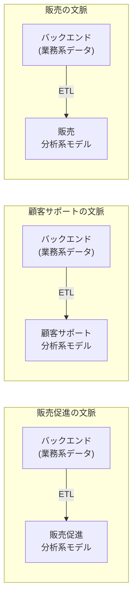

# データメッシュ

## 概要（第16章）

データメッシュは、分析系データのドメイン駆動設計。ドメイン駆動設計が境界を区切り境界の内部を外部から保護するのと同じように、データメッシュは**分析系データのモデルと所有権の境界を定義し、境界内部の分析系モデルを外部から保護する**。

---

## 分析系データモデルと業務系データモデル（16.1）

| モデル種別 | 処理種別 | 目的 | 粒度 |
|---|---|---|---|
| **業務系モデル（OLTP）** | リアルタイムのトランザクション処理 | ヒト・モノ・コトを追跡し相互作用を調整 | 詳細（個々の記録） |
| **分析系モデル（OLAP）** | オンライン分析処理 | 事業活動のパフォーマンスの洞察 | 集約したほうが効率的 |

業務系モデルと分析系モデルは異なる視点の洞察を得るために設計するため、**設計の考え方が異なる**。業務系モデルを分析目的に再利用できない。

### 16.1.1 事実テーブル（Facts）

業務プロセスや行動（動詞）が行われたことを表現するテーブル。

- 過去に起きた出来事を記述する（業務イベントと似ている）
- 業務イベントとは異なり、動詞の過去形で表現することは必須ではない
- **レコードを削除したり変更したりしない**（追加のみ）
- 無効になったレコードは「現在の状態を表現するレコードの追加」で表現する

### 16.1.2 特性テーブル（Dimensions）

事実の性質や状態（形容詞）を記述するテーブル。

- 事実のさまざまな属性を記述する目的で設計する
- 事実テーブルの外部キー（FK）の参照先になる
- 特性としてモデル化される属性は、複数の事実レコードに繰り返し現れる
- 分析系システムでは柔軟な検索が必要なため、特性を**高度に正規化**する
  - 業務系モデルでは必要な検索パターンを特定できるが、分析系では予測できない
  - 高度に正規化で、検索・絞り込み・異なる特性をまたぐグルーピングを動的に支援する

### 16.1.3 分析系モデルのスキーマ

**星形スキーマ（Star Schema）**:
- 事実テーブルを中心に、特性テーブルが周囲を囲む構造（多対1の関係）
- 1つの特性レコードに対し多数の事実レコードが存在する

**雪の結晶形スキーマ（Snowflake Schema）**:
- 星形スキーマの発展形。特性テーブルをさらに小さな粒度の特性に正規化する（多段階）
- 全体のデータ量が減り管理しやすくなる
- 問い合わせ時に結合するテーブルが増えるため、強力な計算資源が必要

---

## 分析系データの管理基盤（16.2）

### 16.2.1 データウェアハウス（DWH）

全社のさまざまな業務系システムからデータを抽出し、**単一の分析系モデルに変換**して単一の分析用データベースに書き出す方式。

- **ETL（抽出・変換・書き出し）スクリプト**にもとづく
- データ抽出の情報源: 業務系DBのデータベース・イベントメッセージのストリーム・ログファイル
- 変換時の操作: 個人情報の削除・レコードの複製・イベント順序の並び替え・細粒度イベントの集約

**データマート**: 特定の分析目的に関連するデータだけを保持するデータベース（部門ごとなど）

**データウェアハウスの課題**:
- 単一モデルで事業全体のあらゆる分析ニーズに対応しようとする→不可能
- ETL処理が業務系システムのDB（内部実装）を直接参照→**密結合**
- 業務系テーブル設計の変更でETLスクリプトが動かなくなる
- 業務系と分析系を担当する部門間のコミュニケーション問題

### 16.2.2 データレイク

業務系システムのデータを取り込むが、ただちに変換せず**いったんは生の状態（業務系モデルのまま）で保管**する方式。

- 変換を後から行うため、同じ元データから複数の分析系モデルを生成できる
- スキーマレス → 取り込むデータに構造的な制約がなく品質が保証されない
- 規模が大きくなると「データの沼」化: カオスになったデータの意味解析が桁違いに複雑

### 16.2.3 データウェアハウスとデータレイクの共通の課題

- **前提**: 分析用に取り込むデータが多ければ多いほど、よい分析結果を生む
- **現実**: 「巨大なデータ」（big data）の重さに耐え切れずに破綻しがち
- 業務系システムの実装モデルへの密結合が根本的な問題
- **DDDに取り組む場合は特に深刻**: ドメインモデルは頻繁に変更される。密結合していると業務系モデルの変更が分析系システムに予期しない問題を引き起こす

---

## データメッシュ（16.3）

データメッシュの基本的な考え方（4原則）:

1. **データを業務の視点で分割する**
2. **データをプロダクトと考える**
3. **自律性を高める**
4. **エコシステムを構築する**

### 16.3.1 データを業務の視点で分割する

データウェアハウスとデータレイクは全社データを単一モデルに統合しようとする→効果的ではない。

データメッシュは**複数の分析系モデルを使い、それぞれをデータの発生源と整合させる**。

- 分析系モデルの所有権の境界は、**区切られた文脈の境界と自然に一致する**（図16-12）
- 分析系データの生成は、区切られた文脈のサービスを開発するチームの責任
- それぞれの区切られた文脈が業務系（OLTP）モデルと分析系（OLAP）モデルの両方を管理する



### 16.3.2 データをプロダクトと考える（data as a product）

分析系データを**第一級の市民**として扱う原則。

- データレイクは詳細を理解していない情報源から業務系データを取得する
- データメッシュでは、区切られた文脈が適切に定義された分析系モデルを他の区切られた文脈に提供する

**分析系データをプロダクトとして扱う要件**:
- 利用者が必要なエンドポイント（データ出力ポート）を簡単に見つけられること
- 分析用エンドポイントは提供するデータの内容と形式を明確に定義したスキーマを用意すること
- 分析系データの信頼性が高く、SLA（Service Level Agreement）を定義して監視すること
- 分析系モデルは通常のAPIと同様に複数バージョンを提供し、利用者に破壊的な影響を与えないようにモデルの変更を管理すること

**チーム構成の変化**: 「データをプロダクトと考える」を実践するには、開発チームの中に**データ指向の専門家**が必要。従来の業務系システム専門家だけのチーム構成では欠けていた役割。

### 16.3.3 自律性を高める

各チームが自分たちのデータプロダクトを作成するだけでなく、他の区切られた文脈が提供するデータプロダクトを利用する。

- 相互運用可能な分析系データの作成・利用・保守の複雑さを扱いやすくするための**データプロダクトの共通管理基盤**が必要
- 共通基盤を整備する**専任チーム**が、各開発チームが利用できる分析系データプロダクトの基本設計を行い、連係方法を統一し、アクセス制御の方針を明確にする
- 複数の言語手段でアクセス可能にする仕組みを提供し、サービスレベルと目的を満たすことを保証する責任を持つ

### 16.3.4 エコシステムを構築する

連合型の統治体制（統治グループ）を構築する。

- **統治グループ**: それぞれの区切られた文脈のデータとプロダクトのオーナー、およびデータ共通基盤チームの代表者で構成
- 健全で相互運用が可能なエコシステムを維持するためのルール作りに責任を持つ
- ルールはすべてのデータプロダクトとその公開インターフェースに適用される

### 16.3.5 データメッシュとドメイン駆動設計を組み合わせる

データメッシュの考え方は、明らかにドメイン駆動設計と同じ。DDDの技法がデータメッシュの構築に役立つ。

**同じ言葉と業務知識**: 分析系モデルの設計でも同じ言葉と業務知識の習得が基本中の基本。従来の分析系モデルでは業務知識が欠落しがちだった。

**共用サービスとしての分析系モデル**: ある区切られた文脈のデータを業務系モデルとは異なる分析系モデルとして外部に公開するのは、まさにDDDの共用サービス。この場合、分析系モデルがもう一つの**公開された言葉**になる。

**CQRSの活用**: コマンド・クエリ責任分離（CQRS）を採用することで、同じデータに対して複数のモデルを簡単に生成できる。さまざまなバージョンの分析系モデルを並行して生成・提供することが実現できる。

**区切られた文脈の連係方法の活用**: 業務系モデルで適用した区切られた文脈どうしの連係方法（良きパートナー・モデル変換装置・互いに独立など）が分析系モデルにも同じように適用できる。

---

## 判断基準

**Q. 業務系モデルを分析目的に再利用できるか？**

```
「業務系モデル（OLTP）を分析（OLAP）目的に使えるか？」
  NO → 設計の考え方が異なる。分析系モデルを別途設計する必要がある
  ※業務系はトランザクション最適化、分析系はパフォーマンス洞察が目的
```

**Q. データウェアハウスかデータレイクかデータメッシュか？**

```
「事業全体を単一の分析系モデルで扱いたいか？」
  YES → データウェアハウス（ただし密結合の課題がある）
  NO → 業務領域ごとに分析系モデルを分割する

「DDDで区切られた文脈があり、モデルが頻繁に変わるか？」
  YES → データメッシュを採用する（密結合問題の根本解決）
  NO → データウェアハウスやデータレイクも選択肢

「生データをいったん保管して後で変換したいか？」
  YES → データレイク（ただしデータの沼化リスクがある）
  NO → データウェアハウス
```

**Q. データメッシュで区切られた文脈どうしを連係するには？**

```
「他の区切られた文脈が提供する分析系モデルをそのまま使えるか？」
  YES → 良きパートナー（分析系モデルを共同で発展させる）
  NO（モデルが不適切） → モデル変換装置を使う
  または → 互いに独立して、それぞれが独自の分析系モデルを作る
```

---

## アンチパターン

**アンチパターン1: ETLで業務系DBを直接参照する**
> 業務系システムのテーブル構造は公開インターフェースではなく内部の実装詳細。ETLスクリプトがDBを直接参照すると、テーブル設計のちょっとした変更でETLが動かなくなる。解決策: 区切られた文脈の公開インターフェースを経由して分析系データを取得する。

**アンチパターン2: 全社の分析系データを一つのモデルに統合しようとする**
> 全社を一つの分析系モデルで表現しようとするのは、全社を一つの業務系モデルで表現しようとするのと同じ失敗。業務領域ごとに分析系モデルを分割し、データメッシュのアプローチを採用する。

**アンチパターン3: データレイクをスキーマレスのまま放置する**
> データレイクはスキーマレスなのでデータの品質が保証されない。一定の規模になると「データの沼」化し、価値ある分析データを抽出するコストが桁違いに高くなる。取り込み段階でのスキーマ管理、またはデータメッシュへの移行を検討する。

**アンチパターン4: 分析系データをプロダクトとして管理しない**
> 分析系データに明確なオーナーシップ・SLA・バージョン管理がなければ、品質と信頼性が維持できない。各区切られた文脈のチームが分析系データプロダクトの責任を持つ体制を整える。

---

## 関連概念

- [[bounded-context]] — データメッシュの分割境界は区切られた文脈と自然に一致する
- [[context-integration]] — 区切られた文脈どうしの連係方法が分析系モデルにも同様に適用できる
- [[architecture-patterns]] — CQRSを使って複数の分析系モデルを並行して生成できる
- [[subdomain]] — 分析系データの分割単位は業務領域の分割に対応する
- [[domain-model]] — 業務系モデル（OLTP）と分析系モデル（OLAP）は目的が異なり別途設計が必要
- [[event-driven-architecture]] — EDAのイベントをデータレイクやデータメッシュのETLで活用できる
