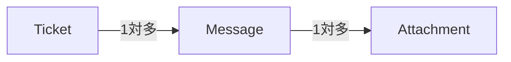
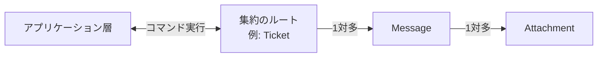

# ドメインモデル（Domain Model）

## 概要

ドメインモデルは**複雑な業務ロジックを実装するための設計手法**。マーチン・ファウラーが提案し、エリック・エヴァンスが「ドメイン駆動設計」として発展させた。

- 技術的な関心事から完全に切り離した**Plain Old Objects**（POCO/POJO/POPO）として実装する
- ソースコードが同じ言葉を語り、業務エキスパートのメンタルモデルを表現する
- 不必要な複雑さを持ち込まない

ドメインモデルの主要部品は**値オブジェクト・エンティティ・集約・業務サービス**の四つ。

---

## 値オブジェクト（Value Objects）（6.2.2.1）

業務で扱う**値**を表現する部品。

**定義の特徴:**
- フィールド値の組み合わせによって識別する（明示的なIDフィールドは不要）
- 不変（イミュータブル）として実装する
- 変更する場合は新しいインスタンスを生成して返す
- 等価判定はIDではなく値のフィールドで判定する（`Equals`オーバーライドが必要）

```csharp
public class Color
{
    public readonly byte Red;
    public readonly byte Green;
    public readonly byte Blue;

    public Color MixWith(Color other)
    {
        return new Color(
            red: Math.Min(255, this.Red + other.Red),
            green: Math.Min(255, this.Green + other.Green),
            blue: Math.Min(255, this.Blue + other.Blue)
        );
    }
}
```

**値オブジェクトの用途として特に重要なのは、通貨あるいは金銭的な値の表現。** 金額をintなどプリミティブな型で扱うと、金額に関わる業務ロジックがあちこちに散らばり、関連する業務ロジックを1箇所にまとめるカプセル化が難しくなる。そして丸めや端数処理に危険な不具合が紛れ込みやすくなる。

**Person例（基本データ型から値オブジェクトへ）:**

```csharp
// NG: 基本データ型への執着
public class Person {
    public string FirstName;
    public string LastName;
    public string PhoneNumber;
    public string EmailAddress;
    public double Height;
    public string CountryCode;
}

// OK: 値オブジェクトで表現
public class Person {
    public Name Name;         // 値オブジェクト
    public PhoneNumber Phone; // 値オブジェクト
    public EmailAddress Email;// 値オブジェクト
    public Height Height;     // 値オブジェクト
    public CountryCode Country;// 値オブジェクト
}
```

### 値オブジェクトをいつ使うか

値オブジェクトは**事業活動を表現する基本部品**と考えるとよい。次節で検討するエンティティの属性として値オブジェクトを使う。また状態区分やパスワードなど、対象領域に固有の概念がある場合も値オブジェクトで表現する。

---

## エンティティ（Entity）（6.2.2.2）

値オブジェクトとは対照的な部品。

**定義の特徴:**
- 個々のインスタンスを特定するための**識別情報（ID）が必要**
- 不変（イミュータブル）ではない（状態が変化する）
- 値オブジェクトはエンティティの**状態を表現する手段**
- エンティティは**単独で実装しない** — 必ず集約の実装の一部になる

```csharp
class Person
{
    public readonly PersonId Id;  // PersonIdは値オブジェクト
    public Name Name { get; set; } // Nameは値オブジェクト

    public Person(PersonId id, Name name)
    {
        this.Id = id;
        this.Name = name;
    }
}
```

識別番号（ID）は値オブジェクトとして実装する。内部では業務に応じた適切なデータ型（GUID・整数・文字列・保険証番号など）を使える。

個体識別フィールドの値はエンティティのインスタンスごとに一意でなければいけない。よほど特殊な場合を除き、エンティティを識別する値はその個体が存在する限り変更してはいけない。

---

## 集約（Aggregate）（6.2.2.3）

ドメインモデルの中心的な部品。**エンティティの階層構造**で、データの一貫性を保証する境界。

### 定義

集約はエンティティであり（一意に識別できるフィールドが必要）、ライフサイクルの途中で状態が変化する。しかし集約は単なるエンティティではなく、**データの一貫性の保証**を目標とする。

### 一貫性を強制する

集約は内部と外部の間に明確な境界を定義することでデータの一貫性を強制する。

- **集約内部の業務ロジックだけが状態を変更できる**
- 外部のプロセスやオブジェクトには集約の状態を**参照することだけ**を許可する
- 集約の状態を変更するには、集約が公開している適切なメソッドを実行することが必要

### コマンド（命令）

集約が公開インターフェースとして外部に提供する状態変更メソッドを**コマンド（命令）**と呼ぶ。コマンドの実装方法は二つある。

**方法1: 通常の公開メソッド**

```csharp
public class Ticket
{
    public void AddMessage(UserId from, string body)
    {
        var message = new Message(from, body);
        _messages.Append(message);
    }
}
```

**方法2: パラメーターオブジェクト（推奨）**

コマンドの実行に必要な情報をカプセル化したオブジェクト。コマンドの種類ごとにパラメーターオブジェクトの型を定義し、多重定義したExecuteメソッドに適切な型のパラメーターオブジェクトを渡す多態（ポリモーフィック）な実装。

```csharp
public class Ticket
{
    public void Execute(AddMessage cmd)
    {
        var message = new Message(cmd.from, cmd.body);
        _messages.Append(message);
    }
}
```

### 並行処理管理

集約の一貫性を保証するもっとも重要な部分。複数のプロセスが同じ集約を変更する場合、最初のプロセスが更新した内容を後続のプロセスが上書きできないようにする必要がある。

**バージョン番号による楽観的ロック:**

```csharp
class Ticket
{
    TicketId _id;
    int      _version;
    ...
}
```

```sql
UPDATE tickets
SET ticket_status = @new_status,
    agg_version = agg_version + 1
WHERE ticket_id=@id AND agg_version=@expected_version;
```

更新前に読み取ったバージョン番号とDB上の番号が一致しない場合は`ConcurrencyException`を発生させ、呼び出し元が最新状態を取得し直して再実行する。

アプリケーション層のコード例（アプリケーション層自体はトランザクションスクリプト）:

```csharp
public ExecutionResult Escalate(TicketId id, EscalationReason reason)
{
    try
    {
        var ticket = _ticketRepository.Load(id);
        var cmd = new Escalate(reason);
        ticket.Execute(cmd);
        _ticketRepository.Save(ticket);
        return ExecutionResult.Success();
    }
    catch (ConcurrencyException ex)
    {
        return ExecutionResult.Error(ex);
    }
}
```

### トランザクションの境界

- **1集約インスタンス = 1トランザクション単位**
- 集約内部のすべてのデータとオブジェクトの状態は、単一のトランザクションとしてDBにコミットする
- **複数の集約にまたがるトランザクションを実行してはいけない**（集約ごとに独立したDBトランザクションを実行し、別々にコミットする）
- 複数集約への変更を単一トランザクションにしたいなら、集約の境界がまちがっているということ

### エンティティの階層構造（図6-3）

集約は複数のエンティティと値オブジェクトの階層構造を持てる（図6-3: Ticket → Message → Attachment）。



この階層構造全体が一つの集約になる（業務ロジックがすべてのオブジェクトを必要とする場合）。「集約」という名前の由来: 関連するエンティティと値オブジェクトをトランザクション境界の内部に**集約**する。

### 他の集約を参照する（図6-4）

他の集約（Customer・Product・Agentなど）は識別番号（ID）を使って参照する。オブジェクトそのものは集約の内部に保持しない。

```csharp
public class Ticket
{
    private UserId          _customer;      // 顧客（IDで参照）
    private List<ProductId> _products;      // 商品のリスト（IDで参照）
    private UserId          _assignedAgent; // 担当者（IDで参照）
    private List<Message>   _messages;      // メッセージのリスト（集約内部に保持）
}
```

**外部集約をIDで参照する理由:**
- そのオブジェクトは集約の境界の外側であることを明確に表現するため
- 集約ごとに固有のトランザクション境界を持つことを保証するため

**あるエンティティを集約で保持するかどうかの判断:** 業務ロジックが結果整合性のみが保証される集約外部のエンティティを参照した場合、不正な状態になる危険があるかないかで判断する。

**経験則: 集約はできるだけ小さく設計する。**

### 集約のルート（図6-5）

集約は複数のエンティティの階層構造だが、外部に公開するインターフェース役のエンティティは**一つ**にすべき。それが**集約のルート**となるエンティティ。



集約内部の他のエンティティの状態を変更するコマンドも、集約のルートを経由して実行する。

### 業務イベント（Domain Events）

業務イベントは、事業活動の中で起きた重要な出来事を表現するメッセージ。

- **名前は必ず過去形**（例: TicketEscalated、MessageReceived）
- 集約は業務イベントを**発行（publish）**する
- 他のプロセス・集約・外部サービスがそのイベントを**購読（subscribe）**し、業務ロジックを実行する（図6-6）

```csharp
public class Ticket
{
    private List<DomainEvent> _domainEvents; // 業務イベントリスト

    public void Execute(RequestEscalation cmd)
    {
        if (!this.IsEscalated && this.RemainingTimePercentage <= 0)
        {
            this.IsEscalated = true;
            var escalatedEvent = new TicketEscalated(_id, cmd.Reason);
            _domainEvents.Append(escalatedEvent);
        }
    }
}
```

業務イベントは集約の公開インターフェースの一部。外部世界と集約を連係させるもう一つの方法。

### 同じ言葉を厳密に反映する

集約を実装する時は、同じ言葉を厳密に反映することが必要。集約の名前、フィールドに持つデータ名、メソッド名、発信する業務イベントの名前、そういうすべての名前を**区切られた文脈の同じ言葉**によって命名する。

---

## 業務サービス（Domain Service）（6.2.2.4）

集約や値オブジェクトでは表現しにくい業務ロジック、または複数の集約にまたがる業務ロジックを記述するための部品。

**定義の特徴:**
- 業務ロジックだけを記述する
- **自分自身の状態は持たない（ステートレス）**
- ほとんどの場合、さまざまなコンポーネントの呼び出しを統合して、何らかの計算や分析を行う

```csharp
public class ResponseTimeFrameCalculationService
{
    public ResponseTimeframe CalculateAgentResponseDeadline(
        UserId agentId, Priority priority, bool escalated, DateTime startTime)
    {
        var policy = _departmentRepository.GetDepartmentPolicy(agentId);
        var maxProcTime = policy.GetMaxResponseTimeFor(priority);

        if (escalated) {
            maxProcTime = maxProcTime * policy.EscalationFactor;
        }

        var shifts = _departmentRepository.GetUpcomingShifts(
            agentId, startTime, startTime.Add(policy.MaxAgentResponseTime));

        return CalculateTargetTime(maxProcTime, shifts);
    }
}
```

**注意:** 業務サービスはマイクロサービスやサービス指向アーキテクチャの「サービス」という用語とは無関係。DDDの業務サービスは業務ロジックの置き場所として使う、状態を持たないオブジェクトのこと。

**1集約=1トランザクションの原則は変わらない。** 業務サービスは複数の集約を参照する計算ロジックを記述する場合に役立つが、複数集約を単一トランザクションとして変更する抜け道ではない。

---

## 複雑さの扱い方（6.2.3）

集約と値オブジェクトの背景にある考え方: **不変条件をカプセル化することで複雑さを小さくする**。

エリヤフ・ゴールドラット（「ザ・チョイス」）によれば、システムの複雑さは**自由度**（状態を表現するデータの個数）によって決まる。

```csharp
// ClassA: 自由度5（5つのフィールドがすべて独立して変化できる）
public class ClassA {
    public int A { get; set; }
    public int B { get; set; }
    public int C { get; set; }
    public int D { get; set; }
    public int E { get; set; }
}

// ClassB: 自由度2（AとDだけが独立、B=A/2、C=A/3、E=D*2）
public class ClassB {
    private int _a, _d;
    public int A { get => _a; set { _a = value; B = value/2; C = value/3; } }
    public int B { get; private set; }
    public int C { get; private set; }
    public int D { get => _d; set { _d = value; E = value*2; } }
    public int E { get; private set; }
}
```

ClassBは一見複雑に見えるが、自由度はClassAの5に対してClassBは2。不変条件（B=A/2など）を追加することで制約が増え、システムの振る舞いを制御・予測するのが**簡単**になっている。

**値オブジェクト・集約の役割:**
- 値オブジェクト: 内部の状態に関するすべての業務ロジックを境界の内部に記述する
- 集約: 内部の状態を変えられるのは集約自身のメソッドだけ

業務ロジックをカプセル化し業務ルールを確実に適用することで自由度が下がり、複雑さを小さくできる。

---

## 比較: ドメインモデルの部品

| 部品 | ID | 状態変化 | 特徴 |
|---|---|---|---|
| 値オブジェクト | なし | なし（不変） | フィールド値の組み合わせで識別。変更時は新インスタンスを生成 |
| エンティティ | あり | あり | 集約の一部として実装。単独では実装しない |
| 集約 | あり（ルート） | あり | データの一貫性境界。1集約=1トランザクション |
| 業務サービス | なし | なし（ステートレス） | 複数集約にまたがる計算ロジック |

---

## 判断基準

**Q. 値オブジェクトかエンティティか？**

```
「個々のインスタンスを個別に識別する必要があるか？」
  YES → エンティティ（IDが必要）
  NO（同じ値なら同じものと扱える）→ 値オブジェクト

「状態が変化するか？」
  YES → エンティティまたは集約
  NO  → 値オブジェクト
```

**Q. あるエンティティを集約内部に持つかIDで参照するか？**

```
「業務ロジックがそのエンティティの状態に強い一貫性を必要とするか？」
  YES → 集約の内部に含める
  NO（結果整合性でよい）→ IDで参照する（外部に置く）
```

**Q. 業務サービスを使うか？**

```
「業務ロジックが複数の集約を参照する計算か？」
  YES → 業務サービスを検討
  NO  → 集約または値オブジェクトに記述する
```

**Q. ドメインモデルをいつ使うか？**

```
「業務ロジックが複雑か？」
  YES（中核の業務領域）→ ドメインモデルを使う
  NO → トランザクションスクリプトまたはアクティブレコード（第5章）を使う
```

---

## アンチパターン

**アンチパターン1: 基本データ型への執着（Primitive Obsession）**
> 金額・電話番号・メールアドレスなどをstringやintで扱うと、関連する業務ロジックがあちこちに散らばる。値オブジェクトで表現することでロジックをカプセル化する。

**アンチパターン2: エンティティを単独で実装する**
> エンティティは必ず集約の実装の一部になる。エンティティ単独で実装すると、データの一貫性の境界が定義できない。

**アンチパターン3: 複数の集約にまたがるトランザクション**
> 複数集約を単一トランザクションでコミットしようとすると、集約の境界がまちがっているサイン。集約を再設計するか、結果整合性で対処する。

**アンチパターン4: 集約を大きくしすぎる**
> 集約が大きくなるとパフォーマンスやスケーラビリティの問題が起きやすくなる。集約はできるだけ小さく設計し、強い一貫性が必要なデータだけを含める。

**アンチパターン5: 業務イベントの名前に過去形を使わない**
> 業務イベントは実際に起きた出来事を表現するため、名前は必ず過去形にする（TicketEscalated、MessageReceived など）。現在形や命令形は業務イベントではなく業務コマンドを表す。

---

## 関連概念

- [[subdomain]] — ドメインモデルは中核の業務領域に使う。補完・一般的な業務領域にはトランザクションスクリプト等を使う
- [[business-logic-simple]] — トランザクションスクリプト・アクティブレコード（単純な業務ロジック向け）との対比
- [[bounded-context]] — ドメインモデルは区切られた文脈の内部で実装する。同じ言葉による命名が必須
- [[ubiquitous-language]] — 集約・値オブジェクト・業務イベントのすべての名前を同じ言葉で命名する
