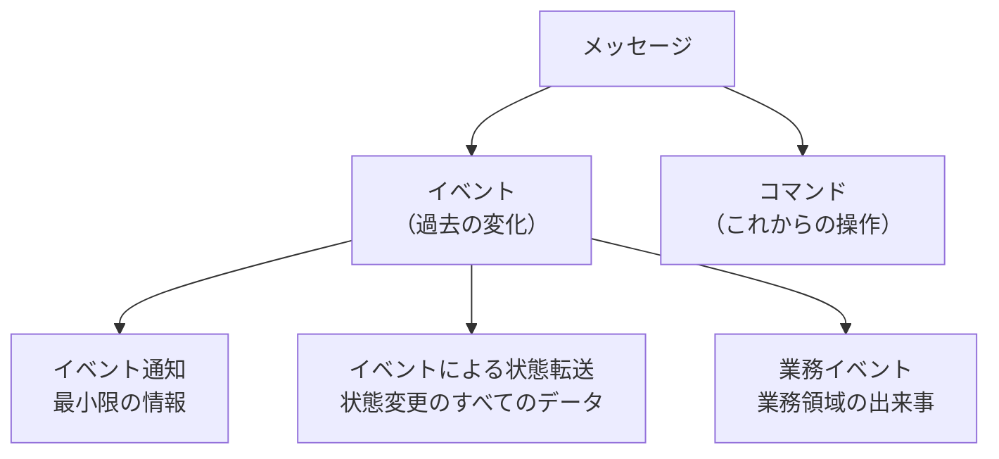
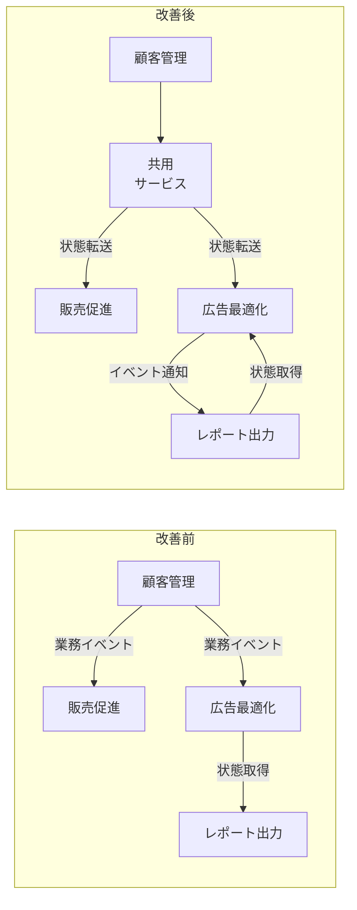

# イベント駆動型アーキテクチャ

## 概要（第15章）

イベント駆動型アーキテクチャ（EDA）は、コンポーネント間で非同期にイベントメッセージをやりとりする技術方式。区切られた文脈の公開インターフェースを設計する手段として使う。

**EDAとイベントソーシングの違い（重要）**:

| 概念 | 範囲 | 役割 |
|---|---|---|
| **EDA** | コンポーネント間の通信方式 | 境界を越えてイベントメッセージを非同期で送受信する |
| **イベントソーシング（ES）** | 区切られた文脈の内部実装方式 | 集約の状態変化をイベントとして記録する |

EDAはシステム全体の連係方式、イベントソーシングはサービス内部の実装方式。同じ設計方法の別名ではない。

---

## イベント・コマンド・メッセージ（15.2.1）

メッセージはイベントとコマンドの二つに分類できる。

**イベント**: すでに起こった変化を表現したメッセージ
- 過去に起きた事実
- イベントを受け取った側はイベントを取り消せない
- イベント名は**過去形**で表現する（例: DeliveryScheduled・ShipmentCompleted・DeliveryConfirmed）
- 逆方向の処理をするには、サーガの補償アクション（コマンドの発行）しかない

**コマンド**: これから実行すべき操作を表現したメッセージ
- これからやるべき何かを示す
- **拒否される可能性がある**（内容が不完全・業務ルール違反など）

両者はどちらも非同期メッセージとして送信される。

---

## イベントのデータ構造（15.2.2）

イベントは何らかのメッセージ通信基盤を使って直列化（serialized）して外部に送信できるデータレコード。

典型的なデータ構造: **メタデータ**（イベントを説明する付加的な情報）+ **ペイロード**（イベントの内容）

```json
{
  "type": "delivery-confirmed",
  "event-id": "14101928-4d79-4da6-9486-dbc4837bc612",
  "correlation-id": "08011958-6066-4815-8dbe-dee6d9e5ebac",
  "delivery-id": "05011927-a328-4860-a106-737b2929db4e",
  "timestamp": 1615718833,
  "payload": {
    "confirmed-by": "17bc9223-bdd6-4382-954d-f1410fd286bd",
    "delivery-time": 1615701406
  }
}
```

---

## イベントの3カテゴリー（15.2.3）

イベントは三つのカテゴリーに分類できる。



### 15.2.3.1 イベント通知（Event Notification）

他のコンポーネントが反応することを想定した、事業活動で起きた変化に関するメッセージ。

- **内容は必要最小限**: 購読者にイベントの発生を伝えることが唯一の目的
- 受信側はリンクをたどって詳細情報を問い合わせる
- 例: PayCheckGenerated（給与明細発行済）・CampaignPublished（キャンペーン公開済）

```json
{
  "type": "paycheck-generated",
  "event-id": "537ec7c2-d1a1-2005-8654-96aee1116b72",
  "delivery-id": "05011927-a328-4860-a106-737b2929db4e",
  "timestamp": 1615726445,
  "payload": {
    "employee-id": "456123",
    "link": "/paychecks/456123/2021/01"
  }
}
```

**イベント通知が好ましい状況**:
- **セキュリティ**: 詳細情報を明示的に問い合わせさせることで、保護すべき情報がメッセージ通信基盤上に漏洩することを防ぐ。アクセスには追加の権限チェックを行う
- **並行性**: 非同期のため届いた時には内容が最新ではない可能性がある。厳密な最新状態が必要なら明示的に問い合わせる。複数コンシューマーが競合する場合、悲観的ロックを組み込んで同じメッセージを複数が処理しないよう制御できる

### 15.2.3.2 イベントによる状態転送（Event-Carried State Transfer: ECST）

プロデューサー内部の状態変更を購読側に通知するメッセージ。

- **状態の変更を反映したすべてのデータを含む**（イベント通知とは対照的）
- 受信側がローカルにキャッシュすることで、プロデューサーが止まっていても処理を継続できる（耐障害性の向上）
- **データを非同期に複製する仕組み**
- 複数の情報源からのデータを処理する必要があるコンポーネントの性能を向上させる

形式は二種類:
- 変更後の状態の**完全なスナップショット**
- 実際に**更新されたフィールドだけ**（大きなデータ構造を操作している場合）

### 15.2.3.3 業務イベント（Domain Event）

第6章で説明した業務イベント。業務領域で発生した重要な出来事を表現しつつ、その出来事を説明するすべてのデータを含む。

**業務イベントとイベント通知の違い**:
- 業務イベントはそのイベントを表現するすべての情報を含む（追加の問い合わせ不要）
- イベント通知の目的は他コンポーネントとの連係の複雑さの緩和
- 業務イベントの目的は業務領域の活動をモデル化し説明すること
- 業務イベントは他のコンポーネントが興味を持たなくても役に立つ（イベント履歴式ドメインモデルで特に有効）

**業務イベントとイベントによる状態転送の違い**:
- ECSと状態転送では、発信側の状態を受信側でローカルキャッシュするための十分な情報を提供する
- 業務イベントはそのような詳細を外部に公開しない
- 業務イベントは集約の状態ではなく、集約のライフサイクルの途中で発生した業務的な出来事を表現する

**具体例: 「結婚」を3カテゴリーで表現**

```javascript
// イベント通知: 婚姻届済という事実だけ
eventNotification = {
  "type": "婚姻届済",
  "person-id": "01b9a761",
  "payload": {
    "person-id": "126a7b61",
    "details": "/01b9a761/marriage-data"
  }
};

// イベントによる状態転送: 個人情報の変更（姓の変更）
ecst = {
  "type": "個人情報変更済",
  "person-id": "01b9a761",
  "payload": {
    "new-last-name": "Williams"
  }
};

// 業務イベント: 現実世界で起きた出来事の要点
domainEvent = {
  "type": "結婚",
  "person-id": "01b9a761",
  "payload": {
    "person-id": "126a7b61",
    "assumed-partner-last-name": true
  }
};
```

---

## イベント駆動型の連係を設計する（15.3）

イベント設計が、コンポーネントの連係方法とコンポーネント間の境界を明確にする。どのカテゴリーのイベントを選択するかで、疎結合になるか密結合になるかが決まる。

### 15.3.1 分散した大きな泥団子

業務イベントをすべて公開してしまうと、購読側は実装の詳細と密に結合する。これが分散した大きな泥団子（密結合した分散システム）になる。

**密結合の3パターン**:

#### 時間的な結合（15.3.2）
実行の順番に強く依存している状態。

- コンポーネントAの処理がコンポーネントBより先に完了していなければならない
- 対処として「遅延」を導入するが、ネットワーク障害・高負荷・サービス障害で破綻する
- 根本原因: 業務イベントによる状態転送を使い、受信側が発信側の状態に依存している

#### 機能的な結合（15.3.3）
複数のコンポーネントが同じ業務機能を実装している状態。

- 同じイベントを購読し、同じ業務機能を実装 → 双方向に機能的に結合
- 機能の変更があれば、両方のコンポーネントを同時に変更する必要がある

#### 実装の結合（15.3.4）
あるコンポーネントの実装変更が、購読している別コンポーネントの変更を強制する状態。

- イベントのデータ構造が変更されると、投影ロジックでエラーが発生する
- 新しい業務イベントが追加されると、受信側の投影モデルに潜在的な影響を与える

### 15.3.5 イベント駆動型連係のリファクタリング

密結合を解消する方法:

**実装の結合と機能的な結合の解消**:
- 投影ロジックを発信側（顧客管理）にカプセル化する
- **コンシューマー駆動契約（Consumer-Driven Contract）**: 受信側が必要とするモデルを発信側が投影し、その投影結果を**公開された言葉**に含める
- 連係用のモデルは顧客管理内部の実装モデルから切り離される
- 発信するイベントは**イベントによる状態転送**を使う

**時間的な結合の解消**:
- 広告最適化（上流）が**イベント通知**を発行する
- レポート出力（下流）はその通知を受信した時に必要なデータを取りに行く
- 遅延の仕組みが不要になる



### 15.3.6 イベント駆動型で設計する経験則

#### 15.3.6.1 最悪のケースを想定する（パラノイアだけが生き残る）

イベント駆動型システムを設計する時の指針:
- ネットワークは必ず遅延する
- サーバーはもっとも都合の悪い時に故障する
- イベントは順番通りには届かない
- イベントは重複する
- 障害は決まって休日や祝祭日に起きる

**対策**:
- メッセージを確実に送出するために**送信箱（Outbox）**を使う（[[communication]] 参照）
- 購読側でメッセージの重複排除と順序の並び替えを行う
- 複数の区切られた文脈にまたがる業務プロセスでは**サーガまたはプロセスマネージャー**を活用する（[[communication]] 参照）

#### 15.3.6.2 公開イベントと内部イベントを使い分ける

業務イベントを発行する時は、実装の詳細が外部に漏れ出ないようにする。

- イベントを区切られた文脈の**公開インターフェースの不可欠な要素**として扱う
- 共用サービスを実装する場合、イベントが**区切られた文脈の公開された言葉**を反映するようにする
- 業務イベントを他の区切られた文脈との通信にそのまま使うのは控える
- **公開する業務イベントを限定する**ことを検討する
- イベント通知メッセージを使えば、公開インターフェースをさらに小さくできる

#### 15.3.6.3 一貫性の要求レベルを検討する

| 一貫性の要求 | 推奨するイベントカテゴリー |
|---|---|
| **結果整合性**（最終的に一貫性のあるデータに落ち着けばよい） | イベントによる状態転送 |
| **強い一貫性**（受信側で発信側の最新の書き込みを読む必要がある） | イベント通知を発行 → 受信側が発信側に最新状態を問い合わせる |

---

## 判断基準

**Q. どのイベントカテゴリーを使うべきか？**

```
「発信側の実装詳細を隠蔽したいか？」
  YES → イベント通知 または イベントによる状態転送（共用サービス経由）を使う
  NO → 業務イベントをそのまま公開してもよいが、リスクを理解した上で

「受信側でローカルキャッシュして耐障害性を高めたいか？」
  YES → イベントによる状態転送
  NO → イベント通知

「強い一貫性（最新の書き込みを反映）が必要か？」
  YES → イベント通知（受信側が問い合わせて最新状態を取得）
  NO（結果整合性で十分） → イベントによる状態転送
```

**Q. 密結合の疑いがあるか？**

```
「複数の区切られた文脈が同じ業務ロジックを実装しているか？」
  YES → 機能的な結合。投影ロジックを発信側にカプセル化してコンシューマー駆動契約に移行する

「処理の実行順番を「遅延」で保証しようとしているか？」
  YES → 時間的な結合。イベント通知に切り替えて受信側が必要時に問い合わせる設計にする

「発信側のイベントデータ構造の変更が受信側の変更を強制するか？」
  YES → 実装の結合。共用サービス+コンシューマー駆動契約で公開インターフェースを分離する
```

---

## アンチパターン

**アンチパターン1: 業務イベントをそのまま区切られた文脈間の通信に使う**
> イベント履歴式ドメインモデルが生成するすべての業務イベントを購読側に公開すると、実装と密に結合する。解決策: 公開する業務イベントを一部に限定するか、イベントによる状態転送や共用サービスを使う。

**アンチパターン2: 遅延で時間的な結合を解決しようとする**
> 「5分待てば先行処理が終わる」という設計は、ネットワーク障害・高負荷・サービス障害で破綻する。受信側がイベントを受け取った時に問い合わせる設計に変える。

**アンチパターン3: イベントカテゴリーを選ばずすべてに業務イベントを使う**
> 業務イベントは業務領域のモデル化が目的。連係の複雑さ緩和が目的ならイベント通知、状態の非同期複製が目的ならイベントによる状態転送を使う。カテゴリーの誤りは分散した大きな泥団子につながる。

**アンチパターン4: EDAとイベントソーシングを混同する**
> EDAはコンポーネント間の通信方式、イベントソーシングは区切られた文脈内部の実装方式。どちらを採用するかは独立して決定できる。

---

## 関連概念

- [[communication]] — 送信箱・サーガ・プロセスマネージャーはEDAの信頼性確保に必要（第9章）
- [[bounded-context]] — EDAは区切られた文脈の公開インターフェースを設計する手段
- [[event-sourced-domain-model]] — イベントソーシングはEDAとは異なる（内部実装方式）
- [[microservices]] — 共用サービスを使って公開インターフェースを小さくする手法と連動
- [[context-integration]] — 共用サービスはコンテキスト連係パターンの一つ
