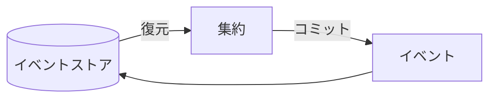
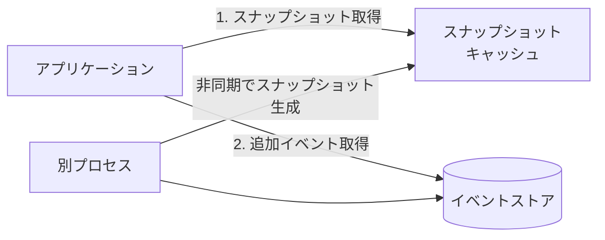
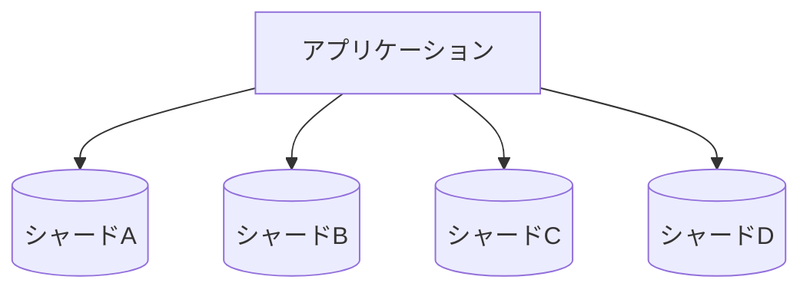

# イベント履歴式ドメインモデル（Event-Sourced Domain Model）

## 概要

**イベントソーシング**とは、オブジェクトのすべての状態変更をイベントとして表現し、永続化する考え方。永続化されたイベントが「**真実を語る唯一の情報源**」（source of truth）となる。

**イベント履歴式ドメインモデル**は、ドメインモデルの集約にイベントソーシングを適用したもの。従来のドメインモデルとの違いは、**集約の状態を永続化するのではなく、集約の状態が変化したことを業務イベントで表現し、業務イベントの履歴を永続化する**こと。

> 「イベントソーシング」ではなく「イベント履歴式ドメインモデル」という用語を使う理由: イベントソーシングはさまざまな状態管理に適用可能で、集約の状態管理に限定されない。集約のライフサイクルの状態管理にイベントソーシングを使っていることを明示するためにこの用語を選んだ。

ドメインモデルの基本となる部品（値オブジェクト・集約・業務イベント）は同じ。対象も複雑な業務ロジックと中核の業務領域。

---

## 7.1 イベントソーシング

### 基本的な考え方

状態そのものを保存する代わりに、**状態を変化させたイベントの履歴を保存**する。そのイベント履歴を順番に適用することで、任意の時点の状態を再構築（投影）できる。

会計の世界のアナロジー: 元帳の変化を表現するためにイベント（会計取引）を使い、口座の残高（現在の状態）は元帳の記録からいつでも「投影」できる。

### 見込み客の例（イベント履歴）

```json
{ "lead-id": 12, "event-id": 0, "event-type": "新規登録", "last-name": "小林", "first-name": "浩美", "phone-number": "555-2951", "timestamp": "2020-05-20T09:52:55.95Z" }
{ "lead-id": 12, "event-id": 1, "event-type": "架電", "timestamp": "2020-05-20T12:32:08.24Z" }
{ "lead-id": 12, "event-id": 2, "event-type": "商談予定設定", "followup-on": "2020-05-27T12:00:00.00Z", "timestamp": "2020-05-20T12:32:08.24Z" }
{ "lead-id": 12, "event-id": 3, "event-type": "連絡先変更", "last-name": "小林", "first-name": "裕美", "phone-number": "555-8101", "timestamp": "2020-05-20T12:32:08.24Z" }
{ "lead-id": 12, "event-id": 4, "event-type": "架電", "timestamp": "2020-05-27T12:02:12.51Z" }
{ "lead-id": 12, "event-id": 5, "event-type": "注文受領", "payment-deadline": "2020-05-30T12:02:12.51Z", "timestamp": "2020-05-27T12:02:12.51Z" }
{ "lead-id": 12, "event-id": 6, "event-type": "支払完了", "status": "成約", "timestamp": "2020-05-27T12:38:44.12Z" }
```

この一連のイベント記録から、顧客が成約済みになるまでのストーリーがわかる。

### 投影（Projection）

イベント履歴に対して、それぞれのイベントに対して単純な変換ロジックを順次実行することで状態を再構築する。

**状態モデルの投影（最新状態）:**

```csharp
public class LeadStateModelProjection
{
    public long LeadId { get; private set; }
    public string FirstName { get; private set; }
    public string LastName { get; private set; }
    public LeadStatus Status { get; private set; }
    public int Version { get; private set; }

    public void Apply(LeadInitialized @event)  // 新規登録
    {
        LeadId = @event.LeadId;
        Status = LeadStatus.NEW_LEAD;
        FirstName = @event.FirstName;
        Version = 0;
    }
    public void Apply(ContactDetailsChanged @event)  // 連絡先変更
    {
        FirstName = @event.FirstName;
        LastName = @event.LastName;
        PhoneNumber = @event.PhoneNumber;
        Version += 1;
    }
    public void Apply(PaymentConfirmed @event)  // 支払完了
    {
        Status = LeadStatus.CONVERTED;
        Version += 1;
    }
}
```

**Versionフィールドに注目:** 業務イベントを適用するたびにバージョン番号を増やす。バージョン番号はエンティティの状態を変更した回数。業務イベントを部分的に適用することで**タイムトラベル**ができる（バージョン5の状態を知りたければ、最初の5つのイベントだけ適用すればよい）。

### 7.1.1 検索

変更前の情報も含む検索が、同じイベント履歴から別の投影ロジックで実現できる。

```csharp
public class LeadSearchModelProjection
{
    public HashSet<string> FirstNames { get; private set; }
    public HashSet<string> LastNames { get; private set; }
    public HashSet<PhoneNumber> PhoneNumbers { get; private set; }

    public void Apply(LeadInitialized @event)
    {
        FirstNames = new HashSet<string>();
        LastNames = new HashSet<string>();
        PhoneNumbers = new HashSet<PhoneNumber>();
        FirstNames.Add(@event.FirstName);
        LastNames.Add(@event.LastName);
        PhoneNumbers.Add(@event.PhoneNumber);
    }
    public void Apply(ContactDetailsChanged @event)
    {
        FirstNames.Add(@event.FirstName);   // 上書きではなく追加
        LastNames.Add(@event.LastName);
        PhoneNumbers.Add(@event.PhoneNumber);
    }
}
// 結果: FirstNames: ['浩美', '裕美'], PhoneNumbers: ['555-2951', '555-8101']
```

### 7.1.2 分析

同じイベント履歴から、ビジネス分析用の投影ロジックを追加できる。

```csharp
public class AnalysisModelProjection
{
    public int Followups { get; private set; }  // 商談予定設定回数
    public LeadStatus Status { get; private set; }

    public void Apply(FollowupSet @event)
    {
        Status = LeadStatus.FOLLOWUP_SET;
        Followups += 1;  // 商談予定設定イベントのたびにカウント
    }
}
// 結果: Followups: 1, Status: 成約
```

**重要:** 投影したモデルをデータベースに永続化するには、第8章で説明するCQRS（コマンド・クエリ責任分離）を学ぶ。

### 7.1.3 真実を語る唯一の情報源

イベントソーシングを実現するには、オブジェクトのすべての状態変更をイベントとして表現し、永続化することが必要。永続化されたイベントが「真実を語る唯一の情報源」となる。

一連のイベントを永続化するデータベースを**イベントストア**と呼ぶ（図7-1）。



### 7.1.4 イベントストア

イベントストアは**追記専用**。記録したイベントの変更や削除はできない（データ移行など特殊な場合を除く）。

イベントソーシングを実現するための最低限必要な機能は二つ:
- 特定のエンティティに関するすべてのイベントを取り出す
- イベントを追記する

```csharp
interface IEventStore
{
    IEnumerable<Event> Fetch(Guid instanceId);
    void Append(Guid instanceId, Event[] newEvents, int expectedVersion);
}
```

`expectedVersion`は楽観的な排他制御を実現するために必要。新たなイベントを追記する時に、指定したバージョンがデータストア側の最新バージョンよりも古い（別のプロセスがイベントを追加済み）であれば、イベントストアは書き込みを失敗させ例外を送出する。

---

## 7.2 イベント履歴式ドメインモデル

### 4ステップの操作手順

イベント履歴式集約への操作は以下の手順で行う:

1. 業務イベント履歴を読み込む
2. 業務判断の対象となる、ある時点の状態を業務イベント履歴から再構築する
3. 集約のコマンド（業務ロジック）を実行し、その結果として、業務イベントを生成する
4. 新たに生成した業務イベントをイベントストアにコミットする

### アプリケーション層のコード

```csharp
public class TicketAPI
{
    private ITicketsRepository _ticketsRepository;  // イベントストア

    public void RequestEscalation(TicketId id, EscalationReason reason)
    {
        var events = _ticketsRepository.LoadEvents(id);  // ステップ1
        var ticket = new Ticket(events);                  // ステップ2（状態再構築）
        var originalVersion = ticket.Version;
        var cmd = new RequestEscalation(reason);
        ticket.Execute(cmd);                              // ステップ3（コマンド実行）
        _ticketsRepository.CommitChanges(ticket, originalVersion);  // ステップ4
    }
}
```

### 集約の実装（イベント履歴式）

```csharp
public class Ticket
{
    private List<DomainEvent> _domainEvents = new List<DomainEvent>();
    private TicketState _state;

    public Ticket(IEnumerable<IDomainEvents> events)
    {
        _state = new TicketState();
        foreach (var e in events)
        {
            AppendEvent(e);  // 既存の全イベントを適用して状態を再構築
        }
    }

    private void AppendEvent(IDomainEvent @event)
    {
        _domainEvents.Append(@event);
        // TicketStateクラスに多重定義された適切なApplyメソッドが動的に呼び出される
        ((dynamic)_state).Apply((dynamic)@event);
    }

    public void Execute(RequestEscalation cmd)
    {
        if (!_state.IsEscalated && _state.RemainingTimePercentage <= 0)
        {
            var escalatedEvent = new TicketEscalated(_id, cmd.Reason);
            AppendEvent(escalatedEvent);  // 状態変更→イベント生成の順序
        }
    }
}
```

従来のドメインモデルでは `IsEscalated = true` と直接状態を変更していたが、イベント履歴式では **escalatedEventを生成してAppendEventに渡す**。

### 状態クラス（TicketState）

```csharp
public class TicketState
{
    public TicketId Id { get; private set; }
    public int Version { get; private set; }
    public bool IsEscalated { get; private set; }

    public void Apply(TicketInitialized @event)  // 新規登録
    {
        Id = @event.Id;
        Version = 0;
        IsEscalated = false;
    }
    public void Apply(TicketEscalated @event)  // チケットエスカレーション
    {
        IsEscalated = true;
        Version += 1;
    }
}
```

---

## 7.2.1 利点

### タイムトラベル

業務イベントの履歴から、集約の最新状態を構築するのと同じ方法で、**過去のあらゆる時点の状態を再現できる**。

用途:
- システムの使われ方の分析
- システムが行った判定結果の検査
- 業務ロジックの最適化
- 障害・不具合の調査（障害発生時点の集約の状態を正確に再現できる）

### 深い洞察

イベントソーシングは、業務イベントの履歴という一つの情報源から、さまざまな状態を表現できる。状態を投影する新たなロジックをいつでも追加できるので、**既存のイベント履歴から、業務活動について新たな洞察を手に入れることが可能**。

### 監査ログ

業務イベントの履歴は厳密な一貫性を持つ監査ログ。集約の状態を変化させたすべての業務活動の正確な記録。事業領域によっては、このような監査ログの保存が法的に義務づけられている。金銭や金融取引を管理するシステムで特に成力を発揮する。

### 進化した楽観的排他制御

従来の楽観的排他制御では、読み込んだデータを変更して書き込む途中で他のプロセスが同じデータを上書きしたことを検知すると例外が発生し、書き込みは失敗する。

イベントソーシングを採用すると、既存のイベントを読み込んでから新しいイベントを書き込むまでに起きることを正確に把握できる。イベントストアに同時に追加された業務イベントを取得し、**イベントを追加する操作が衝突しているのか、それとも無関係であり操作を継続しても安全かどうかを業務視点で判定するロジック**を組み込める。

---

## 7.2.2 欠点

### 学習曲線

従来のデータ管理の方法とまったく違うやり方。このやり方を正しく実装するにはチームの訓練が必要。チームがイベント履歴式のシステムを開発した経験がない限り、この学習曲線を考慮に入れなければならない。

### モデルの発展性

イベントソーシングの厳密な定義では、イベントは不変（イミュータブル）。一度定義したイベントのデータ構造を変えるプロセスは、テーブル設計の変更に比べ、はるかに難しい課題。

### 技術方式の複雑さ

イベントソーシングの実装はシステムにさまざまな仕組みを持ち込むことになり、システム全体の設計が複雑になる。

---

## 7.3 よくある質問

### 7.3.1 性能

**Q: イベントが増えると性能がかなり悪くなりそうだが、うまくいくのか？**

イベント履歴から状態を投影するにはそれなりの処理能力は必要。集約のイベント履歴が大きくなるほど性能が劣化する。

**スナップショット（図7-2）:**

性能に影響がでるほど巨大なイベント履歴を扱う必要がある特殊な状況では、スナップショットが使える。



手順:
1. 投影済みの状態（スナップショット）をキャッシュから取得する
2. スナップショットを作った時点より後に追加されたイベントをイベントストアから取得する
3. 取得したイベントをメモリ上でスナップショットに適用する

**判断基準:** ほとんどのシステムでは、一つの集約のイベントが一万を超えれば性能に影響がでる。実際には、集約のイベント数が百を超えるようなシステムはほとんどない。スナップショット方式が適切に思える場合でも、まず集約の境界の設計を見直すことをおすすめする。

**Q: スケールできますか？**

イベント履歴式ドメインモデルは簡単にスケールできる。集約に関する操作は集約のインスタンスごとに実行されるため、イベントストアは**集約IDでシャーディング（水平分割）**できる（図7-3）。特定インスタンスに属するすべてのイベントを同じシャードに書き込む。



### 7.3.2 データの削除

**Q: 追記専用のイベントストアで、GDPRに対応するためにデータの物理削除が必要になった場合は？**

「**忘れられる内容**」（forgettable payload）パターンで解決する。

1. イベントに含まれる、慎重に扱うことが必要なすべての情報を暗号化する
2. 暗号化のキーはイベントストアとは別のKey-Valueストアに保存する（Key=集約の識別番号、Value=暗号化のキー）
3. 情報を削除したい場合: Key-Valueストアに保存した暗号化のキーを削除する → イベントに含まれる保護すべき情報は復元できなくなる

### 7.3.3 他のやり方ではだめですか？

**ログをテキストファイルに書き出して監査ログとして使う方法:**
データベースへの書き込みとファイルへの書き込みはトランザクション管理が別々。片方の書き込みが失敗すると不整合（eventually inconsistent）になる。

**状態の書き込みと履歴テーブルへの書き込みを一つのDBトランザクションで処理する方法:**
技術的には一貫性を実現しているが、プログラムの変更が必要になった時、保守担当が履歴テーブルへの反映を忘れる可能性がある。状態変更ありのテーブルを「真実を語る唯一の情報源」とした場合、履歴テーブルの扱いがいいかげんになりがち。

**状態を記録するテーブルにトリガーを追加して履歴テーブルに複製する方法:**
履歴テーブルへの書き忘れは起きない。しかし、これは単なるデータの記録（項目の変化内容が記録されるだけ）。**業務の文脈が欠落する** — つまり、その項目が変更された**理由**を記録できない。理由がわからなければ、新たなモデルを投影できる可能性は、きわめて小さくなる。

---

## 比較: 業務ロジックの実装方法（第5〜7章まとめ）

| 実装方法 | 永続化 | 業務ロジックの複雑さ | 対象領域 |
|---|---|---|---|
| トランザクションスクリプト | 最新状態 | 単純 | 補完・一般 |
| アクティブレコード | 最新状態 | 単純（複雑なデータ構造） | 補完・一般 |
| ドメインモデル | 最新状態 | 複雑 | 中核 |
| イベント履歴式ドメインモデル | イベント履歴 | 複雑（時間軸の洞察が必要） | 中核 |

---

## 判断基準

**Q. イベント履歴式ドメインモデルを使うか？**

```
「業務ロジックが複雑か？（中核の業務領域か？）」
  NO → ドメインモデル以外（第5章）を使う

「業務活動の時間軸での分析・監査ログ・タイムトラベルが必要か？」
  YES → イベント履歴式ドメインモデルを検討
  NO  → 通常のドメインモデル（第6章）で十分

「チームがイベントソーシングの開発経験を持つか？」
  NO → 学習曲線を考慮に入れて導入判断する

「一つの集約インスタンスに発生が予想されるイベント数は？」
  100以下 → スナップショット不要
  10,000超 → スナップショットを検討（ただし先に集約境界の設計を見直す）
```

---

## アンチパターン

**アンチパターン1: 補完・一般の業務領域にイベント履歴式ドメインモデルを使う**
> 「事業活動の視点で設計判断する」という原則から外れる。目の前の課題解決にイベント履歴式ドメインモデルを使う正当な理由がなく、もっと単純な解決方法を採用できる場合、欠点（学習曲線・技術的複雑さ・モデルの発展性）が深刻な問題となる。

**アンチパターン2: ログファイルを監査ログとして使う**
> データベースとファイルの書き込みはトランザクション管理が別々なため、一貫性が保証されない。

**アンチパターン3: 状態変更の「理由」を記録しない**
> DBトリガーによる履歴記録は項目の変化内容だけを記録し、業務の文脈（変更理由）が欠落する。理由がわからなければ新たな投影ロジックを追加できない。

---

## 関連概念

- [[domain-model]] — イベント履歴式ドメインモデルの基礎。値オブジェクト・集約・業務イベントは同じ部品を使う
- [[business-logic-simple]] — トランザクションスクリプト・アクティブレコードとの4方式比較
- [[subdomain]] — イベント履歴式ドメインモデルは中核の業務領域に使う
