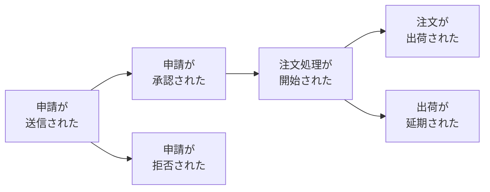
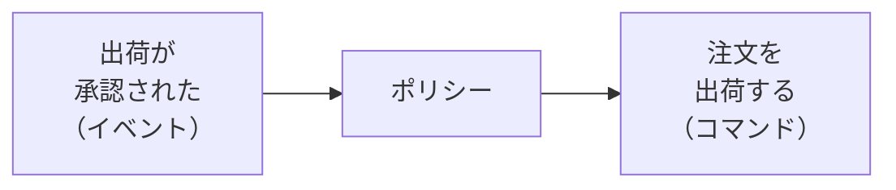

# イベントストーミング

## 概要（第12章）

イベントストーミングは、業務プロセスのモデルを迅速に構築するための協調型ワークショップ。**アルベルト・ブランドリーニ**が考案し、「指針」として定義している（厳密なルールではない）。

主な価値は成果物（モデル・区切られた文脈）より**モデリング活動自体**にある。さまざまな関係者が知識を共有し、事業のメンタルモデルを一致させ、同じ言葉を作り上げることが目的。

---

## 誰が参加するか（12.2）

探求する業務領域の知識を持つすべての関係者:

- ソフトウェアエンジニア
- 業務エキスパート
- プロダクトオーナー（PO）
- テスター
- UI/UXデザイナー
- サポート担当者

**人数の目安**: 対面は10人以下、リモートは5人以下が効果的（参加度と知識共有のバランス）。

---

## 必要なもの（12.3）

- モデリングスペース（広い壁面・デジタルボード）
- 複数の色の付箋
- サインペン
- 軽食（お菓子）
- 椅子のない広い部屋（動き回れる環境）

---

## 付箋の色分け（凡例）

| 付箋の色・形 | 表すもの |
|---|---|
| オレンジ | 業務イベント |
| 水色 | コマンド |
| 黄色（小） | アクター |
| 紫 | ポリシー（自動化ポリシー） |
| 緑 | 読み取りモデル |
| 黄色（大） | 集約 |
| ピンク（四角） | 外部システム |
| ピンク（ダイヤモンド45度傾け） | 問題点（pain point） |
| 垂直線 | 転換イベント |

---

## 10ステップのプロセス（12.4）

イベントストーミングは通常10ステップで実施する。ステップごとに情報や概念を追加しながらモデルを成長させる。

### ステップ1: 発散的に探索する

業務イベントのブレインストーミング。業務イベントは業務活動で起きた興味深い出来事（すでに起きたことなので**過去形**で表現する）。

- 参加者全員が思いついた業務イベントをオレンジの付箋に書き、モデリングスペースに貼る
- この段階ではイベントの順序や重複を気にしない
- 誰も新しい業務イベントを追加できなくなるまで続ける

### ステップ2: 時系列に並べる

ステップ1の業務イベントを業務で発生する順番に整理する。

- **正常系のシナリオ**（期待通りに成功する業務シナリオ）から始める
- 完了後、代替シナリオも追加（エラー・異なる意思決定）
- フローの分岐は「先行イベントから発生する二つのフロー」または「矢印を描いて接続」で示す
- 不正確なイベントの修正、重複の排除、不足イベントの追加も行う



### ステップ3: 問題点を洗い出す

イベントを時系列に整理したら、プロセス全体の中で注意が必要な点を特定する。

問題点の例:
- ボトルネックになっている箇所
- 自動化できていない作業
- 文書化されていないもの
- 業務知識が不足しているところ

**表現方法**: 45度傾けたダイヤモンド形のピンクの付箋でマークする。

ファシリテーターとしてワークショップのすべてのステップで参加者の発言に気を配り、問題や懸念があがったら書き出す。

### ステップ4: 転換イベントを見つける

文脈やフェーズの変化を示す重要な業務イベントを**転換イベント**（pivotal event）と呼ぶ。

- 垂直線を引き、イベントをその垂直線上に配置して前後で転換があることを表現する
- 転換イベントは**区切られた文脈を発見する手がかり**になる

例: 「ショッピングカートが初期化された」「注文処理が開始された」「注文が出荷された」「注文が配達された」「注文が返品された」は注文処理プロセスの重要な変化を表す

### ステップ5: コマンドを見つける

**コマンド**: イベントあるいはイベントのフローを引き起こすもの。システムの操作を記述し、何かを指示する形式で表現する。

例:
- キャンペーンを公開する
- 処理を取り消す
- 注文を送信する

- コマンドは**水色の付箋**で書き、そのコマンドが生成するであろうイベントの前に貼る
- 特定の役割を持つアクターによって実行されるコマンドの場合、アクター情報を**小さな黄色の付箋**で追記する
- アクター: 顧客・管理者・編集者など業務領域内のユーザーやペルソナ
- 明らかな場合に限ってアクター情報を追加する

### ステップ6: ポリシーを定義する

多くのコマンドは特定のアクターに関連づけられていない。これらのコマンドを実行すると想定される「**自動化ポリシー**」を探す。

- 自動化ポリシー: あるイベントがコマンドの実行を引き起こすシナリオ（特定の業務イベントが発生した場合に対応するコマンドが自動的に実行される）
- **紫色の付箋**で表現し、イベントとコマンドを接続する形で配置する
- コマンドが何らかの判定条件を満たした場合にのみ実行されるなら、その判定条件をポリシーの付箋に明記する
- イベントとコマンドが離れている場合、矢印を描いて接続してもよい



### ステップ7: 読み取りモデルを見つける

**読み取りモデル**（read model）: アクターがコマンドを実行するかどうか判断するために使う、対象領域の状態を表現するデータのビュー。画面・レポート・通知などが該当する。

- **緑色の付箋**を使い、アクターが判定するのに必要な情報源を簡潔に表現する
- コマンドはアクターが読み取りモデルを確認した後に実行されるため、読み取りモデルの付箋は**コマンドの前に配置**する

### ステップ8: 外部システムを追加する

**外部システム**: 探求している業務領域の外側に存在するシステム。コマンドを実行したり（入力）、イベントに関する通知を受けたり（出力）する可能性があるものが該当する。

- **ピンクの付箋**で表現する
- このステップが終わった段階で、すべてのコマンドは「アクターによって実行される」「ポリシーによって発動される」「外部システムによって呼び出される」のいずれかになっているはず

### ステップ9: 集約を見つける

すべてのイベントとコマンドを洗い出したら、関連する概念を**集約**として整理する。集約はコマンドを受け取り、イベントを生成する。

- **大きな黄色の付箋**で表し、左側にコマンド、右側にイベントを配置する

### ステップ10: 区切られた文脈に分割する

セッションの最後のステップ。機能的に密接に関係したり、自動化ポリシーを介して結合されている集約を探す。このような集約の集まりが、**区切られた文脈の境界の自然な候補**となる。

---

## いろいろなやり方（12.5）

イベントストーミングは「指針」であり、進め方の厳密なルールはない。

**初めて導入する時の推奨手順**:
1. ある範囲の業務活動全体を対象に、ステップ1〜4（発散的探索〜転換イベント）で全体像を把握する
2. 全体像を把握後、業務プロセスごとにセッションを設け、すべての10ステップを実施してモデルを完成させる

**イベントストーミングの成果物の活用**:
- 手に入ったモデルはイベント履歴式ドメインモデルを実装する土台として使える
- イベント履歴式ドメインモデルで実装するなら、区切られた文脈・集約・主要な業務イベントはすでに明らかになっている

---

## いつ使うか（12.6）

**適している場面**:

| 目的 | 説明 |
|---|---|
| **同じ言葉の構築** | グループが協力してモデルを作る過程で用語が自然に一致し、同じ言語を使い始めるようになる |
| **新しい業務要件の探求** | 参加者全員が新機能について同じ理解を持つようになり、業務要件では考慮されていない特殊なケースが明らかになる |
| **失われた業務知識の修復** | 各参加者のさまざまな知識を一枚絵にまとめるために効果的（レガシーシステムの再構築に特に有効） |
| **既存業務プロセスの改善方法を探る** | プロセス全体を見渡すことで非効率性や改善機会に気づける |
| **新しいチームメンバーへのガイダンス** | 業務知識を伝えるすばらしい方法 |

**適していない場面**:
- 探求する業務プロセスが単純・明白な場合
- 興味をひくような業務ロジックや複雑さを伴わない領域（流れ作業のような領域）

---

## ファシリテーションのコツ（12.7）

**事前準備**: ワークショップ開始前に全体の流れと概要を説明する。
- 何を行うか、探求する業務プロセスの概要、使用するモデリング要素（付箋の凡例）を説明する
- 凡例をワークショップ中すべての参加者が見えるようにしておく

**進行中**: グループの動向を把握する。
- 場の活力が落ちたら質問をしてプロセスを再び活性化するか、次のステップに進むタイミングかを見きわめる
- イベントストーミングはグループ活動。参加者全員にモデリングと議論に参加する機会を与える
- グループから遠ざかっている参加者にはモデルの現状について質問してワークショップに巻き込む
- 集中力を求められる活動なので休憩が必要。参加者全員が部屋に戻るまでセッションを再開しない

**リモートでの実施（12.7.2）**:
- アルベルト・ブランドリーニは本来リモートに異議を唱えてきた（参加度・協力・知識共有のレベルがばらつくため）
- COVID-19以降、リモートツールが登場。注目ツール: **Miro**（オンラインコラボレーションボード）
- リモートでは参加者を**5人以下**に制限することを推奨
- 多くの参加者の知識が必要な場合は複数グループに分けて実施し、モデルを後から統合してもよい
- 可能ならば対面でのイベントストーミングに戻すことを推奨

---

## 判断基準

**Q. イベントストーミングを実施すべきか？**

```
「業務プロセスに複雑な業務ロジックや業務知識が含まれるか？」
  YES → イベントストーミングを実施する
  NO（単純・明白な業務プロセス） → 適していない。別の方法を検討する
```

**Q. 初回は何ステップ実施すべきか？**

```
「組織に初めて導入するか？」
  YES → まずステップ1〜4（全体像把握）から始める。全体像を得た後に各業務プロセスで10ステップ全体を実施する
  NO（経験あり） → 最初から10ステップ全体を実施する
```

**Q. 何人参加させるか？**

```
「実施形式は？」
  対面 → 10人以下（推奨）
  リモート → 5人以下（推奨）。多人数は複数グループに分けて後から統合
```

---

## アンチパターン

**アンチパターン1: 最初から区切られた文脈を決めようとする**
> イベントストーミングの目的は探索と知識共有。区切られた文脈はステップ10で自然に浮かび上がるもの。最初から境界を決めようとするとモデリング活動の価値が失われる。

**アンチパターン2: エンジニアだけで実施する**
> 業務エキスパートなど業務知識を持つ関係者が参加しないと、技術的な偏りが生まれる。同じ言葉の構築という目的が達成できない。

**アンチパターン3: 業務イベントを現在形で書く**
> 業務イベントはすでに起きた出来事なので必ず過去形で表現する（「注文が送信される」ではなく「注文が送信された」）。

**アンチパターン4: 単純な業務プロセスに使う**
> イベントストーミングは複雑で探求する価値のある業務プロセスに効果を発揮する。流れ作業のような単純な業務領域では時間と労力が無駄になる。

---

## 関連概念

- [[ubiquitous-language]] — イベントストーミングで同じ言葉が作り上げられる
- [[bounded-context]] — 転換イベント（ステップ4）と集約の集まり（ステップ10）が区切られた文脈の手がかりになる
- [[domain-model]] — 集約（ステップ9）はドメインモデルの集約と対応する
- [[event-sourced-domain-model]] — イベントストーミングの成果物はイベント履歴式ドメインモデルの実装土台になる
- [[subdomain]] — 業務領域カテゴリーの特定にイベントストーミングを使える
