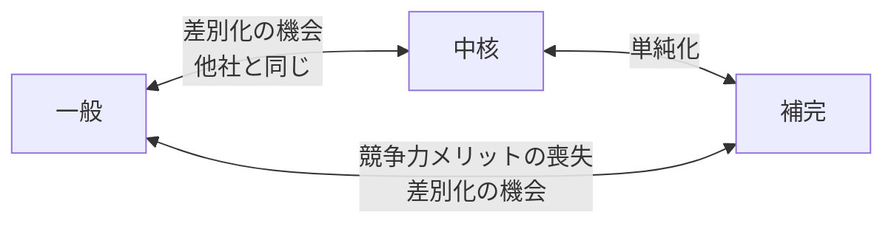
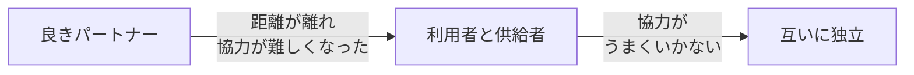

# 設計を進化させる（事業活動・組織・業務知識・システム成長への対応）

## 概要（第11章）

よい設計も変化を扱えなければ危険になる。この章では、ソフトウェア設計で考慮すべき四つの変化のベクトルを検討する。

1. **事業活動の変化** — 業務領域のカテゴリーが変わる
2. **設計の基本方針の再検討** — カテゴリー変化が連係方法・実装方法に影響する
3. **組織の変更** — チーム間の協力関係が連係方法に影響する
4. **業務知識** — 業務知識の増減がモデルと境界に影響する
5. **システムの成長** — 成長が複雑さを増大させる

> 人生において唯一不変なことは変化である。— ヘラクレイトス

---

## 事業活動の変化（11.1）

業務領域のカテゴリー（中核・一般・補完）は固定されていない。企業の成長や外部環境によって変化する。



### 六つの変化パターン（図11-1）

**中核→一般（11.1.1）**
- 原因: 競合他社が同等のサービス/機能を市場に提供するようになった
- 例: BuyIT社の配送ルート最適化アルゴリズム → DeliveryIT社が同等サービスをSaaSとして提供開始

**一般→中核（11.1.2）**
- 原因: 外部パッケージに独自の競争優位を持ち込める機会を発見した
- 例: BuyIT社の在庫管理（パッケージ使用）→ 需要予測に競争優位性を見出し自社開発へ
- 教科書的例: AmazonのIT基盤 → AWS（新たな収益源に発展）

**補完→一般（11.1.3）**
- 原因: オープンソース・パッケージが自社開発以上の機能を提供するようになった
- 例: BuyIT社の契約管理システム → OCR・全文検索付きオープンソースが登場して乗り換え

**補完→中核（11.1.4）**
- 原因: 補完的な業務ロジックの最適化でコスト削減や新収益が生まれた
- 兆候: **補完的な業務領域の業務ロジックが複雑になってきた**
  - 定義上、補完の業務ロジックは単純（CRUD・ETL）
  - 時間がたっても複雑になり、かつ収益が増えているなら中核化の兆候
  - 理由なく複雑になるなら不必要な複雑さ

**中核→補完（11.1.5）**
- 原因: その業務領域の複雑さに適切な理由がなくなった（収益への貢献がなくなった）
- 対応: 他の業務領域を支援する必要最小限のロジックだけ残し、収益を生まない複雑さを取り除く

**一般→補完（11.1.6）**
- 原因: 汎用サービスの仕様に合わせるための連係コストが、メリットを上回るようになった
- 例: オープンソース契約管理の汎用仕様への適合コストが高い → 自社開発（補完）に戻す

---

## 設計の基本方針を再検討する（11.2）

業務領域のカテゴリーが変わると、区切られた文脈の**連係方法**・**開発戦略**に影響する。

### 連係方法の再検討

| 変化パターン | 連係方法の変化 |
|---|---|
| 補完→中核 | 互いに独立→利用者と供給者（モデル変換装置・共用サービスで内部モデルを守る） |
| 中核→補完 | 利用者と供給者→互いに独立（機能の重複を放置可能に） |
| 一般→中核 | 協力関係を強化する必要あり |

### 開発戦略の再検討

| カテゴリー | 開発戦略 |
|---|---|
| **中核** | 社内で業務エキスパートと緊密に協力して開発（外部委託不可） |
| **補完** | 外部委託可能・新人育成機会として活用できる |

---

## 業務ロジックの実装方法を見直す（11.3）

**見直し時の判断基準**: 既存の設計では目の前の事業ニーズにうまく対応できなくなった時。変更がやっかいで危険になってきた時。

> 実装方法の変更を恐れてはいけない。事業がどのように発展するかは誰も予測できない。状況に応じた適切な設計をして、必要になった時に設計を進化させるようにすべき。

### トランザクションスクリプト→アクティブレコードへ（11.3.1）

**タイミング**: トランザクションスクリプトで扱うデータが込み入ってきた時。

**手順**:
1. データ構造が込み入った部分を見つける
2. その部分のデータ操作をアクティブレコードオブジェクトにカプセル化する
3. DBを直接操作するかわりに、アクティブレコードを使ってモデルと構造を抽象化する

### アクティブレコード→ドメインモデルへ（11.3.2）

**タイミング**: データの不整合やロジックの重複が増えてきた時。

**手順**:
1. **値オブジェクトを見つける** — 不変（イミュータブル）なオブジェクトとして表現できそうなデータ構造を特定し、関連する業務ロジックを値オブジェクトのメソッドとして記述する
2. **setterをprivateに変更する** — コンパイルエラーの箇所が状態を変更している外部コンポーネント（リファクタリング対象）
3. **状態変更ロジックをオブジェクト内部に移動する**

```csharp
// Before: ARのsetterが公開
public class Player {
    public Guid Id { get; set; }
    public int Points { get; set; }
}

// Step1: setterをprivateに（コンパイルエラーで変更箇所を特定）
public class Player {
    public Guid Id { get; private set; }
    public int Points { get; private set; }
}

// Step2: 状態変更ロジックをオブジェクト内に移動（集約候補）
public class Player {
    public Guid Id { get; private set; }
    public int Points { get; private set; }
    public void ApplyBonus(int percentage) {
        this.Points *= 1 + percentage/100.0;
    }
}
```

4. **集約設計** — 一貫性を保証する最小のトランザクション境界（最小のデータの集まり）を特定。外部の集約はIDで参照のみ。集約ごとにルートとなるオブジェクト（外部に公開するエントリーポイント）を特定し、内部メソッドはprivateにする。

### ドメインモデル→イベント履歴式ドメインモデルへ（11.3.3）

**手順**: 集約のデータを直接変更するかわりに、集約のライフサイクルを表現する一連の業務イベントを特定する。

**難点**: すでに存在している集約の履歴をどうするか。履歴が失われた最新状態だけを表現する集約を、イベント履歴式モデルに転換する方法が必要。

### 過去の状態変化を修復する（11.3.4）

「近似的な」イベント履歴を生成する方法。最新状態から業務ロジックの観点で「こうだったはずだ」という想定シナリオをイベントとして生成する。

```json
// 最新状態（DBレコード）から想定シナリオをイベント化
{"event-type": "新規作成", "lead-id": 12, ...},
{"event-type": "連絡済", "timestamp": "2020-05-27T12:02:12.51Z"},
{"event-type": "注文発行済", ...},
{"event-type": "支払完了", "status": "成約済", ...}
```

**欠点**: 完全な修復はできない（例: 架電回数の記録が失われていて再現できない）。

### 移行イベントとして表現する（11.3.5）

「移行」という事実の発生そのものを最初のイベントとして記録する方法。

```json
{"event-type": "移行", "lead-id": 12, "last-name": "小林", "status": "成約済", ...}
```

**利点**: 過去の記録が失われたことを明示できる。履歴から最新状態を投影する際に移行イベントの存在を意識できる。  
**欠点**: 旧システムの存在がイベント履歴に残り続ける。

---

## 組織の変更（11.4）

組織の変更 → チーム間の意図の伝達・協力関係 → **区切られた文脈の連係方法**に影響。



**11.4.1 良きパートナー→利用者と供給者へ**  
チームが地理的に離れ、意図の伝達がうまくいかなくなった時。従属・モデル変換装置・共用サービスのどれかに変える。

**11.4.2 利用者と供給者→互いに独立へ**  
どうしても協力がうまくいかない時。重複開発が費用対効果的に有利になることもある。

---

## 業務知識（11.5）

> 「価値を生み出すソフトウェア設計には業務知識が不可欠である」— DDDの中核にある信念

**業務の複雑さは最初は見えない**。最初はすべて単純に見えるが、機能を追加するたびに例外的な条件分岐が増え、さまざまなルールや不変条件が見つかる。この新たな洞察で今まで整理してきた秩序が破壊され、モデルを最初から作り直すことになる。

### 業務知識と境界の経験則

**業務知識が少ない段階**: 広い範囲で文脈を区切る（間違えても論理的境界を引き直す方が物理的境界より簡単）  
**業務知識が増えたら**: 広い文脈を小さな文脈やマイクロサービスに分解可能（第14章）

新たな業務知識を習得したら、その知識を使って設計を進化させ、変更に強い設計にする。

**業務知識の劣化への注意**: 時間がたつと文書が更新されなくなり、初期担当者が去り、その場しのぎで機能が追加される。業務知識の劣化を防ぐため、**イベントストーミング**（第12章）が有効。

---

## システムの成長（11.6）

システムの成長はソフトウェアが健全な証。しかし、設計を再検討せずに成長させると大きな泥団子になる。

**対処の基本姿勢**: 成長によって増大する複雑さのうち、「必要のない複雑さ（過去の設計判断に起因するもの）」を特定して取り除く。「本質的な複雑さ（事業活動が持つ本来の複雑さ）」にはDDDの手法で対処する。

### 業務領域の見直し（11.6.1）

事業が成長すると業務領域の境界がほやけてくる。

**経験則**: 強く関係するユースケース、つまり**同じデータ集合を操作するユースケースの集合**に注目して、業務領域の適切な切れ目を見つける。

目指すべきこと: **純度の高い中核の業務領域を抽出**することで、事業戦略上最も重要な領域に開発リソースを投入できる。

### 区切られた文脈の見直し（11.6.2）

開発規模が大きくなると区切られた文脈の焦点がほやけてくる。

**シグナル**: 区切られた文脈どうしでかなりの通信が発生している → モデルが適切でない → 文脈の区切り方を見直す

「何にでも手を出して、どれもちゃんとできていない」モデルを作ってはいけない。特定課題の解決に集中した区切られた文脈を抽出する。

### 集約の見直し（11.6.3）

集約はできるだけ小さく設計する。業務ロジックとして守るべき一貫性とは無関係なデータを集約に追加すると、必要のない複雑さを集約に持ち込む。

**発見の機会**: 業務機能を専用の集約に抽出するリファクタリングによって、元の集約が単純化されるだけでなく、隠れていた別のモデル（新たな区切られた文脈）を発見することは少なくない。

### システム成長への対応指針（11.7 まとめから）

- 業務領域の機能を拡張する必要になったら、業務領域を小さい単位で識別することを検討する
- 「何にでも手を出して、どれもちゃんとできていない」区切られた文脈を作らない
- 集約はできるだけ小さく設計する
- さまざまな境界を常に監視し、必要のない複雑さを取り除く

---

## 判断基準

**Q. 業務領域のカテゴリーが変化したかどうかを検知するには？**

```
「補完から中核への変化の兆候は？」
  YES → 補完業務のロジックが複雑になり、かつ収益が増えている
  NO（ロジックが複雑なだけ）→ 不必要な複雑さを取り除く

「既存の実装方法を見直すタイミングは？」
  → 変更がやっかいで危険になってきた時
  → 同じデータに対してロジックの重複が増えてきた時
  → 新しい機能追加が難しくなってきた時
```

**Q. 実装方法はいつ変えるべきか？**

```
実装方法の移行: 単純 → 複雑（業務ロジックの増大に合わせて）
  トランザクションスクリプト
    → データ構造が込み入ってきた → アクティブレコード
      → 不整合・ロジック重複が増えた → ドメインモデル
        → 監査記録・分析が必要になった → イベント履歴式ドメインモデル
```

---

## アンチパターン

**アンチパターン1: カテゴリーが変わっても設計を変えない**
> 中核→補完への変化で社内開発を続けたり、補完→中核への変化でトランザクションスクリプトを使い続けると、競争力とコスト最適化の機会を失う。

**アンチパターン2: 集約境界の不備をサーガで補う（→ communication.md参照）**

**アンチパターン3: 業務知識が少ない段階で境界を細かく切る**
> 後から修正するコストが高くつく。最初は広い範囲で区切り、業務知識が増えたら分割する。

**アンチパターン4: 成長に合わせた境界の見直しをしない**
> 「何にでも手を出して、どれもちゃんとできていない」区切られた文脈・集約になる。成長のたびに設計判断を再検討する。

---

## 関連概念

- [[subdomain]] — 業務領域のカテゴリー（中核・一般・補完）
- [[bounded-context]] — 区切られた文脈の設計と境界
- [[context-integration]] — カテゴリー変化に伴う連係方法の変更
- [[design-heuristics]] — 業務ロジックの実装方法の選択経験則
- [[event-sourced-domain-model]] — イベント履歴式ドメインモデルへの移行
