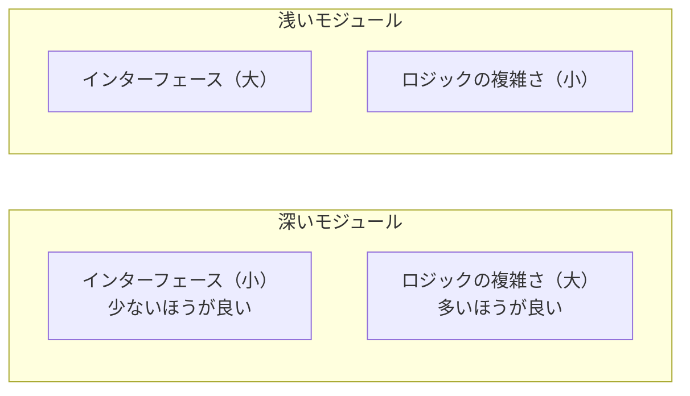
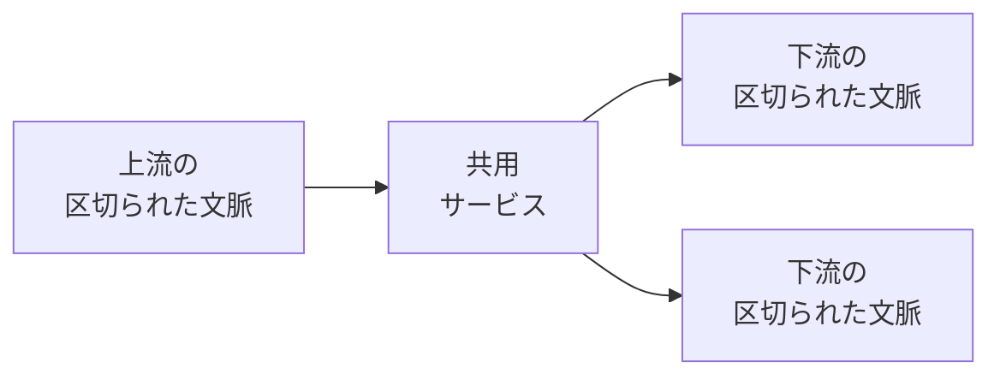
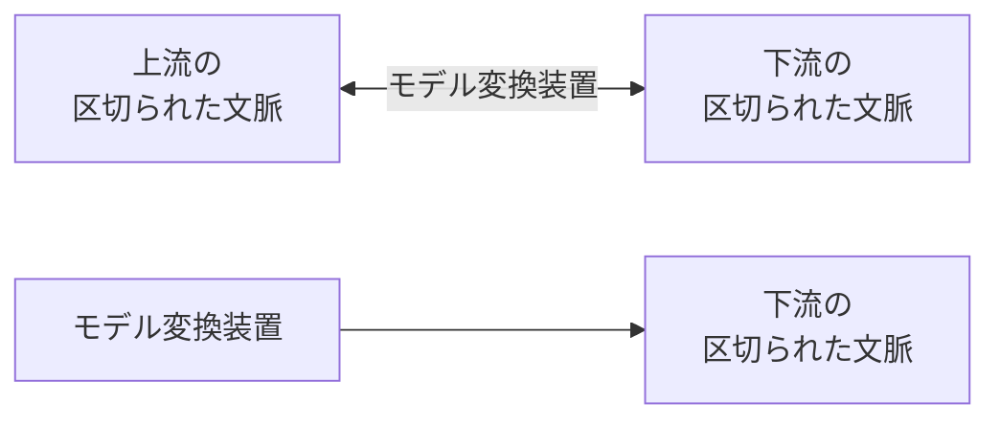

# マイクロサービス

## 概要（第14章）

マイクロサービスは2010年代中頃からソフトウェアエンジニアリング業界を席巻した。迅速な変更・スケーリング・クラウドコンピューティングへの適合を意図した技術方式。しかし多くの企業が手に入れたのは柔軟性ではなく、**分散した大きな泥団子**（分解しようとしたモノリスよりはるかに壊れやすく不恰好で高コストなシステム）だった。

この章では、DDDという設計の方法論と、マイクロサービスという実装の方法論の関係を探る。

---

## サービスとは何か（14.1）

OASIS（コンピュータと通信に関する標準化団体）の定義:
> 「一つ以上の機能にアクセスできる仕組みで、規則として定められたインターフェースを用いて提供されるもの」

サービスの**公開インターフェース**（玄関のドア）が他のシステムコンポーネントと通信連係する手段を提供する。適切に表現されたインターフェースは、サービスが実現する機能をわかりやすく説明する。

---

## マイクロサービスとは何か（14.2）

**定義**: きわめて小さな公開インターフェース（きわめて小さな玄関ドア）を持つサービス。

公開インターフェースを小さくすることの利点:
- サービスの機能が明快になる
- 他のコンポーネントとのつながり方が理解しやすくなる
- サービスの変更理由が限定的になり、開発・管理・スケーリングの独立性が高くなる

**マイクロサービスはデータベースをカプセル化して隠蔽する**: データへのアクセス方法を、連係に特化したコンパクトな公開インターフェースに限定する（データベースを外部にさらけ出すと公開インターフェースは巨大化する）。

### 「メソッド単位のサービス」は完璧なマイクロサービスか（14.2.1）

公開インターフェースをたった一つのメソッドに限定することが完璧なマイクロサービスとは言えない。

バックログ管理サービスを「1サービスにつき1メソッド」のルールで分解した場合:
- 各サービスのデータベースはカプセル化される
- しかし他のサービスのデータにアクセスするには公開インターフェースを使う必要が生じる
- サービスどうしで連係・同期するために公開インターフェースが次々と拡張される
- 結果: 分散した大きな泥団子

### システムの複雑さ（14.2.3）

グレンフォード・J・メイヤーズ著「Composite/Structured Design」より:
> 複雑さを考える時、部分部分の局所的な複雑さの最小化よりも、はるかに重要な複雑さがあります。その複雑さとは、全体の複雑さ、つまりプログラム全体やシステム全体の構造です。

**二種類の複雑さ**:

| 複雑さの種別 | 内容 |
|---|---|
| **局所的な複雑さ** | 個々のマイクロサービスの複雑さ。実装に依存する |
| **全体の複雑さ** | 複数のマイクロサービスで構成するシステム全体の複雑さ。サービスどうしの相互作用と依存関係から決まる |

- 全体の複雑さのみを最小化（全機能を一つのモノリシックなサービスに）→ 大きな泥団子（最悪の局所的複雑さ）
- 局所的な複雑さのみを最適化（極限まで分割）→ 分散した大きな泥団子

**目標**: 全体の複雑さと局所的な複雑さの**両方**を最適化すること（全体最適化）。

### マイクロサービスの深さ（14.2.4）

ジョン・オースターハウト著「The Philosophy of Software Design」の「深さ」による評価。

モジュールは**機能**（行うべきこと・公開インターフェース）と**ロジック**（業務機能を実現するための業務ロジック）の二つで定義される。



- **深いモジュール**: 簡潔な公開インターフェースが複雑なロジックをカプセル化する → 効果的
- **浅いモジュール**: 公開インターフェースがカプセル化する複雑さよりかなり小さい → 非効果的

浅いモジュールの極端な例:
```
int AddTwoNumbers(int a, int b)
{
    return a + b;
}
```
このメソッドは複雑さをカプセル化するどころか、システム全体に不必要な複雑さを持ち込む。

### 深いモジュール（14.2.5）

- マイクロサービスは物理的な境界だけを表現するのに対し、深いモジュールは論理的な境界と物理的な境界の両方を表現する
- システム複雑さの観点: 深いモジュールはシステム全体の複雑さを**減少**させる。浅いモジュールは**増加**させる
- 浅いサービスは、マイクロサービスを目指したプロジェクトが失敗する原因

**誤った定義**:
- 「n行以下のコードで記述できるサービス」
- 「修正するよりも書き換えるほうが簡単なサービス」

これらは設計のもっとも重要な側面（システム全体を見渡すこと）を見失わせる。

**粒度と変更コストの関係**（図14-7）: 粒度がU字型の最低点（マイクロサービス）から外れると変更コストが上昇する。大きな泥団子も分散した大きな泥団子も変更コストが高い。

---

## ドメイン駆動設計とマイクロサービスの境界（14.3）

DDDの手法のほとんどはマイクロサービスと同様に境界に関係する:
- **区切られた文脈** → モデルの境界
- **業務領域** → 業務活動の境界を区切る
- **集約と値オブジェクト** → トランザクションの境界を表現

これらの境界のうち、どれがマイクロサービスの設計に役立つかを検討する。

### 区切られた文脈（14.3.1）

マイクロサービスと区切られた文脈は多くの共通点がある。どちらも物理的な境界であり、単一のチームによって所有される。しかし**非対称の関係**:

> **すべてのマイクロサービスは区切られた文脈**。しかし、**すべての区切られた文脈がマイクロサービスとは限らない**。

- 区切られた文脈: それに含まれるモデルの一貫性を守りながら、**もっとも広い**有効なサービスの境界を示す
- マイクロサービス: サービスとして**もっとも小さい**有効な境界を定義する

境界を広く定義すると → 巨大な一枚岩（大きな泥団子の可能性）。マイクロサービスのしきい値を越えて分解すると → 分散した大きな泥団子。設計の合理的な選択肢は**区切られた文脈とマイクロサービスの間**の範囲にある。

### 集約（14.3.2）

集約は有効な境界をもっとも狭い範囲で決定する（区切られた文脈と逆）。集約をそれ以上細かい単位の物理的なサービスや区切られた文脈に分解することは、次善の策にすらならない。

集約をマイクロサービスの単位とする場合に確認すべき視点:
- 対象とする集約は、同じ業務領域内の他の集約とのやりとりがあるか？
- 他の集約と値オブジェクトを共有しているか？
- 集約の業務ロジックの変更が、業務領域の他のコンポーネントにどの程度影響を与えるか？

同じ業務領域の他のオブジェクトとの関係が強いほど、単独のサービスとしては「浅く」なる。多くの場合、このような細かい粒度のサービスはシステム全体の複雑さを増加させる。

### 業務領域（14.3.3）

マイクロサービスを設計する経験則として**もっともバランスがとれているのは、サービスの境界を業務領域に合わせる方法**。

業務領域が自然に深いモジュールとなる理由:
- 事業活動の観点では「何をするか」（どのように実現するかではない）を説明する
- 技術的観点では強い関連性を持った一貫したユースケースの集合（同じモデル・密接なデータ・機能的に強い関係）
- 業務領域に含まれるユースケースどうしの強い関係性が、結果としてモジュールの深さを保証する
- ユースケースの集合を小さな単位に分割すると公開インターフェースが複雑になり、モジュールとしては浅くなる

**業務領域に合わせてマイクロサービスの境界を設計することは、安全な選択肢**。ほとんどのマイクロサービスにとってそれが最適解。

**例外（業務領域以外の境界が適切な場合）**:
- 区切られた文脈の同じ言葉の一貫性を重視して広い範囲を境界とする場合
- 非機能要件を満たすために集約をマイクロサービスの境界とする場合

マイクロサービスの設計判断は、事業の活動内容だけでなく、組織構造・事業戦略・非機能的要件にも依存する。

---

## 公開インターフェースを小さくする（14.4）

DDDの考え方とやり方は、サービスの境界を見つけるだけでなく、深いサービスにすることにも役立つ。

### 共用サービス（14.4.1）



共用サービスはある区切られた文脈のモデルと他のコンポーネントと連係するためのモデルを**分離**する。

**公開された言葉**（published language）を導入することで:
1. 利用する側に影響を与えることなくサービスの実装を改善できる（新たな実装モデルは既存の公開された言葉に変換可能）
2. 公開された言葉は限定されたモデルを外部に公開する（連係の要件に合わせて設計されており、関係のない実装の複雑さをカプセル化して隠蔽）

ロジックの実装は同じでも、公開インターフェース（機能）を小さくすることで、サービスが「深く」なり、効果的なマイクロサービスとなる。

### モデル変換装置（14.4.2）



共用サービスと役割が逆転。他の区切られた文脈と連係する複雑さを軽減する。

- 利用する側の区切られた文脈の局所的な複雑さとシステム全体の複雑さの両方を軽減
- 利用する側の業務の複雑さと変換の複雑さが分離され、変換の複雑さをモデル変換装置のサービスに委譲
- 利用する側は使い勝手のよい連係に特化したモデルを利用できるため、公開インターフェースが簡潔になる
- 独立したサービスとして実装することも可能（第9章で検討したモデル変換装置の発展形）

---

## まとめ（14.5）

| 概念 | 境界の性質 |
|---|---|
| **マイクロサービス** | もっとも小さい有効な境界を定義 |
| **区切られた文脈** | モデルの一貫性を守りながら、もっとも広い有効なサービスの境界を示す |
| **集約** | もっとも狭い境界（マイクロサービスより細かい単位への分解は望ましくない） |
| **業務領域** | 安全な選択肢。深いモジュールを自然に定義する |

- すべてのマイクロサービスは区切られた文脈だが、すべての区切られた文脈がマイクロサービスとは限らない
- DDDの考え方とやり方を使えば、効果的なマイクロサービスの境界を設計できる

---

## 判断基準

**Q. マイクロサービスの境界をどう決めるか？**

```
「まず業務領域に合わせる（安全な選択肢）」

例外的に他の境界を選ぶ場合:
  「同じ言葉の一貫性を広い範囲で保ちたいか？」
    YES → 区切られた文脈の範囲で境界を設定（広め）
  「非機能要件（スケーリング・デプロイの独立性）の要求が強いか？」
    YES → 集約を境界として検討（ただし十分に検討した上で）
```

**Q. 設計が深いサービスかどうかを確認するには？**

```
「公開インターフェースの複雑さ vs. 内部ロジックの複雑さ」
  公開インターフェースが簡潔で内部ロジックが複雑 → 深いサービス（良い）
  公開インターフェースが複雑で内部ロジックが単純 → 浅いサービス（システム全体の複雑さを増加させる）
```

**Q. 集約をマイクロサービスの単位にすべきか？**

```
「対象の集約は同じ業務領域内の他の集約と強く関係しているか？」
  YES → 単独サービスにすると浅くなる。業務領域単位での設計を検討する
  NO（独立性が高い）→ 集約をサービスの単位とすることも検討できる
  （ただし多くの場合、業務領域単位のほうが適切）
```

---

## アンチパターン

**アンチパターン1: 「1サービスにつき1メソッド」**
> 公開インターフェースを極限まで細かくすると、サービスどうしの連係のために公開メソッドが次々と追加され、分散した大きな泥団子になる。

**アンチパターン2: 局所的な複雑さだけを最適化する**
> 個々のサービスを細かくするほど全体の複雑さが増大する。全体の複雑さと局所的な複雑さの両方をバランスよく最適化する必要がある。

**アンチパターン3: マイクロサービスと区切られた文脈を同一視する**
> 両者の関係は非対称。すべてのマイクロサービスは区切られた文脈だが、逆は成り立たない。区切られた文脈は巨大な一枚岩になることもある（特定のケースでは有効な選択）。

**アンチパターン4: 集約を常にマイクロサービスの単位にする**
> 集約はトランザクション境界を表現する最小単位であり、それ以下への分解は望ましくない結果をもたらす。対象領域によって判断が分かれるが、多くの場合は業務領域単位のほうが適切。

---

## 関連概念

- [[bounded-context]] — 区切られた文脈の設計（マイクロサービスと非対称の関係）
- [[subdomain]] — 業務領域（マイクロサービスの境界として安全な選択肢）
- [[domain-model]] — 集約（マイクロサービスの最小境界）
- [[context-integration]] — 共用サービス・モデル変換装置の連係パターン詳細
- [[communication]] — 送信箱・サーガ・プロセスマネージャー（マイクロサービス間連係）
- [[real-world-ddd]] — 既存システムへのDDD導入（ストラングラー方式等）
