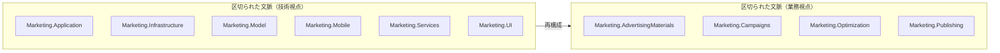
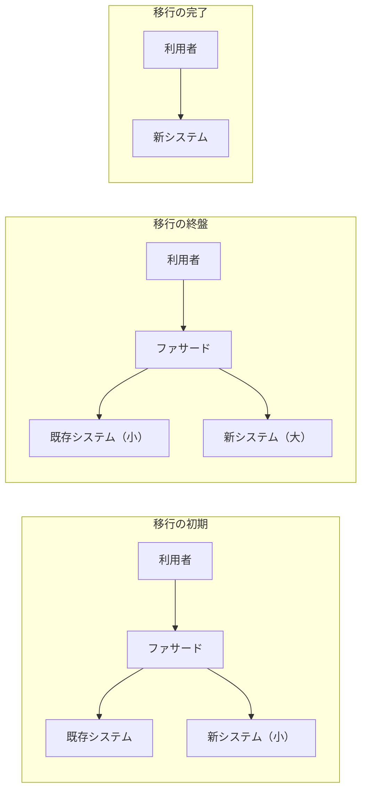

# 現実世界のドメイン駆動設計

## 概要（第13章）

ドメイン駆動設計の適用は「すべてをやる」か「まったくやらない」の二者択一ではない。すべての技法を習得して実践することはおそらく不可能。しかし**すべての技法を取り入れなくても、ドメイン駆動設計は価値を生み出す**。

> DDDが最も効果を発揮するのは、すでに稼働しているソフトウェアに取り組んだ場合。事業への貢献が実証されていて、積み重なった技術的負債と膨れ上がった設計の乱雑さを刷新する必要があるシステムこそ、DDDで取り組む価値がもっとも高い。

> 「ソフトウェアの設計判断を事業活動（ドメイン）で駆動するのがドメイン駆動設計」。集約や値オブジェクトの実装がDDDではない。

---

## 戦略的な分析（13.1）

ドメイン駆動設計を導入する時に最初にやるべきことは次の二つ:

1. 事業活動を理解する
2. システムの構造が現在どうなっているかを理解する

### 事業活動を理解する（13.1.1）

まず自社の事業とは何かを特定する4つの質問:

- 事業活動を展開している領域はどこか？
- 顧客は誰か？
- 顧客に提供しているサービス、あるいは価値は何か？
- 競合している企業や製品は何か？

よい手がかりは**自社の組織図**。自社が存続し発展していくために、それぞれの部門がどのように協力しているかを分析する。

#### 中核の業務領域の特定（13.1.1.1）

競合する他社とどうやって差別化しているかを探すことで明らかになる。

- 競合相手が持っていない独自のノウハウ（自社開発アルゴリズム・特許などの知的財産）があるか？
- 技術とは異なる領域での競争優位性（優秀な人材を採用する能力・独創的なデザインを生み出す能力等）があるか？

**強力な経験則（ありがたくない）**: 大きな泥団子がある箇所。システムでもっとも入り組んだ設計になっている場所は中核の業務領域である可能性が高い。この部分の全面的な書き換えは大きな事業リスク（経営的に選択できない）。パッケージソフトや外部サービスに置き換えることも不可能。

#### 一般的な業務領域の特定（13.1.1.2）

パッケージ製品・外部サービス・オープンソースソフトウェアを探す。競合他社も同じ製品やサービスを利用できる業務領域。他社が同じ製品・サービスを導入しても自社の不利益にならない。

#### 補完的な業務領域の特定（13.1.1.3）

パッケージ製品や外部サービスに置き換えることはできないが、競争優位を直接生み出すことはないソフトウェアコンポーネントを探す。ソースコードが粗削りのままでも大きな問題にならない部分（変更の機会が少なく、技術者が関心を持つことがほとんどない）。

あらゆる補完的な業務領域を洗い出す必要はない。現在取り組んでいるソフトウェアシステムにもっとも関係する業務領域に注目する。

### 既存システムの構造を調べる（13.1.2）

業務領域がわかったら、現在のシステムはどのような解決方法を選択し、どのような設計判断をしてきたかを調査する。

注目すべきは**各サブシステムのライフサイクルの違い**。モノレポや巨大な一枚岩のコードベースでも、他のサブシステムと切り離して修正・拡張・テスト・配置できそうなサブシステムがないか確認する。

#### 業務ロジックの実装方法を確認する（13.1.2.1）

コンポーネントごとに:
- どんな業務領域が含まれているか
- 業務ロジックの実装方法に何を選択しているか
- システム構築の技術方式に何を選択しているか

現在の実装方法は、解決すべき課題の複雑さと合致しているか？ 設計を洗練させるべき場所はないか？ 手を抜いたり既成の製品・サービスを利用したりできそうな業務領域があるか？

#### 設計の基本方針を評価する（13.1.2.2）

システム全体の構造を俯瞰して得た知識を使い、既存システムのコンポーネントを区切られた文脈のように扱って、現在の構造を**文脈の地図**として可視化する。第4章の連係方法の分類を使って、コンポーネントどうしのつながり方を特定し追跡する。

ドメイン駆動設計の観点からこの文脈の地図を分析し、以下の不適切な関係がないか確認する:

- 同じコンポーネントに複数のチームが関わっている
- 中核の業務領域の実装が重複している
- 中核の業務領域の開発を外部に依存している
- 統合が失敗しがちで摩擦が発生している
- 外部サービスや既存システムに影響された、ぎこちないモデルになっている

---

## 設計改善の基本方針（13.2）

「システム全体を一から書き直し、すべての設計とコードをきれいにしよう」という試みが成功することはほとんどない。経営陣がそのような技術視点のシステム再構築を支持することはまずありえない。

**安全なやり方**: 「大きな絵」を描き、「小さく始める」こと。どこを重点的に改善するかを戦略的に判断する。

まずは**論理的な境界（名前空間・モジュール・パッケージなど）と業務領域の境界を対応させるところから始める**（図13-1）。本格的な区切られた文脈（物理的な境界）である必要はない。



モジュール構成の変更は**比較的安全なリファクタリング**（業務ロジックの変更ではない）。ただし、DLLやリフレクション、完全修飾された型名への参照を壊さないように注意する。

### 基本方針の改善（13.2.1）

論理的な境界を物理的な境界（区切られた文脈）に変換して大きな価値を生み出す場所を探す際の判断基準:

- **一つのコードベースを複数のチームが変更している** → チームごとに区切られた文脈を定義し、それぞれのチームの開発ライフサイクルを切り離す
- **競合するモデルが異なるコンポーネントによって使われている** → 競合しているモデルをそれぞれ別の区切られた文脈に移動する

最低限必要な区切られた文脈の境界が定まったら、文脈どうしの関係と連係方法を調べる。

**連係方法の見直し指針**:

| 問題 | 連係方法の変更先 |
|---|---|
| 良きパートナーの関係を想定して設計されたコンポーネントで協力関係が維持できていない | 利用者と供給者の関係（従属・モデル変換装置・共用サービス）に変更 |
| 既存システムのモデルが下流のコンポーネントに悪い影響を及ぼしている | モデル変換装置を追加して区切られた文脈を保護 |
| コンポーネントの実装変更が多くの利用者に影響する | 共用サービスを作成（外部公開APIと内部モデルを分離） |
| 複数チームで共通機能の開発・修正に取り組み摩擦が生じている（中核領域でない場合） | 互いに独立して開発 |

### 実装方法の改善（13.2.2）

実装レベルで最も重要なのは**事業価値と実装方法の不一致がひどい箇所を見つけること**。

最も問題のパターン: 中核の業務領域の複雑な業務ロジックの実装に、トランザクションスクリプトやアクティブレコードを使っている場合。中核の業務領域は変化し続け、設計がまずければ変更がきわめてやっかいで危険になる。

### 同じ言葉を育てる（13.2.3）

既存システムの設計改善を成功させるための必要条件: **業務知識と適切なドメインモデル**。

業務知識を得る近道: **イベントストーミング**（失われた業務知識を取り戻す最良の道具）。

業務知識とモデルが手に入ったら、改善の基本方針を選択する:
- **ストラングラー方式**: システムの構成要素を段階的に置き換えていく
- **リファクタリング**: 既存の実装を段階的にリファクタリングしていく

#### ストラングラー方式（13.2.3.1）

「ストラングラーフィグ」（絞め殺しの木）の生育のしかたを参考にした移行方法。



**手順**:
1. 新たな要求を実装するための区切られた文脈をストラングラーとして追加
2. 既存システム側は緊急度が高い修正を除き、機能の修正と拡張を停止
3. 最終的に既存システムのすべての機能を新システムに移行
4. 宿主（既存システム）のコードベースは死を迎える

**ファサード**: 外部への公開インターフェースとして機能する薄い抽象レイヤー。外部からのリクエストを既存システムか新システムかに振り分ける。移行完了後はファサードを取り除く。

**データベース共有**: ストラングラー方式では「一つの区切られた文脈に一つのデータベース」の原則を一時的に曲げてもよい。新システムと既存システムとの連係を複雑にしないために、データベースを共有する。移行完了後は新システムが専有する。

#### 業務ロジックの実装方法のリファクタリング（13.2.3.2）

全面的な書き換えより**小さな変更の積み重ね**が安全。

**推奨移行順序**（安全な段階的アプローチ）:

```
トランザクションスクリプト
  → アクティブレコード
  → いったん状態ありの集約（→ 効果的な集約境界を見つけることに時間を使う）
  → イベント履歴式の集約

※ TS/ARから直接イベント履歴式へは危険（間違ったトランザクション境界を持ち込むリスク）
```

**リファクタリングの開始点**:
- 値オブジェクトの候補を見つけるところから始める（状態が変化しないオブジェクトを導入するだけでプログラムの複雑さがかなり小さくなる）
- 対象となる業務ロジックを集める
- トランザクション処理の境界を詳しく調べる（**技術的な視点ではなく業務の視点で**）
- トランザクションの必要性を業務視点で徹底的に分析して初めて集約の境界を設計できる

**保護のための仕組み**: 既存システムをリファクタリングする場合、モデル変換装置を使って新しいコードベースを古いモデルから保護し、共用サービスを作って公開された言葉を提供することで、上流の変更が下流に影響しないようにする。

---

## 実践的なドメイン駆動設計（13.3）

- DDDはすべての道具を使う必要はない。何らかの理由で実装レベルの設計のやり方が個別の状況には役に立たないかもしれない。それでよい
- **もっともたいせつなことは事業活動の要求にもとづいた設計判断**
- 対象としている業務領域と事業方針を詳しく調べ、課題の解決に役立つモデルを探す

---

## ドメイン駆動設計を売り込む（13.4）

「売り込む」という考え方より、**技術者が使う道具の一つとして位置づける**。組織戦略として取り入れる必要はない。

### 非公式に取り入れる（13.4.1）

#### 同じ言葉（13.4.1.1）

- 事業活動について関係者が口にする言葉をしっかり聞き取る
- 技術者だけに通じる特殊な言い回しを避け、業務的に意味が通じる言葉を使う
- 使い方が一貫しない用語を見つけたら質問して理由を探す（複数モデルが混在のサイン）
- **業務エキスパートとできるだけたくさん会話する**（正式な会議でなく、ウォーターサーバー前やコーヒーブレークの時間も機会）
- **ソースコードを同じ言葉で記述する** — これが最も重要

#### 区切られた文脈（13.4.1.2）

区切られた文脈の背景にある原則にこだわる:

- あらゆるユースケースを一つのモデルで表現するより課題ごとに複数のモデルを作るとよいのはなぜか？ → 「何でもできる」は実際には何の役にも立たないから
- 一つの区切られた文脈の中に複数のモデルを作らないのはなぜか？ → 異なるモデルが混在すると認知の負荷が大きくなり、ソフトウェアが不必要に複雑になるから
- 同じコードベースを複数のチームで開発するのがよくないのはなぜか？ → チーム間の関係がぎくしゃくし、仕事がうまく進められないから

#### 業務ロジックの実装方法（13.4.1.3）

権威に訴えず**論理で説得**する（「ドメイン駆動設計の本にそう書いてあるから」ではいけない）。

論理的な説明の例:
- トランザクション境界を明確にすることが重要なのはなぜか？ → データの一貫性を維持するため
- 一つ以上の集約インスタンスを同時に変更してはいけないのはなぜか？ → データの一貫性を維持する境界を正しく定義することを保証するため
- 集約内部の状態を外部から直接変更してはいけないのはなぜか？ → 関連する業務ロジックを1箇所に集め、重複させないため
- 集約の機能の一部をストアードプロシージャに移動してはいけないのはなぜか？ → ロジックの記述を重複させないため（物理的にも論理的にも離れたコンポーネントに重複したロジックがあると実装に差異が生まれやすく、データ不整合の原因になりがち）
- 集約をできるだけ小さく保つべき理由は何か？ → トランザクション単位を大きくすると集約が不必要に複雑になり、処理性能も悪化するから
- イベントソーシングのかわりにログファイルを利用してはいけないのはなぜか？ → 長期的に見た時に、ログファイルではデータの一貫性を保証できないから

#### イベント履歴式ドメインモデル（13.4.1.4）

業務エキスパートとの会話で、状態更新式とイベント履歴式の2種類のモデルがあることを伝え、それぞれの利点を説明する。

特に時間軸にそったモデルの利点を説明する。たいていの場合、業務エキスパートはイベントソーシングから得られる洞察の深さをとても気に入り、イベントソーシングを同僚に積極的に売り込んでくれるようになる。

**重要**: 業務エキスパートと話す時は、**同じ言葉を使うことを絶対に忘れない**。

---

## 判断基準

**Q. 既存システムにDDDを取り入れる時、最初にやるべきことは何か？**

```
1. 自社の事業活動と事業方針を詳しく調べる（業務領域カテゴリーを特定）
2. 既存システムの構造を調べ、文脈の地図として可視化する
3. 不適切な関係（実装の重複・設計の不一致）を特定する
4. 重点的に解決すべき課題を特定する
5. ストラングラー方式またはリファクタリングで少しずつ段階的に進める
```

**Q. ストラングラー方式かリファクタリングか？**

```
「既存システムのコードベース全体が問題で段階的な置き換えが必要か？」
  YES → ストラングラー方式（新システムを並行して育てていく）
  NO（特定のモジュール・実装方法の改善） → リファクタリング（段階的に小さく変更）
```

**Q. 中核の業務領域でアクティブレコードを使っているが、どう移行するか？**

```
「一気にイベント履歴式に書き換えようとしているか？」
  YES → やめる（間違ったトランザクション境界を持ち込む危険）
  NO → 以下の順で段階的に:
    1. いったん状態ありの集約を設計する
    2. 効果的な集約の境界を見つけることに時間を使う
    3. 関係する業務ロジックを確実に集約の境界の内側に配置する
    4. そこからイベント履歴式の集約に移行する
```

---

## アンチパターン

**アンチパターン1: 「すべてかゼロか」の二極化思考**
> DDDのすべての技法を使うことがDDDであり、一部の技法だけを使うのはDDDではない、というとらえ方は間違い。適切な道具を選んで使う。

**アンチパターン2: 全面的な書き換え**
> 「システム全体を一から書き直す」という試みが成功することはほとんどない。経営陣の支持も得られない。期待できる事業価値よりも失敗のリスクが上回る。

**アンチパターン3: アクティブレコードからイベント履歴式に直接移行する**
> 間違ったトランザクション境界を持ち込む危険がある。いったん状態ありの集約に移行し、集約境界を確立してからイベント履歴式に移行する。

**アンチパターン4: 権威への訴えでDDDを導入しようとする**
> 「DDDの本にそう書いてあるから」という説得のしかたは機能しない。それぞれの設計判断の論理的な理由を説明する。

---

## 関連概念

- [[subdomain]] — 業務領域カテゴリーの特定（中核・一般・補完）
- [[bounded-context]] — 区切られた文脈の設計と物理的境界への変換
- [[context-integration]] — 連係方法の見直し（利用者と供給者・モデル変換装置・共用サービス）
- [[event-storming]] — 失われた業務知識を取り戻す手段
- [[evolving-design]] — 実装方法の移行手順（第11章の詳細）
- [[design-heuristics]] — 実装方法と技術方式の選択経験則（第10章）
