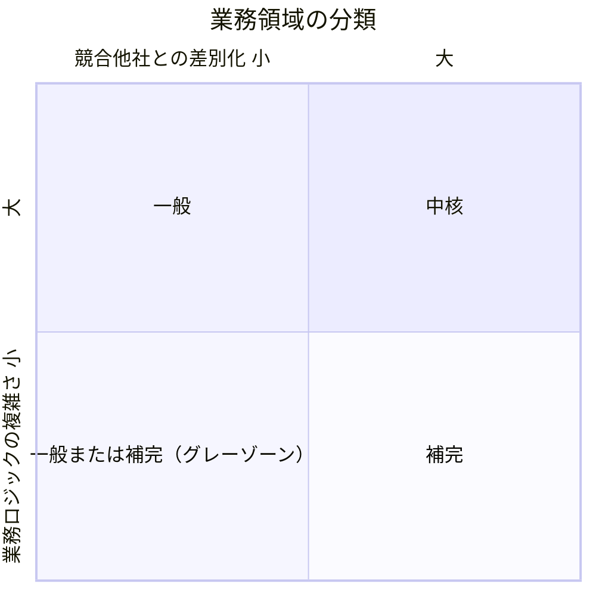
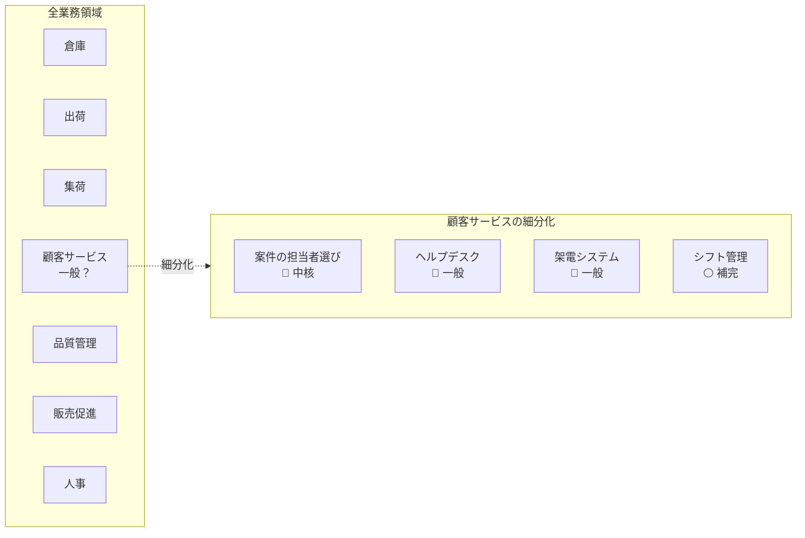
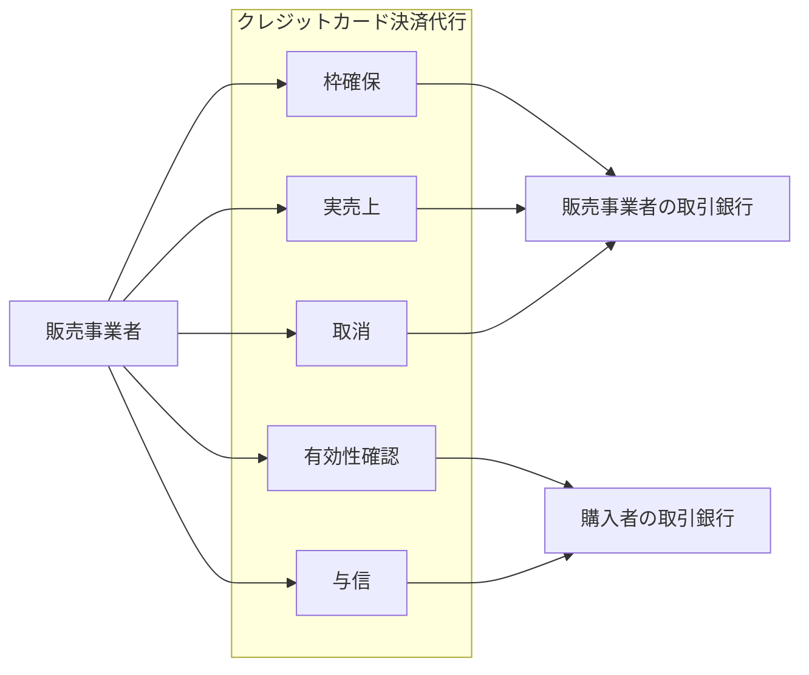
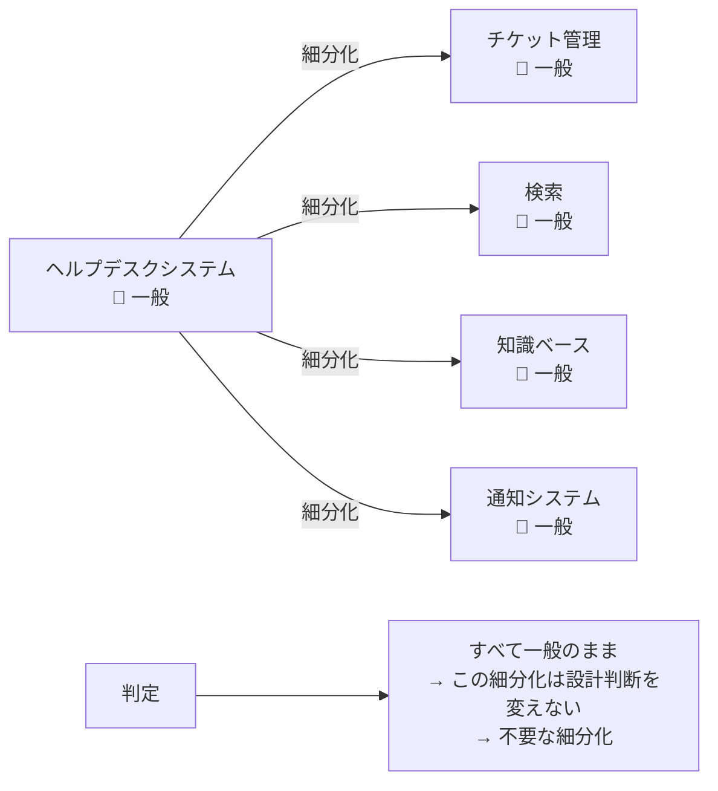

# 業務領域（サブドメイン）

## 定義

業務領域（サブドメイン）とは、企業の事業活動全体を細分化した個々の業務活動の単位。すべての業務領域が連動することで顧客へのサービス提供活動が成り立つ。

---

## 3つの分類

### 中核の業務領域（Core Subdomain）

競合他社との差別化を生み出す業務活動。

- 他社がまねできない独自製品・サービス・業務プロセスの最適化が対象
- 必然的に複雑になる（単純なら競合がすぐ追いつける）
- 継続的な革新・進化が必要で「完了」がない
- 社内開発必須。外部委託・パッケージ利用は戦略的リスク

### 一般的な業務領域（Generic Subdomain）

どの企業も同じやり方で解決する業務活動。

- 競争優位を生まないが、事業運営に不可欠
- 業務知識の観点では「わからないことがわかっている」領域
- 実績あるパッケージ製品・クラウドサービスで賄える
- 自社開発より既製品の活用が費用対効果で優れる

### 補完的な業務領域（Supporting Subdomain）

事業活動を支えるが、競争優位を生まない業務活動。

- 業務ロジックが単純（基本的にCRUD・ETL操作）
- 他社も同じことを簡単にできる
- 社内開発でもよいが、外部委託も有力な選択肢
- 成長途上の若手技術者の育成の場として活用できる

---

## 判断基準

**ステップ1: その業務領域は競争優位を生むか？**

```
「誰かがお金を払ってくれる業務か？」
  YES → 中核候補 → ステップ2へ
  NO  → 補完または一般 → ステップ3へ
```

**ステップ2: 中核か確認する**

```
「外部サービスを導入するより自分たちで作った方が
  簡単で費用も少なくできるか？」
  YES → 補完の業務領域
  NO  → 中核の業務領域
```

**ステップ3: 一般か補完か判断する**

```
「実績あるパッケージ製品・クラウドサービスが存在するか？」
  YES → 一般的な業務領域（既製品を使う）
  NO  → 補完的な業務領域（自社開発するが手を抜いてよい）
```

**補足：ソースコードで判断する場合**

```
「そのプログラムはデータ入力のCRUD画面の集まりか？」
  YES → おそらく補完的な業務領域
  NO（複雑なアルゴリズム・業務ルール・制約条件がある）
     → 典型的な中核の業務領域
```

---

## 分類マトリクス（図1-1）

2軸で業務領域のカテゴリーが決まる。左下のグレーゾーンはパッケージ製品の有無で一般か補完かが決まる。



---

## 比較表

| 観点 | 中核 | 一般 | 補完 |
|---|---|---|---|
| 競争優位 | ○ 生む | × 生まない | × 生まない |
| 複雑さ | 複雑 | 複雑 | 単純 |
| 変化の頻度 | 多い | 少ない | 少ない |
| 実装方針 | 社内開発必須 | 製品購入・外部サービス利用 | 社内または外部委託 |
| 課題の特徴 | 複雑で興味深い | 既存の解決策がある | 明確 |

---

## 具体例

### ライブチケット社（チケット販売・流通）

- **中核:** 推薦エンジン、データの匿名化、モバイルアプリ
- **一般:** 暗号化、会計、決済、認証と認可
- **補完:** 音楽ストリーミングサービスとのデータ連係、ライブへの参加記録

### バス・オンデマンド社（公共交通）

- **中核:** 経路選択アルゴリズム（巡回セールスマン問題）、利用者の行動分析、モバイルアプリ、車両管理
- **一般:** 交通状況、会計、請求、認可
- **補完:** 割引・販売促進サービス

### 顧客サービス部門の細分化（図1-2: 注意が必要な例）

「顧客サービス」をひとまとまりで判断するのは粗い。細分化して初めてカテゴリーが見える。



### 業務領域の境界 = 強く関連するユースケースの集まり（図1-3）

業務領域はユースケースの集まりとして定義できる。同じアクター・同じ外部システムとつながり、密接に関係するデータを操作するユースケース群がひとつの業務領域を形成する。



### 細分化しすぎの例（図1-4）

分割後のカテゴリーがすべて分割前と同じなら、その細分化は不要。



---

## 細分化の焦点

業務領域を探す時は**ソフトウェアが関係しない業務機能を特定して除外する**ことが役に立つ。ソフトウェアが関係しない業務を識別できれば、取り組んでいるソフトウェアシステムが対象とする業務領域に集中できる（1.2.3.3）。

---

## 用語補足

**コアサブドメイン（Core Subdomain）= コアドメイン（Core Domain）**

Eric Evansの「ドメイン駆動設計」（ブルーブック）では「コアドメイン」という用語を使っている。本書は「コアサブドメイン」を使う。理由は以下のとおり。

1. ここで議論しているのはサブドメインであり、ドメイン全体との混乱を避けたい
2. サブドメインのカテゴリーは変化する（例: コアサブドメインが一般サブドメインに変わることがある）。「コアサブドメインが一般サブドメインに変わった」という表現の方が、「コアドメインが一般サブドメインに変わった」より意味が明確

---

## アンチパターン

**アンチパターン1: 中核をパッケージに外注する**
> 中核の業務領域のソフトウェア開発を外部委託すると、短期的には安く見えるが長期的には会社の存続に関わる問題を引き起こす。変更がやりにくく危険なコードベースになり、事業目標の達成を技術面で支援できなくなる。

**アンチパターン2: 組織図でサブドメインを決める**
> 部門名（「顧客サービス部」など）でサブドメインを決めると粗すぎる判断になる。業務の細部に重要な情報が隠れており、細分化してはじめて中核・補完・一般が見えてくる。

**アンチパターン3: 細分化をやりすぎる**
> 分割しても設計判断が変わらないなら、その分割は必要ない。「分割した後のカテゴリーがすべて分割前と同じ」なら意味がない細分化。

---

## 関連概念

- [[business-domain]] — サブドメインを含む事業全体の領域
- [[bounded-context]] — サブドメインをソフトウェアとして実装する境界
- [[subdomain-evolution]] — サブドメインのカテゴリーは変化する（中核→一般など）
