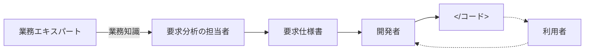
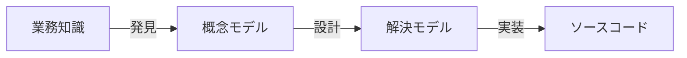

# 同じ言葉（ユビキタス言語 / Ubiquitous Language）

## 定義

同じ言葉とは、プロジェクトのすべての関係者（業務エキスパート・ソフトウェア技術者・プロダクト責任者・UIデザイナー等）が共通して使う、事業活動を表現するための単一の言語。ドメイン駆動設計の土台となる手法。

---

## なぜ必要か

### 図2-1: 典型的な知識の共有（伝統的なやり方の問題）

業務知識は関係者を通じて「翻訳」されながら開発者に届く。翻訳のたびに意図が変質する。



### 図2-2: モデルの変換（変換のたびに情報が欠落する）

業務知識がコードになるまでに複数のモデル変換が発生する。



**変換のたびに情報が欠落し、最終的に業務課題を解決できないソフトウェアが生まれる。**

同じ言葉は変換をなくし、業務エキスパートの考え方をそのままコードに反映させる。

---

## 同じ言葉の3つのルール

### 1. 業務用語のみで構成する

技術用語（シングルトン、ファクトリーパターン等）を含めてはいけない。業務エキスパートがわからない言葉は同じ言葉ではない。

### 2. 一貫性（一語一義）

一つの用語に意味は一つ。あいまいな用語は分解する。

**悪い例：** `Policy`（ポリシー）→「統制ルール」と「保険契約」の2つの意味を持つ
**良い例：** `RegulatingRule`（統制ルール）と `InsuranceContract`（保険契約）に分離

### 3. 同義語を使わない

同じ意味を表す言葉は一つに統一する。ただし、意図が異なるなら**あえて別の用語を使う**。

**例：** 「利用者」「サイト訪問者」「管理者」「会員」
→ 技術的には同じシステムユーザーでも、**行動・データ・機能が異なるなら別の用語として扱う**

---

## 判断基準

**Q. この用語は同じ言葉として適切か？**

```
「業務エキスパートがこの用語を使って業務を説明するか？」
  NO → 同じ言葉ではない。業務用語に置き換える

「この用語は文脈によって意味が変わるか？」
  YES → あいまいな用語。意味ごとに別の用語に分解する

「同じ意味を表す別の用語が存在するか？」
  YES → 意図の違いを確認。違いがないなら一方に統一。
        違いがあるなら、それぞれを正式な用語として定義する
```

---

## 具体例

**広告キャンペーン管理システムの場合：**

- 業務エキスパートの表現（同じ言葉）:
  - 「広告キャンペーンはいろいろな広告素材を使って表示できる」
  - 「キャンペーンの配信には少なくとも一つのアクティブな配信先が必要」
  - 「販売報奨金はコンバージョンが承認された後で発生する」

- 技術者の表現（同じ言葉ではない）:
  - 「HTML形式のiframeを使って広告を表示する」
  - 「配信先テーブルに少なくとも一つの有効なレコードがある時のみ配信できる」

→ 技術的な説明は業務エキスパートには伝わらず、業務ロジックの正しい理解が阻まれる。

---

## 継続的に取り組む

同じ言葉は**一度作ったら終わりではなく、継続的に育てるもの**。

- 業務エキスパートとの会話を通じて不正確な表現・誤解・誤認を検出し、修正し続ける
- プロジェクトのすべての関係者が**いつでもどこでも**同じ言葉を使う: 会話・要件定義・テスト・ドキュメント・ソースコード
- 事業理解のブレークスルーが起きたら、新たな業務知識を同じ言葉に取り込んで進化させる

---

## 道具の利用

### wiki（用語集）

- 同じ言葉の発見と文書化の「用語集」として使える
- **全員が更新できる**ことが重要（チームリーダーやアーキテクトだけが管理する中央集権的なやり方とは逆）
- 新メンバーが事業活動を学ぶ時の最初の参照先になる

**用語集の限界:** 名詞（モノ・プロセス・役割の名前）の整理には役立つが、**振る舞い（業務ロジック・業務ルール・制約）は表現できない**。ユースケースやGherkin記法と組み合わせて使う。

### Gherkin記法（BDD）

BDD（振る舞い駆動開発）で使われるテスト記法。業務エキスパートが**読める形**でテストシナリオを記述でき、同じ言葉の文書化と検証を兼ねる。

```
Senerio: 新規案件をサポート担当者に通知する
  Given 山田太郎さんが以下の新規案件を追加する
  When  案件チケットを吉田さんに割り当てる
  Then  吉田さんにチケット割り当て通知が届く
```

**注意:** 業務エキスパートがGherkinでテストを「書ける」という幻想は捨てること。**読める**だけ。

### NDepend

C#で書かれたソースコードを解析し、記述の一貫性の問題や依存関係の複雑さを視覚的にレポートするツール。同じ言葉の用語がソースコードに適切に使われているかを検査できる。

---

## 困難に立ち向かう

### 暗黙知へのアクセス

重要な業務知識の多くは**言語化されていない**（業務エキスパートの頭の中だけに存在する）。言語化されていない知識にたどりつく唯一の方法は**質問すること**。

質問することで、業務エキスパート自身が気づいていなかった曖昧さ・見落とし・未定義の概念が明らかになる。これは**相互作用**であり、技術者の質問が業務エキスパートの領域理解を深める助けになる（特に中核の業務領域で起きやすい）。

### 既存システムへの取り込み

DDDを既存システムに取り入れようとすると、すでに何らかの言語が存在することに気づく。しかしその言語は業務知識を適切に表現できていない可能性がある（例: 技術的な視点で命名されたDBテーブル名）。

関係者の間で言葉の使い方を変えることは簡単ではない。**基本手段は忍耐**。自分たちがコントロールしやすい場所（技術文書・ソースコード）から手をつける。

### 言語の選択

同じ言葉の用語には**英語の名詞**を使うことを推奨（ソースコードで使いやすいため）。

業務エキスパートが「顧客」「商品」「注文」など日本語を使っている場合の次善策: **クラス名は英語単語、ドキュメントコメントで日本語名を併記して対応づける**。

---

## アンチパターン

**アンチパターン1: 翻訳を挟む**
> 業務エキスパートとソフトウェア技術者の間に「翻訳者」（要件定義担当者・プロダクト責任者）を置き、直接対話しない。変換のたびに意図が変質し、伝言ゲームになる。

**アンチパターン2: コードだけに同じ言葉を適用する**
> 会話では別々の用語を使い、コードだけ業務用語にする。会話とコードで言葉がずれると、議論とコードを照合できなくなる。

**アンチパターン3: あいまいな用語をそのままモデル化する**
> 「Policy」クラスを作り、統制ルールと保険契約を同じクラスで扱う。意味の衝突がバグや設計の混乱を生む。

---

## 関連概念

- [[domain-expert]] — 同じ言葉の源泉。業務エキスパートの用語と考え方がベース
- [[bounded-context]] — 同じ言葉が有効な範囲を定義する境界
- [[business-domain]] — 同じ言葉が対象とする事業活動の全体像
