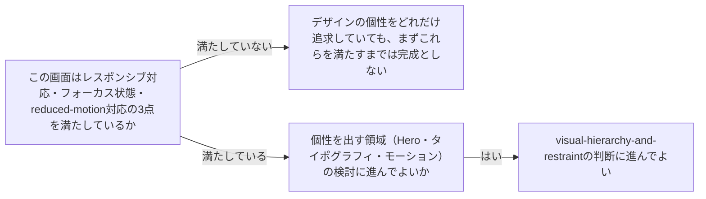

# accessibility-baseline

---

## 概要

### この概念が答える判断

- どんな画面でも最低限守るべき品質基準は何か？
- キーボードだけで操作する利用者への配慮は必要か？
- アニメーションを減らしたい利用者にはどう対応すべきか？

画面設計にはどれだけ独自性を追求しても省略してはならない最低限の品質基準（品質下限）がある。これはデザインの個性とは別の、常に満たすべき土台である。

---

## 原則

- 品質下限は3点から成る。
- (1)レスポンシブ対応——画面幅が変わっても情報が読み取れ操作できる状態を保つ。
- (2)フォーカス状態——キーボードだけで操作する利用者のために、今どの要素が選択されているかを視覚的に示す。
- マウス操作を前提にフォーカス表示を消してしまうと、キーボード利用者が操作不能になる。
- (3)reduced-motion対応——利用者のOS設定で「動きを減らす」が指定されている場合、大きなアニメーション・自動再生を抑える。
- これらはデザインの個性を出す領域（Hero・タイポグラフィ・モーションの演出等）とは別次元の話であり、独自性を追求する自由度とは無関係に常に満たす。

---

## 分類

| 分類 | 特徴 |
|---|---|
| レスポンシブ対応 | 画面幅が変わっても情報の読み取り・操作を保つ |
| フォーカス状態 | キーボード操作時に、今どの要素が選択されているかを可視化する |
| reduced-motion対応 | 利用者の「動きを減らす」設定時に、大きなアニメーション・自動再生を抑える |

---

## 判断基準

---

## 実例

架空のSaaS「TaskFlow」のダッシュボードで、凝ったホバーアニメーションを多用したデザイン案が上がった。実装前にreduced-motion設定時の代替表示（アニメーション無しでも情報が伝わるか）を確認し、キーボードのTabキーで操作した際に選択中のボタンが分かるようフォーカスリングを明示的に残した。狭い画面幅でもグラフの詳細パネルが読める（別タブ・折りたたみに変わる）ことも確認してからリリースした。

---

## アンチパターン

| アンチパターン | 問題点 |
|---|---|
| フォーカス状態を見た目のためだけに消す（outline: none等） | マウス利用者には見えなくなるだけだが、キーボード利用者は今どこを操作しているか分からなくなり、実質的に操作不能になる |
| reduced-motion設定を無視して大きなアニメーションを常時再生する | 動きに敏感な利用者（前庭障害等）に不快感・体調不良を引き起こす可能性がある |
| デザインの個性を優先し品質下限を後回しにする | 独自性のあるHero・モーションを作り込む前にこれらの基準を満たしていることを確認しないと、後から手戻りが大きくなる |

---

## 出典・根拠の透明性

Anthropic公式`/frontend-design`skillのRestraint & Self-Critiqueセクション（レスポンシブ・フォーカス状態・reduced-motion対応という品質下限）を要約・再構成したものであり、本文の直接引用ではない。

---

## 関連概念

| 関連概念 | 関係 |
|---|---|
| visual-hierarchy-and-restraint | 品質下限を満たした上で、個性を追求する領域の判断がvisual-hierarchy-and-restraint |
