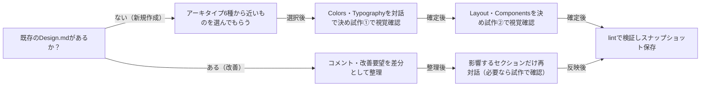

# design-md-conventions

## 概要

### この概念が答える判断

- Design.mdはどんなフォーマットで書くべきか
- デザイントークンはいつ・どうやって確定すべきか
- Design.mdのバージョン管理はどう行うか
- 非デザイナーとの対話でデザインの方向性をどう決めるか

Design.md（コーディングエージェントにビジュアルアイデンティティを伝える文書）の実体仕様と、対話×試作artifactの往復でそれを作成・改善する運用規約。

---

## 原則

- フォーマットは発明しない: Design.mdの実体はgoogle-labs-code/design.md仕様に従う。YAMLフロントマター（機械可読トークン）＋Markdown本文（人間可読の設計理由）の2層構造で、トークンが規範値・本文が適用文脈を担う。
- トークンの語彙: フロントマターにはname・colors・typography・rounded・spacing・componentsを書く。色は任意のCSS色、寸法は数値＋単位、トークン参照は{path.to.token}形式。
- セクションは固定順: 本文の##セクションはOverview→Colors→Typography→Layout→Elevation & Depth→Shapes→Components→Do's and Don'tsの順。省略は許されるが順序の入れ替えは不可。
- 見て決める: トークン値は言葉だけで確定しない。Colors＋Typography確定後とLayout＋Components確定後の2チェックポイントで試作artifactを生成し、視覚確認を経て値を確定する。
- 入り口は指差し: 非デザイナーはゼロから言語化できない。対話の最初に内蔵アーキタイプ（6種の方向性）を見せ、近いものを選んでから差分を対話で詰める。
- 検証は既存ツールで: 構造検証・WCAGコントラスト確認はdesign.mdのlintコマンドを、バージョン間比較はdiffコマンドをオンデマンドで使う。自前で再実装しない。
- 履歴はスナップショット: バージョン履歴は各版のDesign.mdをそのまま保存する。差分は必要時にdiffで算出し、差分結果自体は保存しない。
- Design.mdは生きた文書: UIパターンへのコメント・レビューの学びは、パターン側だけでなくDesign.md本体へ差分として還元する。
- 状態系トークンでround-tripを閉じる: 状態を持つUI（状態チップ・disabled・focus・hover・罫線など）は、その全バリアントの背景色/文字色/境界/focusリングまでトークンとして明示する。トークンが欠けるとモック側が値をその場で発明し、DESIGN.mdが単一の源でなくなる（round-tripが閉じない）。componentsに状態別バリアントを含め、モックがゼロ発明で組める状態にする。

---

## 分類

| 分類 | 特徴 |
|---|---|
| コーポレート・クリーン | 業務SaaSダッシュボード系。スレートネイビー＋技術的ブルー1色、詰めた余白、小さい角丸 |
| エディトリアル・ウォーム | 出版・ブランドジャーナル系。生成り＋高コントラストセリフ＋赤褐色1色、広い余白 |
| プレイフル・スタートアップ | コンシューマーアプリ・LP系。ほぼ黒地本文＋コーラルと薄紫の2アクセント |
| ミニマル・ラグジュアリー | 高級小売・ポートフォリオ系。ほぼ黒地＋アイボリー文字＋真鍮色を一箇所だけ |
| テクニカル・ブループリント | 開発者ツール・インフラ管理系。インク黒＋ティール1色、等幅ラベル、罫線グリッド |
| 信頼重視・パブリック | 行政・公共サービス系。濃紺＋青1色、装飾ゼロ、コントラスト最優先 |

---

## 判断基準

---

## 実例

架空の図書館アプリのDesign.mdを作る場合。利用者が「信頼重視・パブリック」を指差したら、その雛形のcolors（濃紺＋青1色）を起点に対話を始める。「もう少し親しみが欲しい」という要望を受けて青をやや暖色寄りに振った候補2案をスウォッチ試作で見せ、選ばれた値をcolorsトークンに確定する。Layout確定後の試作②で「表の行間が詰まりすぎ」と分かればspacingを増やし、lintでコントラスト比を確認してからv1として保存する。公開後「ボタンが押せる感じがしない」というコメントが3件付いたら、Componentsセクションのbutton-primaryへの差分として反映しv2を保存する。

---

## アンチパターン

| アンチパターン | 問題点 |
|---|---|
| 独自フォーマットの発明 | 既存のlint/diffツールが使えなくなり、他エージェントとの互換性も失う |
| 言葉だけのトークン確定 | 「落ち着いた青で」の解釈が人により違い、実装後に大きな手戻りが起きる |
| トークン1個ごとの試作生成 | 対話のリズムが壊れ、利用者が疲弊する。試作はセクションのまとまり（2チェックポイント）で生成する |
| ゼロからの言語化要求 | 非デザイナーは要望を言語化しきれず、対話が空転する。選択肢の指差しから始める |
| 特定企業デザインの複製 | 実在企業のトークンを抽出・同梱すると商標・トレードドレス上のリスクを負う。想起ワードは業種レベルに留める |
| パターンだけの修正 | コメントの学びをDesign.mdへ還元しないと、次のパターン生成で同じ指摘が再発する |
| 状態トークンの取りこぼし | チップ背景・disabled・focus・hover・罫線をトークン化せず本文の言及だけで済ませると、モックが複数の値を即興し、DESIGN.mdとモックの二重管理になりround-tripが閉じない |

---

## 出典・根拠の透明性

google-labs-code/design.md（Google Labs, 2026年時点のREADME・spec）のフォーマット仕様の要約と、waffleプロジェクトのブレインストーミング（docs/brainstorm/brainstorm-self-hosted-artifact-design-skill.md 論点10・11）で合意した運用規約の再構成。直接引用ではない。

### 留保事項

design.md仕様はalpha版であり、トークンスキーマ・セクション構成は今後変わる可能性がある。

---

## 関連概念

| 関連概念 | 関係 |
|---|---|
| frontend-design-principles | 試作artifactを生成する際の品質判断基準を提供する |
| design-system-tokens | トークンという概念自体の設計原則を提供する |
| accessibility-baseline | lintで確認するコントラスト等の最低基準の背景を提供する |
