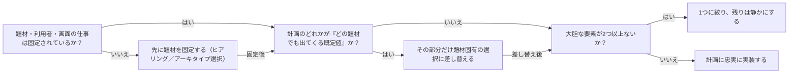

# frontend-design-principles

## 概要

### この概念が答える判断

- UIモックの第一印象（ヒーロー領域）はどう決めるべきか
- タイポグラフィ・配色はどこまで作り込むべきか
- 装飾や番号付けなどの構造要素をいつ使うべきか
- 生成AIっぽい既視感のあるデザインをどう避けるか
- 大胆な表現はどこに投資すべきか

対象の題材に根ざした、他と見分けの付く意図的なビジュアルデザインを作るための原則群。試作artifactやUIパターンHTMLを生成する際の判断基準として使う。

---

## 原則

- 題材に根ざす: 対象が何であるか（題材・利用者・その画面の唯一の仕事）を最初に固定する。題材固有の素材・道具・語彙こそが、他にない選択の源泉になる。
- ヒーローは主張である: 画面の冒頭には題材世界で最も特徴的なもの（見出し・画像・動き・インタラクション）を置く。大きな数字＋小さなラベル＋グラデーションはテンプレの答えであり、最良の場合にのみ使う。
- タイポグラフィが個性を運ぶ: 見出し用と本文用の書体は意図して組み合わせ、太さ・幅・字間まで含めた型スケールを定める。型の扱い自体を記憶に残る要素にする。
- 構造は情報である: 番号・罫線・ラベル等の構造装置は、内容について真であること（実際の順序・実際の分類）を符号化する場合にのみ使う。装飾としては使わない。
- モーションは狙って使う: 演出は散発的に足すより、1箇所のまとまった瞬間に束ねる方が効く。動きを足すほどAI生成らしさが増す局面もあり、少ない方が良いことがある。
- 大胆さは一点に集中する: 記憶に残る要素は1つに絞り、その周囲は静かに規律を保つ。主張がぶつかる場合は彩度を落とすか類似色に寄せる。
- 2パスで作る: まず小さなデザイン計画（4〜6色のパレット・2役以上の書体・レイアウト構想・シグネチャ要素）を立て、それが『どの題材でも出てくる既定値』になっていないか批評してから実装する。
- 既定値クラスタを知る: 生成AIのデザインは特定の見た目（温かいクリーム地＋セリフ＋テラコッタ、ほぼ黒地＋蛍光1色、新聞風ヘアライン等）に集中する。指定がない限りその自由をこれらの既定値に費やさない。
- 品質の床を守る: モバイル対応・キーボードフォーカスの可視化・reduced-motion尊重は宣言せずに常に満たす。

---

## 分類

| 分類 | 特徴 |
|---|---|
| 調査（題材の固定） | 題材・利用者・画面の仕事を1つに定め、題材世界の語彙を集める段階 |
| 計画（トークン設計） | パレット・書体ペア・レイアウト構想・シグネチャ要素を小さく言語化する段階 |
| 批評（既定値チェック） | 計画が題材固有の選択になっているか、既定値クラスタに落ちていないかを見る段階 |
| 実装（計画への忠実） | 批評を通過した計画から全ての色・型の決定を導出して作る段階 |

---

## 判断基準

---

## 実例

架空の焙煎所の予約画面を作るとする。題材の世界には焙煎温度計・麻袋・産地地図といった素材がある。ヒーローには売上グラフではなく『今週の焙煎スケジュール』を大きな時刻表として置き、書体は見出しにわずかに癖のあるセリフ、本文は静かなサンセリフを組む。大胆さは時刻表の帯色1点に集中させ、ボタンや枠線は無彩色に抑える。番号付きステップは実際に予約が3段階だから使うのであって、飾りではない。

---

## アンチパターン

| アンチパターン | 問題点 |
|---|---|
| テンプレヒーロー | 大きな数字＋小さなラベル＋グラデーションを反射的に置くと、題材に関係なく同じ見た目になり第一印象で個性を失う |
| 既定値パレットへの回帰 | クリーム地セリフ＋テラコッタ等の既定値クラスタは題材を問わず出現し、「AIが作った感」の主因になる |
| 装飾としての番号付け | 順序が情報でない内容に01/02/03を振ると、読者に存在しない系列を誤読させる |
| 大胆さの分散 | 目立つ要素を複数置くと互いに打ち消し合い、どれも記憶に残らない |
| 計画なき実装 | トークン計画を立てずに書き始めると、色や型の決定が局所的な思いつきの寄せ集めになり一貫性が壊れる |

---

## 出典・根拠の透明性

Claude Code公式プラグインfrontend-design SKILL.md（Anthropic, 2026年時点）の設計原則・プロセス・自己批評の各節を要約・再構成したもの。直接引用ではない。

### 留保事項

既定値クラスタの具体例（配色等）はモデル世代により変化するため、列挙は網羅ではなく代表例。

---

## 関連概念

| 関連概念 | 関係 |
|---|---|
| design-system-tokens | 本原則の計画段階で定めるトークンの設計原則を提供する |
| visual-hierarchy-and-restraint | 大胆さの一点集中・抑制の原則を視覚的階層の観点から補強する |
| ui-copywriting | デザイン素材としての言葉の扱いを提供する |
| design-md-conventions | 本原則で決めたトークンを記録するDesign.mdの仕様を定める |
