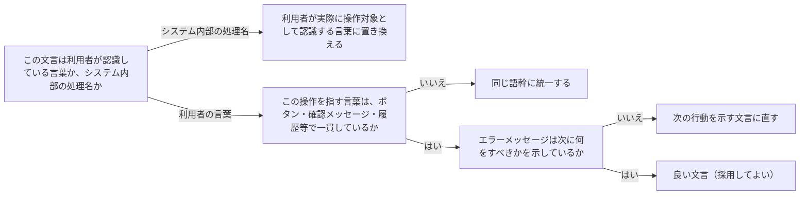

# ui-copywriting

---

## 概要

### この概念が答える判断

- ボタンや見出しの文言は誰の視点で書くべきか？
- 内部処理を説明する文言と、利用者が認識する言葉、どちらを使うべきか？
- 確認メッセージの文言は、操作前後で一貫させるべきか？

画面上の文言（ボタン・見出し・確認メッセージ・エラー文等）は、理解と操作のしやすさのためだけに存在するという前提に立ち、書き方の一貫した基準を定める。

---

## 原則

- 文言は常に利用者の視点から書く。
- 操作を表す言葉は、システム内部の仕組み（アーキテクチャ・処理名）ではなく、利用者が認識し操作対象として扱う言葉を使う。
- 能動態を基本とし、婉曲・受動的な言い回しを避ける。
- 同じ操作を指す言葉は画面をまたいで一貫させる——例えば操作ボタンが「公開する」なら、完了後の確認も「公開しました」のように同じ語幹を使う。
- 文体は会話的で平易、気の利いた言い回しより具体的で分かりやすい表現を優先し、ブランド・想定利用者に応じてトーンを調整する。

---

## 分類

| 分類 | 特徴 |
|---|---|
| 操作の呼称 | ボタン・メニュー項目等、操作そのものを指す言葉 |
| 確認・完了メッセージ | 操作後にその結果を伝える言葉 |
| エラーメッセージ | 想定外の状態を伝え、次に何をすべきか導く言葉 |

---

## 判断基準

---

## 実例

架空のSaaS「TaskFlow」で、タスクを非公開から公開状態に切り替えるボタンの文言を検討する場面。当初「ステータスを更新」という内部処理寄りの表現だったが、利用者が実際に行っている操作（他のメンバーに見えるようにする）に即して「公開する」に変更した。操作後の確認メッセージも「ステータスが更新されました」ではなく「公開しました」に揃えた。保存に失敗した際のエラー文言も「エラーが発生しました」から「保存に失敗しました。もう一度お試しください」に直し、次の行動を示すようにした。

---

## アンチパターン

| アンチパターン | 問題点 |
|---|---|
| システム内部の処理名をそのまま文言にする | 利用者にとって意味の分からない技術用語（「ステータスを更新」「リクエストを送信」等）が画面に残り、何が起きるか予測できない |
| 操作ボタンと完了メッセージで異なる語を使う | 「公開する」ボタンを押した後に「ステータスが変更されました」と表示すると、同じ操作の結果だと利用者が認識しにくい |
| エラーメッセージが次の行動を示さない | 「エラーが発生しました」とだけ表示すると、利用者は何をすればよいか分からず操作に詰まる |

---

## 出典・根拠の透明性

Anthropic公式`/frontend-design`skillのWriting in Designセクションを要約・再構成したものであり、本文の直接引用ではない。

---

## 関連概念

| 関連概念 | 関係 |
|---|---|
| design-system-tokens | 文言もトークンと同様、design.md等に記録し画面をまたいだ一貫性を保つ運用に組み込める |
