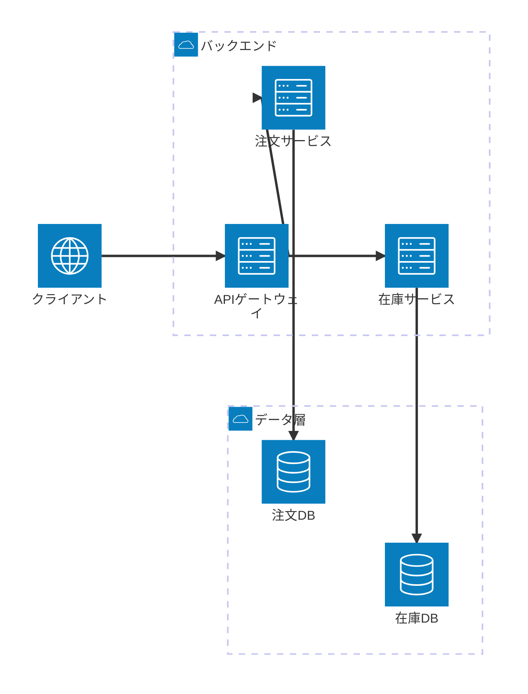
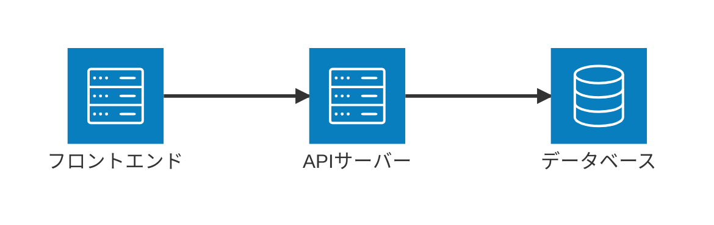
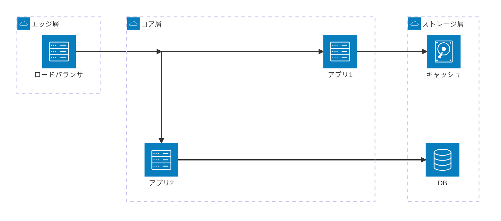

# アーキテクチャ図（architecture-beta）

> ⚠️ **beta構文**: `architecture-beta` は Mermaid のベータ機能。バージョンやレンダリング環境によって表示されない・レイアウトが崩れる場合がある。使用前に対象環境（Claude Code のプレビュー・GitHub・Mermaid Live 等）で表示確認すること。

参照: https://mermaid.js.org/syntax/architecture.html

## 概要

クラウドサービス・サーバー・データベース等の**インフラ構成要素**をアイコン付きで表現する図。`group`（グループ／筐体）・`service`（個々のコンポーネント）・`junction`（分岐点）をエッジで結び、サービス間の通信・依存・配置関係を可視化する。

## 使いどころ

- クラウドインフラ構成図（AWS・GCP・Azure等の論理配置）
- マイクロサービス間の通信・ネットワーク構成
- システム全体の物理/論理アーキテクチャ概要（どのグループにどのサービスが属するか）

## 使わないケース

- ソフトウェアの論理的な構造（クラス・継承） → `classDiagram`
- 処理の時系列フロー → `sequenceDiagram`
- インフラ色を持たない一般的なブロック配置 → `block-beta` or `flowchart`
- 要件とコンポーネントのトレーサビリティ → `requirementDiagram`

---

## 基本テンプレート

```
architecture-beta
    group グループID(アイコン)[表示ラベル]
        service サービスID(アイコン)[表示ラベル] in グループID
    end

    junction 分岐ID

    サービスID:R --> L:別サービスID
```

※実際の構文では `group` 定義に `end` は不要（`service ... in グループID` で所属を宣言する形。後述の通り、公式のネスト表記は `in` 句を使う）。

---

## 構文要素 網羅表

| 要素 | 構文 | 説明 |
|---|---|---|
| ダイアグラム宣言 | `architecture-beta` | 図種別の宣言。必ず先頭に書く |
| グループ | `group {id}({icon})[{title}]` | インフラの筐体・論理グループを定義 |
| グループのネスト | `group {id}({icon})[{title}] in {parentId}` | 既存グループの内側に別グループを配置（入れ子可能） |
| サービス | `service {id}({icon})[{title}]` | 個々のコンポーネント（サーバー・DB等）を定義 |
| サービスのグループ配置 | `service {id}({icon})[{title}] in {groupId}` | サービスを指定グループの内側に配置 |
| ジャンクション | `junction {id}` / `junction {id} in {groupId}` | エッジの分岐・合流点（4方向に接続できる仮想ノード） |
| エッジ（接続） | `{id}:{side} -- {side}:{id}` | 矢印なしの単純接続 |
| エッジ（矢印付き） | `{id}:{side} --> {side}:{id}` / `{id}:{side} <-- {side}:{id}` | 片方向矢印 |
| エッジ（双方向） | `{id}:{side} <--> {side}:{id}` | 双方向矢印 |
| 接続辺（side指定） | `L`（左）/ `R`（右）/ `T`（上）/ `B`（下） | サービス/グループの接続面 |
| グループ間エッジ | `{id}{group}:{side} --> {side}:{id}{group}` | サービスIDに `{group}` を付けて、そのサービスが属するグループ全体を起点/終点にする |
| 整列（行） | `align row {idA} {idB} {idC} ...` | 指定したid群を同一行に整列（v11.16.0+） |
| 整列（列） | `align column {idA} {idB} ...` | 指定したid群を同一列に整列（v11.16.0+） |
| Iconify連携 | `service {id}(name:icon-name)[{title}]` | iconify.design の20万種超のアイコンを `パック名:アイコン名` 形式で利用 |
| タイトル/設定 | `%%{init: {"architecture": {...}}}%%`（frontmatter） | レイアウト詳細設定（後述） |

### デフォルト組込みアイコン

| アイコン名 | 用途 |
|---|---|
| `cloud` | クラウド全般 |
| `database` | データベース |
| `disk` | ストレージ/ディスク |
| `internet` | インターネット/外部ネットワーク |
| `server` | サーバー |

上記5種のみが標準搭載。それ以外の見た目が必要な場合は iconify 連携（例: `service ec2(logos:aws-ec2)[EC2]`）を使う（要アイコンパック登録）。

### レイアウト設定（frontmatterで指定可能な主なオプション）

| オプション | 型 | デフォルト | 説明 |
|---|---|---|---|
| `randomize` | boolean | `false` | 初期配置のランダム化有無 |
| `nodeSeparation` | number | `75` | ノード間の最小間隔 |
| `idealEdgeLengthMultiplier` | number | `1.5` | 理想エッジ長の倍率 |
| `edgeElasticity` | number | `0.45` | エッジのばね弾性係数 |
| `numIter` | number | `2500` | レイアウト計算の最大反復回数 |
| `seed` | number | `1` | レイアウトを決定論的にするための乱数シード |

指定例:
```
%%{init: {"architecture": {"nodeSeparation": 100, "seed": 42}}}%%
architecture-beta
    ...
```

---

## 各構文要素の具体例

### グループ定義・ネスト

```
architecture-beta
    group public_api(cloud)[Public API]
    group private_api(cloud)[Private API] in public_api
```

### サービス定義・グループ配置

```
architecture-beta
    group private_api(cloud)[Private API]
    service database1(database)[My Database] in private_api
```

### エッジ（矢印なし・矢印付き・双方向）

```
architecture-beta
    service db(database)[DB]
    service server(server)[Server]

    db:R -- L:server
    db:T --> B:server
    db:L <--> R:server
```

### ジャンクション（4方向分岐）

```
architecture-beta
    service left(server)[Left]
    service right(server)[Right]
    service top(server)[Top]
    junction j

    left:R --> L:j
    j:R --> L:right
    j:T --> B:top
```

### グループ間エッジ（`{group}` 修飾子）

```
architecture-beta
    group groupOne(cloud)[Group One]
    group groupTwo(cloud)[Group Two]
    service server(server)[Server] in groupOne
    service subnet(disk)[Subnet] in groupTwo

    server{group}:B --> T:subnet{group}
```

### 整列（align）

```
architecture-beta
    service a(server)[A]
    service b(server)[B]
    service c(server)[C]

    align row a b c
```

### Iconify 外部アイコン

```
architecture-beta
    service ec2(logos:aws-ec2)[EC2 Instance]
    service s3(logos:aws-s3)[S3 Bucket]

    ec2:R --> L:s3
```

---

## 実例（そのままプレビュー可能）

### 例1: マイクロサービスのインフラ構成



### 例2: シンプルな3層構成



### 例3: ジャンクションを使った3層構成



---

## 注意点

- **`[表示ラベル]` に日本語等の非ASCII文字を使う場合は必ずダブルクォートで囲む**（`["バックエンド"]`。クォート無し`[バックエンド]`はレクサエラーで構文解析に失敗する。ASCII文字のみのラベルはクォート省略可）。
- **`{group}`エッジ修飾子（グループ間エッジ）は、図全体でグループが3つ以上定義されていると`Cannot read properties of undefined (reading 'in')`エラーで構文解析に失敗する**（v11.16.0で動作確認済みのバグ・グループ名やASCII/日本語の別に関係なく再現）。2グループのみの図では問題なく動作する。3グループ以上の図で層をまたぐ接続を示したい場合は、`{group}`を使わず個々のserviceを直接エッジで結ぶこと。
- デフォルトアイコンセットは `cloud`/`database`/`disk`/`internet`/`server` の5種のみ。それ以外の見た目（`user` 等）が必要な場合は iconify 連携で明示的にアイコンパックを指定すること。
- `service ... in グループID` の所属指定は、必ずそのグループ定義より後（または同名グループ定義済みの状態）で書く。
- beta機能のため、将来の Mermaid バージョンで構文が変わる可能性がある。重要なドキュメントに組み込む前に対象バージョンでの表示確認を推奨。
