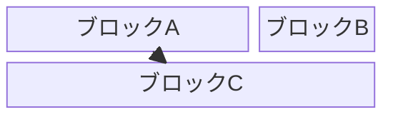
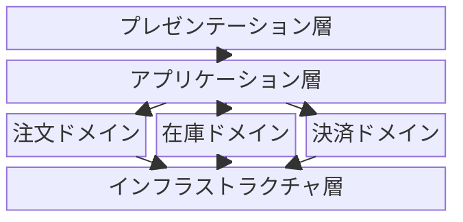
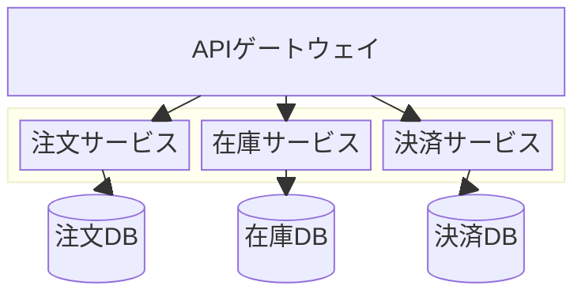
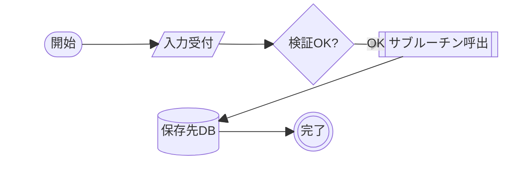

# ブロック図（block）

> ⚠️ **beta由来の構文**: 長らく `block-beta` というキーワードで提供されてきた図種。最新の公式ドキュメントでは `block` という表記だが、GitHubなど多くのレンダリング環境・過去バージョンでは引き続き `block-beta` の `-beta` サフィックスが必要な場合がある。使用環境で両方試すこと（本ファイルの実例は互換性優先で `block-beta` を使用）。比較的新しい図種のため、表示崩れ・非対応環境がある点に注意。

参照: https://mermaid.js.org/syntax/block.html

## 概要

グリッドベースでブロック（コンポーネント）を配置し、システム構成を表現する図。`flowchart` 同様のノード形状記法が使え、かつ `columns` によるグリッドレイアウトの明示的コントロールができる点が特徴。

## 使いどころ

- システムの物理的・論理的なコンポーネント配置
- レイアウト（列数・幅）を細かく指定したいアーキテクチャ図
- 画面レイアウトの概略（ワイヤーフレーム的用途）

## 使わないケース

- フローや処理順序が重要 → `flowchart`
- サービス間の依存・通信を強調したい → `architecture-beta`
- ノードの自動レイアウトで十分 → `flowchart`

---

## 基本テンプレート



`columns N` でグリッドの列数を指定。ブロックIDの後ろの `:N` でブロックが占める列数（幅）を指定。

---

## 構文一覧

| 構文要素 | 書式 | 説明 |
|---|---|---|
| 図の宣言 | `block-beta`（環境により `block`） | 1行目に必須 |
| 列数指定 | `columns N` | グリッドの列数。省略時は自動配置 |
| ブロック（省略記法） | `a b c` | 1行に複数ブロックIDを並べると自動的に各セルへ配置 |
| ブロック幅 | `id:N` | そのブロックが N 列分の幅を占める（例 `b:2`） |
| 空白ブロック | `space` / `space:N` | グリッド上に何も配置しない空きセルを挿入（`:N`で複数列分） |
| 複合（入れ子）ブロック | `block:ID ... end` | ブロックの中に子ブロックを配置するグルーピング |
| 複合ブロックの幅 | `block:ID:N ... end` | 複合ブロック自体の幅を指定 |
| 複合ブロック内の列数 | `columns N`（`block:ID` の内側で宣言） | 子ブロックのグリッド列数を親と独立して指定可能 |
| ブロック矢印 | `id<["ラベル"]>(方向)` | 方向を持つ矢印形状のブロック。方向は `right`/`left`/`up`/`down`/`x`/`y`/`x, down` 等 |
| エッジ（矢印） | `A --> B` | ブロック間を矢印で接続 |
| エッジ（線のみ） | `A --- B` | 矢印無しの接続 |
| エッジ（ラベル付き） | `A -- "ラベル" --> B` | 矢印にラベルを付与 |
| スタイル（個別） | `style id fill:#hex,stroke:#hex,stroke-width:Npx` | 特定ブロックの見た目を指定 |
| クラス定義 | `classDef クラス名 fill:#hex,stroke:#hex,stroke-width:Npx;` | 再利用可能なスタイル定義 |
| クラス適用 | `class id クラス名` | 定義したクラスをブロックへ適用 |
| コメント | `%% コメント` | 行コメント |

### ブロックの形状一覧

`flowchart` と同様の角括弧記法で形状を指定できる（デフォルトは矩形）。

| 形状 | 記法 | 具体例 |
|---|---|---|
| 矩形（デフォルト） | `id["text"]` | `a["処理A"]` |
| 角丸 | `id("text")` | `a("処理A")` |
| スタジアム型（両端丸） | `id(["text"])` | `a(["開始"])` |
| サブルーチン（二重線） | `id[["text"]]` | `a[["サブ処理"]]` |
| 円柱（データベース） | `id[("text")]` | `db[("注文DB")]` |
| 円 | `id(("text"))` | `a(("集約点"))` |
| 二重円 | `id((("text")))` | `a((("中心")))` |
| 非対称（旗形） | `id>"text"]` | `a>"フラグ"]` |
| 菱形（判断） | `id{"text"}` | `a{"条件分岐"}` |
| 六角形 | `id{{"text"}}` | `a{{"準備処理"}}` |
| 平行四辺形 | `id[/"text"/]` | `a[/"入力"/]` |
| 台形 | `id[\"text"\]` | `a[\"出力"\]` |

### columns / 幅指定の具体例

```
block-beta
    columns 3
    a["A"]:2
    b["B"]
    c["C"]
    d["D"]
    e["E"]
```

### 空白ブロックの具体例

```
block-beta
    columns 3
    a["A"] space b["B"]
```

### 複合（入れ子）ブロックの具体例

```
block-beta
    columns 3
    a:3
    block:group1:2
        columns 2
        h i j k
    end
    g
    block:group2:3
        l m n o p q r
    end
```

### ブロック矢印の具体例

```
block-beta
    blockArrowId<["処理"]>(right)
    blockArrowId2<["逆流"]>(left)
    blockArrowId3<["上昇"]>(up)
    blockArrowId4<["下降"]>(down)
    blockArrowId5<["双方向X"]>(x)
    blockArrowId6<["双方向Y"]>(y)
    blockArrowId7<["複合"]>(x, down)
```

### エッジ（矢印・ラベル）の具体例

```
block-beta
    columns 2
    A["注文サービス"]
    B["在庫サービス"]
    A --> B
    A -- "在庫確認" --> B
    A --- B
```

### スタイリングの具体例

```
block-beta
    columns 2
    A["重要コンポーネント"]
    B["通常コンポーネント"]
    style A fill:#636,stroke:#333,stroke-width:4px
    classDef normal fill:#eee,stroke:#999,stroke-width:1px;
    class B normal
```

> 注意: 公式ドキュメントには複合ブロック内部の描画方向（`flowchart` の `subgraph` にある `direction TB` 相当）を指定する構文は記載されていない。列レイアウトは `columns` でのみ制御する。

---

## 実例

### 例1: レイヤードアーキテクチャ



### 例2: マイクロサービス構成（円柱形状・複合ブロック）



### 例3: 複数形状を組み合わせた処理フロー概略


