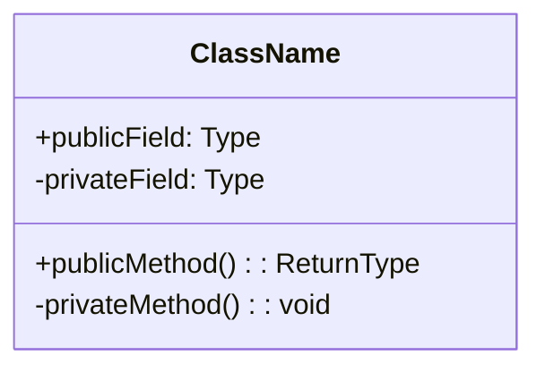
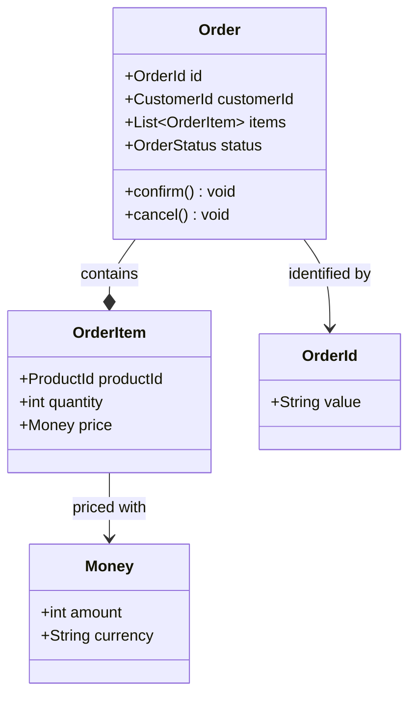
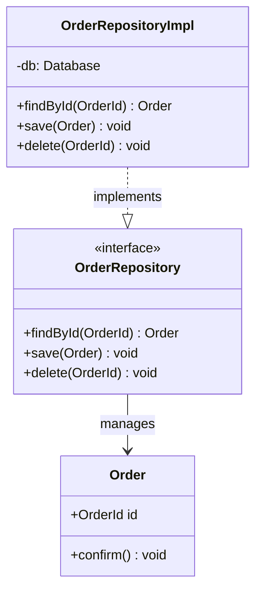
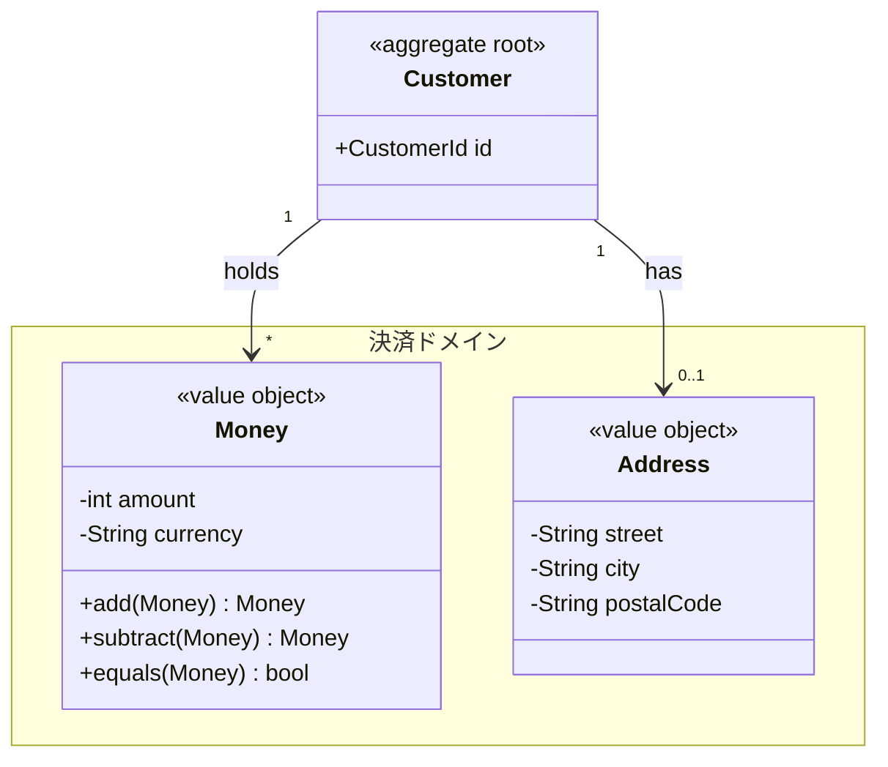

# クラス図（classDiagram）

## 概要

クラスの属性・メソッドと、クラス間の関係（継承・コンポジション・依存など）を表現する図。DDDの戦術的パターン（エンティティ・値オブジェクト・集約・ドメインサービス）の構造表現に適している。

## 使いどころ

- DDDの集約・エンティティ・値オブジェクトの構造
- インターフェースと実装の関係
- クラス間の継承・コンポジション・依存関係
- リポジトリとドメインオブジェクトの関係

## 使わないケース

- エンティティ間の多重度のみ示したい → `erDiagram`（DBスキーマ寄りの表現）
- 動的な処理順序 → `sequenceDiagram`

---

## 基本テンプレート



---

## クラスの宣言

**単独宣言（メンバー無し）:**

```
class Animal
```

**中括弧ブロック:**

```
class Animal {
    +int age
    +String gender
    +isMammal()
}
```

**コロン記法（ブロックを使わない別記法）:**

```
class Animal
Animal : +int age
Animal : +String gender
Animal : +isMammal()
```

**ラベル付き（表示名を変える）:**

```
class MyClass["表示用ラベル"]
```

---

## メンバー（属性・メソッド）の記法

### 可視性修飾子

| 記号 | 意味 |
|---|---|
| `+` | public |
| `-` | private |
| `#` | protected |
| `~` | package/internal |

### 属性・メソッドの型/戻り値

```
class MyClass {
    +int age
    +String name
    +getValue() int
    +List~String~ getNames()
}
```

### ジェネリクス（`~T~`）

```
class MyClass {
    List~int~ items
    getValue() List~String~
}
```

### 分類子（静的・抽象）

```
class MyClass {
    someAbstractMethod()*
    someAbstractMethod() int*
    someStaticMethod()$
    someStaticMethod() String$
    String someStaticField$
}
```

`*` = abstract（抽象）、`$` = static（静的）。フィールド・メソッドどちらにも付与できる。

---

## 関係の種類と矢印記法

| 記法 | 意味 | 用途 |
|---|---|---|
| `A <|-- B` | 継承（B is-a A） | スーパークラス・サブクラス |
| `A *-- B` | コンポジション（強い所有・Bは独立不可） | 集約内のエンティティ |
| `A o-- B` | 集約（弱い所有・Bは独立可能） | 弱い所有関係 |
| `A --> B` | 関連（一方向の参照） | 一方向の参照 |
| `A -- B` | リンク（実線・矢印なし） | 単純な接続 |
| `A ..> B` | 依存（一時的な利用） | メソッド引数・戻り値 |
| `A ..|> B` | 実現（インターフェース実装） | `<<interface>>` の実装 |
| `A .. B` | リンク（破線・矢印なし） | 弱い/一時的な接続 |

### 双方向・混合矢印

```
classA <|--|> classB
classA *--o classB
classA o--< classB
classA >--< classB
```

### 関係ラベル

```
classA --> classB : uses
classA --|> classB : implements
```

### 多重度（カーディナリティ）

```
classA "1" --> "0..1" classB
classA "1..*" --> "*" classB
```

指定可能な値: `1` `0..1` `1..*` `*` `n` `0..n` 等。

---

## ロリポップ（インターフェース簡易表記）

```
bar ()-- foo
foo --() bar
```

---

## ステレオタイプ・アノテーション（DDDでよく使う）

```
<<interface>>       # インターフェース
<<abstract>>        # 抽象クラス
<<service>>         # サービス
<<enumeration>>      # 列挙型
<<entity>>          # エンティティ
<<value object>>    # 値オブジェクト
<<aggregate root>>  # 集約ルート
<<domain service>>  # ドメインサービス
<<repository>>      # リポジトリ
```

**クラス宣言時に付与:**

```
class MyInterface {
    <<Interface>>
}
```

**外部から付与:**

```
class MyInterface
<<Interface>> MyInterface
```

---

## namespace（名前空間）

```
namespace MyNamespace {
    class ClassA
    class ClassB
}
```

**表示ラベル付き:**

```
namespace MyNamespace["表示用ラベル"] {
    class ClassA
}
```

**ドット記法での階層化:**

```
namespace Sales.Orders {
    class Order
}
```

**入れ子構文:**

```
namespace Outer {
    namespace Inner {
        class ClassC
    }
}
```

---

## 方向（direction）

```
classDiagram
direction TD
```

選択肢: `TD`（上→下）/ `LR`（左→右）/ `BT`（下→上）/ `RL`（右→左）

---

## 注釈（note）

```
note "全体に対する注釈（複数行も可）"
note for MyClass "特定クラスへの注釈"
```

---

## クリックインタラクション

```
click ClassName href "https://example.com" "ツールチップ"
click ClassName call functionName() "ツールチップ"
```

---

## スタイリング

```
style MyClass fill:#f9f,stroke:#333,stroke-width:4px

classDef important fill:#f9f,stroke:#333,stroke-width:4px;
classDef group1,group2 font-size:12pt;

cssClass "MyClass" important;
cssClass "A,B" group1,group2;

class MyClass:::important

classDef default fill:#eee,stroke:#333;
```

---

## コメント

```
%% これはコメント
class MyClass
```

---

## 実例

### 例1: DDDの集約構造



### 例2: リポジトリパターン（インターフェース実現）



### 例3: 値オブジェクト・namespace・多重度


