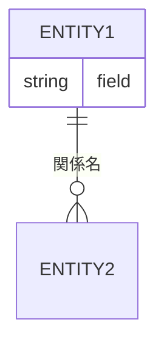
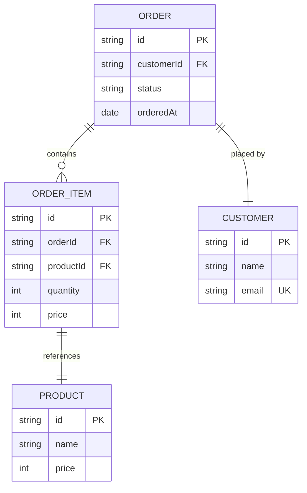
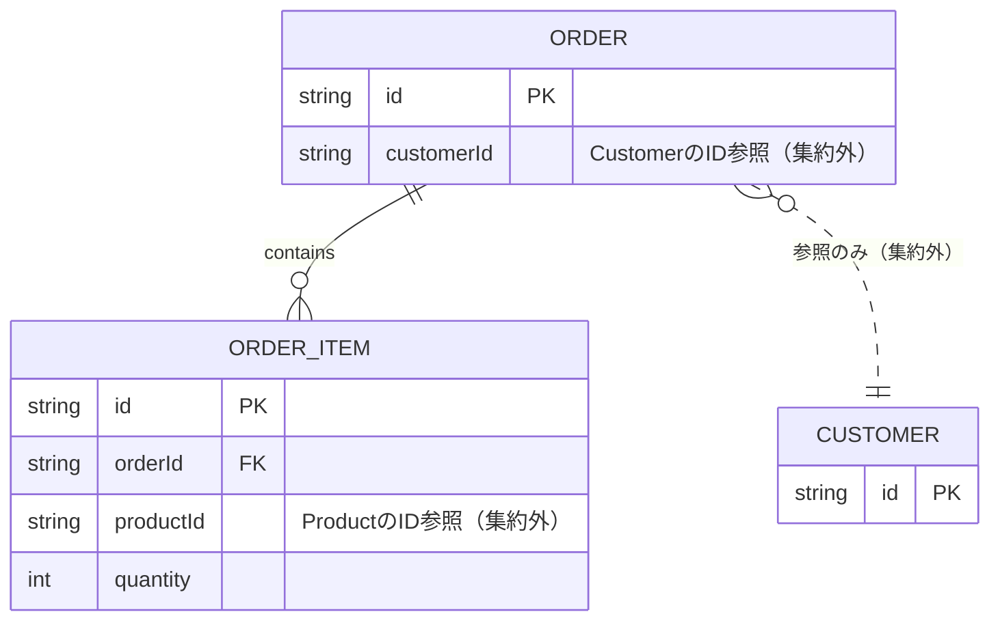
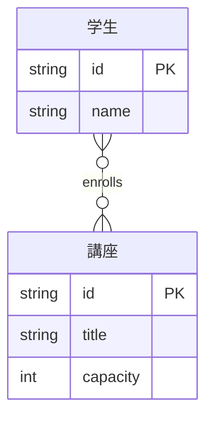

# ER図（erDiagram）

## 概要

エンティティ間の関係と多重度（カーディナリティ）を表現する図。データ構造・ドメインモデルの関係を「何対何」の視点で示す。

## 使いどころ

- ドメインモデルのエンティティ間の関係・多重度
- データベーススキーマの設計・確認
- 集約をまたぐ参照関係の整理

## 使わないケース

- クラスのメソッド・継承関係 → `classDiagram`
- 処理の順序 → `sequenceDiagram`

---

## 基本テンプレート



---

## 基本構文

パターンは `<エンティティ1> [<関係> <エンティティ2> : <関係ラベル>]` の形。エンティティ単体の宣言（関係なし）も可能。

```
CUSTOMER
```

```
PROPERTY ||--|{ ROOM : contains
```

---

## カーディナリティ（多重度）記法（クロウズフット）

| 記法 | 意味 |
|---|---|
| `\|o` / `o\|` | ゼロまたは1 |
| `\|\|` / `\|\|` | ちょうど1 |
| `}o` / `o{` | ゼロ以上（0..*） |
| `}\|` / `\|{` | 1以上（1..*） |

### エイリアス表記（同じ意味の別名）

| 表現 | 意味 |
|---|---|
| `one or zero` / `zero or one` | ゼロまたは1 |
| `only one` / `1` | ちょうど1 |
| `one or more` / `one or many` / `many(1)` / `1+` | 1以上 |
| `zero or more` / `zero or many` / `many(0)` / `0+` | 0以上 |

### 組み合わせ例

```
||--o{  : 1対多（1つのAに0以上のB）
||--||  : 1対1
}o--o{  : 多対多
|o--o|  : ゼロ/1 対 ゼロ/1
```

---

## 関係の種類（線種：識別 / 非識別）

| 記法 | 線種 | 意味 |
|---|---|---|
| `--` | 実線 | 識別関係（子が親の主キーの一部を継承する強い関係） |
| `..` | 破線 | 非識別関係（弱い/任意の関連） |

```
PERSON |--o{ NAMED-DRIVER : drives
PERSON }|..|{ CAR : "driver"
```

エイリアス: `to`（識別関係相当）/ `optionally to`（非識別関係相当）も利用可。

---

## 属性ブロック（attributes）

```
CUSTOMER {
    string name
    int age
}
```

### 型に付与できるキー（PK / FK / UK）

```
CUSTOMER {
    int id PK
    string email UK
    int orderId FK "外部キー参照"
}
```

複数キーの併記も可能: `int id PK, FK`

### コメント（属性後のダブルクォート文字列）

```
ORDER_ITEM {
    string productId FK "Product集約への参照"
}
```

### Optional（nullable）型（新しめのバージョン）

```
CUSTOMER {
    string? email
}
```

---

## エンティティ名のエイリアス（表示名変更）

```
CUSTOMER ["Customer Entity"]
```

宣言した角括弧内の文字列が実際の描画ラベルとして使われる。

---

## 方向（direction）

```
erDiagram
    direction LR
```

選択肢: `TB`（上→下）/ `BT`（下→上）/ `LR`（左→右）/ `RL`（右→左）

---

## テキスト機能

- エンティティ名・関係名・属性名にUnicode（日本語含む）が利用可能
- Markdown書式のテキストにも対応
- スペースを含む名前は `"..."` で引用符囲みにする

```
"顧客 データ"
```

---

## スタイリング

```
style CUSTOMER fill:#f9f,stroke:#333,stroke-width:4px
style ENTITY1,ENTITY2 fill:#bbf

classDef important fill:#f9f,stroke:#333,stroke-width:4px
class CUSTOMER important

CUSTOMER:::important
ENTITY1:::group1,group2

classDef default fill:#eee,stroke:#333
```

---

## コメント

```
%% これはコメント
```

---

## 設定（レイアウトエンジン）

```
---
config:
  layout: elk
---
```

---

## 実例

### 例1: 受注ドメインのエンティティ関係



### 例2: 集約をまたぐ参照（IDのみ・非識別関係）



### 例3: 多対多関係とエンティティエイリアス


