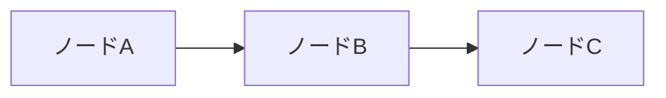
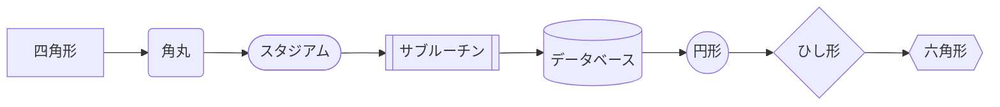
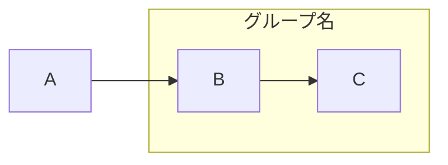
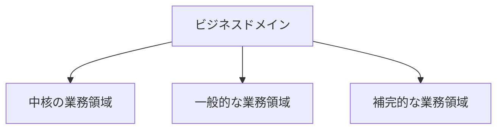
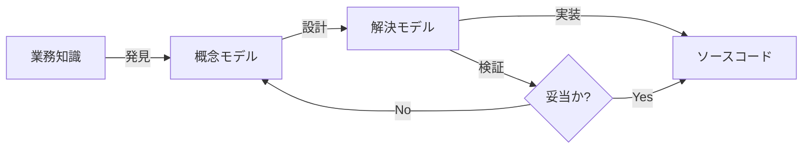
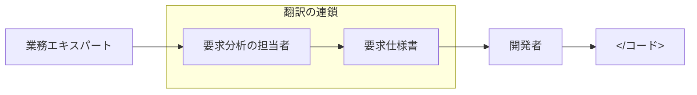
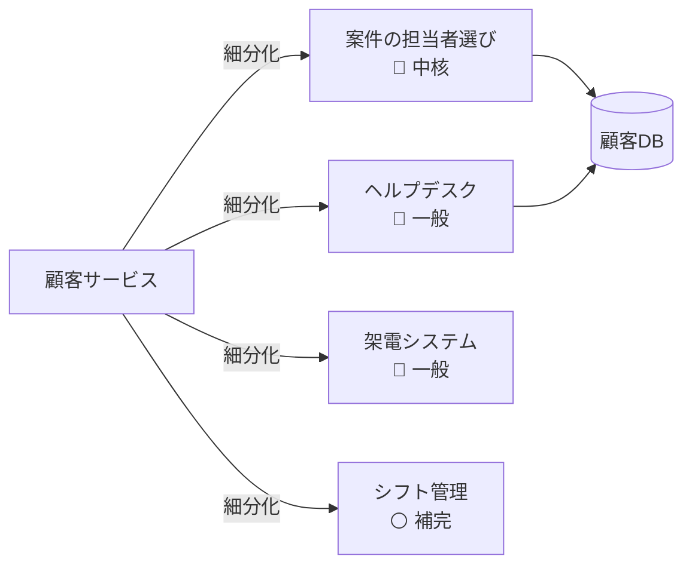

# フローチャート（flowchart）

## 概要

ノードと矢印で構成される汎用の関係・フロー図。Mermaidで最も多用する構文。方向・ノード形状・矢印種別を組み合わせて、階層図・プロセス図・関係図・意思決定フローなど幅広く表現できる。

## 使いどころ

- **TD/TB（上→下）**: 階層・包含関係、ツリー構造、組織図
- **BT（下→上）**: 積み上げ・依存の下から上への表現
- **LR（左→右）**: プロセス・変換フロー、役割・関係図、依存の流れ
- **RL（右→左）**: LRの逆向き（レイアウト調整用）

## 使わないケース

- アクター間のメッセージ順序 → `sequenceDiagram`
- クラス・継承関係 → `classDiagram`
- エンティティの多重度 → `erDiagram`
- 状態遷移 → `stateDiagram-v2`

---

## 基本テンプレート



---

## ノードの形（基本記法）

| 記法 | 形 | 用途 |
|---|---|---|
| `A` | デフォルト（角丸なし四角） | id のみでテキストが id と同一 |
| `A[text]` | 四角形 | 一般的なノード |
| `A(text)` | 角丸四角形 | 開始・終了・状態 |
| `A([text])` | スタジアム形（両端半円） | 開始・終了ポイント |
| `A[[text]]` | 二重四角形（サブルーチン） | サブルーチン・別プロセス呼び出し |
| `A[(text)]` | 円柱形 | データベース・ストレージ |
| `A((text))` | 円形 | イベント・ポイント |
| `A>text]` | 非対称形（旗形） | フラグ・特殊マーカー |
| `A{text}` | ひし形 | 分岐・条件 |
| `A{{text}}` | 六角形 | 準備・条件付き処理 |
| `A[/text/]` | 平行四辺形 | 入力 |
| `A[\text\]` | 平行四辺形（逆向き） | 出力 |
| `A[/text\]` | 台形 | 手動処理 |
| `A[\text/]` | 台形（逆向き） | 手動処理（逆） |
| `A(((text)))` | 二重円 | 停止・終端 |

例:



### 拡張ノード形状（`@{ shape: ... }`、v11.3.0+）

新しい統一記法。多数の意味的形状（フローチャート記号）を宣言できる。

```
A@{ shape: rect, label: "処理" }
```

代表的な `shape` 値: `rect`（プロセス）/ `circle`（開始）/ `diam`（決定・ひし形）/ `stadium`（端子）/ `hex`（条件付き準備）/ `cyl`（データベース）/ `doc`（ドキュメント）/ `docs`（複数ドキュメント）/ `dbl-circ`（停止）/ `rounded`（イベント）/ `lin-rect`（区切り線プロセス）/ `fork`（フォーク/ジョイン）/ `datastore`（データストア）/ `lean-r` `lean-l`（データ入出力）/ `h-cyl`（ダイレクトアクセス記憶）/ `lin-cyl`（ディスク記憶）/ `curv-trap`（表示）/ `delay`（遅延）/ `text`（テキストブロック）/ `notch-rect`（カード）/ `hourglass`（照合）/ `brace` `brace-r` `braces`（コメント）/ `tri`（抽出）/ `flip-tri`（手動ファイル）/ `sl-rect`（手動入力）/ `trap-t` `trap-b`（手動操作・優先アクション）/ `f-circ`（結合点）/ `sm-circ`（開始小円）/ `fr-circ`（フレーム付き停止）/ `win-pane`（内部記憶）/ `bow-rect`（保存データ）/ `fr-rect`（サブプロセス）/ `notch-pent`（ループ上限）/ `flag`（紙テープ）/ `bolt`（通信リンク）/ `cloud`（クラウド）ほか。

### アイコン形状・画像形状（v11.3.0+）

```
A@{ icon: "fa:user", form: "circle", label: "ユーザー", pos: "t", h: 48 }
A@{ img: "https://example.com/logo.png", label: "ロゴ", pos: "t", w: 60, h: 60, constraint: "off" }
```

---

## 矢印・リンクの種類

| 記法 | 見た目 | 用途 |
|---|---|---|
| `A-->B` | 実線＋矢印 | 通常の関係・フロー |
| `A---B` | 実線（矢印なし） | 関連・接続 |
| `A-.->B` | 点線＋矢印 | 非同期・弱い依存 |
| `A-.-B` | 点線（矢印なし） | 弱い関連 |
| `A==>B` | 太線＋矢印 | 強調・主要フロー |
| `A===B` | 太線（矢印なし） | 強調された接続 |
| `A~~~B` | 不可視リンク | レイアウト調整用（見た目に出さない結線） |
| `A---oB` | 丸終端 | 円終端の関連 |
| `A---xB` | ×終端 | 打ち消し・非対応の関連 |
| `A<-->B` | 双方向矢印 | 相互関係 |
| `A o--o B` | 両端丸 | 双方向の弱い関連 |
| `A x--x B` | 両端× | 双方向の否定的関連 |

### ラベル付きリンク

```
A-->|text|B
A-- text -->B
A---text---B
A-.text.->B
A==text==>B
```

### リンクの長さ調整（サブグラフの階層調整）

ハイフンや `=`・`.` を追加すると、そのぶんノード間のランク（距離）が伸びる。

```
A---->B   (通常より長い実線矢印)
A===>B    (長い太線矢印)
A-..->B   (長い点線矢印)
```

### リンクのチェーン（連結記述）

```
A-->B-->C
A & B & C -->|text| D & E & F
A-->B-->C & D-->E & F-->G
```

### エッジID・アニメーション（v11.x+）

```
e1@-->|text| B
e1@{ animate: true }
e1@-- fast --> B
e1@-- slow --> B
```

アニメーションを `classDef` で付与:

```
classDef animate stroke:blue,animation:fast;
class e1 animate;
```

---

## 方向（direction）

```
flowchart TB   %% 上から下（TD と同じ）
flowchart TD   %% Top Down
flowchart BT   %% Bottom to Top
flowchart LR   %% Left to Right
flowchart RL   %% Right to Left
```

---

## subgraph（サブグラフ）



### ID付き・direction指定

```
subgraph id1[表示タイトル]
    direction LR
    X --> Y
end
```

### subgraph同士・subgraphへのエッジ

```
A --> subgraph_id
subgraph_id --> B
```

> 注意: サブグラフ内のノードが外部へリンクしている場合、そのサブグラフの `direction` 指定は無視され、親のdirectionを継承する。

---

## テキスト・特殊文字

### Markdown文字列（デフォルトで有効）

```
A["**太字** と *斜体*"]
A["改行あり
の文字列"]
```

無効化する場合:

```
---
config:
  markdownAutoWrap: false
---
```

### エンティティコード・エスケープ

```
A["#35; で # を表示"]
A["&lt;タグっぽい文字&gt;"]
```

### Unicode

```
A["日本語もそのまま使える"]
```

### FontAwesomeアイコン

```
A["fa:fa-ban 禁止"]
A[fa:fa-twitter]
```

対応プレフィックス: `fa` `fab` `fas` `far` `fal` `fad`（カスタムキットは `fak`）。

---

## コメント

```
%% これはコメント
A-->B %% 行末コメントも可
```

---

## スタイリング

### ノード個別スタイル

```
style A fill:#f9f,stroke:#333,stroke-width:4px;
```

### classDef と class（クラス定義＋適用）

```
classDef important fill:#f9f,stroke:#333,stroke-width:4px;
classDef groupA,groupB font-size:12pt;

class A,B important;
```

### ショートハンド（`:::`）でクラス適用

```
A-->B:::important
```

### defaultクラス（全ノードに適用）

```
classDef default fill:#eee,stroke:#333;
```

### リンク（エッジ）のスタイル

```
linkStyle 3 stroke:#ff3,stroke-width:4px,color:red;
linkStyle 1,2,7 color:blue;
```

### 曲線スタイル（config）

```
---
config:
  flowchart:
    curve: stepBefore
---
```

選択肢: `basis` `bumpX` `bumpY` `cardinal` `catmullRom` `linear` `monotoneX` `monotoneY` `natural` `step` `stepAfter` `stepBefore`

---

## クリックインタラクション

`securityLevel: 'loose'` が必要（描画環境の設定）。

```
click A callback
click A call callback()
click B "https://example.com" "ツールチップ"
click C href "https://example.com" "ツールチップ" _blank
```

`_blank` の代わりに `_self` `_parent` `_top` も指定可。

---

## 設定（frontmatter / init）

```
---
config:
  flowchart:
    defaultRenderer: "elk"
    width: 100%
---
```

または:

```
%%{init: {'flowchart': {'width': '100%'}}}%%
```

---

## 注意点（予約語・特殊文字）

- `end` は予約語。ノードIDやテキストとして使う場合は `End` や `END` のように大文字を混ぜて回避する。
- ノードIDが `o` や `x` で始まる場合、`---oB` `---xB` の丸/×終端記法と衝突しうる。スペースを空けるか大文字にして回避する。

---

## 実例

### 例1: 階層・包含関係（TD）



### 例2: プロセス・変換フロー（LR）+ 分岐



### 例3: 役割・関係図（LR）+ subgraph



### 例4: 細分化・分解（LR）+ データベース形状


