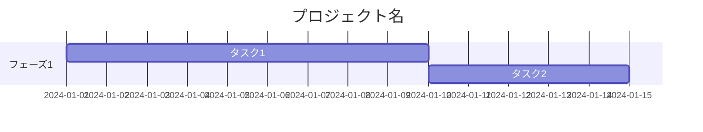
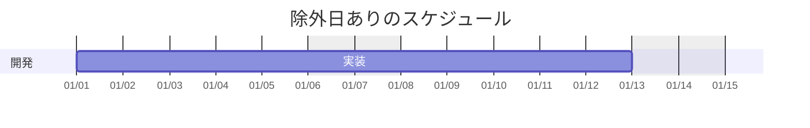
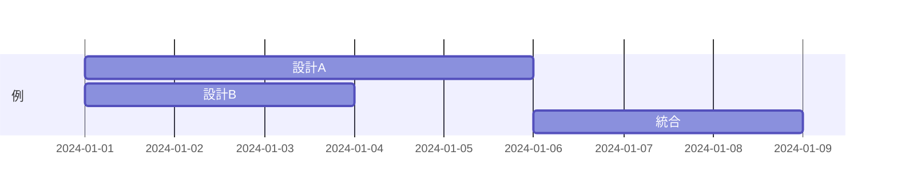
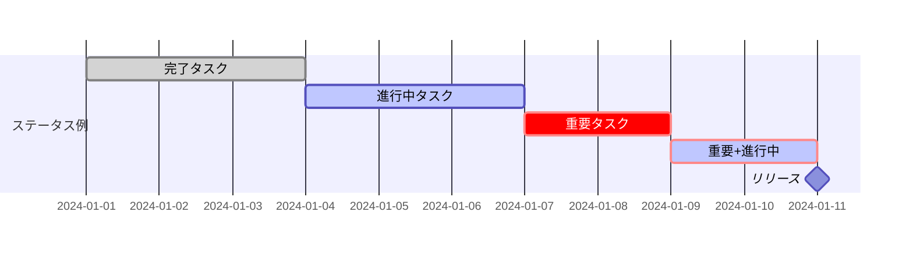
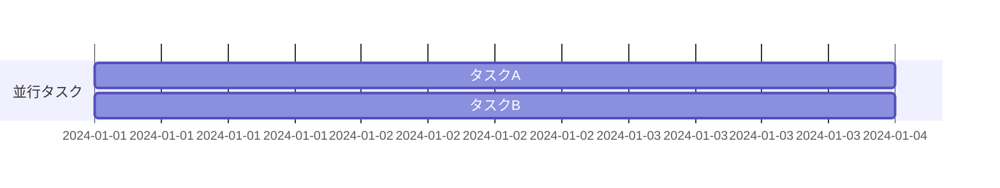
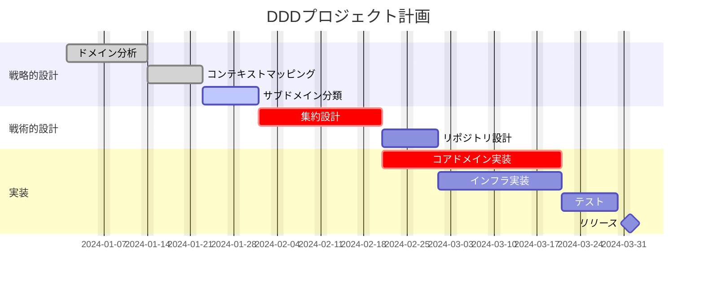
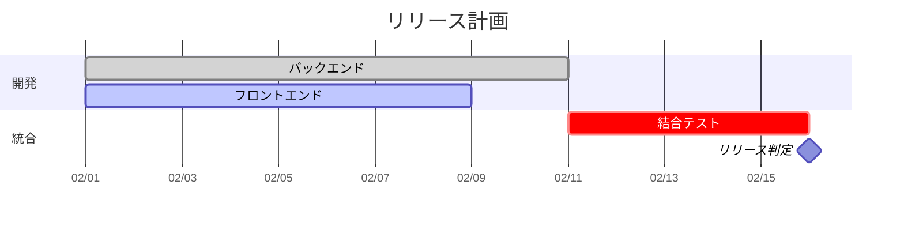
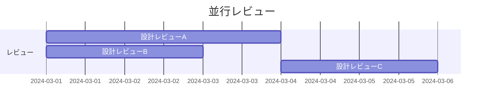

# ガントチャート（gantt）

## 概要

タスクの期間・依存関係・進捗をバーで表現するプロジェクト管理図。x軸が時間、y軸がタスクを表す。

## 使いどころ

- プロジェクトのスケジュール管理
- タスクの依存関係と並行作業の可視化
- フェーズ・マイルストーンの表示

## 使わないケース

- 時系列の出来事（期間が不要） → `timeline`
- 処理の順序 → `sequenceDiagram`

---

## 基本テンプレート



---

## トップレベル・ディレクティブ一覧

| ディレクティブ | 説明 | 必須 |
|---|---|---|
| `title` | チャート最上部のタイトル文字列 | 任意 |
| `dateFormat` | 入力する日付の形式を定義（例: `YYYY-MM-DD`） | 任意（既定あり） |
| `axisFormat` | 出力される軸の日付表示形式を定義（例: `%Y-%m-%d`） | 任意 |
| `tickInterval` | 軸目盛りの間隔（例: `1day`, `1week`, `1month`） | 任意 |
| `excludes` | 除外する日（`YYYY-MM-DD`・曜日名・`weekends`） | 任意 |
| `weekend` | `weekends`除外時に週末とみなす開始曜日（`friday`/`saturday`） | 任意 |
| `weekday` | 週の開始曜日（既定は`sunday`） | 任意 |
| `todayMarker` | 本日マーカーのスタイル指定、または`off`で非表示 | 任意 |
| `section` | チャートを複数の領域（フェーズ）に分割 | 任意 |



---

## タスク定義の全パターン

基本構文: `タスク名 : [修飾子] [ID], [開始指定], [終了指定]`

| パターン | 開始 | 終了 | ID |
|---|---|---|---|
| `id, startDate, endDate` | 絶対日付 | 絶対日付 | あり |
| `id, startDate, length` | 絶対日付 | 開始日+期間 | あり |
| `id, after otherId, endDate` | 他タスク終了後 | 絶対日付 | あり |
| `id, after otherId, length` | 他タスク終了後 | 開始日+期間 | あり |
| `id, startDate, until otherId` | 絶対日付 | 他タスクの開始日まで | あり |
| `id, after otherId, until otherId` | 他タスク終了後 | 他タスクの開始日まで | あり |
| `startDate, endDate` | 絶対日付 | 絶対日付 | なし |
| `startDate, length` | 絶対日付 | 開始日+期間 | なし |
| `after otherId, endDate` | 他タスク終了後 | 絶対日付 | なし |
| `after otherId, length` | 他タスク終了後 | 開始日+期間 | なし |
| `startDate, until otherId` | 絶対日付 | 他タスクの開始日まで | なし |
| `after otherId, until otherId` | 他タスク終了後 | 他タスクの開始日まで | なし |
| `endDate`（開始省略） | 直前タスクの終了後 | 絶対日付 | なし |
| `length`（開始省略） | 直前タスクの終了後 | 開始日+期間 | なし |
| `until otherId`（開始省略） | 直前タスクの終了後 | 他タスクの開始日まで | なし |

複数タスクへの依存は `after` にIDを列挙する（最も遅い終了日が採用される）。



---

## タスクのステータス修飾子

| 記法 | 意味 |
|---|---|
| なし | 未着手 |
| `active` | 進行中 |
| `done` | 完了 |
| `crit` | クリティカル（赤系で強調表示。他修飾子と併用可: `crit, active`） |
| `milestone` | マイルストーン（期間を持たない単一時点。終了日=開始日として扱われる） |



---

## 期間（length）の単位

| 単位 | 接尾辞 | 例 |
|---|---|---|
| ミリ秒 | `ms` | `500ms` |
| 秒 | `s` | `30s` |
| 分 | `m` | `30m` |
| 時間 | `h` | `4h` |
| 日 | `d` | `3d` |
| 週 | `w` | `2w` |
| 月 | `M` | `1M` |
| 年 | `y` | `1y` |

小数（例: `1.5d`）にも対応。

---

## dateFormat（入力日付）で使えるトークン

| トークン | 意味 |
|---|---|
| `YYYY` | 4桁年 |
| `YY` | 2桁年 |
| `Q` | 四半期 |
| `M` / `MM` | 月 |
| `MMM` / `MMMM` | 月名 |
| `D` / `DD` | 日 |
| `Do` | 序数付き日（1st等） |
| `X` | Unixタイムスタンプ |
| `H` / `HH` | 24時間表記 |
| `h` / `hh` | 12時間表記 |
| `a` / `A` | am/pm |
| `m` / `mm` | 分 |
| `s` / `ss` | 秒 |

## axisFormat（出力軸）で使えるトークン

| トークン | 意味 |
|---|---|
| `%a` | 曜日（短縮） |
| `%A` | 曜日（完全） |
| `%b` | 月名（短縮） |
| `%B` | 月名（完全） |
| `%d` | 日（0埋め） |
| `%e` | 日（空白埋め） |
| `%H` | 24時間 |
| `%I` | 12時間 |
| `%m` | 月 |
| `%Y` | 4桁年 |
| `%y` | 2桁年 |
| `%x` | ロケール日付表記 |
| `%X` | ロケール時刻表記 |

---

## その他の機能

- **コメント**: `%%` で始まる行はコメントとして無視される。
- **クリックインタラクション**:
  ```
  click taskId call callback(arguments)
  click taskId href "https://example.com"
  ```
  （`securityLevel: 'strict'` の場合は無効化される）
- **表示モード**: `displayMode compact` を宣言すると、重複しないタスクを同じ行にまとめて表示できる（公式ドキュメント記載の構文）。
  ⚠️ **動作確認済みの注意点**: Mermaid v11.16.0で実際に検証したところ、`displayMode compact`はdateFormatの直後・section後どちらに置いても`Parse error`（`Expecting 'taskData', got 'NL'`）でパースに失敗する（ドキュメントと実装が食い違っている既知の問題）。使用前に対象のMermaidバージョンで必ず表示確認すること。



---

## 実例

### 例1: DDDプロジェクトのスケジュール



### 例2: 複数依存とマイルストーン



### 例3: 並行タスク（複数依存の表現）


