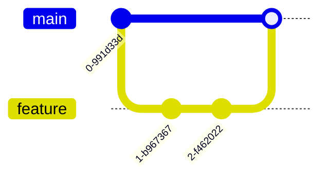
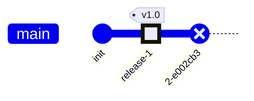
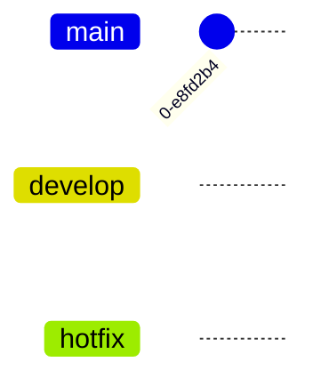
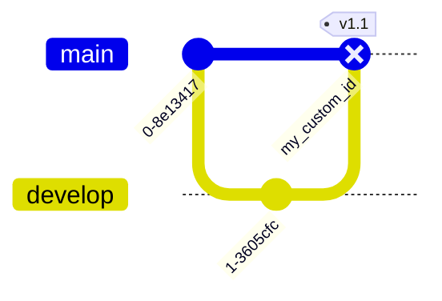
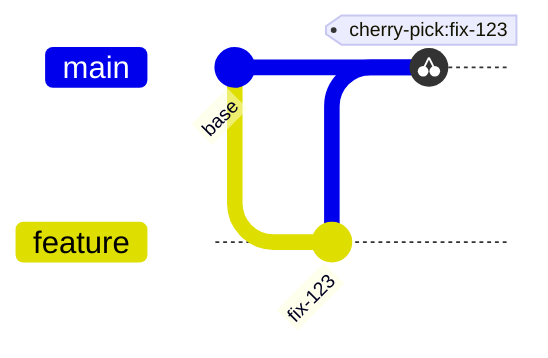
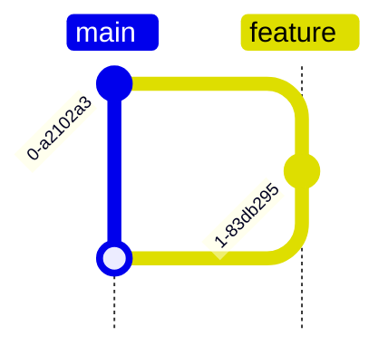
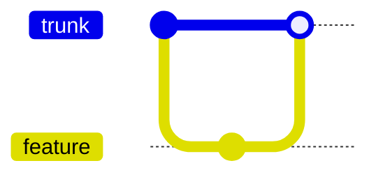
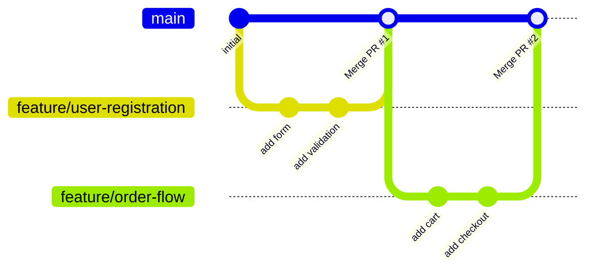
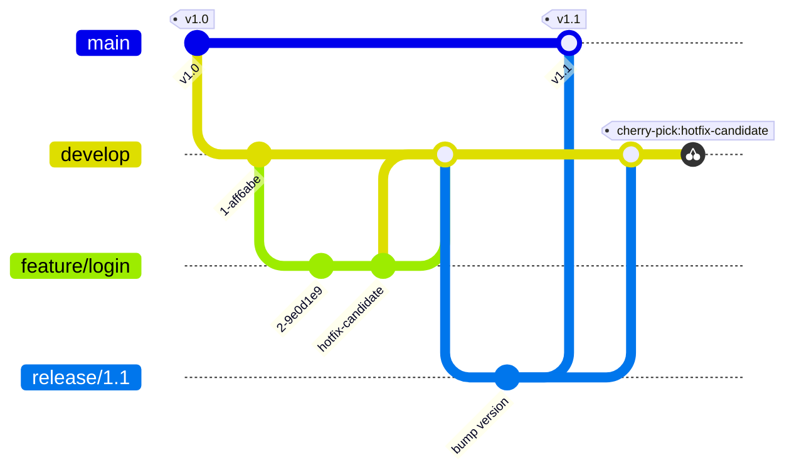
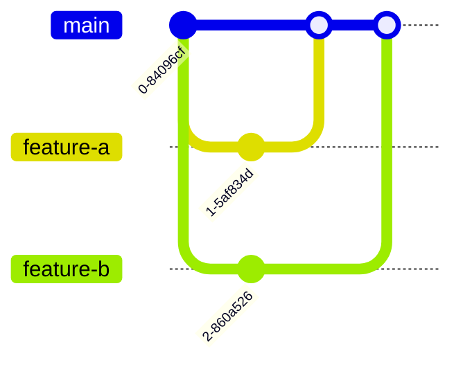

# Gitグラフ（gitGraph）

## 概要

Gitのコミット・ブランチ・マージといった操作（コマンド）を模した宣言的構文で、Git履歴を視覚化する図。

## 使いどころ

- ブランチ戦略の説明（Git Flow, GitHub Flow等）
- リリースフロー・開発フローの設計図
- マージ・チェリーピックの手順説明

## 使わないケース

- プロセスの流れ全般 → `flowchart`
- スケジュール → `gantt`

---

## 基本テンプレート

各図は `main` ブランチで初期化された状態から開始する。

---

## 主要コマンド一覧

| コマンド | 説明 |
|---|---|
| `commit` | 現在のブランチにコミットを追加 |
| `branch <name>` | 新しいブランチを作成し、現在のブランチとして設定 |
| `checkout <name>` / `switch <name>` | 既存ブランチへ切り替え（両者は同義で相互利用可） |
| `merge <name>` | 指定ブランチを現在のブランチへマージ |
| `cherry-pick id: "<commitId>"` | 他ブランチの特定コミットを現在のブランチへ適用 |

ブランチ名が予約語と衝突しうる場合（例: `cherry-pick`）は `branch "cherry-pick"` のように引用符で囲む。

---

## 各コマンドのオプション引数

### commit

| オプション | 説明 |
|---|---|
| `id: "文字列"` | コミットIDをカスタム指定 |
| `type: NORMAL / REVERSE / HIGHLIGHT` | コミットの見た目。既定は`NORMAL`（塗りつぶし円）。`REVERSE`は十字付き円、`HIGHLIGHT`は塗りつぶし四角 |
| `tag: "文字列"` | リリースバージョン等のタグを付与 |
| `msg: "文字列"` (内部的にcommit直後の文字列がmsgとして扱われる場合あり) | コミットメッセージ |

### branch

| オプション | 説明 |
|---|---|
| `order: N` | ブランチの表示順序を正の整数で指定 |

### checkout / switch

引数なし。ブランチ名のみ指定する。

### merge

| オプション | 説明 |
|---|---|
| `id: "文字列"` | マージコミットのIDをカスタム指定 |
| `tag: "文字列"` | マージコミットへタグを付与 |
| `type: NORMAL / REVERSE / HIGHLIGHT` | マージコミットの見た目を上書き |

### cherry-pick

| オプション | 説明 |
|---|---|
| `id: "文字列"`（必須） | チェリーピック対象の既存コミットID |
| `parent: "文字列"` | マージコミットをチェリーピックする場合に、どちらの親経由かを指定（必須） |
| `tag: "文字列"` | 付与するタグ |

制約: 対象コミットは現在のブランチに存在してはならない。現在のブランチは最低1つのコミットを持っている必要がある。

---

## 向き（Orientation）

| 記法 | 向き |
|---|---|
| `gitGraph LR:` または既定 | 左→右（コミットが左右、ブランチは上下に積層） |
| `gitGraph TB:` | 上→下（コミットが上下、ブランチは左右に配列） |
| `gitGraph BT:` | 下→上（コミットが下上、ブランチは左右に配列） |

---

## 設定オプション

| オプション | 説明 | 既定値 |
|---|---|---|
| `showBranches` | ブランチ名・ブランチ線の表示切り替え | `true` |
| `showCommitLabel` | コミットラベルの表示切り替え | `true` |
| `rotateCommitLabel` | コミットラベルを回転表示するか（`false`で水平表示） | `true` |
| `mainBranchName` | 既定ブランチ名の変更 | `main` |
| `mainBranchOrder` | メインブランチの表示位置 | `0` |
| `parallelCommits` | `true`で親から同じ距離のコミットを同レベル表示（時系列を厳密表示しない） | `false` |

これらは `%%{init: {"gitGraph": {...}}}%%` で設定する。

---

## テーマ・カラー変数

| 項目 | 変数 |
|---|---|
| 定義済みテーマ | `base` / `forest` / `dark` / `default` / `neutral` |
| ブランチ色（最大8色、以降は循環） | `git0` 〜 `git7` |
| ブランチラベル色 | `gitBranchLabel0` 〜 `gitBranchLabel7` |
| ハイライトコミット色 | `gitInv0` 〜 `gitInv7` |
| コミットラベル文字色/背景/フォントサイズ | `commitLabelColor` / `commitLabelBackground` / `commitLabelFontSize` |
| タグ文字色/背景/枠線/フォントサイズ | `tagLabelColor` / `tagLabelBackground` / `tagLabelBorder` / `tagLabelFontSize` |

ブランチの表示順は「メインブランチ（order=0）→ order未指定のブランチ（定義順）→ order指定のブランチ（値の昇順）」で決まる。

---

## 実例

### 例1: GitHub Flow

### 例2: Git Flow（タグ・cherry-pick付き）

### 例3: 並行コミット表示（parallelCommits）

