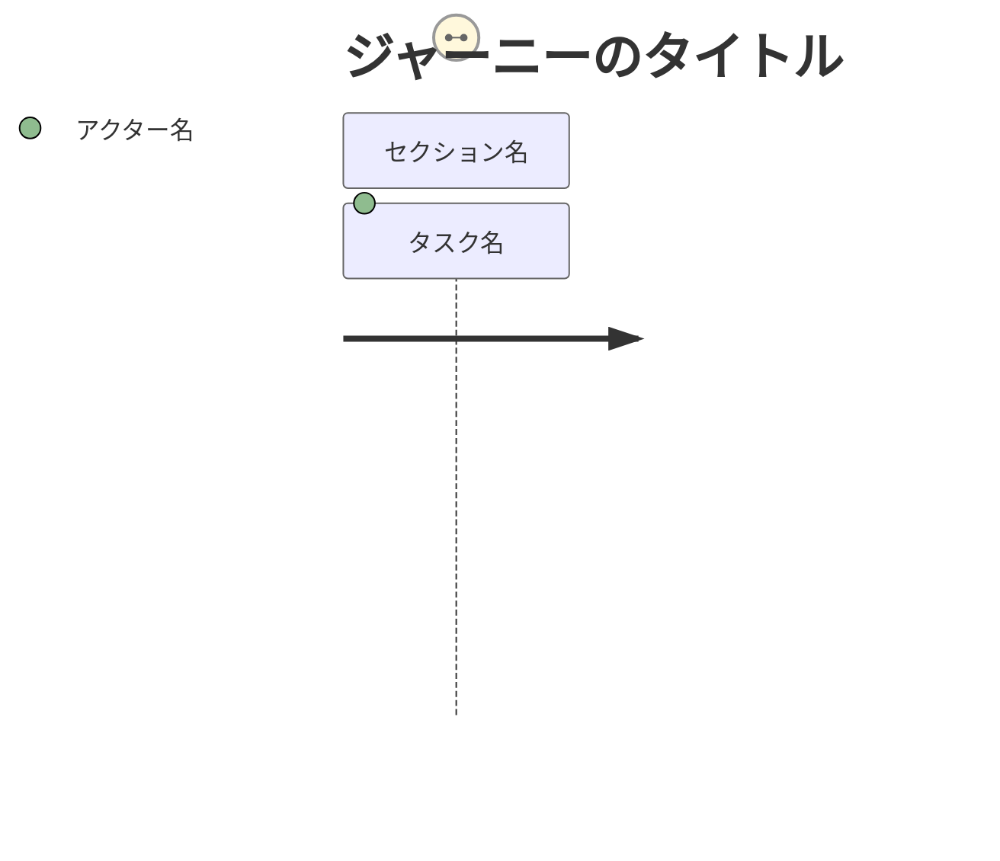
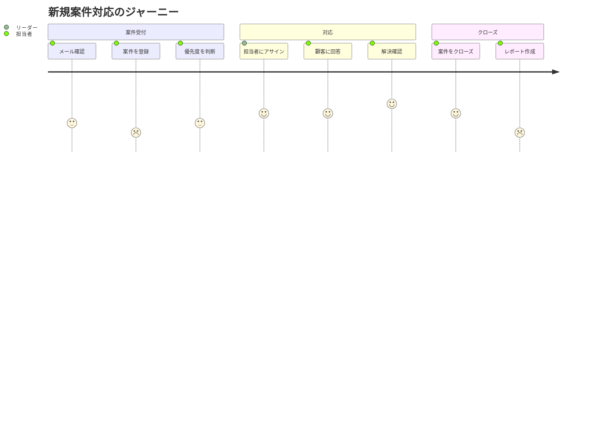
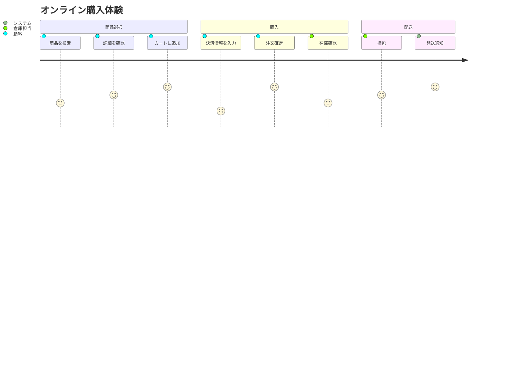
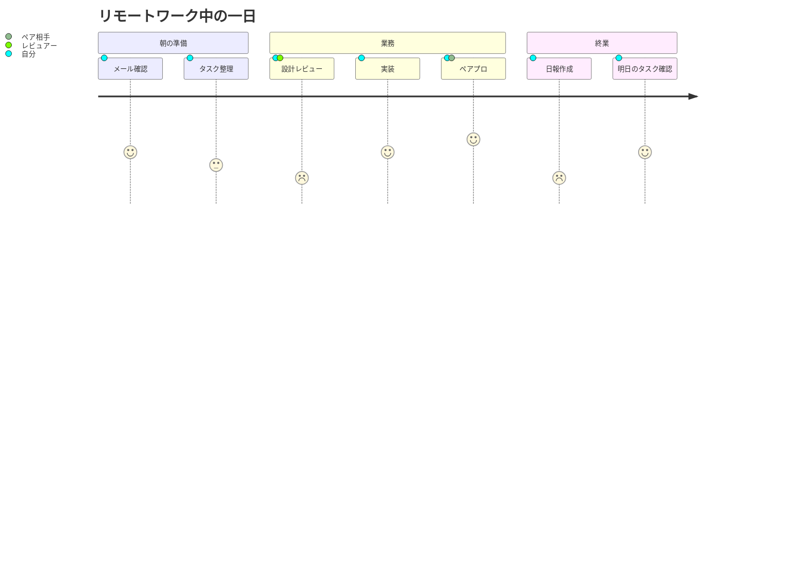

# ユーザージャーニー（journey）

## 概要

ユーザーが目標を達成するまでの体験の流れを、セクションで区切ったタスクの並びと、各タスクに対する満足度スコア・担当アクターとともに表現する図。「現状（as-is）のユーザーワークフロー」を可視化し、改善余地を洗い出す目的で使われる。

公式ドキュメント（https://mermaid.js.org/syntax/userJourney.html）に記載されている構文はシンプルで、以下がすべてである（config・テーマ変数・アイコン指定などの追加オプションはこのページには記載されていない）。

## 使いどころ

- ユーザー体験（UX）の可視化
- 業務フローの「つらさ」の見える化（スコアの低いタスクが改善対象）
- 複数アクター（担当者・システムなど）が関与するタスクの整理
- 改善ポイントの特定

## 使わないケース

- システム間の処理順序・メッセージのやり取り → `sequenceDiagram`
- 状態の変化（ライフサイクル） → `stateDiagram-v2`
- 時系列の出来事の羅列（スコア不要） → `timeline`

---

## 基本テンプレート



---

## 構文一覧

| 構文要素 | 書式 | 説明 |
|---|---|---|
| 図の宣言 | `journey` | 1行目に必須 |
| タイトル | `title <テキスト>` | 図全体のタイトル（省略可） |
| セクション | `section <セクション名>` | タスクをグルーピングする見出し。複数定義可 |
| タスク行 | `<タスク名>: <スコア>: <アクター1>, <アクター2>, ...` | コロン区切りで「タスク名・スコア・アクター（カンマ区切りで複数可）」を指定 |
| スコア | `1`〜`5`の整数（inclusive） | 満足度・体験の良し悪しを表す。値が小さいほど低評価 |
| 複数アクター | `タスク名: スコア: 担当A, 担当B` | 同じタスクに複数のアクターが関与する場合、カンマで並べる（例: `Do work: 1: Me, Cat`） |

### 各構文要素の具体例

**title**
```
journey
    title My working day
```

**section とタスク**
```
journey
    title My working day
    section Go to work
      Make tea: 5: Me
      Go upstairs: 3: Me
      Do work: 1: Me, Cat
    section Go home
      Go downstairs: 5: Me
      Sit down: 5: Me
```
（公式ドキュメント記載のサンプルそのまま。`Do work` タスクには `Me` と `Cat` の2アクターが割り当てられている）

**スコアのみを変えた例**
```
journey
    section 単独タスクの例
      承認依頼を送る: 2: 申請者
```

> 注意: このページには `journey` 専用の config／テーマ変数（アクターごとの色指定など）は明記されていない。表示色はレンダラ側のテーマに依存する。

---

## 実例

### 例1: ヘルプデスク担当者のジャーニー



### 例2: 複数アクターの比較



### 例3: 複数アクターが同一タスクに関与する例


