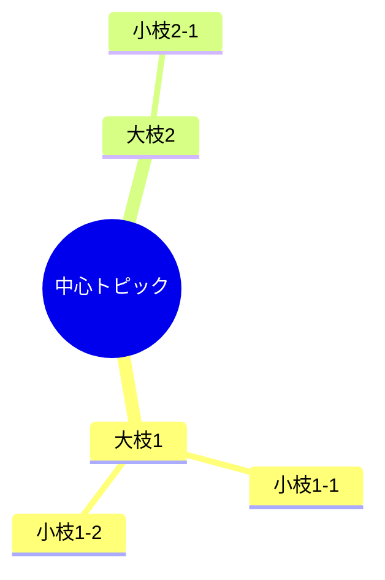
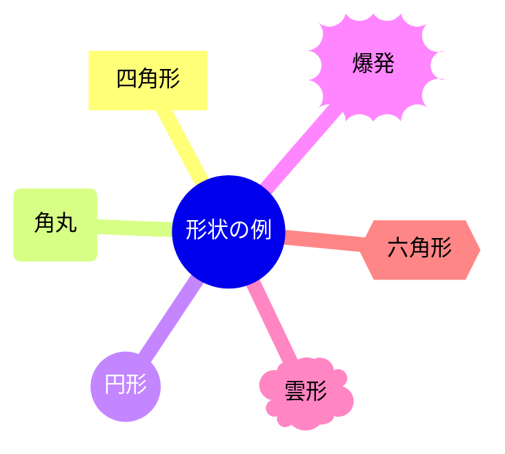
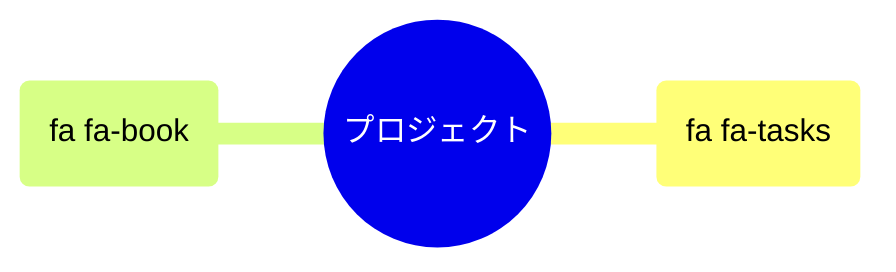
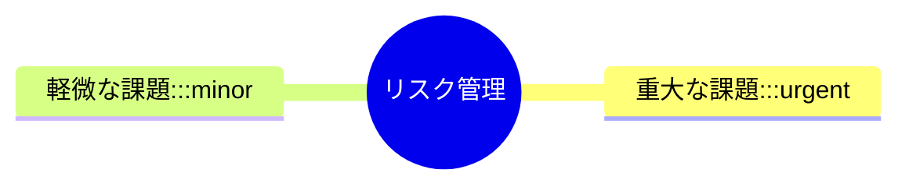
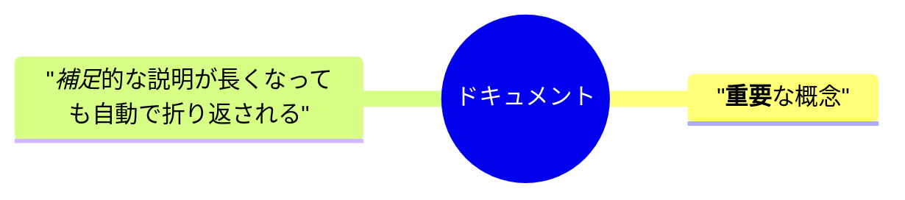
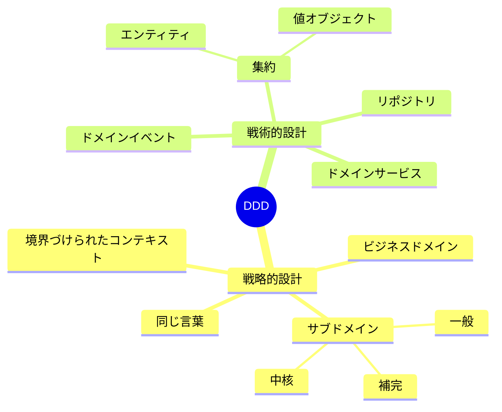
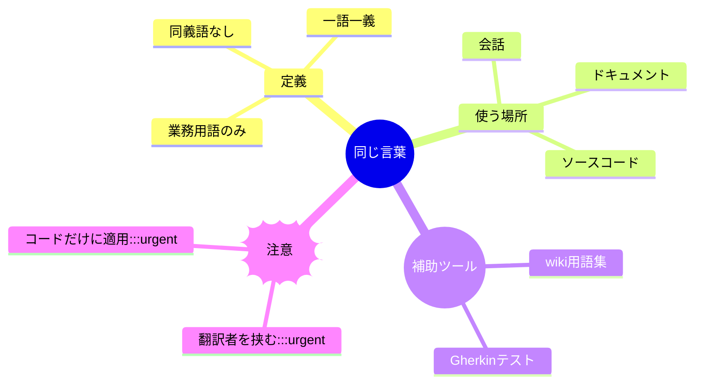
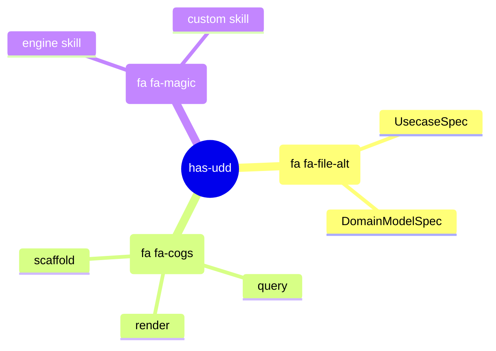

# マインドマップ（mindmap）

## 概要

中心トピックから放射状に枝分かれする階層構造の図。インデントで階層を表現するシンプルなテキストアウトライン形式。概念の全体像・関係性を俯瞰するのに適している。

## 使いどころ

- 概念・知識の全体像を俯瞰する
- ブレインストーミングの整理
- ドメインの概念マップ（concept-map）

## 使わないケース

- 順序・フローが重要 → `flowchart`
- 関係の方向が重要 → `flowchart` or `sequenceDiagram`

---

## 基本テンプレート



インデント幅（スペース数）の深さで親子関係を表現する。ルートノードは慣例として `root` というIDに `(())` の二重円形状を付ける。

---

## ノードの記法

ノードは `id形状(テキスト)` の形で書く。IDは省略可能で、省略時はテキストがそのままノード名になる。

| 記法 | 形状 | 例 |
|---|---|---|
| `text` | デフォルト（角丸の既定形） | `育児` |
| `id(text)` | 角丸四角（rounded square） | `a(概要)` |
| `id[text]` | 四角形（square） | `b[詳細]` |
| `id((text))` | 円形（circle） | `root((中心))` |
| `id))text((` | 雲形風・bang（爆発形） | `c))重要((` |
| `id)text(` | 雲形（cloud） | `d)アイデア(` |
| `id{{text}}` | 六角形（hexagon） | `e{{条件}}` |



---

## アイコン指定（実験的機能）

`::icon(クラス名)` でノードに Font Awesome や Material Design 等のアイコンを付与できる。構文・対応は将来変更される可能性がある実験的機能。



---

## クラス（スタイル）指定

`:::クラス名` （トリプルコロン、スペース区切りで複数指定可）でCSSクラスを付与し見た目をカスタマイズできる。



```
classDef urgent fill:#f00,color:#fff
classDef minor fill:#eee
```
（クラス定義はflowchart等と同様に `classDef` で行う）

---

## Markdown文字列サポート

ノードテキストを `"..."` で囲むと、太字（`**text**`）・イタリック（`*text*`）に対応し、長いテキストは自動的に折り返される（`<br>`タグを使わずに改行できる）。



---

## 実例

### 例1: DDDの概念マップ



### 例2: ユビキタス言語の概念マップ（形状・クラス使用）



### 例3: アイコン付きロードマップ俯瞰


