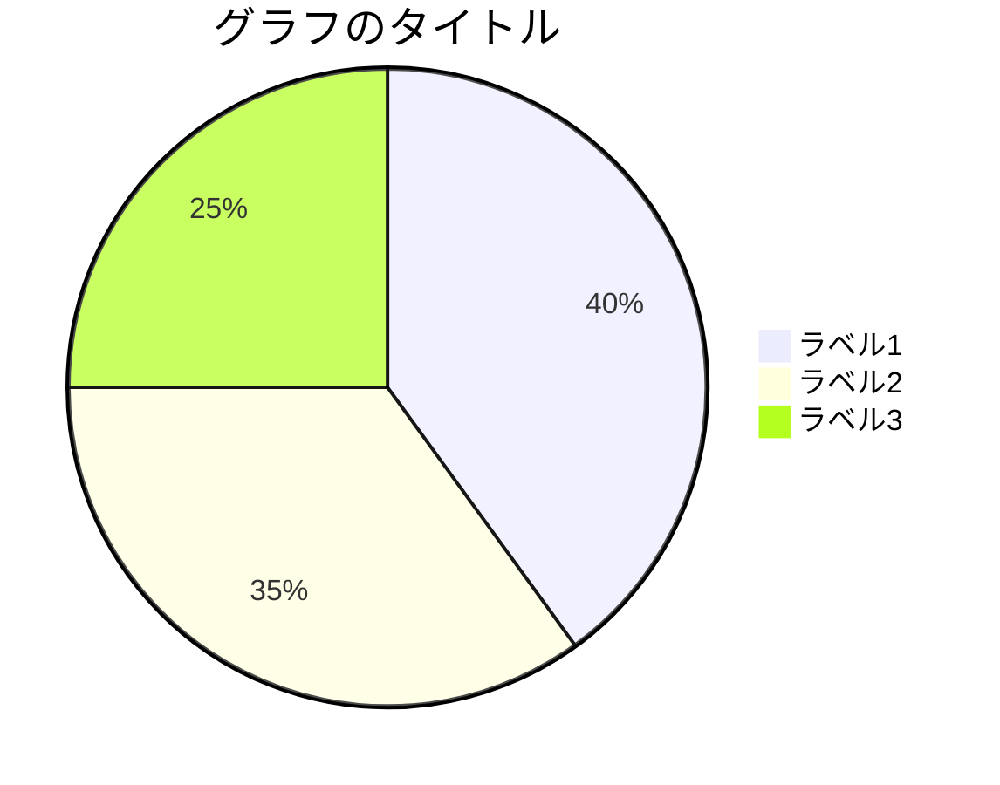
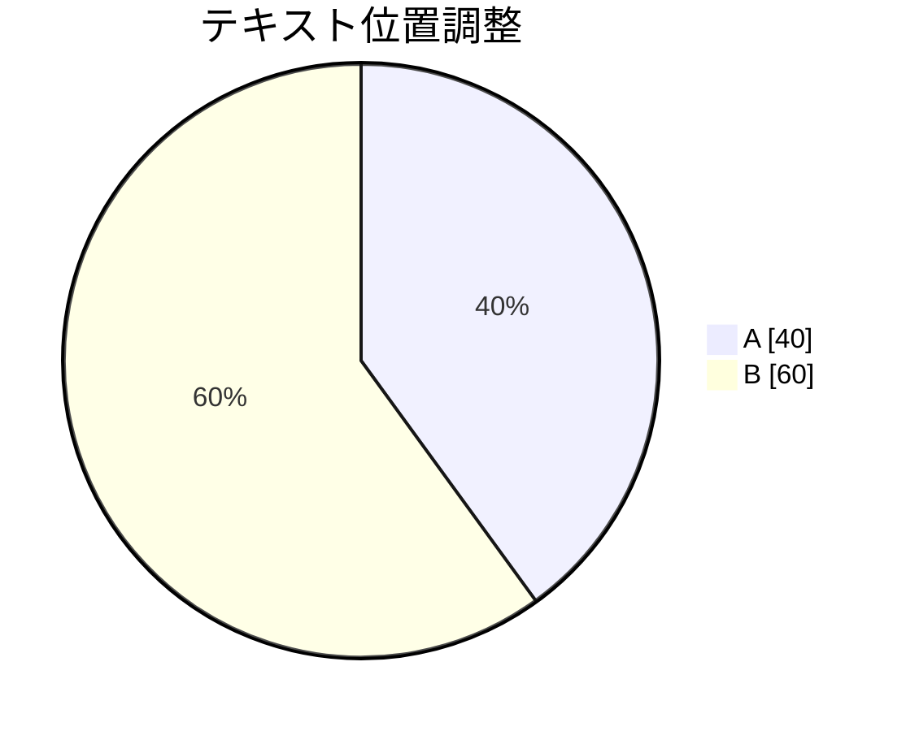
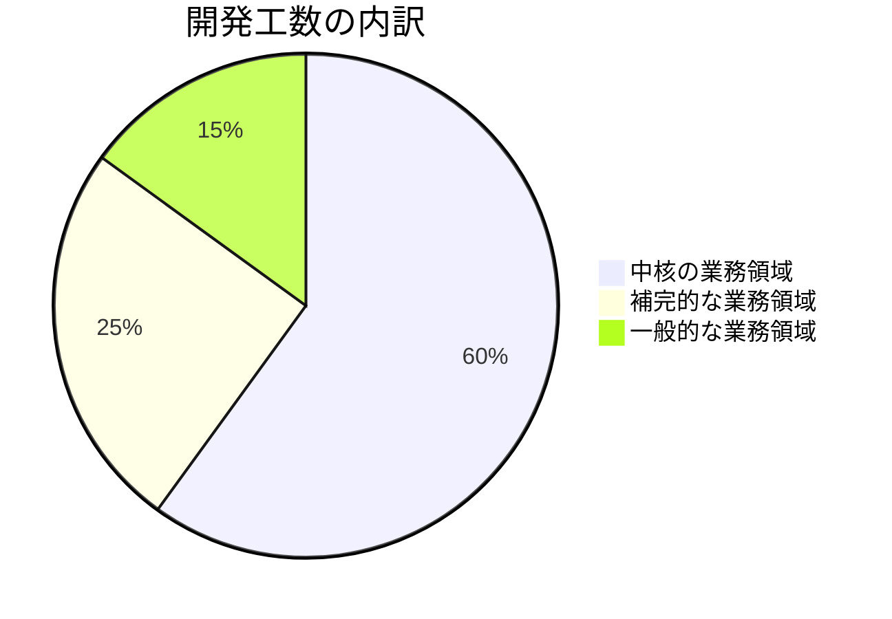
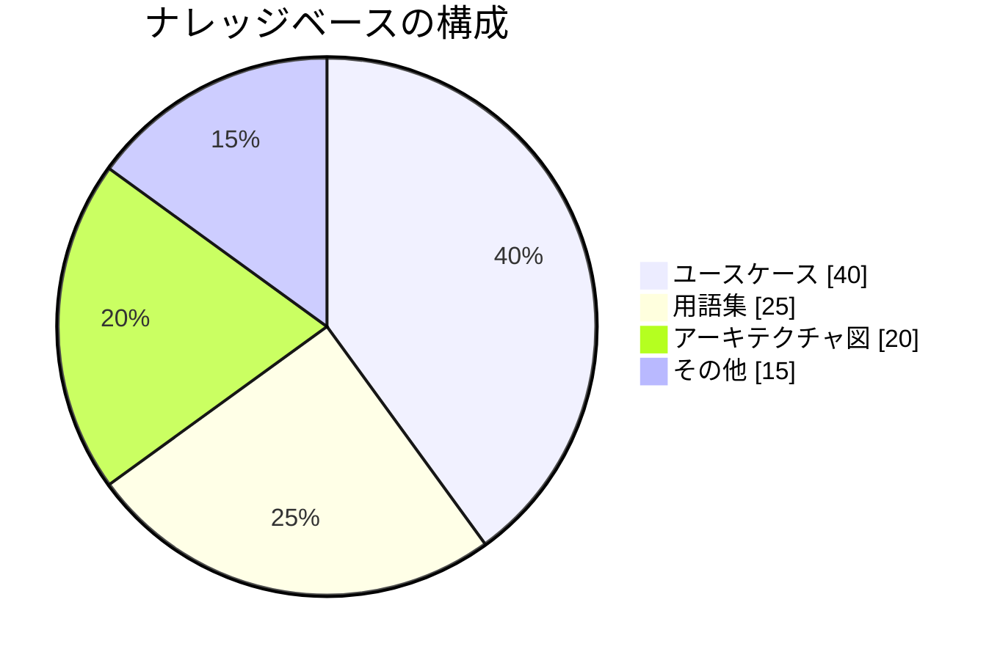
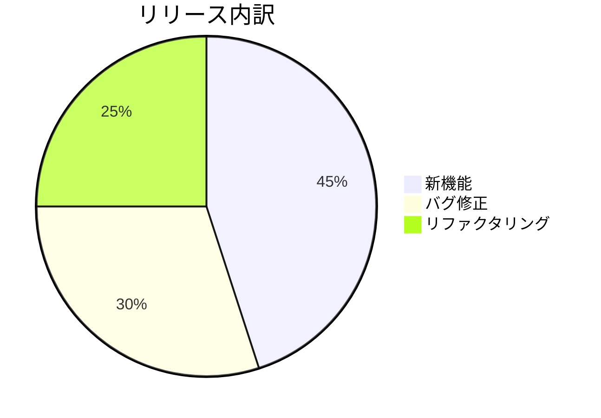

# 円グラフ（pie）

## 概要

全体に対する各要素の割合を扇形で表現する図（circular statistical graphic）。値は指定順に時計回りで配置される。

## 使いどころ

- カテゴリ別の構成比（業務領域の割合など）
- リソース配分・工数の内訳
- 集計データの可視化

## 使わないケース

- 要素間の関係・順序が重要 → `flowchart`
- 時系列の変化 → `xychart-beta`
- 要素が6個以上で見分けにくい → テーブル形式を検討
- マイナス値・ゼロ値を含む → 円グラフでは表現不可（正の数値のみ許容）

---

## 基本テンプレート



値は数値（割合ではなく量）で指定する。合計に対する割合が自動的に計算され、扇形として描画される。

---

## 構文要素

```
pie [showData] [title タイトル文字列]
    "ラベル1" : 値1
    "ラベル2" : 値2
```

| 要素 | 説明 |
|---|---|
| `pie` | 図の開始キーワード（必須） |
| `showData` | 凡例の後ろに実際の数値を表示するオプション修飾子 |
| `title タイトル文字列` | 図全体のタイトル（任意） |
| `"ラベル" : 値` | データ項目。ラベルは必ずダブルクォートで囲む |

### 値の制約

- 正の数値のみ許容（**0以下・負の値はエラー**）
- 小数点以下2桁まで指定可能（例: `12.34`）
- 記述順にクロックワイズ（時計回り）でスライスが配置される

---

## 設定オプション（v11.16.0以降）

| パラメータ | 説明 | 既定値 |
|---|---|---|
| `textPosition` | スライスラベルの半径方向の位置（0.0=中心 〜 1.0=外縁） | `0.75` |
| `donutHole` | ドーナツ状にくり抜く穴の比率（`0`〜`0.9`） | `0`（穴なし＝通常の円グラフ） |
| `legendPosition` | 凡例の配置（`top` / `bottom` / `left` / `right` / `center`） | `right` |
| `highlightSlice` | 特定のスライスを強調表示 | なし |

これらは `%%{init: {...}}%%` ディレクティブや設定オブジェクトの `pie` キーで指定する。



---

## 実例

### 例1: 開発工数の内訳



### 例2: ドキュメントの種類別割合（数値表示付き）



### 例3: ドーナツ型（v11.16.0以降）


