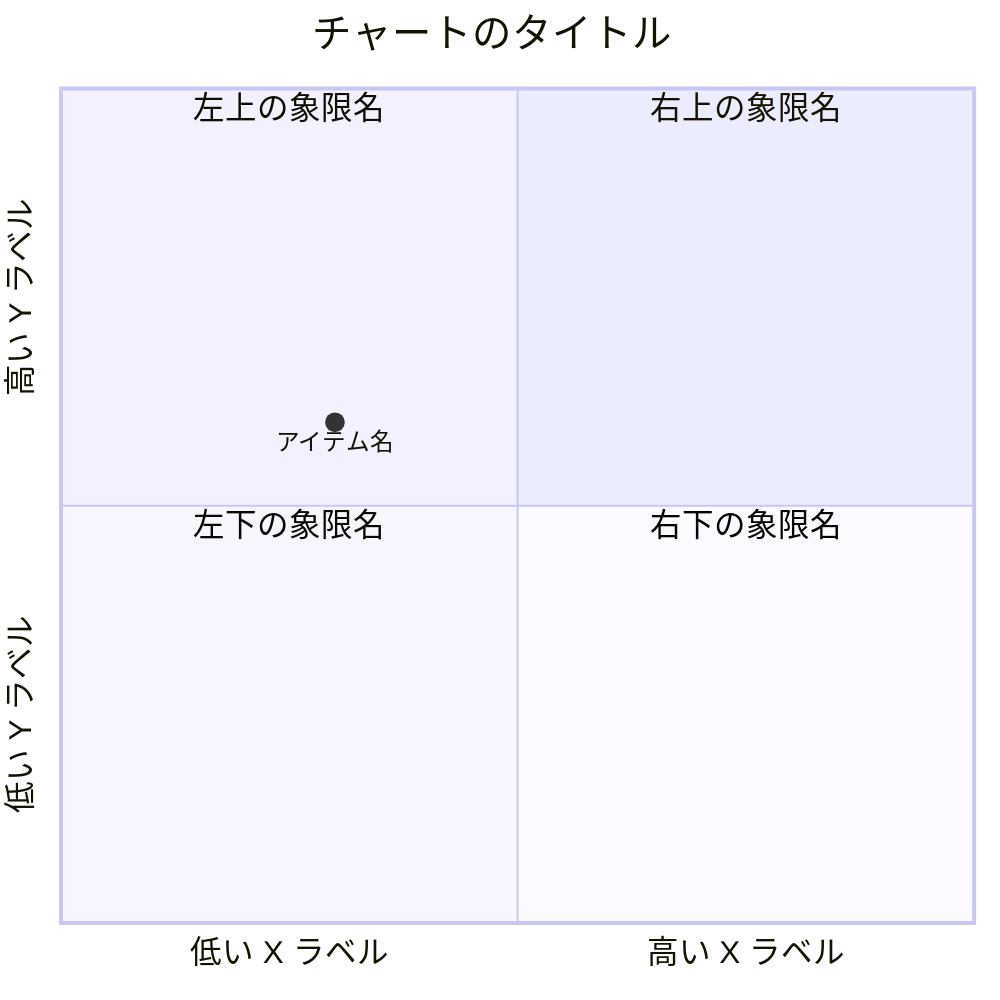
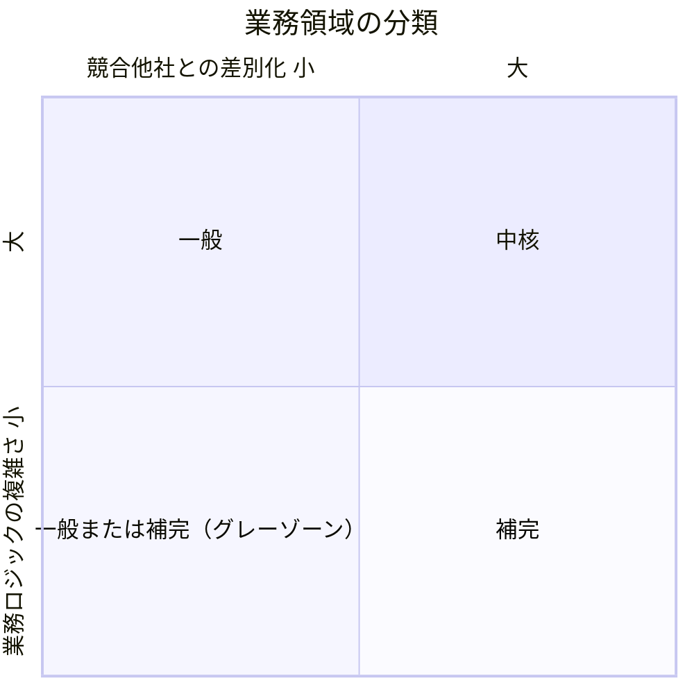
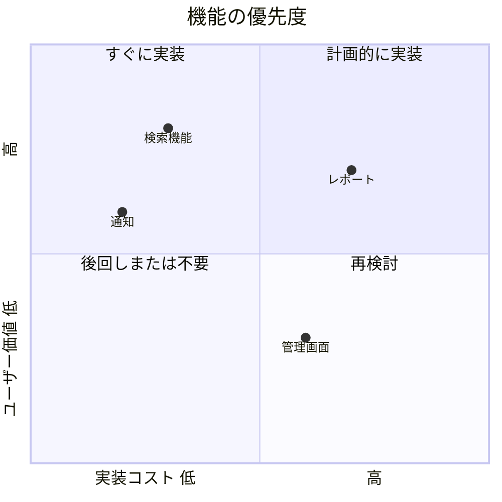
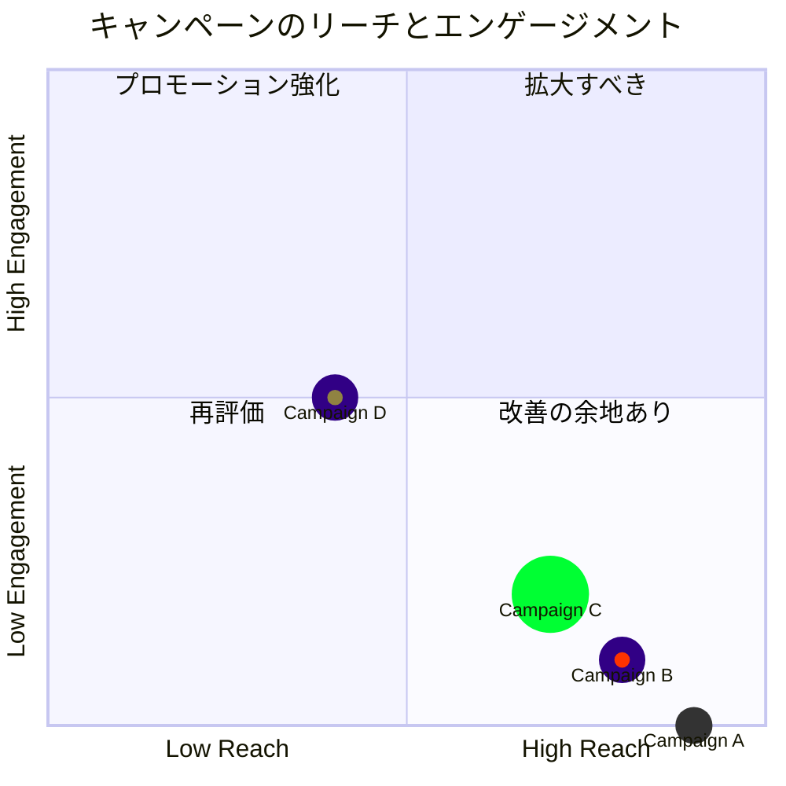

# 象限チャート（quadrantChart）

## 概要

X軸・Y軸の2軸でプロットエリアを4象限に分割し、各要素（ポイント）を座標 `[x, y]`（0.0〜1.0の範囲）でプロットする図。2つの評価軸でアイテムを分類・比較するときに使う。beta表記ではなく正式構文（公式ドキュメントに beta 注記なし）。

参照: https://mermaid.js.org/syntax/quadrantChart.html

## 使いどころ

- 2軸の分類マトリクス（複雑さ vs 競争優位 など）
- ポートフォリオ分析・優先度マッピング（例: アイゼンハワーマトリクス「緊急度×重要度」）
- DDDのサブドメイン分類（中核・一般・補完）

## 使わないケース

- 軸が1つ → `pie` or `xychart-beta`
- 個々の要素に詳細な情報が必要 → `flowchart` + ノード
- 要素数が多く座標管理が煩雑 → テーブル形式を検討

---

## 基本テンプレート



座標は `0`〜`1` の範囲で指定する。

象限の番号（固定）：
- `quadrant-1` : 右上（X大、Y大）
- `quadrant-2` : 左上（X小、Y大）
- `quadrant-3` : 左下（X小、Y小）
- `quadrant-4` : 右下（X大、Y小）

---

## 構文一覧

| 構文要素 | 書式 | 説明 |
|---|---|---|
| 図の宣言 | `quadrantChart` | 1行目に必須 |
| タイトル | `title <テキスト>` | 図全体のタイトル |
| x軸（両端） | `x-axis <左テキスト> --> <右テキスト>` | 左右両方のラベルを描画 |
| x軸（片側） | `x-axis <左テキスト>` | 左ラベルのみ描画（右は空） |
| y軸（両端） | `y-axis <下テキスト> --> <上テキスト>` | **下→上**の順で指定する点に注意（x軸は左→右） |
| y軸（片側） | `y-axis <下テキスト>` | 下ラベルのみ描画 |
| 象限ラベル | `quadrant-1 <テキスト>` 〜 `quadrant-4 <テキスト>` | 右上/左上/左下/右下 の順で固定 |
| データポイント（基本） | `<ラベル>: [x, y]` | x, y は 0〜1 の範囲 |
| データポイント（直接スタイル） | `<ラベル>: [x, y] color: #hex, radius: N, stroke-width: Npx, stroke-color: #hex` | ポイント単位でスタイル上書き |
| データポイント（クラス指定） | `<ラベル>:::<クラス名>: [x, y]` | `classDef` で定義したスタイルを適用 |
| クラス定義 | `classDef <クラス名> color: #hex, radius: N, stroke-color: #hex, stroke-width: Npx` | 複数ポイントへ共通スタイルを再利用 |
| config（frontmatter） | `---\nconfig:\n  quadrantChart:\n    <プロパティ>: <値>\n---` | 図全体のレイアウト調整 |
| テーマ変数（frontmatter） | `---\nconfig:\n  themeVariables:\n    <変数名>: <値>\n---` | 色などのテーマ上書き |
| スタイル優先順位 | 直接スタイル ＞ クラススタイル ＞ テーマスタイル | 公式ドキュメント記載の適用順 |

### x-axis / y-axis の具体例

```
x-axis Low Reach --> High Reach
y-axis Low Engagement --> High Engagement
```

```
x-axis 実装コスト 低
```
（右ラベルを省略した片側指定）

### quadrant-1〜4 の具体例

```
quadrant-1 We should expand
quadrant-2 Need to promote
quadrant-3 Re-evaluate
quadrant-4 May be improved
```

### データポイントの具体例

```
Campaign A: [0.3, 0.6]
Campaign B: [0.8, 0.1] color: #ff3300, radius: 10
Campaign C: [0.7, 0.2] radius: 25, color: #00ff33, stroke-color: #10f0f0
Campaign D: [0.6, 0.3] radius: 15, stroke-color: #00ff0f, stroke-width: 5px, color: #ff33f0
```

### クラススタイルの具体例

```
Campaign E:::class1: [0.5, 0.4]
Campaign F:::class2: [0.4, 0.5]
classDef class1 color: #109060
classDef class2 color: #908342, radius: 10, stroke-color: #310085, stroke-width: 10px
```

### ポイントスタイルで指定可能なプロパティ

| プロパティ | 説明 |
|---|---|
| `color` | ポイントの塗り色 |
| `radius` | ポイントの半径 |
| `stroke-width` | ポイント外周の線幅 |
| `stroke-color` | ポイント外周の色（`stroke-width` 未指定時は無効） |

### config（quadrantChartConfig）主要プロパティ

| プロパティ | 説明 | デフォルト |
|---|---|---|
| `chartWidth` | チャート幅 | 500 |
| `chartHeight` | チャート高さ | 500 |
| `titlePadding` | タイトルの上下パディング | 10 |
| `titleFontSize` | タイトルのフォントサイズ | 20 |
| `quadrantPadding` | 4象限全体の外側パディング | 5 |
| `quadrantTextTopPadding` | ポイントが無い場合の象限テキスト上部パディング | 5 |
| `quadrantLabelFontSize` | 象限テキストのフォントサイズ | 16 |
| `quadrantInternalBorderStrokeWidth` | 象限内部境界線の太さ | 1 |
| `quadrantExternalBorderStrokeWidth` | 象限外周境界線の太さ | 2 |
| `xAxisLabelPadding` | x軸テキストの上下パディング | 5 |
| `xAxisLabelFontSize` | x軸テキストのフォントサイズ | 16 |
| `xAxisPosition` | x軸位置（`top`/`bottom`。ポイントがある場合は常に`bottom`扱い） | `'top'` |
| `yAxisLabelPadding` | y軸テキストの左右パディング | 5 |
| `yAxisLabelFontSize` | y軸テキストのフォントサイズ | 16 |
| `yAxisPosition` | y軸位置（`left`/`right`） | `'left'` |
| `pointTextPadding` | ポイントとその下のテキスト間のパディング | 5 |
| `pointLabelFontSize` | ポイントテキストのフォントサイズ | 12 |
| `pointRadius` | ポイントの半径（デフォルト値） | 5 |

### テーマ変数（themeVariables）主要一覧

| 変数名 | 説明 |
|---|---|
| `quadrant1Fill` 〜 `quadrant4Fill` | 各象限の塗り色 |
| `quadrant1TextFill` 〜 `quadrant4TextFill` | 各象限テキストの色 |
| `quadrantPointFill` | ポイントの塗り色 |
| `quadrantPointTextFill` | ポイントテキストの色 |
| `quadrantXAxisTextFill` | x軸テキストの色 |
| `quadrantYAxisTextFill` | y軸テキストの色 |
| `quadrantInternalBorderStrokeFill` | 象限内部境界線の色 |
| `quadrantExternalBorderStrokeFill` | 象限外周境界線の色 |
| `quadrantTitleFill` | タイトルの色 |

### frontmatter での config + テーマ変数の指定例

```
---
config:
  quadrantChart:
    chartWidth: 400
    chartHeight: 400
  themeVariables:
    quadrant1TextFill: "ff0000"
---
quadrantChart
  x-axis Urgent --> Not Urgent
  y-axis Not Important --> "Important"
  quadrant-1 Plan
  quadrant-2 Do
  quadrant-3 Delegate
  quadrant-4 Delete
```

> 補足: ポイントが1つも無い場合、軸テキストと象限テキストは各象限の中央に描画される。ポイントがある場合、x軸ラベルは各象限左端かつチャート下部に、y軸ラベルは各象限下部に、象限テキストは各象限上部に描画される（公式ドキュメントの注記）。

---

## 実例

### 例1: サブドメイン分類



### 例2: 機能の優先度マッピング



### 例3: ポイント個別スタイル＋クラススタイルの併用


