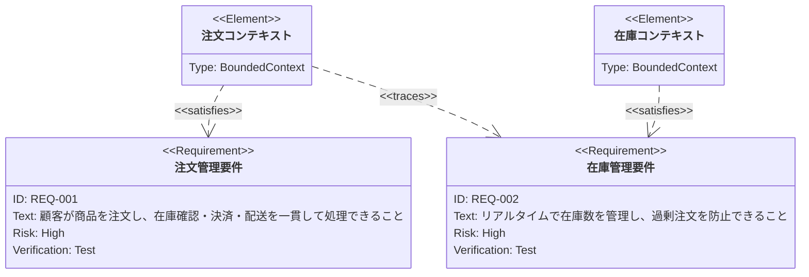
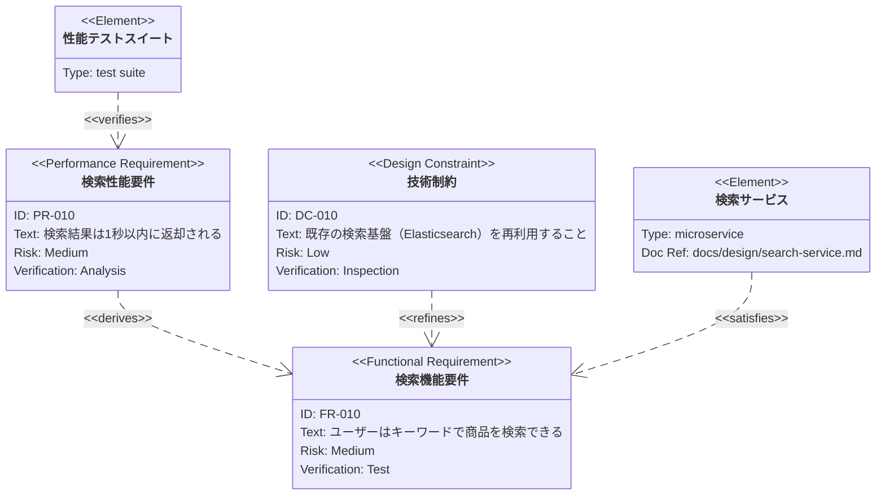
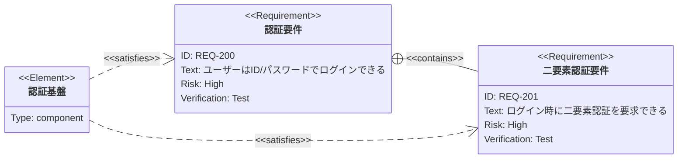

# 要件図（requirementDiagram）

参照: https://mermaid.js.org/syntax/requirementDiagram.html

## 概要

要件（requirement）とシステム要素（element：コンポーネント・テスト・仕様書等）の関係を表現する図。要件がどの要素によってどう満たされる／トレースされる／派生するかを可視化し、要件トレーサビリティを表現する。

## 使いどころ

- 要件とコンポーネントのトレーサビリティ（どの実装/テストがどの要件を満たすか）
- 要件の充足状況・依存関係の可視化
- ドメイン要件とサービス/コンテキスト（bounded context等）の対応関係

## 使わないケース

- 処理フロー・手順 → `flowchart` or `sequenceDiagram`
- 設計レベルのクラス構造 → `classDiagram`
- インフラ構成 → `architecture-beta`

---

## 基本テンプレート

```
requirementDiagram

    requirement 要件名 {
        id: 番号
        text: 要件の説明
        risk: high
        verifymethod: test
    }

    element 要素名 {
        type: 要素の種類
    }

    要素名 - satisfies -> 要件名
```

---

## 構文要素 網羅表

### 要件（requirement）の種類

| キーワード | 意味 |
|---|---|
| `requirement` | 一般的な要件 |
| `functionalRequirement` | 機能要件 |
| `interfaceRequirement` | インターフェース要件 |
| `performanceRequirement` | 性能要件 |
| `physicalRequirement` | 物理要件 |
| `designConstraint` | 設計制約 |

いずれも定義構文は共通で、種類（キーワード）だけが異なる。

⚠️ **日本語等の非ASCII文字を要件名・要素名・id・textに使う場合は必ずダブルクォートで囲む**（`requirement "注文管理要件" {`・`id: "REQ-001"`。ハイフンを含むid（`REQ-001`等）も無クォートだとレクサエラーになる）。関係の記法（`- satisfies ->`等）や`class`文で参照する際も、定義時と同じ引用符付き文字列で書く。

### 要件のプロパティ

| プロパティ | 説明 | 許容値 |
|---|---|---|
| `id` | 要件の識別子 | 任意の文字列 |
| `text` | 要件の説明文 | 任意の文字列 |
| `risk` | リスクレベル | `low` / `medium` / `high` |
| `verifymethod` | 検証方法 | `analysis` / `inspection` / `test` / `demonstration` |

要件定義の構文:
```
<requirement種別> 要件名 {
    id: 任意のID
    text: 要件テキスト
    risk: <risk値>
    verifymethod: <verifymethod値>
}
```

### 要素（element）の構文とプロパティ

| プロパティ | 説明 |
|---|---|
| `type` | 要素の種類（自由記述。例: `BoundedContext`, `simulation`, `test suite` 等） |
| `docref` | 参照ドキュメントへの識別子/リンク（自由記述） |

```
element 要素名 {
    type: 要素の種類
    docref: 参照先
}
```

### 関係の種類（要素→要件、または要件→要件）

| 記法 | 意味 |
|---|---|
| `- contains ->` | 要件が別の要件を含む（親子関係） |
| `- copies ->` | 要件をコピーする |
| `- derives ->` | 要件から派生する |
| `- satisfies ->` | 要素が要件を満たす |
| `- verifies ->` | 要素が要件を検証する |
| `- refines ->` | 要件を詳細化・精緻化する |
| `- traces ->` | 要素/要件が要件にトレースされる（緩い関連） |

矢印の向きは反転させて書くこともできる:
```
{destination} <- <関係種別> - {source}
```

### direction（描画方向）

| 値 | 意味 |
|---|---|
| `TB`（デフォルト） | 上から下 |
| `BT` | 下から上 |
| `LR` | 左から右 |
| `RL` | 右から左 |

```
requirementDiagram
    direction LR
    ...
```

### スタイリング

| 方法 | 構文 | 説明 |
|---|---|---|
| インラインスタイル | `style 要素名 fill:#f9f,stroke:#333` | 個別ノードへの直接スタイル指定 |
| クラス定義 | `classDef クラス名 fill:#f9f,stroke:#333` | 再利用可能なスタイルクラスを定義 |
| クラス適用（複数対象） | `class 要件名1,要件名2 クラス名` | 定義済みクラスを複数ノードへ適用 |
| クラス適用（ショートハンド） | `要件名:::クラス名` | 単一ノード宣言時にクラスを同時付与 |

---

## 各構文要素の具体例

### 要件種別ごとの定義

```
requirementDiagram
    functionalRequirement 検索機能 {
        id: FR-001
        text: ユーザーはキーワードで商品を検索できる
        risk: medium
        verifymethod: test
    }
    interfaceRequirement API連携 {
        id: IR-001
        text: 外部決済APIと連携できる
        risk: high
        verifymethod: demonstration
    }
    performanceRequirement 応答性能 {
        id: PR-001
        text: 検索結果は1秒以内に返却される
        risk: medium
        verifymethod: analysis
    }
    physicalRequirement サーバー配置 {
        id: PHR-001
        text: 東京リージョンにサーバーを配置する
        risk: low
        verifymethod: inspection
    }
    designConstraint 技術制約 {
        id: DC-001
        text: 既存の認証基盤を再利用すること
        risk: low
        verifymethod: inspection
    }
```

### element と docref

```
requirementDiagram
    element 検索サービス {
        type: microservice
        docref: docs/design/search-service.md
    }
```

### 関係の記法（両方向）

```
requirementDiagram
    requirement 親要件 { id: REQ-100 text: 親 risk: low verifymethod: inspection }
    requirement 子要件 { id: REQ-101 text: 子 risk: low verifymethod: inspection }
    element 実装 { type: component }

    親要件 - contains -> 子要件
    実装 - satisfies -> 子要件
    子要件 <- traces - 実装
```

### direction 指定

```
requirementDiagram
    direction LR
    requirement 要件A { id: A text: 説明 risk: low verifymethod: test }
    element 要素A { type: component }
    要素A - satisfies -> 要件A
```

### スタイリング

```
requirementDiagram
    requirement 重要要件 {
        id: REQ-1
        text: 最優先要件
        risk: high
        verifymethod: test
    }

    classDef highRisk fill:#f66,stroke:#900,color:#fff
    class 重要要件 highRisk
```

---

## 実例（そのままプレビュー可能）

### 例1: ドメイン要件とコンテキストの対応



### 例2: 要件種別・関係種別を広く使った例



### 例3: direction を使った例


