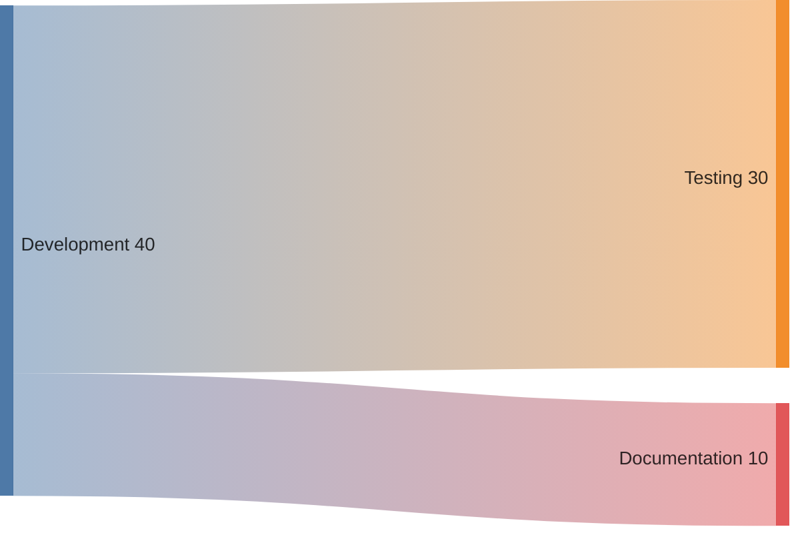
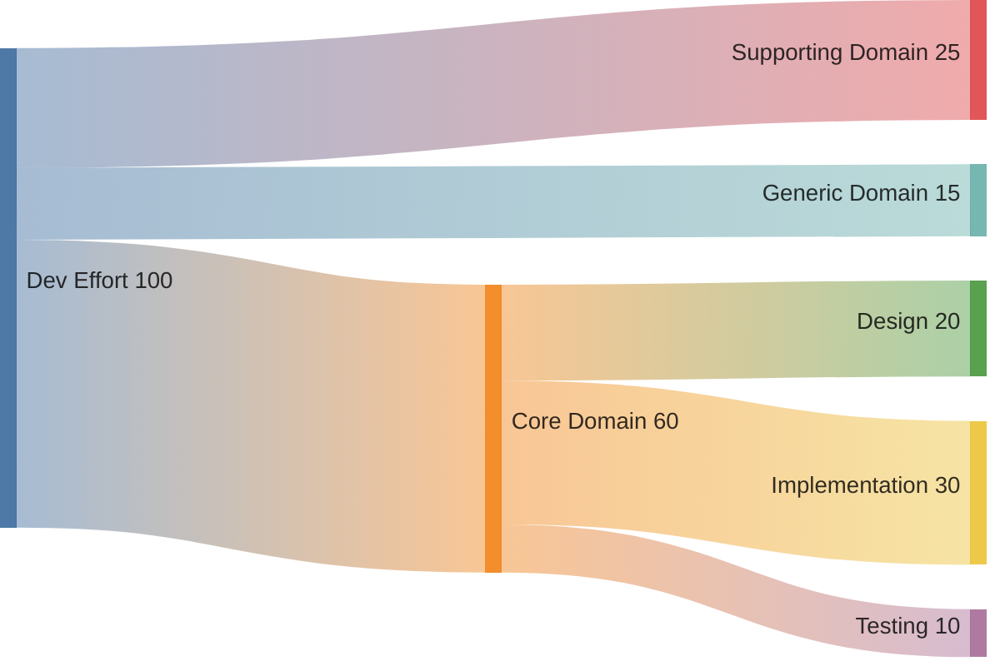
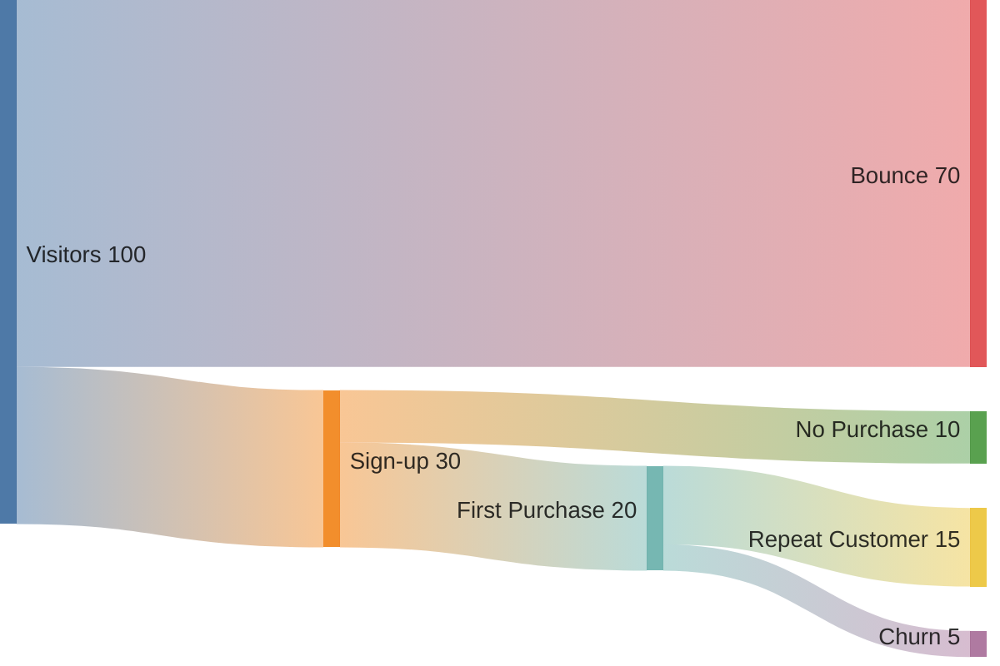
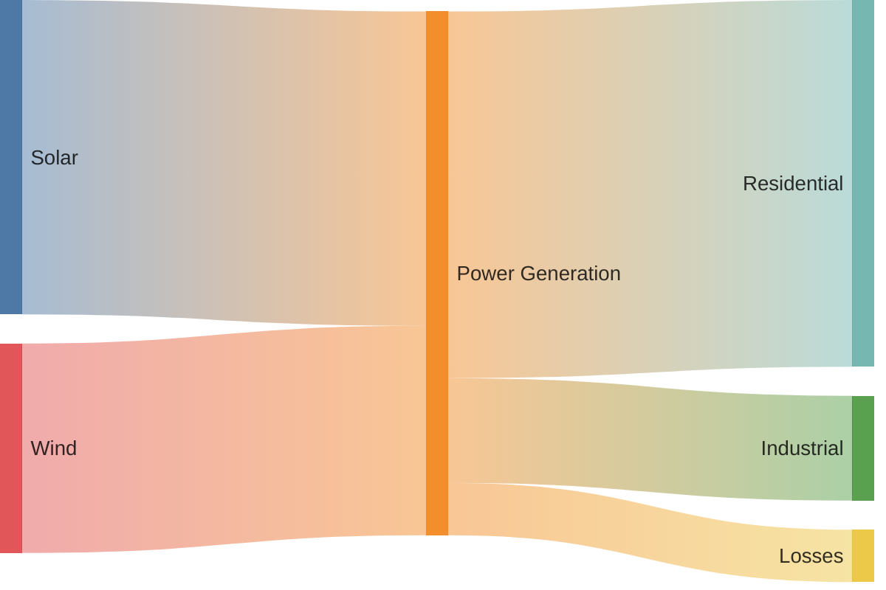

# サンキー図（sankey）

> ⚠️ **experimental（実験的）構文**: 公式ドキュメントで "This is an experimental diagram. Its syntax are very close to plain CSV, but it is to be extended in the nearest future." と明記されている。v10.3.0 以降で利用可能。表示環境（GitHub等）によっては `sankey-beta` という `-beta` サフィックス付きキーワードでないと認識されない場合があるため、環境ごとに確認すること。

参照: https://mermaid.js.org/syntax/sankey.html

## 概要

フローの量（ボリューム）を線の太さで表現する図。「ノード（node）」と「リンク（link）」で構成され、ある集合から別の集合への値の移動・変換を可視化する。構文はほぼプレーンなCSV（3列: source, target, value）。

## 使いどころ

- リソース・予算・工数の流れと配分
- トラフィックの経路と量
- エネルギー変換など、変換プロセスでの損失・変化の可視化

## 使わないケース

- 量が不要な関係図 → `flowchart`
- 単純な構成比（内訳のみ） → `pie`

---

## 基本テンプレート



1行目に `sankey`（環境によっては `sankey-beta`）を宣言し、空行を挟んで CSV データ（source, target, value の3列のみ）を続ける。

---

## 構文一覧（CSVフォーマット規則）

| 規則 | 内容 |
|---|---|
| 列数 | **3列のみ**（source, target, value）。RFC4180準拠のCSVをベースにするが列数が固定である点が独自 |
| 空行 | 見やすさのために **空行を挟むことが許可**される（カンマ区切りの行の間に空行があってもよい） |
| カンマを含む値 | ダブルクォートで囲む（例: `"Heating and cooling, homes"`） |
| ダブルクォートを含む値 | クォート内でダブルクォートを2つ並べてエスケープ（例: `"Heating and cooling, ""homes"""`） |
| コメント | `%%` で行コメントが使用できる（CSVデータ行の前後に説明を書ける） |

### 基本（コメント付き）

```
sankey

%% source,target,value
Electricity grid,Over generation / exports,104.453
Electricity grid,Heating and cooling - homes,113.726
Electricity grid,H2 conversion,27.14
```

### 空行を挟む例

```
sankey

Bio-conversion,Losses,26.862

Bio-conversion,Solid,280.322

Bio-conversion,Gas,81.144
```

### カンマを含む値（ダブルクォートで囲む）

```
sankey

Pumped heat,"Heating and cooling, homes",193.026
Pumped heat,"Heating and cooling, commercial",70.672
```

### ダブルクォートを含む値

```
sankey

Pumped heat,"Heating and cooling, ""homes""",193.026
Pumped heat,"Heating and cooling, ""commercial""",70.672
```

---

## config（sankey）設定項目

frontmatter（YAML）で `config.sankey` 配下に指定する。

```
---
config:
  sankey:
    showValues: false
---
sankey

Agricultural waste,Bio-conversion,124.729
```

| プロパティ | 説明 | 値・デフォルト |
|---|---|---|
| `width` | 図の幅（ピクセル） | 例: `800` |
| `height` | 図の高さ（ピクセル） | 例: `400` |
| `linkColor` | リンク（線）の色付け方法 | `source`（source色）/ `target`（target色）/ `gradient`（source→targetのグラデーション）/ 直接カラーコード（例 `#a1a1a1`） |
| `nodeAlignment` | ノードの水平配置アルゴリズム | `justify` / `center` / `left` / `right` |
| `showValues` | ラベルに数値を表示するか | `true` / `false` |
| `labelStyle`（v11.15.0+） | ノードラベルの描画方式 | `legacy`（デフォルト・プレーンテキスト、ノードのx座標基準で配置）/ `outlined`（背景線付きで可読性向上、中心ノードからの層基準で配置） |
| `nodeWidth`（v11.15.0+） | ノード矩形の幅（ピクセル） | デフォルト `10` |
| `nodePadding`（v11.15.0+） | ノード間の垂直パディング（ピクセル） | デフォルト `12` |
| `nodeColors`（v11.15.0+） | 個別ノードへの色指定マップ（未指定ノードはデフォルト配色） | CSSカラー（hex/`rgb()`/`hsl()`/named color）のマップ |

### linkColor の指定例

```
---
config:
  sankey:
    linkColor: gradient
---
sankey

A,B,10
B,C,5
```

### labelStyle の指定例

```
---
config:
  sankey:
    showValues: false
    labelStyle: outlined
---
sankey

Electricity grid,Heating and cooling - homes,113.726
Electricity grid,Industry,342.165
Electricity grid,Losses,56.691
```

### nodeWidth / nodePadding の指定例

```
---
config:
  sankey:
    showValues: false
    nodeWidth: 15
    nodePadding: 20
---
sankey

Electricity grid,Heating and cooling - homes,113.726
Electricity grid,Industry,342.165
Electricity grid,Losses,56.691
```

### nodeColors の指定例

```
---
config:
  sankey:
    showValues: false
    nodeColors:
      Electricity grid: "#4e79a7"
      Industry: "#e15759"
      Losses: "#bab0ab"
---
sankey

Electricity grid,Heating and cooling - homes,113.726
Electricity grid,Industry,342.165
Electricity grid,Losses,56.691
```

---

## 実例

⚠️ **日本語ノード名は使用不可（動作確認済みの制限）**: Mermaid v11.16.0で検証したところ、sankey-betaはノード名にクォート有無を問わず**日本語（マルチバイト文字）を含めると必ず構文解析エラーになる**（1文字でも含まれると失敗）。ASCII文字のみで記述すること。

### 例1: 開発工数の配分



### 例2: ユーザーのサービス利用フロー



### 例3: config でノード幅・パディングを調整したエネルギー配分


