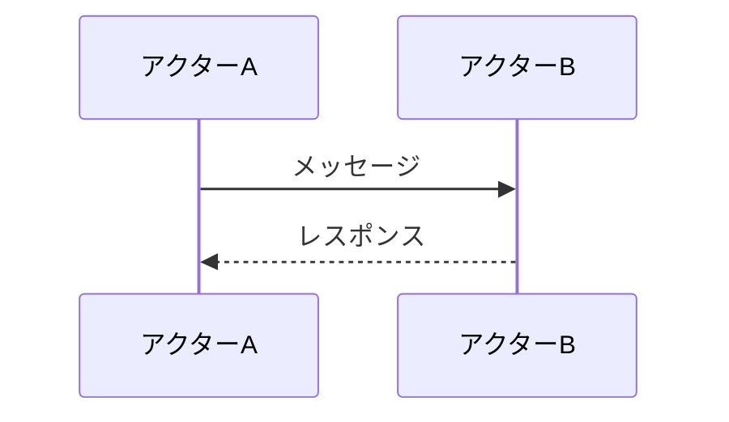
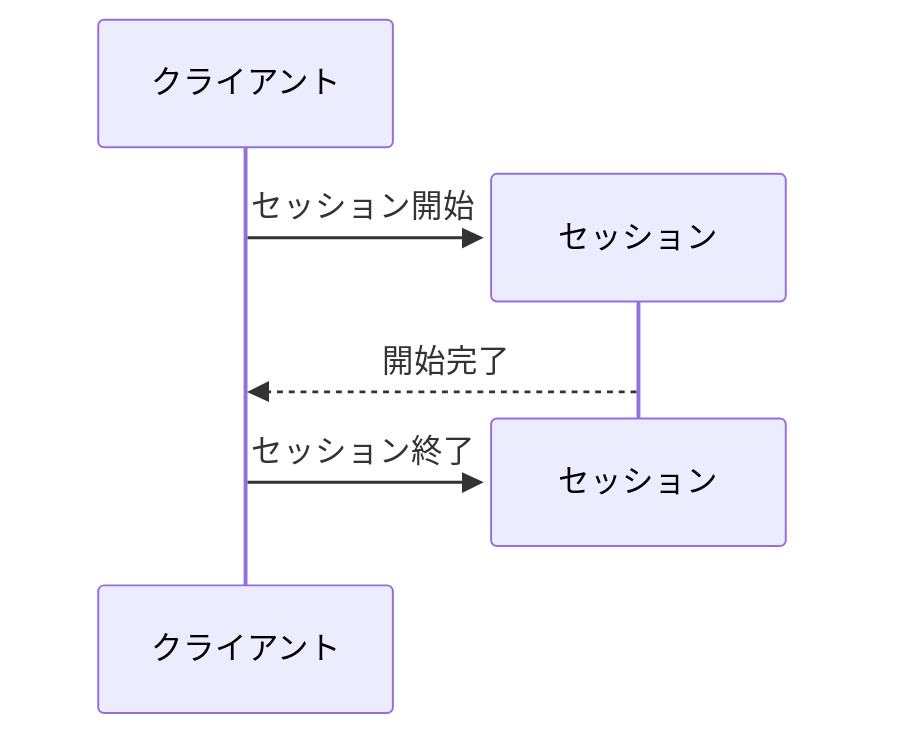
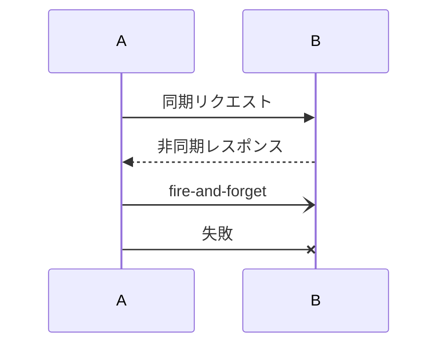
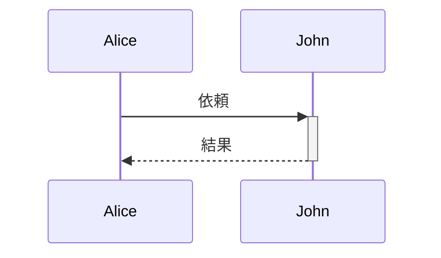
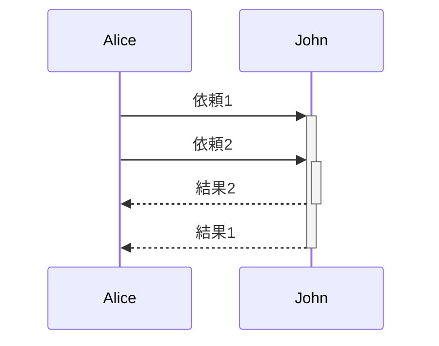
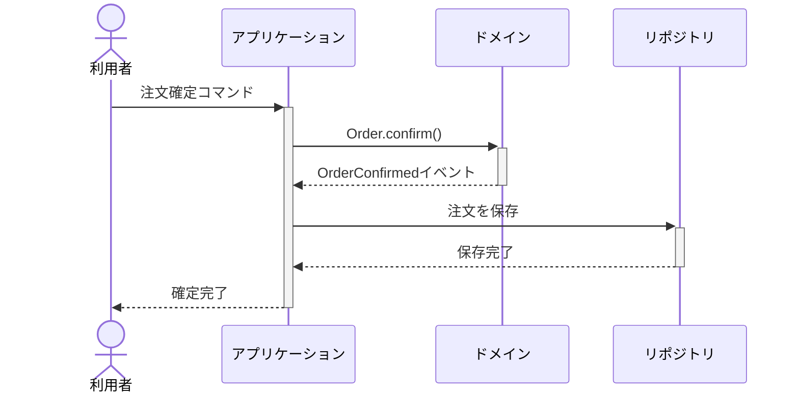
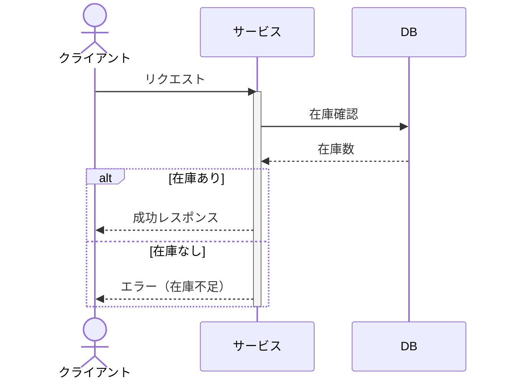
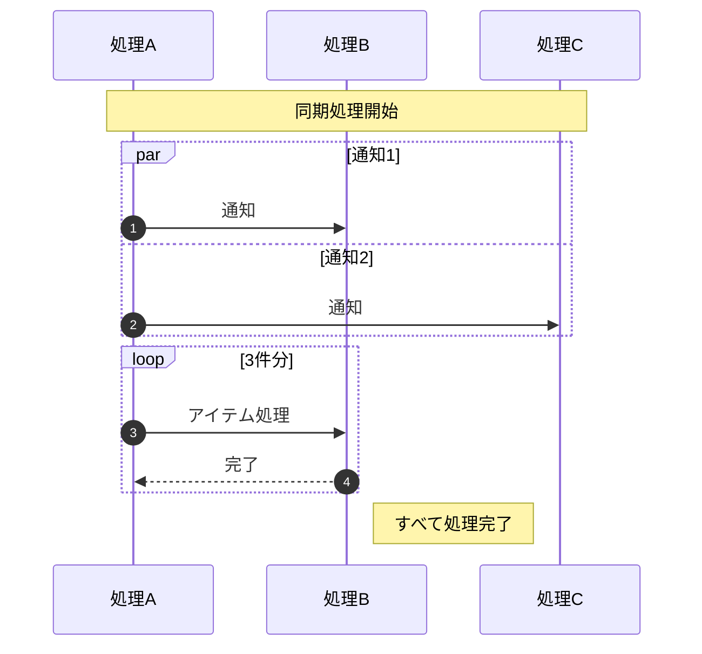

# シーケンス図（sequenceDiagram）

## 概要

アクター（登場人物・システム）間のメッセージのやり取りを時系列で表現する図。「誰が誰に何を送るか」の順序を示す。

## 使いどころ

- ユースケースの処理フロー（どのコンポーネントが何を呼ぶか）
- ドメインイベントの発生から通知までの流れ
- APIコール・サービス間通信の順序
- コマンドとイベントの連鎖

## 使わないケース

- 静的な構造・関係 → `flowchart` or `classDiagram`
- 状態の変化 → `stateDiagram-v2`

---

## 基本テンプレート



---

## participant と actor（宣言）

デフォルトでは初出のメッセージ登場順に自動で参加者が並ぶが、明示宣言すると表示順を固定できる。

```
sequenceDiagram
    participant Alice
    participant Bob
```

`actor` は人間の登場人物専用の宣言で、四角の箱ではなく棒人間アイコンで描画される。

```
sequenceDiagram
    actor Alice
    participant System
    Alice->>System: リクエスト
```

### エイリアス（as）

```
sequenceDiagram
    participant A as 利用者
    actor U as ユーザー
```

### 参加者の型（boundary/control/entity/database/collections/queue）

```
sequenceDiagram
    participant B as UI画面
    participant C as コントローラ
```

> 表示用のステレオタイプ的な型指定（boundary/control/entity/database/collections/queue）も利用できる。UMLのロバストネス図に近い意味付けをしたい場合に使う。

---

## 参加者の作成・破棄（create / destroy）

処理の途中で新しく登場する参加者、途中で消える参加者を表現できる。



---

## グルーピング（box）

複数の参加者を枠でまとめ、任意で色を指定できる。

⚠️ **動作確認済みの注意点**: Mermaid v11.16.0で検証したところ、`box`〜`end`によるグルーピングは（ASCII/日本語・色指定の有無を問わず）常に`Option is not defined`エラーで構文解析に失敗する（実装側のバグと見られる）。使用前に対象のMermaidバージョンで必ず表示確認すること。

```
sequenceDiagram
    box Aqua グループ名
        participant A
        participant B
    end
    box rgb(33,66,99)
        participant C
    end
    box transparent 透明枠
        participant D
    end
```

---

## メッセージ（矢印）の種類

| 記法 | 線種 | 矢印 | 用途 |
|---|---|---|---|
| `->` | 実線 | なし | メッセージ送信（矢先なし） |
| `-->` | 点線 | なし | 非同期通知（矢先なし） |
| `->>` | 実線 | あり | 同期呼び出し・リクエスト |
| `-->>` | 点線 | あり | 非同期レスポンス・戻り値 |
| `<<->>` | 実線 | 両矢印 | 双方向の同期メッセージ |
| `<<-->>` | 点線 | 両矢印 | 双方向の非同期メッセージ |
| `-x` | 実線 | × | 失敗・エラー（同期） |
| `--x` | 点線 | × | 失敗・エラー（非同期） |
| `-)` | 実線 | 開いた矢印 | 非同期送信（fire-and-forget） |
| `--)` | 点線 | 開いた矢印 | 非同期送信（戻りを待たない） |

例:



---

## アクティベーション（activate/deactivate）

処理中であることを縦棒で表す。

```
sequenceDiagram
    activate Alice
    Alice->>John: 依頼
    deactivate Alice
```

### ショートハンド（+ / -）



### スタッキング（同一参加者の多重アクティブ化）



---

## 注釈（Note）

```
Note right of Alice: 補足説明
Note left of Bob: 補足説明
Note over Alice,Bob: 複数参加者にまたがる注釈
```

改行は `<br/>` で挿入できる。

```
Note over A,B: 1行目<br/>2行目
```

---

## 制御構造

### loop（繰り返し）

```
loop 3件分
    A->>B: アイテム処理
    B-->>A: 完了
end
```

### alt / else（条件分岐）

```
alt 在庫あり
    S-->>C: 成功レスポンス
else 在庫なし
    S-->>C: エラー（在庫不足）
end
```

### opt（オプション・条件付き分岐、else無し）

```
opt 追加確認が必要な場合
    S-->>C: 確認リクエスト
end
```

### par / and（並行処理）

```
par 処理1
    A->>B: メッセージ1
and 処理2
    A->>C: メッセージ2
and 処理3
    A->>D: メッセージ3
end
```

ネストも可能:

```
par 外側
    par 内側
        A->>B: msg
    and
        B->>C: msg
    end
and
    C->>D: msg
end
```

### critical / option（必須処理・代替オプション）

```
critical 必ず成功すべき処理
    A->>B: 決済実行
option 決済失敗時
    A->>C: ロールバック
option タイムアウト時
    A->>C: リトライ
end
```

`option` を書かず `critical`単体でも使える。

### break（例外的終了）

```
break 例外発生
    Alice->>John: 例外が発生した
end
```

---

## 背景の強調（rect）

```
rect rgb(0, 255, 0)
    Alice->>John: 緑背景で強調
end
rect rgba(0, 0, 255, .1)
    John-->>Alice: 青の半透明背景
end
```

---

## シーケンス番号（autonumber）

```
autonumber
Alice->>John: メッセージ1
John-->>Alice: メッセージ2
```

開始値・増分値を指定（新しめのバージョン）:

```
autonumber 10 5
Alice->>John: 10番から始まる
John-->>Alice: 15番になる
```

---

## アクターメニュー（link / links）

```
link Alice: ダッシュボード @ https://example.com
links Alice: {"ダッシュボード": "https://example.com", "リポジトリ": "https://github.com/example"}
```

---

## エスケープ・特殊文字

```
Alice->>John: エンティティコード例 #35; は # を表す
Note right of Alice: &lt; &gt; &amp; のようなHTMLエスケープも利用可
```

---

## コメント

```
%% これはコメント
Alice->>John: Hello
```

---

## 実例

### 例1: コマンドとイベントの流れ（activate省略記法つき）



### 例2: 条件分岐（alt）とアクター区分（actor）



### 例3: ループ・並行処理・注釈・autonumber


