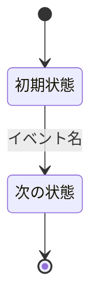
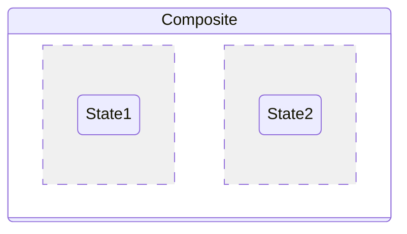
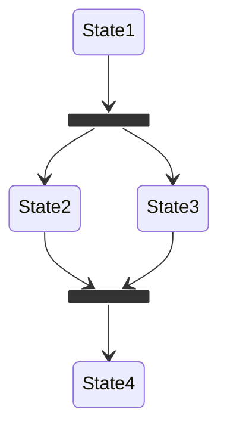
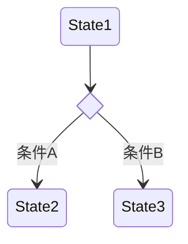
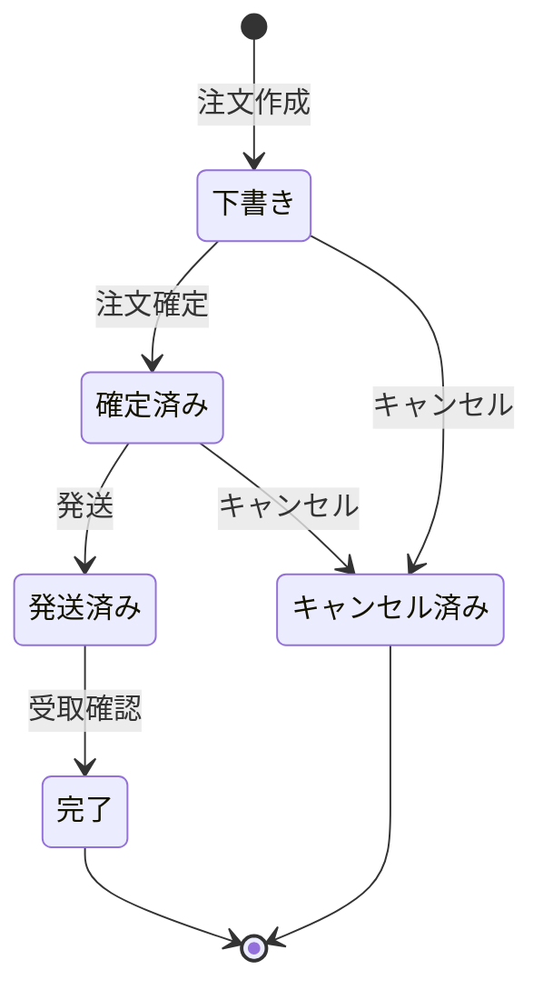
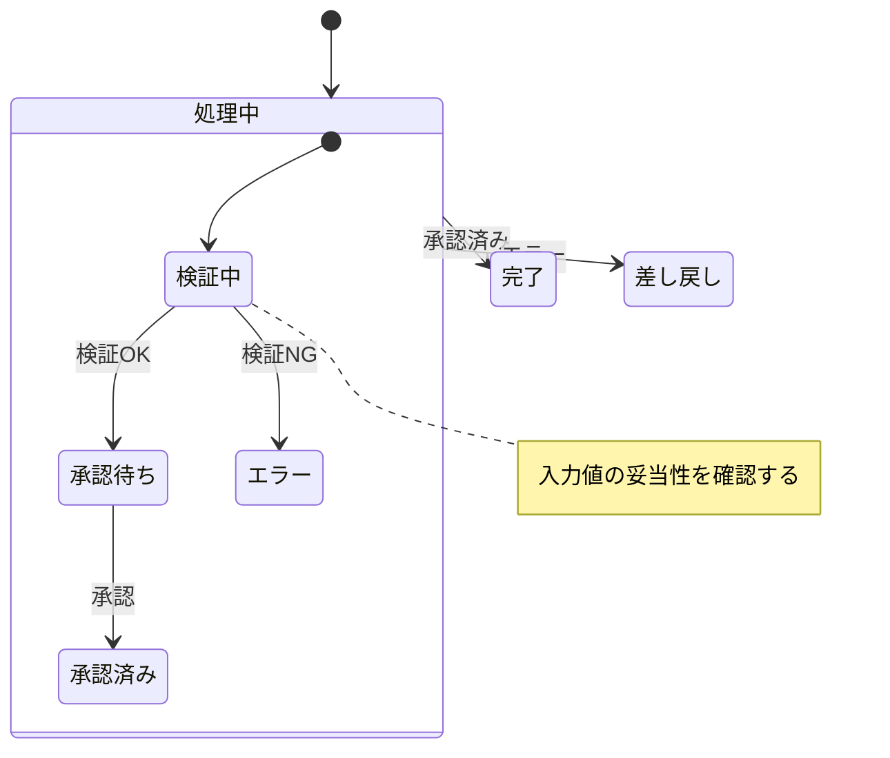
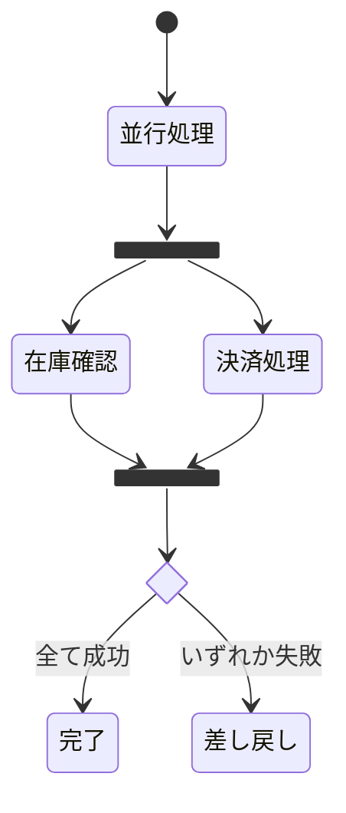

# 状態遷移図（stateDiagram-v2）

## 概要

オブジェクトの状態と、状態を変化させるイベント・条件を表現する図。集約の状態ライフサイクルを可視化するのに適している。

## 使いどころ

- 集約（注文・申請・チケット等）のライフサイクル
- 業務プロセスの状態管理
- ドメインイベントによる状態遷移

## 使わないケース

- 処理の順序（誰が何を呼ぶか） → `sequenceDiagram`
- 静的な構造 → `flowchart` or `classDiagram`

---

## 基本テンプレート



`[*]` は開始・終了を表す（矢印の始点なら開始状態、終点なら終了状態）。

---

## 状態の宣言

**単純な状態:**

```
stateDiagram-v2
    Still
```

**長い名前・スペースを含む名前へのエイリアス:**

```
stateDiagram-v2
    state "長い状態名（スペースを含む）" as id
    [*] --> id
    id --> OtherState
```

---

## 遷移（トランジション）

```
stateDiagram-v2
    Still --> Moving
    Moving --> Still
    Moving --> Crash
```

**ラベル（イベント名・条件）付き遷移:**

```
stateDiagram-v2
    Still --> Moving : イベント名
```

---

## 開始・終了状態

```
stateDiagram-v2
    [*] --> Still
    Crash --> [*]
```

---

## 複合状態（サブ状態・composite state）

```
stateDiagram-v2
    state Composite {
        InnerState1
        InnerState2
        InnerState1 --> InnerState2
    }
```

**入れ子（ネスト）:**

```
stateDiagram-v2
    state Level1 {
        state Level2 {
            NestedState
        }
    }
```

**複合状態同士の遷移:**

```
stateDiagram-v2
    state Comp1 {
        State1
    }
    state Comp2 {
        State2
    }
    Comp1 --> Comp2
```

---

## 並行状態（`--` ディバイダによるフォーク領域）

複合状態の中を `--` で区切ると、複数の領域が並行して動作することを表現できる。



## fork / join（明示的な分岐・合流ノード）



## choice（選択疑似状態）

条件によって遷移先が分岐する場合に使う。



---

## 注釈（note）

```
note right of State1
    補足説明（複数行可）
end note

note left of State2 : 一行の注釈
```

---

## 方向（direction）

```
stateDiagram-v2
    direction LR
    State1 --> State2
```

選択肢: `TB`（既定）/ `LR` / `BT` / `RL`

---

## コメント

```
%% これはコメント
State1 --> State2 %% 行末コメント
```

---

## スタイリング

⚠️ **動作確認済みの注意点**: `class <状態名> <クラス名>` の対象に日本語等の非ASCII状態名を直接指定するとレクサエラーになる。`state "日本語名" as alias` でASCIIエイリアスを宣言し、`class alias クラス名`のようにエイリアス側を指定すること（遷移の矢印では日本語名を直接使ってよい）。

**classDefとclassによる適用:**

```
classDef movement font-style:italic;
classDef badEvent fill:#f00,color:white,font-weight:bold;

class State1 movement
class State2 badEvent
```

**ショートハンド（`:::`）:**

```
classDef highlight fill:#ff0
State1:::highlight --> State2
```

---

## 実例

### 例1: 注文のライフサイクル



### 例2: 複合状態（サブ状態）+ 注釈



### 例3: 並行状態（fork/join）+ choice


