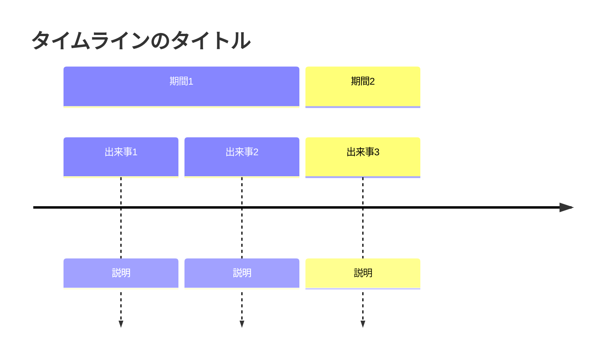
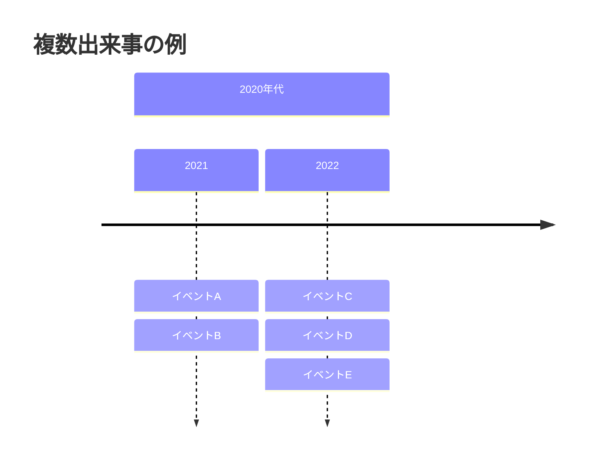
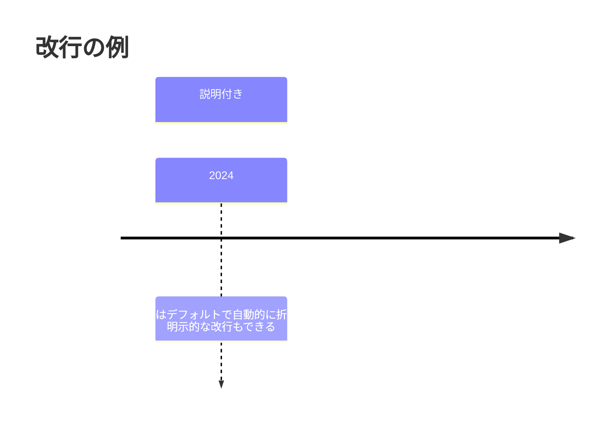
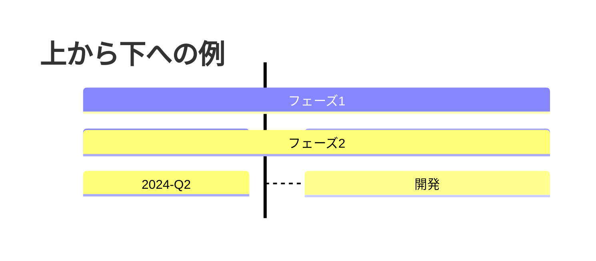
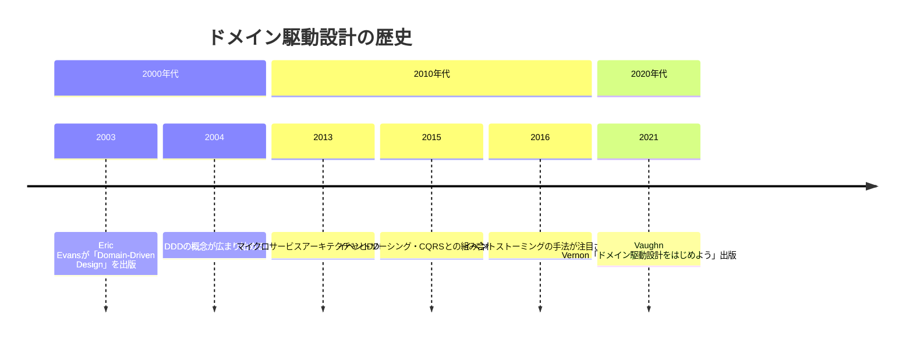
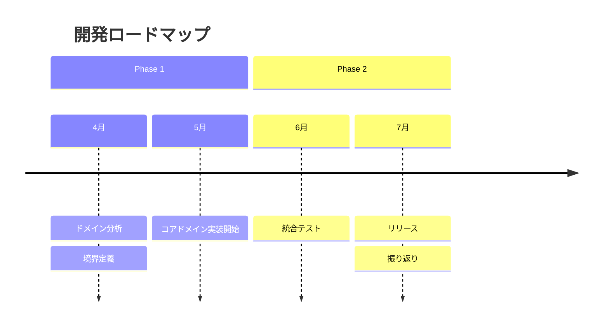
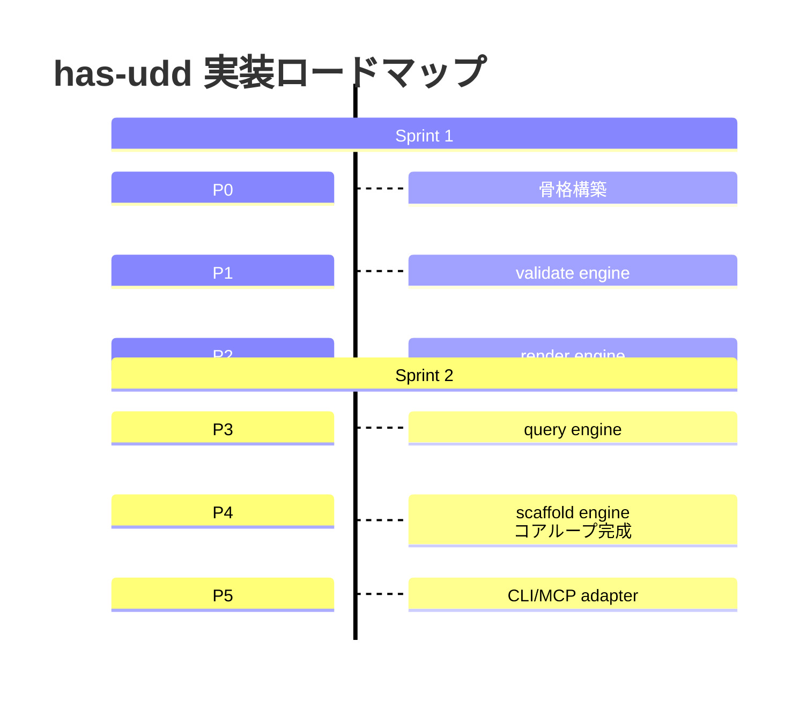

# タイムライン（timeline）

## 概要

時系列の出来事・日付・期間を年表形式で表現する図。歴史・プロセスの進化・ロードマップを表すのに適している。

## 使いどころ

- 技術・業界の歴史的な変遷
- プロジェクトのマイルストーン・ロードマップ
- 概念の発展史

## 使わないケース

- タスクの期間・並行作業 → `gantt`
- 処理の順序 → `sequenceDiagram`

---

## 基本テンプレート



---

## 構文要素

| 要素 | 説明 |
|---|---|
| `timeline` | 図の開始キーワード |
| `title 文字列` | タイムライン全体のタイトル（任意） |
| `section 名前` | 期間・時代のグループ化（任意。セクションごとに配色が変わる） |
| `時代 : 出来事` | 時代（time period）と出来事（event）のペア。両方とも単なる文字列で、数値に限定されない |

### 1つの時代に複数の出来事を書く方法

**同一行でコロン区切り**:
```
2024 : 出来事A : 出来事B : 出来事C
```

**複数行に分けて記述**（2行目以降は時代を省略しコロンから開始）:
```
2024 : 出来事A
     : 出来事B
     : 出来事C
```



---

## テキストの折り返し・改行

- 長いテキストはデフォルトで自動折り返しされる
- `<br>` タグを使うと明示的に改行できる



---

## 方向設定（v11.14.0以降）

| 記法 | 向き |
|---|---|
| `timeline LR`（既定） | 左から右 |
| `timeline TD` | 上から下 |



---

## スタイリング・設定

| 設定項目 | 説明 |
|---|---|
| `disableMulticolor` | `true`にするとセクションごとの色分けを無効化（既定は`false`＝色分けあり）。`mermaid.initialize({ timeline: { disableMulticolor: false } })` で設定 |
| `cScale0` 〜 `cScale11` | セクション/時代ごとの配色（最大12色、テーマ変数） |
| `cScaleLabel0` 〜 `cScaleLabel11` | 各配色に対応するラベル文字色 |

利用可能な定義済みテーマ: `base` / `forest` / `dark` / `default` / `neutral`

---

## 実例

### 例1: DDDの歴史



### 例2: プロジェクトロードマップ（複数出来事）



### 例3: 上から下方向・改行付き


