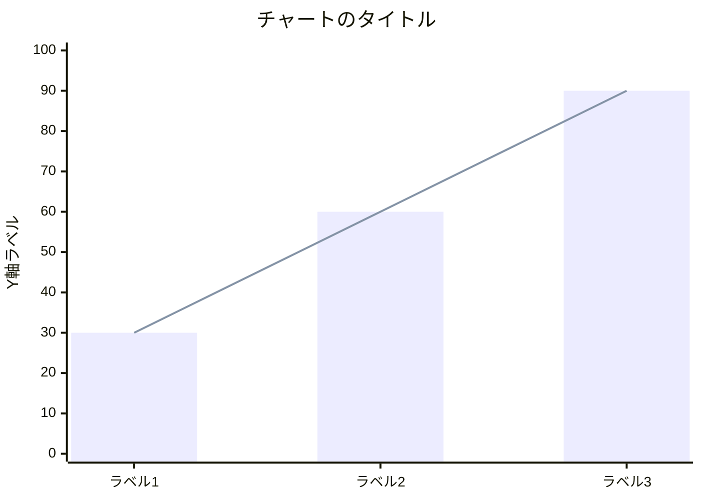
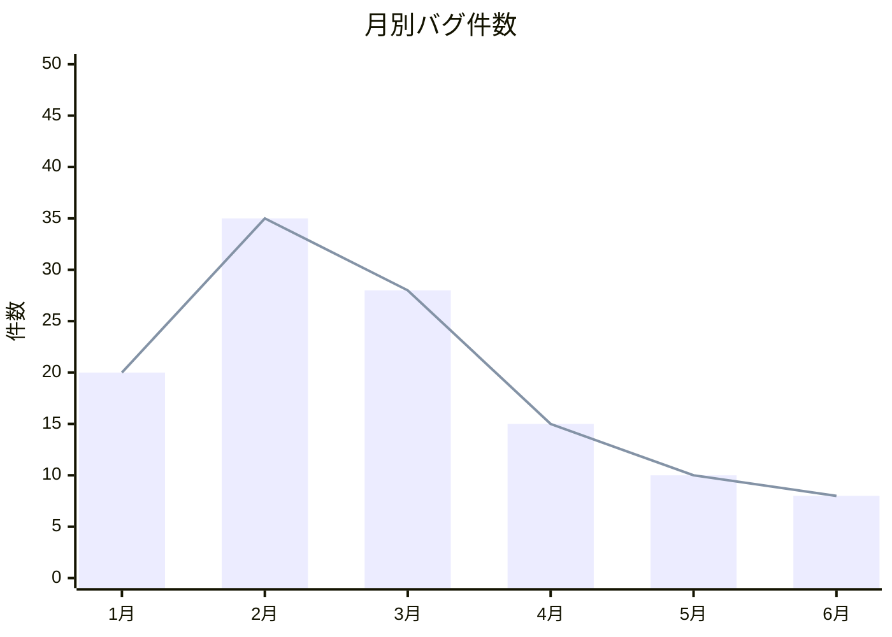
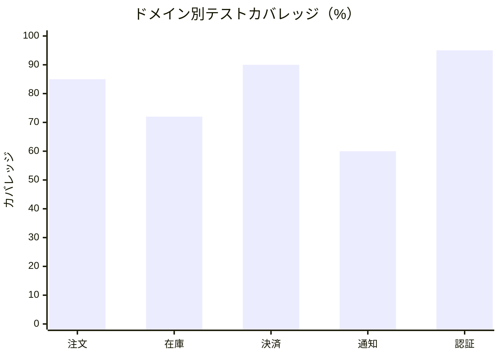

# XYチャート（xychart）

> ⚠️ **beta由来の構文**: 長らく `xychart-beta` というキーワードで提供されてきた図種。最新の公式ドキュメントでは `xychart` という表記に統一されているが、GitHubなど多くのレンダリング環境・過去バージョンでは引き続き `xychart-beta` の `-beta` サフィックスが必要な場合がある。使用環境で両方試すこと（本ファイルの実例は互換性優先で `xychart-beta` を使用）。

参照: https://mermaid.js.org/syntax/xyChart.html

## 概要

X軸・Y軸を持つ棒グラフ・折れ線グラフを表現する図。時系列データや複数系列の比較データの可視化に使う。`bar` と `line` は同じチャート内で重ね合わせて表示できる。

## 使いどころ

- 時系列データの推移（月別売上、件数など）
- カテゴリ間の数値比較
- 複数系列の重ね合わせ（棒 + 折れ線、複数の棒/複数の折れ線）

## 使わないケース

- 構成比 → `pie`
- 2軸の分類（散布図的なプロット） → `quadrantChart`
- 量の流れ → `sankey`

---

## 基本テンプレート



---

## 構文一覧

| 構文要素 | 書式 | 説明 |
|---|---|---|
| 図の宣言 | `xychart-beta`（環境により `xychart`） | 1行目に必須 |
| 横向き指定 | `xychart-beta horizontal` | 棒グラフを水平方向に描画（デフォルトは垂直） |
| タイトル | `title "テキスト"` | 図全体のタイトル |
| x軸（カテゴリ配列） | `x-axis [cat1, cat2, cat3]` | カテゴリ名の配列。スペースを含む場合や日本語等の非ASCII文字を含む場合は必ず `["1月", "2月"]` のようにダブルクォートで囲む（クォート無しの日本語はレクサエラーになる・動作確認済み） |
| x軸（カテゴリ＋タイトル） | `x-axis "タイトル" [cat1, cat2, cat3]` | 軸タイトル付きでカテゴリ指定 |
| x軸（数値範囲） | `x-axis タイトル 最小値 --> 最大値` | 連続値の範囲としてx軸を定義 |
| y軸（範囲指定） | `y-axis "タイトル" 最小値 --> 最大値` | 範囲を明示 |
| y軸（タイトルのみ） | `y-axis タイトル` | 範囲省略時はデータから自動計算 |
| 棒グラフ | `bar [値1, 値2, ...]` | 数値配列 |
| 棒グラフ（系列名付き） | `bar "系列名" [値1, 値2, ...]` | 複数系列を重ねる場合に使用 |
| 折れ線グラフ | `line [値1, 値2, ...]` | 数値配列 |
| 折れ線グラフ（系列名付き） | `line "系列名" [値1, 値2, ...]` | 複数系列を重ねる場合に使用 |
| 折れ線（ラベル付きポイント、v11.16.0+） | `line [値1 "ラベル1", 値2 "ラベル2", ...]` | 各データポイントに個別ラベルを付与 |
| 複数系列の重ね合わせ | `bar [...]` と `line [...]` を複数回記述 | 棒+棒、棒+線、線+線 いずれも可能 |

### x-axis の具体例

```
x-axis [jan, feb, mar, apr, may, jun, jul, aug, sep, oct, nov, dec]
```

```
x-axis "月" ["1月", "2月", "3月"]
```

```
x-axis "実装コスト" 0 --> 100
```

### y-axis の具体例

```
y-axis "Revenue (in $)" 4000 --> 11000
```

```
y-axis "カバレッジ"
```
（範囲省略・自動スケーリング）

### bar / line の具体例

```
bar [5000, 6000, 7500, 8200, 9500, 10500]
line [5000, 6000, 7500, 8200, 9500, 10500]
```

```
bar "今年" [20, 35, 28, 15, 10, 8]
bar "昨年" [15, 25, 30, 20, 12, 9]
```

```
line [540 "PaLM", 65 "LLaMA-65B", 34 "Llama 2 34B"]
```
（v11.16.0+ のラベル付きポイント）

### 横向きチャートの例

```
xychart-beta horizontal
    title "処理時間の比較"
    x-axis [処理A, 処理B, 処理C]
    y-axis "秒" 0 --> 10
    bar [3, 7, 5]
```

---

## config（xyChart）設定項目

| プロパティ | 説明 | デフォルト |
|---|---|---|
| `width` | チャート全体の幅 | 700 |
| `height` | チャート全体の高さ | 500 |
| `titlePadding` | タイトルの上下パディング | 10 |
| `titleFontSize` | タイトルのフォントサイズ | 20 |
| `showTitle` | タイトルを表示するか | true |
| `showLegend` | 凡例を表示するか | true |
| `legendFontSize` | 凡例のフォントサイズ | 14 |
| `legendPadding` | 凡例のパディング | 10 |
| `chartOrientation` | `'vertical'` / `'horizontal'` | `'vertical'` |
| `plotReservedSpacePercent` | プロットエリアに割り当てる幅の割合(%) | 50 |
| `showDataLabel` | データラベルを表示するか | false |
| `showDataLabelOutsideBar` | 棒の外側にデータラベルを表示するか | false |

### 軸別設定（xAxis / yAxis 共通の AxisConfig）

| プロパティ | 説明 | デフォルト |
|---|---|---|
| `showLabel` | 軸ラベル（メモリ）を表示するか | true |
| `labelFontSize` | ラベルのフォントサイズ | 14 |
| `labelPadding` | ラベルのパディング | 5 |
| `showTitle` | 軸タイトルを表示するか | true |
| `titleFontSize` | 軸タイトルのフォントサイズ | 16 |
| `titlePadding` | 軸タイトルのパディング | 5 |
| `showTick` | 目盛り線を表示するか | true |
| `tickLength` | 目盛り線の長さ | 5 |
| `tickWidth` | 目盛り線の太さ | 2 |
| `showAxisLine` | 軸線を表示するか | true |
| `axisLineWidth` | 軸線の太さ | 2 |
| `labelRotation` | ラベルの回転角度 | 0 |

### frontmatter での config 指定例

```
---
config:
  xyChart:
    width: 900
    height: 500
    plotReservedSpacePercent: 60
  themeVariables:
    xyChart:
      plotColorPalette: "#4e79a7, #e15759, #59a14f"
---
xychart-beta
    title "月別売上"
    x-axis ["1月", "2月", "3月"]
    y-axis "円" 0 --> 100000
    bar [50000, 70000, 65000]
```

### テーマ変数（xyChart）

| 変数名 | 説明 |
|---|---|
| `backgroundColor` | 背景色 |
| `titleColor` | タイトル文字色 |
| `dataLabelColor` | データラベル文字色 |
| `legendTextColor` | 凡例文字色 |
| `xAxisLabelColor` / `xAxisTitleColor` / `xAxisTickColor` / `xAxisLineColor` | x軸のラベル/タイトル/目盛り/軸線の色 |
| `yAxisLabelColor` / `yAxisTitleColor` / `yAxisTickColor` / `yAxisLineColor` | y軸のラベル/タイトル/目盛り/軸線の色 |
| `plotColorPalette` | 複数系列を描画する際に使う色のパレット（カンマ区切り） |

---

## 実例

### 例1: 月別バグ件数の推移（棒＋折れ線の重ね合わせ）



### 例2: ドメイン別テストカバレッジ



### 例3: 複数系列（今年 vs 昨年）の比較

```mermaid
xychart-beta
    title "月別売上比較"
    x-axis ["1月", "2月", "3月", "4月", "5月", "6月"]
    y-axis "売上（万円）" 0 --> 120
    bar "今年" [80, 95, 70, 60, 100, 110]
    bar "昨年" [60, 70, 65, 50, 80, 90]
```


