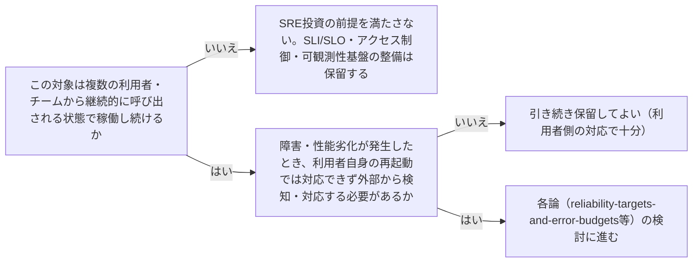

# sre-investment-threshold

---

## 概要

### この概念が答える判断

- SLI/SLO・アクセス制御・可観測性といったSRE的な仕組みを、どんな対象にも整備すべきか？
- ローカルで動く単体プロセス・開発者個人のツールにも、可用性目標は必要か？
- 「継続的に稼働するサービス」と「そうでないもの」を区別する基準は何か？

SRE/クラウドアーキテクチャの原則（SLI/SLO・最小権限・可観測性等）は、複数の利用者に対して継続的に稼働するサービスであることを暗黙の前提にしている。この前提が成立しない対象にまで機械的に適用すべきではない、という投資判断の閾値を扱う。

---

## 原則

AWS Well-Architected等が扱う可用性目標・セキュリティ境界・可観測性は、いずれも「継続的に稼働し、複数のアクター（利用者・チーム）が利用し続ける」という状況を暗黙の前提として組み立てられている。この前提が成立しない対象——起動のたびに使い捨てられるローカルプロセス、単一の利用者しか呼び出さないツール、ネットワークを介さず呼び出し元と同じプロセス内で完結する処理——には、SLI/SLOのような「稼働率」概念そのものが意味を持たず、アクセス制御という境界も存在しない。SRE的な投資を検討する前に、まず対象が「継続的に稼働し複数のアクターが利用する」という前提を満たしているかどうかを判定し、満たしていなければ各論（具体的な目標値・境界設計）の検討自体を保留する。

---

## 分類

| 分類 | 特徴 |
|---|---|
| 継続稼働サービス | ネットワークを介して複数の利用者・チームから繰り返し呼び出される、起動したままの状態が続くもの。SRE投資の前提を満たす |
| 使い捨てプロセス | 呼び出しごとに起動・終了し、呼び出し元と同じライフサイクルを共有するもの。SRE投資の前提を満たさない |
| 単一利用者ツール | ネットワークを介さず、単一の利用者・呼び出し元だけが使うもの。アクセス制御の境界が実質的に存在しない |

---

## 判断基準

---

## 実例

架空の物流プラットフォーム「ShipFast」の社内ツールを考える。開発者が自分のPC上でCLIとして起動する「配送ラベル生成ツール」は、起動するたびにプロセスが立ち上がり終了する使い捨てプロセスであり、単一の開発者しか呼び出さない。ここにSLI/SLOやアクセス制御を設計しようとする提案が出たが、複数利用者・継続稼働という前提が成立しないため保留された。一方、同じチームが後に「配送ラベル生成」を社内の複数チームが呼び出せるAPIサービスとして公開することにした際は、継続稼働・複数利用者という前提が成立するため、SLI/SLO・アクセス制御・可観測性の検討に進んだ。

---

## アンチパターン

| アンチパターン | 問題点 |
|---|---|
| 継続稼働の前提が無い対象にSLI/SLOを機械的に定義しようとする | 「稼働率」という概念自体が意味を持たず、無意味な数値目標を作るだけの作業になる |
| 単一利用者ツールにアクセス制御の設計を持ち込む | 境界を引く対象（複数のアクター）が存在しないため、設計コストだけがかかり実効性のない仕組みになる |
| 「将来複数チームに公開するかもしれない」という理由だけで先回りしてSRE投資をする | 実際にその予定が具体化していない段階での投資は、要件が固まる前に作った仕組みが実態と合わず作り直しになるリスクが高い |

---

## 出典・根拠の透明性

SRE/クラウドアーキテクチャの原則群（Google SRE・AWS Well-Architected等）が暗黙に前提とする適用条件を明示化したものであり、tech-lead-advisorの`architecture-evidence-based-scope`（YAGNI／Thinnest Viable Platform）と同型の判断規律をplatform-advisorの領域に適用したものである。単一の権威ある出典ではなく、広く確立された実務知見の交差点である。

---

## 関連概念

| 関連概念 | 関係 |
|---|---|
| reliability-targets-and-error-budgets | この閾値を満たしてから初めて検討する対象 |
| security-boundary-and-least-privilege | この閾値を満たしてから初めて検討する対象 |
| observability-design | この閾値を満たしてから初めて検討する対象 |
