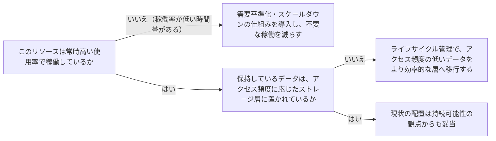

# sustainability

---

## 概要

### この概念が答える判断

- インフラ・システムの環境負荷はどう考えるべきか？
- リージョン・データセンターの選び方に環境面の考慮は関係あるか？
- 使わなくなったデータ・リソースはどう扱うべきか？

持続可能性（サステナビリティ）とは、クラウドワークロードの稼働がもたらす環境負荷（電力消費・資源消費）を最小化する設計原則である。

---

## 原則

環境負荷の最小化はクラウド事業者と利用者の共同責任として捉える——事業者側は物理インフラの効率化を担い、利用者側は稼働させるワークロードの設計・運用を最適化する責任を持つ。稼働率が低いリソースを削減し、実際に使われている割合（使用率）を高めることが、必要な資源量そのものを減らす最も直接的な手段である。リージョン選定は事業要件だけでなく持続可能性の目標（再生可能エネルギー比率等）も踏まえて行える。利用者の利用パターン（時間帯・曜日による需要変動）を理解し、需要が低い時間帯はインフラを縮小するといった調整を行う。急激な負荷変動をそのまま受けるのではなく、負荷を平準化する設計（キューイング等）で、ピークに合わせた過剰な資源確保を避ける。データは無制限に保持し続けるのではなく、アクセス頻度に応じてより効率的なストレージ層へ移行する仕組み（ライフサイクル管理）を使う。

---

## 分類

| 分類 | 特徴 |
|---|---|
| 使用率の最大化 | 稼働率が低いリソースを削減し、実際に使われる割合を高める |
| リージョン・配置の選定 | 事業要件と持続可能性目標の両方を踏まえて配置する |
| 需要平準化 | 利用パターンに応じてインフラを伸縮させ、急激な負荷変動を吸収する設計にする |
| データライフサイクル管理 | アクセス頻度に応じてデータをより効率的なストレージ層へ移行する |

---

## 判断基準

---

## 実例

架空の物流プラットフォーム「ShipFast」で、夜間はほとんどアクセスが無いにもかかわらず日中と同じ規模のサーバー構成を24時間稼働させていた。利用パターンを分析し、夜間は自動的にリソースを縮小する仕組みを導入した。また3年以上前の配送記録は高速アクセス用のストレージに置かれたままだったが、実際には参照されることがほとんど無かったため、より低コスト・低消費電力のアーカイブ用ストレージへ自動移行するライフサイクルルールを設定した。

---

## アンチパターン

| アンチパターン | 問題点 |
|---|---|
| 需要変動を無視し常に最大構成で稼働させ続ける | 使用率の低い時間帯も無駄な資源を消費し続ける |
| アクセス頻度に関わらず全データを同じ高速ストレージに置き続ける | 実際にはほとんど使われないデータのために不必要に多くの資源を消費する |
| リージョン選定を事業要件だけで決め、持続可能性の目標を考慮しない | 環境負荷を減らせる選択肢があっても検討されないまま見落とされる |

---

## 出典・根拠の透明性

AWS Well-Architected FrameworkのSustainability Pillarが扱う設計原則（共同責任モデル・使用率の最大化・需要平準化・データライフサイクル管理）をAIが要約・再構成したものであり、本文の直接引用ではない。

---

## 関連概念

| 関連概念 | 関係 |
|---|---|
| cost-optimization | 使用率の最大化・需要平準化はコスト最適化とも重なる領域 |
| performance-efficiency | リソース選定の効率化という点で関連する |
