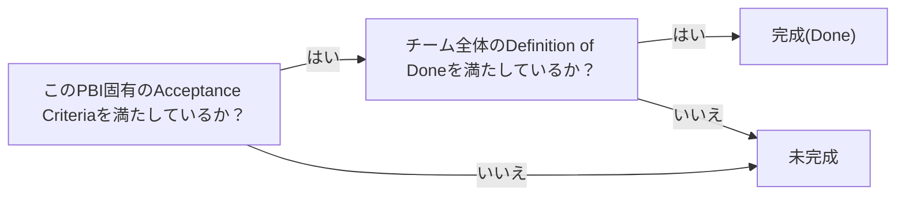

# definition-of-done

## 概要

### この概念が答える判断

- 個々のユースケース/ストーリーが「完成」と言えるのは何を満たしたときか？
- 受け入れ基準(Acceptance Criteria)を満たせば、それだけで完成と言えるのか？

全ての作業項目に一律適用される、チーム全体の普遍的な品質基準。個々のストーリー固有の受け入れ基準(Acceptance Criteria)とは別軸で、両方を満たして初めて「完成」となる。

---

## 原則

- Scrum Guide(2020年版)の定義: Definition of Doneは、プロダクトに要求される品質基準を満たしたインクリメントの状態を表す、正式な記述である。
- DoDは2020年版でScrumの3つのCommitment(Product Backlog↔Product Goal、Sprint Backlog↔Sprint Goal、Increment↔Definition of Done)の1つとして正式に構造化された。
- DoDは「Incrementそのもの」と「そのIncrementの一部になる各Product Backlog Item」の両方に適用される、入れ子構造を持つ。
- 組織レベルの標準DoDがあれば全Scrum Teamはそれを最低基準として従い、上乗せしてよい。無ければチーム自身が作る。同じプロダクトに複数チームが関わる場合、DoDは1つを共有する。
- Acceptance Criteria(個々のストーリー固有の受け入れ条件)とDefinition of Done(全ストーリーに一律適用される普遍的品質基準)は別軸であり、1件のストーリーが「完成」と言えるのは両方を満たしたときのみである。
- AC→DoDという順序的な階層関係ではなく、両方が独立して要求される加算的な関係である。

---

## 分類

| 分類 | 特徴 |
|---|---|
| Acceptance Criteria(受け入れ基準) | 個々のストーリー/PBI固有。プロダクトオーナーが主に作成し、その特定の作業が完了したと言えるかを定義する |
| Definition of Done | 全PBIに一律適用される、チーム全体で協働して作る普遍的な品質基準(コードレビュー済み・テスト済み・文書化済み等) |

---

## 判断基準

---

## 実例

あるPBI「注文確定ボタンを押すと注文が確定する」について、Acceptance Criteria(「在庫が無い場合はエラーになる」等)を全て満たしていても、チームのDoD(単体テストカバレッジ基準・コードレビュー完了・ドキュメント更新)を満たしていなければ、そのPBIはまだ"Done"とは言えない。

---

## アンチパターン

| アンチパターン | 問題点 |
|---|---|
| fudging the Definition of Done(DoDのごまかし) | 締め切りのプレッシャーの中で、ほぼ完成した作業を完全に完成したものとして扱ってしまう。DoDが持つ透明性という目的を損なう |
| Acceptance CriteriaをDefinition of Doneの代わりにする | 個々のストーリー固有の受け入れ基準を満たすだけで完成とみなし、コードレビュー・テスト規約・文書化等の横断的な品質基準を省略してしまう |

---

## 出典・根拠の透明性

Scrum Guide(Ken Schwaber・Jeff Sutherland共著、2020年版を中心に2011年版・2013年版の変遷も参照)、およびMike Cohn(Mountain Goat Software)によるDoD/Acceptance Criteria比較記事に基づく。

### 留保事項

web調査の最終統合ステップで技術的な不具合が発生したため、検証済みの生データから手動で再構成した。

---

## 関連概念

| 関連概念 | 関係 |
|---|---|
| tdd | TDDのRed/Green/Refactorサイクルとは別軸。DoDは個々のテストではなく作業項目全体の完成基準 |
