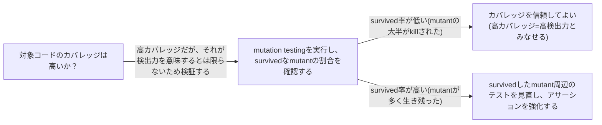

# mutation-testing

## 概要

### この概念が答える判断

- 既存のテストスイートが実際にバグを検出できる強さを持っているか、どう測定するか？
- カバレッジ(実行された行の割合)と、テストの検出力は何が違うか？
- 現代の開発でこの技法はどう位置づけられているか？

ソースコードに意図的な小さな変更(mutant)を注入し、既存のテストスイートがその変更を検出(kill)できるかどうかでテストの検出力(強度)を測定する技法。カバレッジが「実行されたか」だけを見るのに対し、mutation testingは「実行された箇所の変化を実際に検出できるか」を見る。

---

## 原則

- mutantとは、テストツールがソースコードに意図的に加える小さな変更である。テストスイートが強力であれば、その変更を検出してテストが失敗するはずである。
- テストがmutantを検出して失敗した場合はkilled(検出成功)、mutantが混入したままテストが全て通過してしまった場合はsurvived(検出失敗)と呼ばれる——survivedしたmutantの存在は、その箇所を検証しているはずのテストが実際には何も検証できていない(空疎である)ことのシグナルになる。
- カバレッジ駆動で書かれた、アサーションを欠く・弱いテストは、行が実行されるためカバレッジ上は高く見えても、mutantを検出できずsurvivedとなることが多い——カバレッジ指標だけでは見抜けないテストの空洞化を可視化する。

---

## 分類

| 分類 | 特徴 |
|---|---|
| Killed | テストスイートがmutantを検出し、少なくとも1つのテストが失敗した状態。テストがその箇所を実際に検証できていることを示す |
| Survived | mutantが混入したままテストが全て通過してしまった状態。その箇所を検証するテストが実質的に機能していないことを示す |

---

## 判断基準

---

## 実例

「合計金額が0以上であること」を検証するコードで、テストが`assert result is not None`しか書いていない場合、カバレッジ上はその行を通過するため100%と表示されるが、計算結果を意図的に不正な値に変異(mutant)させてもテストは通過してしまう(survived)。これはテストが実質的に何も検証していないことを示すシグナルであり、カバレッジ指標だけでは検出できない。

---

## アンチパターン

| アンチパターン | 問題点 |
|---|---|
| カバレッジ100%を品質の証明として扱う | カバレッジは『実行されたか』しか測らず、『検出できるか』は測らない。survivedなmutantが多数残っていても、カバレッジ指標上は高品質に見えてしまう |

---

## 出典・根拠の透明性

mutantの基本定義は現代の実装ツール文書(Microsoft Learn、Stryker.NET解説)に基づく。技法の起源はRichard Hamlet(1977年、IEEE Transactions on Software Engineering誌『Testing Programs with the Aid of a Compiler』)およびDeMillo, Lipton, Sayward(1978年、『Hints on Test Data Selection: Help for the Practicing Programmer』)に遡るとされ、ソフトウェアテスト分野で広く引用される起源として知られている。

### 留保事項

Hamlet(1977)・DeMillo et al.(1978)の起源論文は、著者名・タイトル・掲載誌・年としては複数の検索結果で一致して確認できたが、いずれも学術誌の有料壁の内側にあり、今回の調査プロセスでは論文本文への直接アクセス・引用検証(competent programmer仮説・coupling effect仮説等の具体的な主張内容の裏付け)までは完了していない。killed/survived以外の詳細な結果分類(timeout等)についても、特定の情報源に基づく主張は調査時の検証で反証されたため、本文書には含めていない。現代ツール(PIT/Stryker等)における実務的な採用状況(mutation scoreをKPIとしてどう解釈するか等)についても、ツールベンダー以外の独立した実務評価はまだ確認できていない。

---

## 関連概念

| 関連概念 | 関係 |
|---|---|
| test-smells | survivedなmutantの多発は、Obscure TestやAssertion-Freeに近いtest smellの症状として現れることが多い |
| risk-based-testing | mutation testingは全コードに一律適用するにはコストが高いため、リスクベーステストで特定した高リスク領域に絞って適用するのが実務的 |
