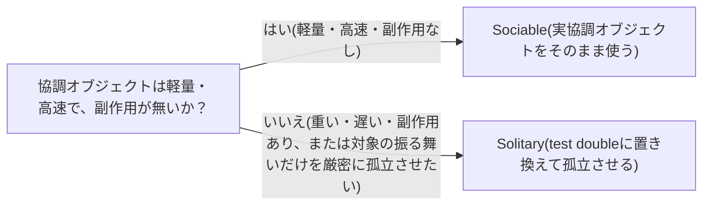

# sociable-solitary-unit-tests

## 概要

### この概念が答える判断

- ユニットテストは協調オブジェクト(collaborator)を本物のまま動かすべきか、置き換えるべきか？
- テストの脆さ(実装への過剰な結合)は何によって生まれるか？
- この区別はテスト戦略の設計にどう影響するか？

ユニットテストを、対象の協調オブジェクト(collaborator)をどう扱うかで2分類する考え方。Jay Fieldsが考案し、Martin Fowlerが自身のbliki記事「UnitTest」(2014年公開)で整理・普及させた。

---

## 原則

- Solitary unit testは、テスト対象ユニットの協調オブジェクトをすべてtest double(mock/stub等)に置き換え、対象を孤立させて検証する。
- Sociable unit testは、実際の協調オブジェクトをそのまま動かして検証する。Fowlerは『単一ユニットの振る舞いのテストであり、そのユニット以外はすべて正しく動作していると仮定して書く』と説明する。
- Sociable unit testが実協調オブジェクトとの相互作用を許すことは、テスト対象以外のコンポーネントの不具合によってテストが失敗しうることを意味し、実装への結合による脆さの一因になりうる(ただしFowler自身は「fragile」という語を明示的には使っていない)。
- この用語自体はJay Fieldsが考案したものであり、Fowlerはbliki記事でこれを採用・普及させた——Fowler自身の独自発案ではない。

---

## 分類

| 分類 | 特徴 |
|---|---|
| Solitary | collaboratorをtest doubleに置き換えて対象ユニットを孤立させるテスト |
| Sociable | 実collaboratorをそのまま動かして対象ユニットの振る舞いを検証するテスト |

---

## 判断基準

---

## 実例

orderオブジェクトのpriceメソッドをテストする際、solitary方式ならcustomerオブジェクトをtest doubleに置き換え、customer側の不具合でorderのテストが失敗する事態を防ぐ。sociable方式なら実customerオブジェクトをそのまま使い、両者の統合された振る舞いを含めて検証する。

---

## アンチパターン

| アンチパターン | 問題点 |
|---|---|
| 全てのユニットテストを機械的にsolitaryで書く | 協調オブジェクト間の実際の統合不具合を検出できなくなり、個々のユニットが仕様通りでも組み合わせると壊れるという欠陥を見逃す |

---

## 出典・根拠の透明性

Jay Fields『Working Effectively with Unit Tests』における語の考案、およびMartin Fowlerのbliki記事「UnitTest」(martinfowler.com、2014年5月5日公開、2014年10月24日にsolitary/sociable語彙を追加、2017年3月9日にこれらの用語を主要な扱いに格上げ)に基づく。

### 留保事項

「実装への結合による脆さ(fragility)」という表現は、Fowlerの原文(『2021 Test Shapes』記事等)の説明を妥当に敷衍したものであり、Fowler自身が「fragile」という語を明示的に使っているわけではない。

---

## 関連概念

| 関連概念 | 関係 |
|---|---|
| test-smells | solitary化の過剰適用がConditional Test Logic等のtest smellsを誘発することがある |
| test-induced-design-damage | solitaryを追求しすぎることが、test-induced design damageが指摘する過剰な間接化(モック駆動設計)の一因になりうる |
