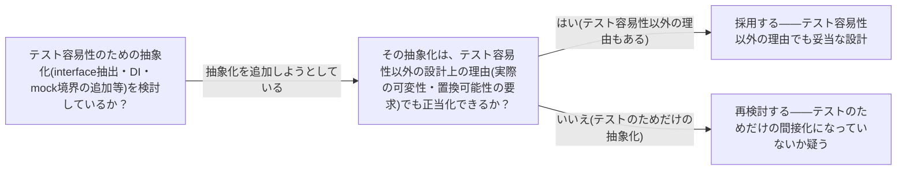

# test-induced-design-damage

## 概要

### この概念が答える判断

- テスト容易性を追求した設計が、逆に設計を悪化させることはあるか？
- この主張の論拠は何で、どのような反論があるか？
- Waffle自身の設計判断でこの主張をどう扱うべきか？

David Heinemeier Hansson(DHH)が2014年に提起した、テスト駆動(特にmock多用によるisolation-driven testing)が過剰な間接化(indirection)を生み設計を損なうという主張、およびそれを巡ってKent Beck・Martin Fowlerと交わされた論争の総称。単一の確立原則ではなく、対立する2つの立場を含む論争として扱う。

---

## 原則

- DHHは2014年のブログ記事群(『TDD is dead. Long live testing.』および別記事『Test-induced design damage』2014年4月29日付)で、厳格なtest-first(TDD)の教条主義的実践を批判し、必須の方法論として拒否した。
- DHHの主張の核心: mock駆動でテスト容易性を追求する設計(hexagonal architecture等の過度な層分離)が、コードの明瞭さを損なう不要な間接化と概念的オーバーヘッドをもたらす。
- Martin Fowler司会による『Is TDD Dead?』対談シリーズ(martinfowler.com、2014年5月9日〜6月4日、全5話)でこの論争が公開議論された。Episode 2は明示的に『Test-induced Design Damage』と題されている。
- Kent Beckの反論: 設計の質は個々の設計判断次第であり、TDDそのものの必然的帰結ではない(『車で悪い場所に行って車のせいにするようなものだ』という比喩)。
- この対立は『TDDというプラクティス自体が悪い設計を強制する』のか『TDDは道具にすぎず、悪い設計は使い手の判断ミスである』のかという未解決の論争であり、本文書はどちらか一方を正しいと断定しない。

---

## 分類

| 分類 | 特徴 |
|---|---|
| DHH側の立場 | mock駆動・isolation-driven testingが過剰な間接化を生み、コードの明瞭さを損なうというテスト容易性追求への懐疑 |
| Beck/Fowler側の立場 | 設計の質は個々の設計判断次第であり、TDDというプラクティス自体が悪い設計を必然的に生むわけではないという擁護 |

---

## 判断基準

---

## 実例

「モックできるように」という理由だけでインターフェースを抽出し、実装が1つしか無いのにDIコンテナ経由で差し替え可能にしている場合、これはtest-induced design damageが指摘する過剰な間接化に該当する可能性が高い。一方、実際に複数の実装を切り替える必要がある(例: 本番用と開発用のストレージ実装)場合は、同じインターフェース抽出でもテスト容易性以外の設計上の理由で正当化できる。

---

## アンチパターン

| アンチパターン | 問題点 |
|---|---|
| 『テストのために』を唯一の理由として抽象化を正当化する | テスト容易性以外の設計上の必然性が無いまま抽象化を重ねると、DHHが指摘する不要な間接化・概念的オーバーヘッドが蓄積し、可読性・保守性が低下する |

---

## 出典・根拠の透明性

David Heinemeier Hansson『TDD is dead. Long live testing.』(dhh.dk、2014年4月23日)および『Test-induced design damage』(dhh.dk、2014年4月29日)。Martin Fowler『Is TDD Dead?』対談シリーズ(martinfowler.com、2014年5月9日〜6月4日、参加者: Kent Beck・David Heinemeier Hansson・Martin Fowler)。

### 留保事項

『test-induced design damage』という用語は『TDD is dead』記事内でDHHが直接造語したのではなく、同時期の別記事(2014年4月29日付)が初出である点に注意(調査時の検証でこの2記事の混同は明確に反証された)。また対談シリーズにおけるBeckの発言は動画そのものの書き起こしではなく、InfoQ等の要約記事経由での確認にとどまる。

---

## 関連概念

| 関連概念 | 関係 |
|---|---|
| sociable-solitary-unit-tests | DHHが批判する『isolation-driven testing』は、solitary unit test(mock多用)を極端に追求した状態とほぼ対応する |
| tdd | この論争はTDDというプラクティス自体の是非ではなく、TDDが誘発しうる設計上の副作用の是非を扱う。TDDの原則そのものとは区別する |
| test-smells | 過剰な間接化の結果として、Obscure TestやHard to Test Codeのようなtest smellsが表面化することがある |
