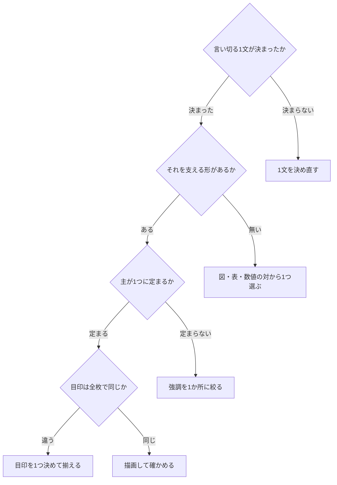

# visual-design-for-slide-decks

---

## 概要

### この概念が答える判断

- 1枚に何を置けば、見た人の記憶に残るか
- 色と大きさを、どう配るか
- 枚をまたいで、何を揃え、何を変えるか
- できたものが「AIが作った見た目」になっていないかを、どう判定するか

**枚は、読まれるのではなく見られる。**
**一目で受け取れなければ、そこに何が書いてあっても届かない。**

---

## 原則

**8つの概念で足りる**。個々の設計規則は、この8つのどれかの現れである。

**1から4は、枚をどう作るかである。5から8は、作ったものをどう確かめるかである。**

### 1. 枚は見るものであって、読むものではない

**文字だけの枚は、記憶に残らない。**
図・表・数値の対のいずれかを、必ず1つ置く。

**日本語での現れ**——言い切る1文を決めたら、それを支える形を1つ選ぶ。
**文だけで支えようとすると、枚が段落になる。**

### 2. 重みを均等に配らない

**見る順序は、重みが決める。**
色も大きさも、均等にすると順序が消える。

```
支配する色    1つ。枚の見た目の6割から7割を占める
支える色      1つか2つ
際立たせる色  1つだけ。ここが目を引く
```

**大きさも同じである**。見出しと本文の差が小さいと、どちらが主かが読めない。

**日本語での現れ**——強調は1か所だけにする。
**2か所を強調すると、どちらも強調にならない。**

### 3. 繰り返すものと、変えるものを分ける

**繰り返すのは、そのデッキを1つに見せる印である。**
**変えるのは、枚の並べ方である。**

| 繰り返す | 変える |
|---|---|
| 目印になる要素を1つ決めて、全枚で使う | 枚ごとの組み方 |
| 列に割り当てた役割 | 中身の形 |

**両方を繰り返すと、単調になる。**
**両方を変えると、ばらばらになる。**

**日本語での現れ**——列に役割を割り当てたら、全枚で守る。
その上で、枚の型は3つから選び直す。

### 4. 既定値のままにすると、内容と無関係な見た目になる

**色も飾りも、選ばなければ既定値が出る。**
**既定値は、題材について何も言わない。**

**そして、既定値には印がある。**
見出しの下に引く線、色の帯、縁の縞は、**AIが作った見た目として知られている。**

**日本語での現れ**——色は題材から決める。
**見出しの下に線を引かない。色の帯や縞を、目印の代わりにしない。**

### 5. 構造を先に決め、中身は後で入れる

**枚の追加・削除・並べ替えを先に済ませる**。中身を書くのは、そのあとである。

**順序を逆にすると、複製が編集済みの枚を複製する。**
**そして削除が、書いたばかりの枚を巻き込む。**

**日本語での現れ**——枚の並びを決めてから、1枚ずつ書く。

### 6. 書いた本人は、描画されたものではなく期待を見る

**作ったコードを見つめたあとは、描画されたものではなく、そうなるはずだと思ったものが見える。**
だから、別の目で見る。

**最初の描画には、たいてい本物の欠陥がいくつかある。**
**見る順序を決めておく。**

```
1  はみ出しと切れ        最も多く、必ず見える
2  重なり                文字が図形を突き抜けていないか
3  出典と本文の衝突
4  間隔と余白            狭すぎる、広すぎる、揃っていない
5  文字と背景のコントラスト
6  置き忘れた仮の文字
```

**直したら、直した枚だけを描き直して止める。**

**日本語での現れ**——描画した画像を、作った本人とは別の目で見る。
文脈を持たない読み手に、成果物だけを渡して確かめるのと同じ形である。

### 7. 出たものから、中身を取り出し直して確かめる

**書いたものを読み返しても、入れ忘れは見つからない。**
**成果物から中身を取り出し、それを読む。**

**見るのは3つである。**

```
入れ忘れ   置くはずのものが無い
順序       並びが意図どおりか
置き忘れ   仮の文字が残っていないか
```

**置き忘れは機械で探せる**。`lorem` ・ `TODO` ・ `[insert` ・ 同じ文字の繰り返しが目印になる。

### 8. 元から在った壊れと、自分が作った壊れを分ける

**土台にした素材が、もともと壊れていることがある。**
**分けずに検査すると、自分が作っていない欠陥が自分のものとして出る。**

**そして本物の後戻りが、その中に紛れる。**

**日本語での現れ**——直す前に、直す対象を1度検査して件数を控える。
**増えたぶんだけが、自分が作った壊れである。**

---

## 分類

**4つの概念のうち、どれが機械で見えるか。**

| 概念 | 機械で見えるか |
|---|---|
| 1 見るものであって読むものではない | **一部見える**。図と表の有無は数えられる |
| 2 重みを均等に配らない | **見えない**。何が主かを機械が判定できない |
| 3 繰り返すものと変えるものを分ける | **見えない** |
| 4 既定値のままにしない | **一部見える**。見出し下の線・色の帯は、クラス名で見つかる |
| 5 構造を先に決める | **見えない**。作った順序は成果物に残らない |
| 6 本人は期待を見る | **見えない**。別の目が要る |
| 7 出たものを取り出し直す | **一部見える**。置き忘れた仮の文字は機械で探せる |
| 8 元からの壊れと分ける | **見える**。直す前後の件数を比べる |

**残りは、描画して目で見る**（`render-check.md`）。

---

## 判断基準



---

## 実例

**同じ内容を、文だけの枚と、支える形を置いた枚で比べる。**

```
文だけの枚
  観測は仕様だけを読み、測定は仕様と実装を読む。
  観測には読む道具を与えず、測定には Read と Glob と Grep を与える。
  書く道具はどちらも Write に限る。
```

**3つの対応関係が文に埋まっていて、一目では受け取れない。**

| | 読む道具 | 書く道具 |
|---|---|---|
| **観測** | 与えない | `Write` |
| **測定** | `Read` ／ `Glob` ／ `Grep` | `Write` |

**表にすると、差が1列に集まる。**
**これが概念1の現れである。**

---

## アンチパターン

| 名前 | 何が問題か | 外れている概念 |
|---|---|---|
| **文だけの枚** | 一目で受け取れない。段落になる | 1 |
| **強調が2か所以上** | どちらも強調にならない | 2 |
| **見出しと本文の大きさが近い** | どちらが主かが読めない | 2 |
| **全枚が同じ組み方** | 単調になり、どこを見ればよいか分からなくなる | 3 |
| **枚ごとに列の役割が変わる** | 読み手が毎回、割り当てを覚え直す | 3 |
| **見出しの下の線・色の帯・縁の縞** | **AIが作った見た目として知られている**。題材について何も言わない | 4 |
| **既定の青のまま** | 題材と無関係である | 4 |

---

## 出典・根拠の透明性

**8つの概念は、Anthropic の公開スキル `pptx` から取り出した。**
規則そのものではなく、規則が立っている考え方を取っている。

| 概念 | 元にした記述 |
|---|---|
| 1 見るものであって読むものではない | Every slide needs a visual element. **Text-only slides are forgettable** |
| 2 重みを均等に配らない | One color should dominate (60-70% visual weight)… **Never give all colors equal weight** ／ Don't skimp on size contrast |
| 3 繰り返すものと変えるものを分ける | **Commit to a visual motif: Pick ONE distinctive element and repeat it** ／ Don't repeat the same layout |
| 4 既定値のままにしない | Don't default to blue ／ **NEVER use accent lines under titles — these are a hallmark of AI-generated slides** |
| 5 構造を先に決める | **Do all structural work — add, delete, reorder — before editing any slide's content** |
| 6 本人は期待を見る | **After staring at the generating code you tend to see what you expect rather than what rendered, so look at the images fresh** ／ Your first render usually has a few real issues… **and stop** ／ Visual QA の欠陥の並び |
| 7 出たものを取り出し直す | `markitdown output.pptx` — Check for missing content, typos, wrong order ／ **leftover placeholder text** の grep |
| 8 元からの壊れと分ける | **`--original` baselines the schema and slide checks against the template, suppressing errors it already had** |

| 出所 | URL | 取得日 |
|---|---|---|
| Anthropic skills — pptx | `github.com/anthropics/skills/blob/main/skills/pptx/SKILL.md` | 2026-08-29 |

**設計・編集・QA・画像化の節を逐語で読んだ。**
**`pptxgenjs` の罠と、依存する道具の節は読んでいない。`.pptx` の作り方に固有だからである。**

### 出所を持たないもの

**各概念の「日本語での現れ」には、出所が無い。**
**このリポジトリで実際に起きた読みにくさから起こしている。**

---

## 関連概念

| 関連概念 | 関係 |
|---|---|
| `design-rules.md` | この4つの概念から出る、具体の設計規則 |
| `render-check.md` | 描画して確かめる手順である。**書いたものと、描画されたものは違う** |
