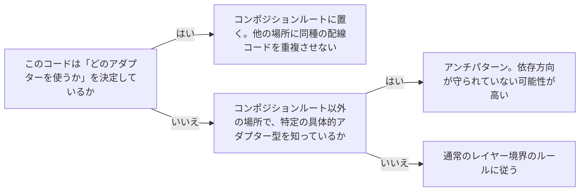

# architecture-composition-root

---

## 概要

### この概念が答える判断

- アダプターをポートに配線する処理は、どこに書くべきか？
- 配線コードは依存方向のルールに従う必要があるか？
- 配線コードがアプリケーションコアや個々のアダプターの中に散らばってしまっている。これは問題か？

アダプターをポート（インターフェース）に結びつける「配線」処理を、システム全体で1箇所（コンポジションルート）に集約する、という原則。

---

## 原則

ポートとアダプターの原則上、アプリケーションコアはポートの型だけを知り、具体的なアダプター実装を知らない。しかし実行時には、どこかで「このポートにはこの具体的なアダプターを使う」という結びつけが必要になる。この結びつけを行うコードは、コアの型とアダプターの型の両方を知る必要があり、依存方向のルール（内側は外側を知らない）が唯一成立しない場所になる。この例外を野放しにせず、アプリケーションの起動処理など、システムで最も外側の1箇所（コンポジションルート）に集約することで、依存方向のルールが「コンポジションルート以外のどこでも」成立する、という状態を維持できる。

---

## 分類

| 分類 | 特徴 |
|---|---|
| コンポジションルート | アプリケーションの起動時に一度だけ実行される、配線専用のコード。main関数やDIコンテナの設定など |
| それ以外の全てのコード | 配線を行わない。ポートの型だけに依存し、具体的なアダプターの実装を知らない |

---

## 判断基準

---

## 実例

架空の物流プラットフォームで、アプリケーション起動時に「ShipmentRepositoryポートには本番用のPostgreSQL実装を使う、テスト実行時にはメモリ内実装を使う」という結びつけをmain関数（またはDIコンテナ設定）で一括して行う。ユースケースのコードやドメイン層のコードは、どの実装が使われているかを一切知らない。

---

## アンチパターン

| アンチパターン | 問題点 |
|---|---|
| 個々のユースケースの中でアダプターの具体クラスをnewする | 配線が複数箇所に散らばり、テスト時の差し替えが困難になる。依存方向も逆転する |
| コンポジションルート自体に業務ロジックを書く | コンポジションルートは配線専用であるべきで、ビジネスルールを持ち込むと責務が混ざる |

---

## 出典・根拠の透明性

クリーンアーキテクチャ・ヘキサゴナルアーキテクチャの共通原則（ポートとアダプターの結びつけは1箇所に集約する）をAIが総合し、has-udd独自にまとめたものである。DDDの原典知識には対応する判断基準が無く、純粋にアーキテクチャ側の運用ルールとして作成した（[[brainstorm-platform-engineering-application]] 論点11拡張・ddd-advisor/tech-lead-advisor相談結果を受けて着手）。

---

## 関連概念

| 関連概念 | 関係 |
|---|---|
| architecture-port-adapter | コンポジションルートはポートとアダプターの結びつけを行う唯一の場所 |
| architecture-dependency-direction | 依存方向のルールが唯一適用されない例外地点として、意図的に隔離する |
