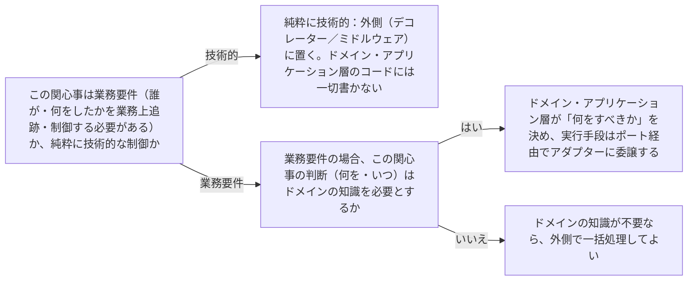

# architecture-cross-cutting-concerns

---

## 概要

### この概念が答える判断

- ロギング・認証・キャッシュのようなコードは、どの層に置くべきか？
- ドメイン層の処理で認可チェックが必要になった。ドメイン層に認可ロジックを書いてよいか？
- 全てのユースケースで共通して必要な処理（監査ログ等）を、毎回手作業で呼び出す必要があるか？

ロギング・認証・キャッシュ・トランザクション管理のような、特定の業務ルールに属さず複数の箇所で横断的に必要になる関心事を、どの層に配置し、どう実装するかという判断。

---

## 原則

横断的関心事の多くは技術的な実行時の制御（いつ・何を記録するか、いつキャッシュを使うか）であり、業務ルールそのものではないため、原則としてドメイン層には置かない。ただし「この操作は誰が実行したか記録する必要がある」という要求そのものが業務要件（監査要件）である場合は、ドメイン・アプリケーション層が「何を記録すべきか」を決め、実際にどう記録するか（ログファイルかDBか）はSecondaryポート・アダプターに委ねる、という形で分離できる。多くの純粋に技術的な横断的関心事は、個々のユースケースのコードに手作業で挿入するのではなく、アプリケーション層の外側（デコレーター・ミドルウェア等の仕組み）で、複数のユースケース呼び出しに共通して適用する形にすることで、ユースケースのコード自体を業務ロジックだけに保てる。

---

## 分類

| 分類 | 特徴 |
|---|---|
| 純粋に技術的な横断的関心事（ロギング・キャッシュ・パフォーマンス計測） | ドメイン層・アプリケーション層のコードに書かない。外側（デコレーター・ミドルウェア）で一括して適用する |
| 業務要件としての横断的関心事（監査ログ・認可） | 「何を記録すべきか・誰が実行を許可されるか」という決定はドメイン・アプリケーション層の関心事だが、実際の記録・認証手段はポート経由でインフラに委ねる |

---

## 判断基準

---

## 実例

架空の物流プラットフォームで、全APIリクエストの応答時間を計測してログに残す処理（純粋に技術的）はミドルウェアで一括処理する。一方、「集荷担当者が配送記録を変更した場合、変更前後の値を監査ログに残す」という要件は業務要件であり、Shipment集約の`updateAddress()`等のコマンド実行時に「何を変更したか」というドメインイベントを発行し、それを`AuditLogPort`（アダプターが実装）が記録する、という形にする。

---

## アンチパターン

| アンチパターン | 問題点 |
|---|---|
| 個々のユースケースコードの中に手作業でログ出力・キャッシュ確認を書き込む | 同じ横断的処理が複数箇所に重複し、抜け漏れや不整合が起きやすい |
| 認可チェックをドメイン層の集約メソッドの中に直接書く | 「誰がログインしているか」という技術的な認証の仕組みにドメイン層が依存することになり、依存方向が逆転する |

---

## 出典・根拠の透明性

クリーンアーキテクチャ・ヘキサゴナルアーキテクチャの共通原則（技術的関心事はコアの外に置く）をAIが総合し、has-udd独自にまとめたものである（[[brainstorm-platform-engineering-application]] 論点11のddd-advisor/tech-lead-advisor相談結果を受けて着手）。

---

## 関連概念

| 関連概念 | 関係 |
|---|---|
| architecture-port-adapter | 業務要件としての横断的関心事は、ポート経由でインフラに委譲する形で実現する |
| architecture-dependency-direction | 技術的な横断的関心事がドメイン層に混入することは依存方向の乱れの一種 |
