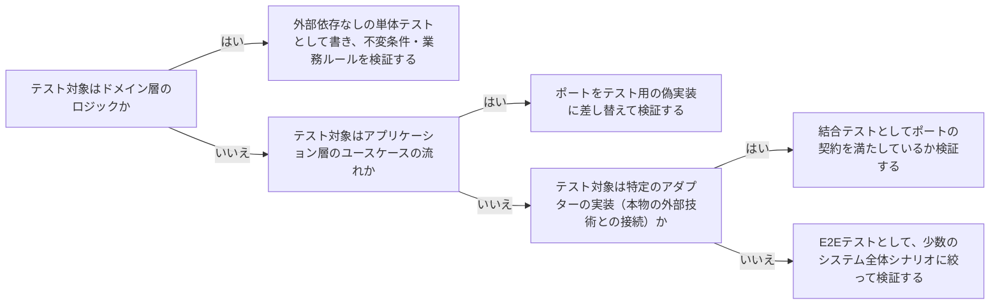

# architecture-test-strategy-by-layer

---

## 概要

### この概念が答える判断

- ドメイン層のテストは何を検証すべきか？
- アダプターの実装を差し替えてテストするとはどういうことか？
- ポートのテストダブル（偽実装）はどこまで本物に似せるべきか？

レイヤー構成・ポートとアダプターの分離を、テスト戦略にどう活かすかという判断。テストの種類（単体・結合・E2E）を、どの層のどの境界に対して書くべきかを決める。

---

## 原則

ポートとアダプターの分離により、アプリケーションコア（ドメイン＋アプリケーション層）は、実際のアダプター実装無しに、ポートのテスト用の偽実装（フェイク・スタブ・モック）を使って単体テストできる。これはアーキテクチャが提供する最も実務的な恩恵の一つである。ドメイン層のテストは、外部依存を一切使わず、純粋に不変条件・業務ルールの検証に集中する。アダプター層のテストは、実際の外部技術（DB・API等）に対する結合テストとして書き、「ポートの契約を正しく満たしているか」を検証する——ポートのインターフェースに対する契約テストを、本物のアダプターとテスト用の偽実装の両方に対して同じテストスイートで実行できると、両者の振る舞いの一致を保証しやすい。E2Eテストは、コンポジションルートによる配線を含めた、システム全体の振る舞いを少数だけ検証する。

---

## 分類

| 分類 | 特徴 |
|---|---|
| ドメイン層のテスト | 外部依存なし。純粋な単体テスト。不変条件・業務ルールを検証する |
| アプリケーション層のテスト | ポートをテスト用の偽実装に差し替えた単体テスト。ユースケースの流れ（呼び出し順序）を検証する |
| アダプター層のテスト（契約テスト） | 実際の外部技術に対する結合テスト。ポートの契約を満たしているかを検証する |
| E2Eテスト | コンポジションルートによる配線を含む、システム全体の少数の振る舞いを検証する |

---

## 判断基準

---

## 実例

架空の物流プラットフォームで、Shipment集約の「配達完了にできるのは輸送中状態からのみ」という不変条件はドメイン層の単体テストで検証する。「集荷依頼ユースケースが在庫確認→配送記録作成の順で呼ばれる」流れはShipmentRepositoryポートを偽実装に差し替えたアプリケーション層のテストで検証する。PostgresShipmentRepositoryが実際のDBに対して正しく保存・取得できるかはアダプターの結合テストで検証する。

---

## アンチパターン

| アンチパターン | 問題点 |
|---|---|
| ドメイン層の単体テストの中で実際のDBに接続する | テストが遅くなり、外部環境に依存して不安定になる。ドメイン層は外部依存なしでテストできることがポートとアダプター分離の恩恵であり、それを活かせていない |
| アダプターの結合テストを書かず、E2Eテストだけで全てを検証しようとする | 失敗時にどの層の問題か切り分けにくく、テスト全体が遅く壊れやすくなる |

---

## 出典・根拠の透明性

クリーンアーキテクチャ・ヘキサゴナルアーキテクチャの「アダプター差し替えによるテスト容易性」の原則をAIが総合し、has-udd独自にまとめたものである。「何をどれだけ厚くテストするか」という粒度判断（実装方法別のテストピラミッド形状）はddd-advisorの`design-heuristics.md`が扱い、本ファイルは「どの層の境界でテストを書くか」というアーキテクチャ側の判断に特化する（[[brainstorm-platform-engineering-application]] 論点11拡張を受けて着手）。

---

## 関連概念

| 関連概念 | 関係 |
|---|---|
| architecture-port-adapter | テスト容易性の源泉となるポートとアダプターの分離そのもの |
| architecture-composition-root | E2Eテストはコンポジションルートによる配線の正しさも含めて検証する |
