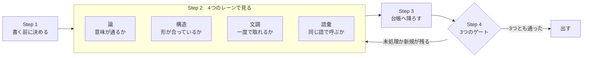

## 目的

**テクニカルライティングの文書を、3つが満たされた状態にする。**

| | 満たすこと |
|---|---|
| **論** | 意味が通り、論が崩れていない |
| **構造** | 情報が、その型に合った形で置かれている |
| **文調** | 人が読んで、一度で意味が取れる |
| **語彙** | 同じものが同じ語で呼ばれている |

**満たしたかどうかは、3つのゲートで決める。**
**どれも Yes/No で、同じ文書なら同じ答えが出る。**

| ゲート | 何を見るか |
|---|---|
| **壊れているものが0件** | 描画されない強調・ASCII の罫線・与えた語の対。**機械で決まる** |
| **未処理が0件** | 指さされた箇所が、全部「直した」か「残す（理由）」になっている |
| **新しい指摘が0件** | 直したことで、別の指摘を生んでいない |

**ゲートは、判断が済んでいることを見る。**
判断そのものは書き手に残る。**取りこぼしが無いことだけを、機械が担保する。**

## 役割

- 書き始める前に、読み手・主メッセージ・見出しの骨組みを決める
- 書いたあと、**論・構造・文調・語彙の4つのレーン**で見る
- 指さされた箇所を**1件ずつ台帳へ降ろし**、直したか残したかを書く
- **機械が見ていない範囲を、報告に書く**
- 3つのゲートを通してから出す

## 処理対象と成果物

### 処理対象

**これから書く文書の題材、または既に書いてある日本語の文書である。**
新規なら何を伝えるかと読み手を受け取り、修正なら対象ファイルを受け取る。

### 成果物

**4つのレーンの台帳が埋まり、3つのゲートを通った文書である。**
直さずに残した箇所は、理由とともに台帳に残る。

## 入力の想定

| 受け取る情報 | 解釈・既定値 |
|---|---|
| 読み手 | 明示されなければ、その文書を初めて開く人とする |
| 用語表 | 対象フォルダに用語を定めた文書があれば、それに従う。無ければ新たに定めて冒頭に置く |
| 前回の検査結果 | 有れば、新しい指摘が出ていないかの判定に使う。無ければ1周目として扱う |

---

## 実行手順



### Step 1: 書く前に決める

**書いたあとに直すより、書く前に決めるほうが効く。**
本文から書き始めない。

- 読み手が最初に知りたい1つを決め、それを最初の節に置く
- **主メッセージを一文で書く**。書けないなら素材不足であり、書き方の問題ではない
- 見出しの骨組みを作り、**見出しだけを順に読んで論旨が通ること**を確かめてから本文へ進む
- 「決めたこと」と「どうやったか」と「なぜそう判断したか」を、別の節または別のファイルに分ける
- 対比・条件・一覧・手順は表で、分岐・流れ・包含は図で書く。**散文は理由を述べるときだけに使う**

### Step 2: 4つのレーンで見る

**1つの検査で全部を見ない。**
レーンごとに、見えない範囲が違う。
判定の仕方は `references/writing-checklist.md` にある。

#### 2-1: 論のレーン

**意味が通り、論が崩れていないかを見る。**

- **主張と根拠が対になっているか**。根拠のない断定が残っていないか
- **根拠の段と推論の段が分かれているか**（測った／確かめていない／だから／結論）
- **循環していないか**。前の節が、後の節で決まることを使っていないか
- 抽象から具体へ降りているか
- **見出しだけを順に読んで、論旨が追えるか**
- 同じことを2か所に書いていないか。書くなら片方を正本にし、もう片方を参照にする
- 同じものを説明する記述が、文書のなかで離れた位置に無いか

**このレーンは、機械では判定できない。**
機械にできるのは、見出しと各段落の先頭文を抜き出すところまでである。
**抜き出したものを読んで、追えるかを決めるのは書き手である。**

#### 2-2: 構造のレーン

**情報が、その型に合った形で置かれているかを見る。**
**形を選ぶのは書き手ではない。情報の型が決める。**

| 情報の型 | 形 |
|---|---|
| 対比・条件・一覧・手順 | **表** |
| 分岐・流れ・包含 | **図**（mermaid か SVG） |
| 本当に並列な項目 | **箇条書き** |
| 理由 | **散文** |
| コードと、その出力と、木構造 | **コードブロック** |

**構造を持つ情報を散文にたたむと、読み手が構造を組み立て直すことになる。**
**桁を空白で揃えて表に見せるのは、表ではない。**

**機械が見られるのは、文字で図を描いていないかだけである。**
その情報が構造を持つかどうかは、読んで決める。

#### 2-3: 文調のレーン

**読解の負荷が高い順に、4つの層で見る。**
**前の層ほど、読者に計算を強いる。**

**層は、読み手が何をさせられるかで分ける。**

| 層 | 読み手がさせられること | 現れ方 |
|---|---|---|
| **A 打ち消しが重なる** | 打ち消しを数えて、真偽を組み立て直す | 二重否定、条件の入れ子 |
| **B 係り先を探す** | どの語がどこに掛かるかを、後戻りして決める | 主語と述語が遠い、修飾の語順、読点の位置、指示語の先、1文に2つ以上の命題 |
| **C 語をほどく** | 1つの語の中身を、読みながら分解する | 漢字の連なり、名詞化、受動、初めて見る語の連結 |
| **D 要らないものを読む** | 情報が増えない文を読み進める | 前置き、言い換えの水増し |

**前の層ほど、読み手は文の意味に届く前に計算を強いられる。**
だから A から順に当てる。

**字数は成果ではない。**
先に確かめるのは、事実が保たれていることと、主語と述語が対応していることである。
**その2つが同じだけ満たされる書き方が複数あるときにだけ、短いほうを採る。**
文を割って字数が増えるのは、正しい結果である。

**どれも禁止ではない。条件で見る。**
体言止めは表のセル・見出し・箇条書きなら自然であり、主語の省略も日本語では普通である。
**復元できるかどうかで決める。**

#### 2-4: 語彙のレーン

**同じものが、同じ語で呼ばれているかを見る。**

- 同じ意味に2つの語を当てていないか
- 違う意味に同じ語を当てていないか
- **初出で定義しているか**。専門用語は、機能を説明してから名前を渡す
- 別の分野から借りた語を、断らずに使っていないか
- 普通の日本語を、役割や分類の名前に取っていないか

**揺れの発見そのものは、機械にはできない。**
`--synonyms` で与えた対が両方あるかを見るだけなので、**対を思いつかなければ1件も出ない。**

### Step 3: 機械の検査を通し、台帳へ降ろす

```
python3 <skill>/scripts/check_writing.py <ファイル...>
```

| 渡すもの | 中身 |
|---|---|
| `--synonyms 用語.tsv` | 同じ意味に当ててはいけない語の対 |
| `--terms 複合語.tsv` | 定着した複合語。名詞の連結として指摘しない |
| `--figures 借用語.tsv` | 別の分野から借りた語。1行1語 |

**出方は2つある。**

| 出方 | 中身 | 扱い |
|---|---|---|
| **指摘** | 描画されない強調・ASCII の罫線・与えた語の対 | **壊れている。直す** |
| **確認** | 体言止め・名詞の連結・1文の長さ・同じ文が2か所 | **判断が要る。台帳へ降ろす** |

**この検査が見ていない範囲を、先に知っておく。**

| 見ている | 見ていない |
|---|---|
| 本文の行と、表のセル | **見出し・箇条書き・引用の行**。行の先頭で一括して外している |
| 文の中の表層 | **論旨が通るか**。論のレーンが受け持つ |
| 与えた語の対 | **揺れそのものの発見**。語彙のレーンで人が見る |

**外している範囲は広い。**
実測では対象の 54% にあたった（2026-09-06、Skill 48ファイル 3,607行のうち 1,968行）。
**0件は「通った」ではなく「見た範囲に壊れが無い」である。**

**見つけたものは、レーンを問わず1件ずつ台帳に降ろす。**

| 台帳に書く欄 | 中身 |
|---|---|
| どこ | ファイルと行番号 |
| どのレーン | 論 ／ 構造 ／ 文調 ／ 語彙 |
| どうした | 直した ／ 残す（理由） |

**「残す」には理由を書く。**
理由が書けないなら、それは直す対象である。

### Step 4: 3つのゲートを通す

**全部が Yes になるまで、Step 2 と Step 3 を繰り返す。**

| ゲート | 判定 |
|---|---|
| **壊れているものが0件か** | 機械の「指摘」が0件 |
| **未処理が0件か** | 台帳の全項目が「直した」か「残す（理由）」になっている |
| **新しい指摘が0件か** | 直したあとに通し直して、前回に無かった指摘が出ていない |

**同じ指摘が2周続けて再発したら、直し方が間違っている。**
その1件を台帳に「残す（理由）」として置き、先へ進む。

**ゲートを通ったことは、読めることを意味しない。**
**論のレーンは機械では判定されないので、通っても読み直しは要る。**

---

## 出力形式

**直した文書を出す。あわせて、次を報告する。**

| 報告する内容 | 書き方 |
|---|---|
| 台帳 | レーンごとに、どこを何から何へ直したかを表で出す |
| 残した箇所 | 場所と、残す理由を書く |
| **3つのゲートの結果** | **通ったものと通っていないものを、1つずつ書く** |
| **見ていない範囲** | **機械が外した範囲と、読んでいない箇所を書く。「0件」だけを書かない** |
| 確かめていないこと | **確かめていないことを、確かめたと書かない** |

---

## ガードレール

- **ゲートは Yes/No で置く**。同じ文書なら同じ答えが出るものだけをゲートにする
- **未処理を残したまま出さない**。指さされた箇所は、直すか、理由をつけて残すかのどちらかにする
- **素通りした範囲を書く**。外した範囲を書かないと、0件が「通った」と読める
- **機械の検査を、読み直しの代わりにしない**。論のレーンは機械では判定できない
- **訂正の記録を本文に残さない**。文書には現行の正しい内容だけを書く。履歴はgitが持つ
- **数値は原典の文字列で確認してから書く**。要約を経由して引かない。自分で計算した値を、原典の値のように書かない
- **確かめていない内容を、確かめたように書かない**。推測は推測と分かる形で書く
- **ASCII で図を描かない**。図は mermaid か SVG で書く
- **名前を付ける前に、検査を書けないか試す**。検査で書けるなら、名前は要らない
- **既存の文書に用語の定めがあれば、それを上書きしない**
- **散文で書けることを、散文で書かない**。対比・条件・一覧・手順は表、分岐・流れ・包含は図にする
- **1つのレーンで直したあと、他のレーンが壊れていないかを見る**。節を分けると参照が切れ、語を変えると別の箇所と揃わなくなる
- **描画して確かめてから出す**。閉じの強調記号を句点の後ろに置くと、太字にならない。原文を読んでも分からない

---

## 参照

- `references/writing-checklist.md`: 4つのレーンそれぞれの判定の仕方と、直し方の例
- `scripts/check_writing.py`: 機械で見える範囲の検査。**見ている範囲は Step 3 の表にある**。`--list` で検査の一覧を出せる
- `scripts/test_check_writing.py`: この検査の振る舞いを事例で確かめる。`python3 test_check_writing.py` で走る
- `references/known-terms.example.tsv`: 定着した複合語の例。プロジェクトごとに写して足す
- `references/knowledge/technical-writing-for-research-documents.md`: 文書の書き方を9つの概念に分けたもの。どれが機械で見えるかを持つ
- `references/knowledge/ubiquitous-language-in-documents.md`: 語彙の規約。会話ではなく文書に当てたときに変わる4つ
- `references/knowledge/reader-testing.md`: 機械で見えない範囲を、読み手を立てて確かめる手続き
