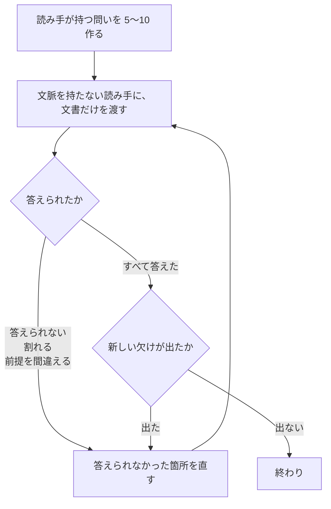

# reader-testing

---

## 概要

### この概念が答える判断

- 書いた文書が読めるかどうかを、どうやって確かめるか
- 機械の検査が0件のとき、次に何をするか
- どこまで直したら終わりにしてよいか

**書き手は、自分の文書を読めない。**
**文脈を持たない読み手を立てて、問いに答えられるかで確かめる。**

---

## 原則

### 1. 書き手は、自分の文書を読めない

**書き手は、文書に書いていないことを知っている。**
だから欠けた箇所を無意識に補って読む。**補ったことに気づかない。**

**読み飛ばしているのではない**。知っていることを、書いてあると錯覚している。
**何度読み返しても、同じ錯覚が起きる。**

### 2. 文脈を持たない読み手を立てる

**書き手が持っている文脈を、1つも持たない読み手に読ませる。**
答えられない問いがあれば、そこが書き落とした箇所である。

**同じ場で続けて聞かない。**
その場には、会話で渡した文脈が残っている。**残っていれば、補って答えてしまう。**

### 3. 問いで測る。感想では測らない

**「読みやすいか」と聞かない**。答えが主観になり、直す場所が決まらない。

**その文書を読む人が実際に持つ問いを、5つから10つ作る。**
そして、文書だけを渡して答えさせる。
**答えられない、または違う答えが返る箇所が、直す場所である。**

**見るのは3つである。**

| 見るもの | 何が起きているか |
|---|---|
| **答えられない** | 書いていない |
| **答えが割れる** | 2通りに読める |
| **前提を間違える** | 書き手が当然と思っていることを、読み手が知らない |

### 4. 止める条件を先に決める

**問いに一貫して正しく答え、新しい欠けが出なくなったら終わりにする。**

**直すたびに新しい問いが出るなら、まだ終わっていない。**
**そして、直しても何も変わらない状態が続いたら、削る側を考える。**

---

## 分類

**この手続きで見つかるものと、見つからないものがある。**

| 見つかる | 見つからない |
|---|---|
| 書いていない前提 | **事実の誤り**（読み手も原典を持たないため） |
| 2通りに読める箇所 | **数値の取り違え**（同じ理由） |
| 見出しと中身の食い違い | **文書どうしの矛盾**（1本ずつ読ませるため） |
| 情報が離れて置かれている箇所 | |

**事実と数値は、原典に当たって確かめる。**
**文書どうしの矛盾は、まとめて読ませるか、目で当てる。**

---

## 判断基準



**輪を回すたびに、問いを作り直す。**
**同じ問いを使い回すと、直した箇所しか見なくなる。**

---

## 実例

**この研究で実際に起きた例である。**

```
書いた文  3本は一列につながっている

読み手    「3本」が何を指すのか分からない
          文書のなかで「3本」という語は、この1か所にしか出てこない
```

**書き手は、問い3本のことだと知っている。**
**知っているので、指す先を書かなかったことに気づけない。**

**機械の検査は、この文を通す。**
1文の長さも、体言止めも、名詞の連結も、規約を破っていない。
**破っているのは、指す先を名前で書くという規約だけである。**

---

## アンチパターン

| 名前 | 何が問題か | 外れている概念 |
|---|---|---|
| **書き手が読み返して確かめる** | 補って読むので、欠けが見えない | 1 |
| **同じ場で続けて聞く** | 会話で渡した文脈が残っている | 2 |
| **「読みやすいか」と聞く** | 答えが主観になり、直す場所が決まらない | 3 |
| **問いを使い回す** | 直した箇所しか見なくなる | 4 |
| **1度で終わりにする** | 直すと新しい欠けが出る。出なくなるまで回す | 4 |
| **機械の検査で代える** | 見出しと中身の食い違いも、情報の散在も、機械には見えない | 1 |

---

## 検査

**この手続き自体が検査である。**
**機械の検査を通したあとに当てる。**

| | 何を当てるか |
|---|---|
| **先** | 機械の検査を当てる。1文の長さ・体言止め・語の対 |
| **後** | 読み手を立てる。書いていない前提・2通りに読める箇所・情報の散在を見る |

**順序を逆にしない。**
**機械で直せるものを読み手に見つけさせると、そちらに目が行く。**

---

## 出典・根拠の透明性

**手続きは Anthropic の公開スキル `doc-coauthoring` の Stage 3 にある。**

| 本文書の概念 | 元にした記述 |
|---|---|
| 2 文脈を持たない読み手を立てる | Test with fresh Claude instance (no context bleed) |
| 3 問いで測る | Generate 5-10 realistic reader questions ／ Check for ambiguity, false assumptions, contradictions |
| 4 止める条件を先に決める | Reader Claude consistently answers questions correctly and doesn't surface new gaps or ambiguities |

| 出所 | URL | 取得日 |
|---|---|---|
| Anthropic skills — doc-coauthoring | `github.com/anthropics/skills/blob/main/skills/doc-coauthoring/SKILL.md` | 2026-08-29 |

**要約を経由して読んだ。全文の照合はしていない。**

**概念1「書き手は、自分の文書を読めない」に出所は無い。**
**残る3つが、なぜ効くのかを言うために置いている。**
実例は、このリポジトリで実際に起きたものである。

---

## 関連概念

| 関連概念 | 関係 |
|---|---|
| `technical-writing-for-research-documents` | 9つの概念のうち、機械が触れない概念3・4・7と、一部しか見えない概念1・2・6・9を、この手続きで確かめる |
| `ubiquitous-language-in-documents` | 定義と本文のずれを、この手続きで見つける |
