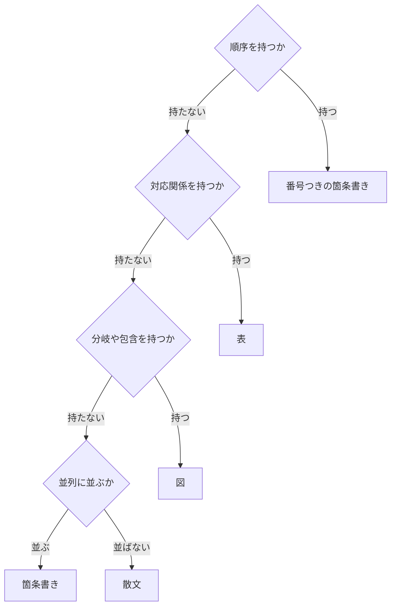

# technical-writing-for-research-documents

---

## 概要

### この概念が答える判断

- 散文で書くか、表で書くか、箇条書きで書くか
- 見出しに何を書くか
- どこまで削るか
- 書いたものが読める状態かを、どう確かめるか

**研究文書は、判断するために読まれる**。通して味わうためではない。
**読み手は、探しに来たものを見つけたら読むのをやめる。**

---

## 原則

**9つの概念で足りる**。個々の書き方の規則は、この9つのどれかの現れである。

### 1. 文書は、探しに来た人のためにある

**読み手は通読しない。走査して、要るところだけを読む。**
だから、いちばん大事なものを先に置く。見出しにも、表の項目にも、段落にも当てはまる。

**日本語での現れ**——結論を先に書き、理由を後ろに置く。

### 2. 情報の型が、表現の形を決める

**書き手が形を選ぶのではない**。情報が順序を持てば番号つき、対応を持てば表、分岐を持てば図になる。
**構造を持つ情報を散文にたたむと、読み手が構造を組み立て直すことになる。**

**日本語での現れ**——「一方で」「また」で対応関係をつなぐ文は、たいてい表になる。

### 3. 同じものは、同じ形で書く

**形が違えば、読み手は内容が違うと受け取る。**
比べるものは、同じ文の形・同じ段数・同じ並びで書く。
**繰り返しの型は、冗長ではなく、読み手の目印である。**

**日本語での現れ**——並べた項目の語尾を揃える。片方が体言止めで片方が文だと、対応が読めない。

### 4. 見出しは、下にあるものを言い切る

**見出しは、読み手がそこを開くかどうかを決める材料である。**
「はじめに」「その他」は、下に何があるかを言わない。
**そして見出しの下を空にしない**。階層も飛ばさない。

**日本語での現れ**——述べることを抽象した名詞句にする。問いの形にも、結論の文にもしない。

### 5. 誰が何をするかを、文から復元できるようにする

**動作の主が消えると、読み手は補って読む**。補い方は読み手ごとに違う。
**能動で書き、動作の主を落とさない。**

**日本語での現れ**——**どれも禁止ではない。条件が付く。**
日本語は主語を省くのが普通で、全部書けば不自然になる。

| 書き方 | 問題になるとき |
|---|---|
| 主語・目的語の省略 | **文脈から一意に復元できないとき**。読み手が補い、補い方が読み手ごとに違う |
| 倒置 | **主語と述語が離れて、意味が取れなくなるとき**。近ければ強調の技法である |
| 体言止め | **説明の文で続けたとき**。動作の主が消える。表のセル・見出し・箇条書きでは自然である |
| 名詞の連結 | **初めて見る語を4つ以上つなげたとき**。定着した複合語は連結ではない |
| 指示語 | **指す先が離れているか、候補が複数あるとき**。指示語そのものは日本語の基本である |
| 鉤括弧で語尾を名詞のように使う | **説明の文で使ったとき**。何を指すかが決まらない |
| 「〜することができる」 | **動作の主が薄れるとき** |

**条件を書かずに禁じると、通じていた文を不自然に書き換えることになる。**

### 6. 判断に要る量まで削る

**短さが目的ではない**。読み手が判断できるだけの情報を渡し、それ以外を削る。
**削ると決められないのは、その文書が誰の何の判断のためにあるかを決めていないからである。**

**日本語での現れ**——**長さそのものは問題ではない。**
修飾を重ねた長い1文は、たいてい2つの主張を運んでいる。
**1つしか運んでいないなら、長くてよい。**

### 7. 声に出して読めるかで、通じるかを測る

**読めない文は、書いた本人にも読めない。**
**これは、書き手が自分で当てられる唯一の検査である。**

### 8. 書いたものと、描画されたものは違う

**書き手が見ているのは原文で、読み手が見るのは描画されたものである。**
原文が正しくても、描画で壊れることがある。

**壊れたことは、原文を読んでも分からない**。描画して初めて見える。
**そして、壊れたまま出しても、書き手には正しく見えている。**

**日本語での現れ**——閉じの強調記号を句点の後ろに置くと、太字にならない。
CommonMark が、句点の直後の記号を閉じとして認めないためである。

### 9. 別の分野の語を借りない

**語が別の分野から来ていると、読み手はそれを訳し直して読む。**
訳し方は読み手ごとに違う。**概念5 と同じ形の失敗である。**

**禁止ではない。あえて例えると断れば使える。**
「たとえるなら」「〜のようなもの」と明示すれば、読み手は比喩として読む。
**断らずに使うと、借りた語が技術の語の位置に座る。**

**借りた語のほうが短いことが多い。**
短さと引き換えに、指す先が曖昧になる。

**日本語での現れ**——ゲーム・相撲・銃・料理・掲示の語を当てると、読み手が訳し直す。
「当たり判定」「土俵に載せる」「引き金」「下ごしらえ」「札を貼る」がその例である。

---

## 分類

**9つの概念のうち、どれが機械で見えるか。**

| 概念 | 機械で見えるか |
|---|---|
| 1 探しに来た人のため | **見えない**。読み手の探し物を機械が知らない |
| 2 情報の型が形を決める | **見えない**。情報が構造を持つかを機械が判断できない |
| 3 同じものは同じ形で | **一部見える**。語尾の不揃いは見える |
| 4 見出しは言い切る | **見えない**。見出しと中身の対応を機械が測れない |
| 5 動作の主を落とさない | **見える**。体言止め・倒置・名詞の連結 |
| 6 判断に要る量まで削る | **一部見える**。1文の長さは見える |
| 7 声に出して読める | **見えない** |
| 8 描画されたものは違う | **見える**。描画の壊れは機械で判る |
| 9 別の分野の語を借りない | **一部見える**。既に出た借用語は一覧で拾える。新しい借用は見えない |

**この9つのうち、機械が触れるのは6つである。**
**十分に見えるのは概念5と概念8の2つで、概念1・2・6・9は一部しか見えない。**
**概念3・4・7には触れない。**

**残りは、読み手を立てて確かめる**（`reader-testing`）。

---

## 判断基準



**これは概念2を当てた結果である。**
**迷ったら表にする**。表にできない情報は、構造を持っていない。

---

## 実例

**概念2を、同じ内容の書き分けで示す。**

```
散文で書いた場合
  観測では判定者に読む道具を与えず、仕様の全文を依頼書に載せる。
  一方で測定では Read と Glob と Grep を与え、実装を自分で探させる。
  書く道具はどちらも Write に限る。
```

**3つの対応関係が、1つの文にたたまれている**。読み手は、対応を頭の中で組み立てる。

| | 読む道具 | 書く道具 | 仕様の渡し方 |
|---|---|---|---|
| **観測** | 与えない | `Write` | 依頼書に全文を載せる |
| **測定** | `Read` ／ `Glob` ／ `Grep` | `Write` | 同上 |

**表にすると、空欄と重複がそのまま見える。**
**組み立てる手間が、読み手から書き手へ移る。**

---

## アンチパターン

| 名前 | 何が問題か | 外れている概念 |
|---|---|---|
| **見出しが中身を言わない** | 読み手は開くまで分からない | 4 |
| **指示語で受ける** | 「これは」「上記の」は、指す先が読み手の記憶に依存する | 5 |
| **散文にたたむ** | 対応関係を1文に押し込むと、読み手が組み立て直す | 2 |
| **並びの形が揃わない** | 違いが内容なのか書き方なのか、読み手に分からない | 3 |
| **同じことを2か所に書く** | 直すたびに2か所を直すことになり、片方が古くなる | 1 |
| **メモを文書として出す** | 書き手が全部を知っている前提で書くと、読み手は補って読む | 1・5 |
| **断らずに比喩を使う** | 読み手が訳し直す。訳し方は読み手ごとに違う | 9 |

---

## 出典・根拠の透明性

**9つの概念は、公開のスタイルガイドと Anthropic の公開スキルから取り出した。**
規則そのものではなく、規則が立っている考え方を取っている。

| 概念 | 取り出した先 |
|---|---|
| 1 探しに来た人のため | Microsoft — Scannable content ／ Top 10 tips |
| 2 情報の型が形を決める | Google — Highlights ／ Microsoft — Scannable content |
| 3 同じものは同じ形で | Microsoft — Scannable content |
| 4 見出しは言い切る | Google — Headings and titles |
| 5 動作の主を落とさない | Google — Highlights ／ Microsoft — Top 10 tips |
| 6 判断に要る量まで削る | Microsoft — Top 10 tips |
| 7 声に出して読める | Microsoft — Top 10 tips |
| 8 描画されたものは違う | Anthropic `skills/pptx` の Visual QA |
| 9 別の分野の語を借りない | Google — Writing for a global audience ／ Microsoft — Writing tips |

| 出所 | URL | 取得日 |
|---|---|---|
| Google developer documentation style guide — Highlights | `developers.google.com/style/highlights` | 2026-08-29 |
| 同 — Headings and titles | `developers.google.com/style/headings` | 2026-08-29 |
| Microsoft Writing Style Guide — Top 10 tips | `learn.microsoft.com/en-us/style-guide/top-10-tips-style-voice` | 2026-08-29 |
| 同 — Scannable content | `learn.microsoft.com/en-us/style-guide/scannable-content/` | 2026-08-29 |
| Anthropic skills — pptx | `github.com/anthropics/skills/blob/main/skills/pptx/SKILL.md` | 2026-08-29 |
| Google — Writing for a global audience | `developers.google.com/style/translation` | 2026-08-30 |
| Microsoft Writing Style Guide — Writing tips | `learn.microsoft.com/en-us/style-guide/global-communications/writing-tips` | 2026-08-30 |

**どれも公開のページである**。HTML なので、内容は変わりうる。
**取得日を書いておくので、当たり直したいときはそこから確かめる。**

### 出所を持たないもの

**各概念の「日本語での現れ」には、出所が無い。**
体言止め・倒置・語尾の揃え方・読点の打ち方は、日本語固有である。
**手元に日本語の資料が無いので、根拠を示せない。**

**概念そのものには出所がある。**
**その概念が日本語でどう現れるかを、このリポジトリで起きた読みにくさから起こしている。**
**日本語の資料が手に入ったら、そこだけ差し替える。**

---

## 関連概念

| 関連概念 | 関係 |
|---|---|
| `ubiquitous-language-in-documents` | 語彙の規約であり、概念3と5を語の側から支える |
| `reader-testing` | 機械が触れない概念3・4・7と、一部しか見えない概念1・2・6・9を、読み手を立てて確かめる |
